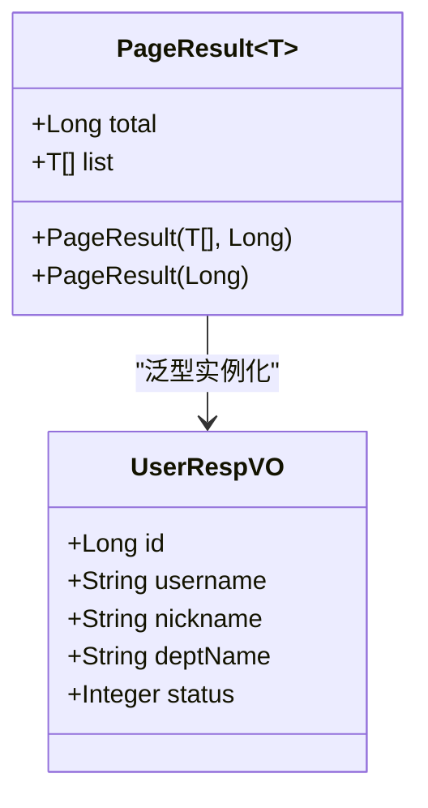
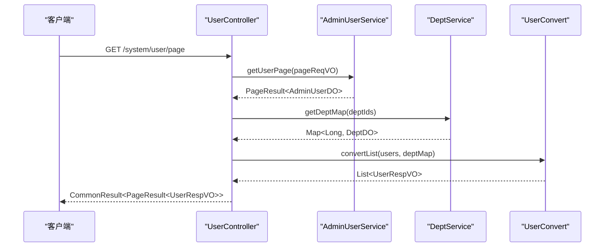
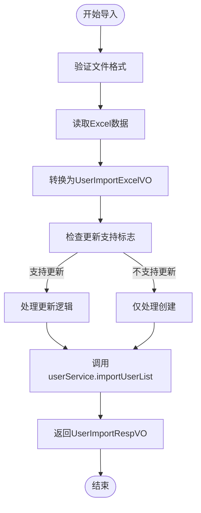
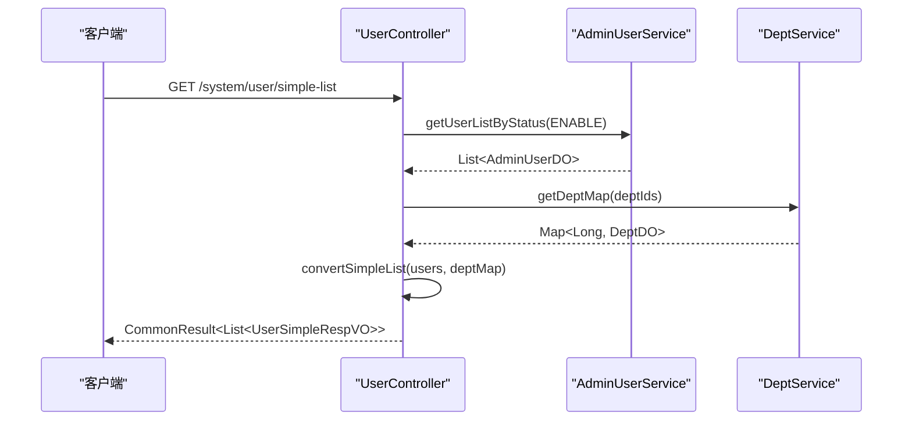
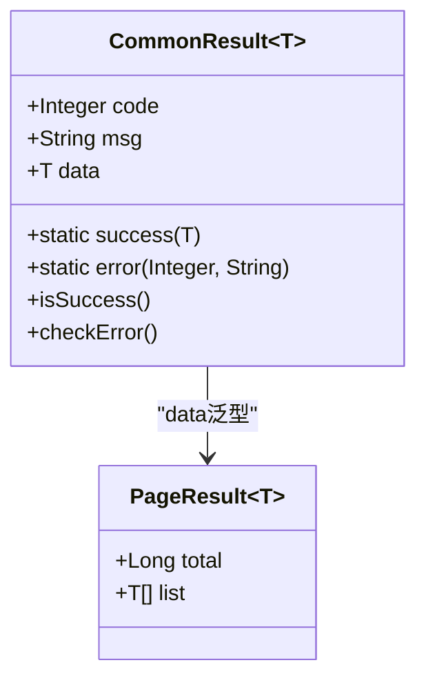

# 用户管理API

<cite>
**本文档引用的文件**
- [UserController.java](file://yudao-module-system/src/main/java/cn/iocoder/yudao/module/system/controller/admin/user/UserController.java)
- [UserSaveReqVO.java](file://yudao-module-system/src/main/java/cn/iocoder/yudao/module/system/controller/admin/user/vo/user/UserSaveReqVO.java)
- [UserUpdateStatusReqVO.java](file://yudao-module-system/src/main/java/cn/iocoder/yudao/module/system/controller/admin/user/vo/user/UserUpdateStatusReqVO.java)
- [UserRespVO.java](file://yudao-module-system/src/main/java/cn/iocoder/yudao/module/system/controller/admin/user/vo/user/UserRespVO.java)
- [UserSimpleRespVO.java](file://yudao-module-system/src/main/java/cn/iocoder/yudao/module/system/controller/admin/user/vo/user/UserSimpleRespVO.java)
- [UserPageReqVO.java](file://yudao-module-system/src/main/java/cn/iocoder/yudao/module/system/controller/admin/user/vo/user/UserPageReqVO.java)
- [AdminUserService.java](file://yudao-module-system/src/main/java/cn/iocoder/yudao/module/system/service/user/AdminUserService.java)
- [UserConvert.java](file://yudao-module-system/src/main/java/cn/iocoder/yudao/module/system/convert/user/UserConvert.java)
- [DeptService.java](file://yudao-module-system/src/main/java/cn/iocoder/yudao/module/system/service/dept/DeptService.java)
- [CommonResult.java](file://yudao-framework/yudao-common/src/main/java/cn/iocoder/yudao/framework/common/pojo/CommonResult.java)
- [PageResult.java](file://yudao-framework/yudao-common/src/main/java/cn/iocoder/yudao/framework/common/pojo/PageResult.java)
</cite>

## 目录
1. [简介](#简介)
2. [核心端点说明](#核心端点说明)
3. [请求参数结构](#请求参数结构)
4. [响应数据结构](#响应数据结构)
5. [分页与查询机制](#分页与查询机制)
6. [批量操作与导入导出](#批量操作与导入导出)
7. [特殊操作流程](#特殊操作流程)
8. [权限控制与安全](#权限控制与安全)
9. [异常处理与错误码](#异常处理与错误码)

## 简介

用户管理API提供了对系统用户的全面管理功能，包括用户创建、更新、删除、查询、导入导出等操作。该API通过RESTful接口设计，支持分页查询、状态管理、密码重置等核心功能，广泛应用于后台管理系统中。所有接口均遵循统一的响应格式，并集成权限校验和操作日志记录。

**Section sources**
- [UserController.java](file://yudao-module-system/src/main/java/cn/iocoder/yudao/module/system/controller/admin/user/UserController.java#L37-L180)

## 核心端点说明

### 用户创建
- **HTTP方法**: POST
- **URL路径**: `/system/user/create`
- **权限要求**: `sys:user:create`
- **功能描述**: 创建新用户，需提供完整的用户信息
- **成功响应**: 返回新创建用户的ID

### 用户修改
- **HTTP方法**: PUT
- **URL路径**: `/system/user/update`
- **权限要求**: `sys:user:update`
- **功能描述**: 更新现有用户信息
- **注意**: 请求体复用UserSaveReqVO，包含id字段标识目标用户

### 用户删除
- **HTTP方法**: DELETE
- **URL路径**: `/system/user/delete`
- **权限要求**: `sys:user:delete`
- **参数**: id（用户编号）
- **功能描述**: 删除指定ID的用户

### 批量删除
- **HTTP方法**: DELETE
- **URL路径**: `/system/user/delete-list`
- **权限要求**: `sys:user:delete`
- **参数**: ids（用户编号列表）
- **功能描述**: 批量删除多个用户

### 用户详情查询
- **HTTP方法**: GET
- **URL路径**: `/system/user/get`
- **权限要求**: `sys:user:query`
- **参数**: id（用户编号）
- **功能描述**: 获取指定用户的详细信息

### 用户分页列表
- **HTTP方法**: GET
- **URL路径**: `/system/user/page`
- **权限要求**: `sys:user:query`
- **功能描述**: 分页获取用户列表，支持多种查询条件

**Section sources**
- [UserController.java](file://yudao-module-system/src/main/java/cn/iocoder/yudao/module/system/controller/admin/user/UserController.java#L51-L180)

## 请求参数结构

### UserSaveReqVO（用户创建/修改）
用于用户创建和修改操作的请求参数对象。

- **id**: 用户编号（修改时必需）
- **username**: 用户账号（必填，4-30字符，字母数字组成）
- **nickname**: 用户昵称（最大30字符）
- **remark**: 备注信息
- **deptId**: 部门编号
- **postIds**: 岗位编号数组
- **email**: 电子邮箱（格式校验）
- **mobile**: 手机号码（格式校验）
- **sex**: 用户性别（参考SexEnum）
- **avatar**: 用户头像URL
- **password**: 密码（仅创建时必需，4-16位）

**Section sources**
- [UserSaveReqVO.java](file://yudao-module-system/src/main/java/cn/iocoder/yudao/module/system/controller/admin/user/vo/user/UserSaveReqVO.java#L1-L81)

### UserUpdateStatusReqVO（用户状态更新）
用于修改用户状态的请求参数。

- **id**: 用户编号（必填）
- **status**: 状态值（必填，参考CommonStatusEnum）

**Section sources**
- [UserUpdateStatusReqVO.java](file://yudao-module-system/src/main/java/cn/iocoder/yudao/module/system/controller/admin/user/vo/user/UserUpdateStatusReqVO.java#L1-L27)

### UserPageReqVO（分页查询）
用于用户分页查询的请求参数。

- **username**: 用户账号（模糊匹配）
- **mobile**: 手机号码（模糊匹配）
- **status**: 状态筛选
- **createTime**: 创建时间范围
- **deptId**: 部门编号（包含子部门）
- **roleId**: 角色编号

**Section sources**
- [UserPageReqVO.java](file://yudao-module-system/src/main/java/cn/iocoder/yudao/module/system/controller/admin/user/vo/user/UserPageReqVO.java#L1-L42)

## 响应数据结构

### UserRespVO（用户详情响应）
包含用户完整信息的响应对象。

- **id**: 用户编号
- **username**: 用户账号
- **nickname**: 用户昵称
- **remark**: 备注
- **deptId**: 部门ID
- **deptName**: 部门名称
- **postIds**: 岗位编号数组
- **email**: 电子邮箱
- **mobile**: 手机号码
- **sex**: 用户性别（字典格式）
- **avatar**: 用户头像
- **status**: 状态（字典格式）
- **loginIp**: 最后登录IP
- **loginDate**: 最后登录时间
- **createTime**: 创建时间

**Section sources**
- [UserRespVO.java](file://yudao-module-system/src/main/java/cn/iocoder/yudao/module/system/controller/admin/user/vo/user/UserRespVO.java#L1-L76)

### UserSimpleRespVO（用户精简信息）
用于前端下拉框等场景的精简用户信息。

- **id**: 用户编号
- **nickname**: 用户昵称
- **deptId**: 部门ID
- **deptName**: 部门名称

**Section sources**
- [UserSimpleRespVO.java](file://yudao-module-system/src/main/java/cn/iocoder/yudao/module/system/controller/admin/user/vo/user/UserSimpleRespVO.java#L1-L26)

## 分页与查询机制

### 分页实现
系统使用PageResult<T>作为分页响应的统一结构：

**Diagram sources**
- [PageResult.java](file://yudao-framework/yudao-common/src/main/java/cn/iocoder/yudao/framework/common/pojo/PageResult.java#L9-L40)
- [UserRespVO.java](file://yudao-module-system/src/main/java/cn/iocoder/yudao/module/system/controller/admin/user/vo/user/UserRespVO.java#L1-L76)

### 查询流程
分页查询的处理流程如下：

**Diagram sources**
- [UserController.java](file://yudao-module-system/src/main/java/cn/iocoder/yudao/module/system/controller/admin/user/UserController.java#L107-L125)
- [AdminUserService.java](file://yudao-module-system/src/main/java/cn/iocoder/yudao/module/system/service/user/AdminUserService.java#L25-L216)
- [DeptService.java](file://yudao-module-system/src/main/java/cn/iocoder/yudao/module/system/service/dept/DeptService.java#L14-L123)
- [UserConvert.java](file://yudao-module-system/src/main/java/cn/iocoder/yudao/module/system/convert/user/UserConvert.java#L21-L55)

## 批量操作与导入导出

### 数据导出
- **HTTP方法**: GET
- **URL路径**: `/system/user/export-excel`
- **权限要求**: `sys:user:export`
- **功能**: 导出用户数据到Excel文件
- **实现**: 使用ExcelUtils.write方法生成.xls文件

### 导入模板获取
- **HTTP方法**: GET
- **URL路径**: `/system/user/get-import-template`
- **功能**: 获取用户导入模板
- **内容**: 包含示例数据的Excel文件

### 数据导入
- **HTTP方法**: POST
- **URL路径**: `/system/user/import`
- **权限要求**: `sys:user:import`
- **参数**:
  - file: Excel文件
  - updateSupport: 是否支持更新（默认false）
- **流程**: 读取Excel -> 转换为UserImportExcelVO列表 -> 调用服务层导入

**Diagram sources**
- [UserController.java](file://yudao-module-system/src/main/java/cn/iocoder/yudao/module/system/controller/admin/user/UserController.java#L158-L180)
- [AdminUserService.java](file://yudao-module-system/src/main/java/cn/iocoder/yudao/module/system/service/user/AdminUserService.java#L25-L216)

## 特殊操作流程

### 密码重置
- **HTTP方法**: PUT
- **URL路径**: `/system/user/update-password`
- **权限要求**: `sys:user:update-password`
- **参数**: UserUpdatePasswordReqVO（id, password）
- **安全**: 密码在传输和存储过程中均需加密

### 用户状态修改
- **HTTP方法**: PUT
- **URL路径**: `/system/user/update-status`
- **权限要求**: `sys:user:update`
- **参数**: UserUpdateStatusReqVO（id, status）
- **状态值**: 参考CommonStatusEnum（启用=0，禁用=1）

### 精简用户列表
- **HTTP方法**: GET
- **URL路径**: `/system/user/list-all-simple` 或 `/system/user/simple-list`
- **功能**: 获取所有启用状态用户的精简信息
- **用途**: 前端下拉选择框数据源

**Diagram sources**
- [UserController.java](file://yudao-module-system/src/main/java/cn/iocoder/yudao/module/system/controller/admin/user/UserController.java#L137-L156)
- [AdminUserService.java](file://yudao-module-system/src/main/java/cn/iocoder/yudao/module/system/service/user/AdminUserService.java#L25-L216)

## 权限控制与安全

### 权限注解
所有端点均使用Spring Security的@PreAuthorize注解进行权限控制：

- `@PreAuthorize("@ss.hasPermission('system:user:create')")`
- `@PreAuthorize("@ss.hasPermission('system:user:update')")`
- `@PreAuthorize("@ss.hasPermission('system:user:delete')")`
- `@PreAuthorize("@ss.hasPermission('system:user:query')")`
- `@PreAuthorize("@ss.hasPermission('system:user:export')")`
- `@PreAuthorize("@ss.hasPermission('system:user:import')")`
- `@PreAuthorize("@ss.hasPermission('system:user:update-password')")`

### 参数校验
使用JSR-303 Bean Validation进行参数校验：

- @NotBlank: 非空校验
- @Pattern: 正则校验
- @Size: 长度校验
- @Email: 邮箱格式校验
- @NotNull: 非null校验
- @InEnum: 枚举值校验

### 敏感信息处理
- 密码字段使用@JsonIgnore注解避免序列化
- 用户密码在存储前必须加密
- 敏感操作记录操作日志

**Section sources**
- [UserController.java](file://yudao-module-system/src/main/java/cn/iocoder/yudao/module/system/controller/admin/user/UserController.java#L37-L180)
- [UserSaveReqVO.java](file://yudao-module-system/src/main/java/cn/iocoder/yudao/module/system/controller/admin/user/vo/user/UserSaveReqVO.java#L1-L81)

## 异常处理与错误码

### 统一响应格式
所有API响应均封装在CommonResult<T>中：

**Diagram sources**
- [CommonResult.java](file://yudao-framework/yudao-common/src/main/java/cn/iocoder/yudao/framework/common/pojo/CommonResult.java#L18-L120)
- [PageResult.java](file://yudao-framework/yudao-common/src/main/java/cn/iocoder/yudao/framework/common/pojo/PageResult.java#L9-L40)

### 错误处理机制
- 服务层抛出ServiceException
- 全局异常处理器捕获并转换为CommonResult.error
- 前端通过code字段判断操作结果
- msg字段提供用户可读的错误信息

### 常见错误码
- **0**: 成功
- **非0**: 各类业务错误（权限不足、参数错误、资源不存在等）
- 具体错误码定义在GlobalErrorCodeConstants中

**Section sources**
- [CommonResult.java](file://yudao-framework/yudao-common/src/main/java/cn/iocoder/yudao/framework/common/pojo/CommonResult.java#L18-L120)
- [UserController.java](file://yudao-module-system/src/main/java/cn/iocoder/yudao/module/system/controller/admin/user/UserController.java#L37-L180)