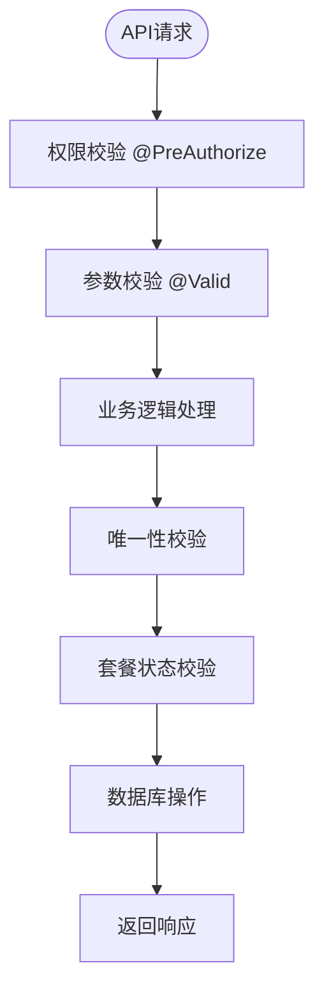

# 租户管理API

<cite>
**本文档引用文件**  
- [TenantController.java](file://yudao-module-system/src/main/java/cn/iocoder/yudao/module/system/controller/admin/tenant/TenantController.java)
- [TenantPackageController.java](file://yudao-module-system/src/main/java/cn/iocoder/yudao/module/system/controller/admin/tenant/TenantPackageController.java)
- [TenantSaveReqVO.java](file://yudao-module-system/src/main/java/cn/iocoder/yudao/module/system/controller/admin/tenant/vo/tenant/TenantSaveReqVO.java)
- [TenantPageReqVO.java](file://yudao-module-system/src/main/java/cn/iocoder/yudao/module/system/controller/admin/tenant/vo/tenant/TenantPageReqVO.java)
- [TenantRespVO.java](file://yudao-module-system/src/main/java/cn/iocoder/yudao/module/system/controller/admin/tenant/vo/tenant/TenantRespVO.java)
- [TenantContextHolder.java](file://yudao-framework/yudao-spring-boot-starter-biz-tenant/src/main/java/cn/iocoder/yudao/framework/tenant/core/context/TenantContextHolder.java)
- [TenantServiceImpl.java](file://yudao-module-system/src/main/java/cn/iocoder/yudao/module/system/service/tenant/TenantServiceImpl.java)
</cite>

## 目录
1. [简介](#简介)
2. [核心API定义](#核心api定义)
3. [租户套餐管理](#租户套餐管理)
4. [多租户架构与上下文传递](#多租户架构与上下文传递)
5. [请求与响应示例](#请求与响应示例)
6. [权限模型与安全约束](#权限模型与安全约束)
7. [错误码与异常处理](#错误码与异常处理)
8. [总结](#总结)

## 简介
本技术文档详细描述了基于`TenantController`实现的租户管理API，涵盖租户的增删改查（CRUD）操作。文档系统性地记录了相关数据模型（如`TenantSaveReqVO`、`TenantPageReqVO`、`TenantRespVO`）和端点定义，说明了租户套餐（`TenantPackageController`）的关联管理接口及租户状态控制逻辑。同时，文档化了多租户架构下的API调用特殊性，包括租户隔离机制和上下文传递方式，并提供了完整的请求/响应示例、权限模型解释以及错误处理机制，旨在为客户端开发者提供全面的技术指导。

**Section sources**
- [TenantController.java](file://yudao-module-system/src/main/java/cn/iocoder/yudao/module/system/controller/admin/tenant/TenantController.java#L1-L30)

## 核心API定义

### 租户增删改查操作

#### 创建租户
- **HTTP方法**: `POST`
- **路径**: `/system/tenant/create`
- **权限要求**: `system:tenant:create`
- **功能描述**: 创建一个新的租户实例。
- **请求体**: `TenantSaveReqVO`
- **响应**: 成功返回新创建租户的ID（`CommonResult<Long>`）

#### 更新租户
- **HTTP方法**: `PUT`
- **路径**: `/system/tenant/update`
- **权限要求**: `system:tenant:update`
- **功能描述**: 更新现有租户的信息。
- **请求体**: `TenantSaveReqVO`
- **响应**: 成功返回布尔值`true`（`CommonResult<Boolean>`）

#### 删除租户
- **HTTP方法**: `DELETE`
- **路径**: `/system/tenant/delete`
- **权限要求**: `system:tenant:delete`
- **功能描述**: 删除指定ID的租户。
- **参数**: `id`（租户编号）
- **响应**: 成功返回布尔值`true`（`CommonResult<Boolean>`）

#### 批量删除租户
- **HTTP方法**: `DELETE`
- **路径**: `/system/tenant/delete-list`
- **权限要求**: `system:tenant:delete`
- **功能描述**: 批量删除多个租户。
- **参数**: `ids`（租户编号列表）
- **响应**: 成功返回布尔值`true`（`CommonResult<Boolean>`）

#### 查询单个租户
- **HTTP方法**: `GET`
- **路径**: `/system/tenant/get`
- **权限要求**: `system:tenant:query`
- **功能描述**: 根据ID获取单个租户的详细信息。
- **参数**: `id`（租户编号）
- **响应**: `TenantRespVO`对象（`CommonResult<TenantRespVO>`）

#### 分页查询租户列表
- **HTTP方法**: `GET`
- **路径**: `/system/tenant/page`
- **权限要求**: `system:tenant:query`
- **功能描述**: 分页获取租户列表，支持按名称、联系人、状态等条件筛选。
- **参数**: `TenantPageReqVO`
- **响应**: `PageResult<TenantRespVO>`对象

#### 导出租户Excel
- **HTTP方法**: `GET`
- **路径**: `/system/tenant/export-excel`
- **权限要求**: `system:tenant:export`
- **功能描述**: 导出符合条件的租户数据为Excel文件。
- **参数**: `TenantPageReqVO`
- **响应**: HTTP响应直接输出Excel文件流

**Section sources**
- [TenantController.java](file://yudao-module-system/src/main/java/cn/iocoder/yudao/module/system/controller/admin/tenant/TenantController.java#L73-L133)

### 数据模型定义

#### TenantSaveReqVO (租户保存请求对象)
该对象用于创建和更新租户操作，包含以下字段：

| 字段名 | 类型 | 是否必填 | 描述 | 示例 |
|--------|------|----------|------|------|
| id | Long | 否 | 租户编号（更新时使用） | 1024 |
| name | String | 是 | 租户名 | 芋道 |
| contactName | String | 是 | 联系人姓名 | 芋艿 |
| contactMobile | String | 否 | 联系手机 | 15601691300 |
| status | Integer | 是 | 租户状态（0正常 1停用） | 1 |
| websites | List<String> | 否 | 绑定域名数组 | ["https://www.iocoder.cn"] |
| packageId | Long | 是 | 租户套餐编号 | 1024 |
| expireTime | LocalDateTime | 是 | 过期时间 | 2025-12-31T23:59:59 |
| accountCount | Integer | 是 | 账号数量 | 1024 |
| username | String | 是（仅创建时） | 管理员用户名 | yudao |
| password | String | 是（仅创建时） | 管理员密码 | 123456 |

**Section sources**
- [TenantSaveReqVO.java](file://yudao-module-system/src/main/java/cn/iocoder/yudao/module/system/controller/admin/tenant/vo/tenant/TenantSaveReqVO.java#L1-L71)

#### TenantPageReqVO (租户分页请求对象)
该对象用于分页查询租户列表，继承自`PageParam`，包含以下筛选字段：

| 字段名 | 类型 | 描述 | 示例 |
|--------|------|------|------|
| name | String | 租户名 | 芋道 |
| contactName | String | 联系人 | 芋艿 |
| contactMobile | String | 联系手机 | 15601691300 |
| status | Integer | 租户状态（0正常 1停用） | 1 |
| createTime | LocalDateTime[] | 创建时间范围 | ["2023-01-01", "2023-12-31"] |

**Section sources**
- [TenantPageReqVO.java](file://yudao-module-system/src/main/java/cn/iocoder/yudao/module/system/controller/admin/tenant/vo/tenant/TenantPageReqVO.java#L1-L36)

#### TenantRespVO (租户响应对象)
该对象用于返回租户信息，包含完整的租户详情：

| 字段名 | 类型 | 是否必填 | 描述 | 示例 |
|--------|------|----------|------|------|
| id | Long | 是 | 租户编号 | 1024 |
| name | String | 是 | 租户名 | 芋道 |
| contactName | String | 是 | 联系人姓名 | 芋艿 |
| contactMobile | String | 否 | 联系手机 | 15601691300 |
| status | Integer | 是 | 租户状态 | 1 |
| websites | List<String> | 否 | 绑定域名数组 | ["https://www.iocoder.cn"] |
| packageId | Long | 是 | 租户套餐编号 | 1024 |
| expireTime | LocalDateTime | 是 | 过期时间 | 2025-12-31T23:59:59 |
| accountCount | Integer | 是 | 账号数量 | 1024 |
| createTime | LocalDateTime | 是 | 创建时间 | 2023-01-01T00:00:00 |

**Section sources**
- [TenantRespVO.java](file://yudao-module-system/src/main/java/cn/iocoder/yudao/module/system/controller/admin/tenant/vo/tenant/TenantRespVO.java#L1-L56)

## 租户套餐管理

### 租户套餐API
`TenantPackageController`提供了对租户套餐的管理接口，其设计模式与`TenantController`一致。

#### 主要端点
- **创建套餐**: `POST /system/tenant-package/create`
- **更新套餐**: `PUT /system/tenant-package/update`
- **删除套餐**: `DELETE /system/tenant-package/delete`
- **批量删除套餐**: `DELETE /system/tenant-package/delete-list`
- **获取套餐**: `GET /system/tenant-package/get`
- **分页查询套餐**: `GET /system/tenant-package/page`
- **获取启用的套餐列表**: `GET /system/tenant-package/get-simple-list`

#### 权限控制
所有操作均通过`@PreAuthorize`注解进行权限校验，例如：
- 创建权限: `@ss.hasPermission('system:tenant-package:create')`
- 查询权限: `@ss.hasPermission('system:tenant-package:query')`

**Section sources**
- [TenantPackageController.java](file://yudao-module-system/src/main/java/cn/iocoder/yudao/module/system/controller/admin/tenant/TenantPackageController.java#L25-L91)

## 多租户架构与上下文传递

### 租户上下文管理
系统通过`TenantContextHolder`类管理当前线程的租户上下文，其核心机制如下：

```mermaid
classDiagram
class TenantContextHolder {
+static Long getTenantId()
+static Long getRequiredTenantId()
+static void setTenantId(Long tenantId)
+static boolean isIgnore()
+static void clear()
}
note right of TenantContextHolder
使用TransmittableThreadLocal
确保租户ID在线程间传递
end
```

**Diagram sources**
- [TenantContextHolder.java](file://yudao-framework/yudao-spring-boot-starter-biz-tenant/src/main/java/cn/iocoder/yudao/framework/tenant/core/context/TenantContextHolder.java#L1-L67)

### 上下文传递流程
1. **Web过滤器**: `TenantContextWebFilter`从HTTP请求头`tenant-id`中提取租户ID。
2. **设置上下文**: 将提取的租户ID设置到`TenantContextHolder`中。
3. **业务执行**: 业务逻辑通过`TenantContextHolder.getTenantId()`获取当前租户。
4. **清理上下文**: 请求结束后，`TenantContextHolder.clear()`清理线程局部变量。

### 租户隔离实现
- **数据隔离**: 通过AOP和动态数据源实现，确保数据库操作限定在当前租户范围内。
- **逻辑隔离**: `TenantUtils.execute()`方法允许在指定租户上下文中执行特定逻辑，确保操作的租户上下文正确。

**Section sources**
- [TenantContextHolder.java](file://yudao-framework/yudao-spring-boot-starter-biz-tenant/src/main/java/cn/iocoder/yudao/framework/tenant/core/context/TenantContextHolder.java#L1-L67)
- [TenantContextWebFilter.java](file://yudao-framework/yudao-spring-boot-starter-biz-tenant/src/main/java/cn/iocoder/yudao/framework/tenant/core/web/TenantContextWebFilter.java#L1-L36)

## 请求与响应示例

### 创建租户请求示例
```json
POST /system/tenant/create
Content-Type: application/json

{
  "name": "新租户",
  "contactName": "张三",
  "contactMobile": "13800138000",
  "status": 1,
  "websites": ["https://newtenant.com"],
  "packageId": 1,
  "expireTime": "2025-12-31T23:59:59",
  "accountCount": 50,
  "username": "admin",
  "password": "password123"
}
```

### 创建租户成功响应
```json
{
  "code": 0,
  "msg": "成功",
  "data": 2001
}
```

### 分页查询租户请求示例
```json
GET /system/tenant/page?pageNo=1&pageSize=10&name=芋道
```

### 分页查询成功响应
```json
{
  "code": 0,
  "msg": "成功",
  "data": {
    "list": [
      {
        "id": 1024,
        "name": "芋道",
        "contactName": "芋艿",
        "status": 1,
        "packageId": 1,
        "expireTime": "2025-12-31T23:59:59",
        "accountCount": 1024,
        "createTime": "2023-01-01T00:00:00"
      }
    ],
    "total": 1
  }
}
```

**Section sources**
- [TenantController.java](file://yudao-module-system/src/main/java/cn/iocoder/yudao/module/system/controller/admin/tenant/TenantController.java#L115-L121)
- [TenantRespVO.java](file://yudao-module-system/src/main/java/cn/iocoder/yudao/module/system/controller/admin/tenant/vo/tenant/TenantRespVO.java#L1-L56)

## 权限模型与安全约束

### 权限控制机制
系统采用基于角色的访问控制（RBAC），通过`@PreAuthorize`注解实现细粒度权限管理。

#### 租户管理权限
| 操作 | 权限码 | 说明 |
|------|--------|------|
| 创建租户 | system:tenant:create | 允许创建新租户 |
| 更新租户 | system:tenant:update | 允许修改租户信息 |
| 删除租户 | system:tenant:delete | 允许删除租户 |
| 查询租户 | system:tenant:query | 允许查看租户信息 |
| 导出租户 | system:tenant:export | 允许导出租户数据 |

### 安全约束
- **参数校验**: 使用`@Valid`注解对请求参数进行JSR-303校验。
- **唯一性校验**: 创建和更新租户时，校验租户名和域名的唯一性。
- **套餐校验**: 确保租户关联的套餐处于启用状态。
- **内置租户保护**: 系统内置租户（如超级管理员租户）禁止删除和修改。



**Diagram sources**
- [TenantController.java](file://yudao-module-system/src/main/java/cn/iocoder/yudao/module/system/controller/admin/tenant/TenantController.java#L73-L133)
- [TenantServiceImpl.java](file://yudao-module-system/src/main/java/cn/iocoder/yudao/module/system/service/tenant/TenantServiceImpl.java#L1-L320)

**Section sources**
- [TenantController.java](file://yudao-module-system/src/main/java/cn/iocoder/yudao/module/system/controller/admin/tenant/TenantController.java#L73-L133)

## 错误码与异常处理

### 主要错误码
系统通过`GlobalErrorCodeConstants`和`ErrorCodeConstants`定义了统一的错误码体系。

| 错误码 | 错误信息 | 触发场景 |
|--------|----------|----------|
| TENANT_NOT_EXISTS | 租户不存在 | 查询或操作不存在的租户 |
| TENANT_DISABLE | 租户已禁用 | 操作被禁用的租户 |
| TENANT_EXPIRE | 租户已过期 | 操作过期的租户 |
| TENANT_NAME_DUPLICATE | 租户名重复 | 创建或更新时租户名冲突 |
| TENANT_WEBSITE_DUPLICATE | 域名重复 | 创建或更新时域名冲突 |
| TENANT_CAN_NOT_UPDATE_SYSTEM | 系统租户不可修改 | 尝试修改系统内置租户 |

### 异常处理流程
1. **业务校验**: 在`TenantServiceImpl`中进行各种业务规则校验。
2. **抛出异常**: 使用`ServiceExceptionUtil.exception()`抛出`ServiceException`。
3. **全局捕获**: 通过全局异常处理器捕获并返回标准化的错误响应。

### 特殊处理逻辑
- **租户状态校验**: `validTenant()`方法统一校验租户是否存在、是否禁用、是否过期。
- **批量操作校验**: `deleteTenantList()`在删除前会逐一校验每个租户的存在性。

**Section sources**
- [TenantServiceImpl.java](file://yudao-module-system/src/main/java/cn/iocoder/yudao/module/system/service/tenant/TenantServiceImpl.java#L1-L320)
- [TenantController.java](file://yudao-module-system/src/main/java/cn/iocoder/yudao/module/system/controller/admin/tenant/TenantController.java#L73-L133)

## 总结
本文档全面介绍了租户管理API的设计与实现，涵盖了从核心CRUD操作到多租户架构的各个方面。通过`TenantController`和`TenantPackageController`，系统提供了完整的租户生命周期管理能力。多租户上下文通过`TenantContextHolder`和`TenantContextWebFilter`实现，确保了租户隔离的安全性。权限模型基于RBAC，通过细粒度的权限码控制访问。错误处理机制完善，能够为客户端提供清晰的错误信息。开发者在使用这些API时，应特别注意权限校验、参数验证和租户上下文的正确传递。