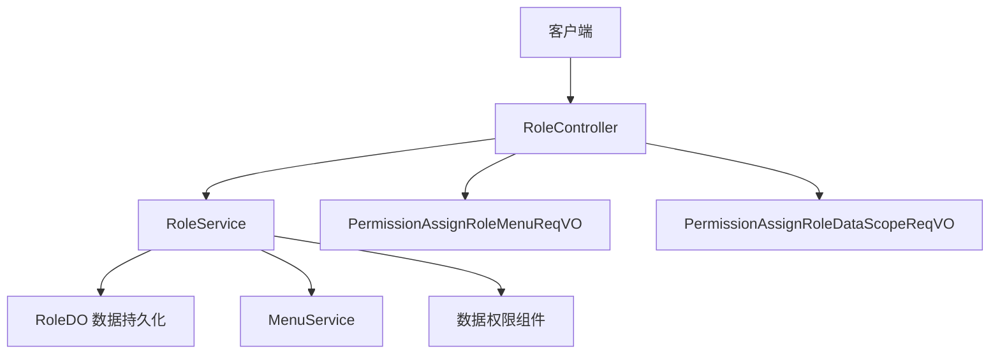
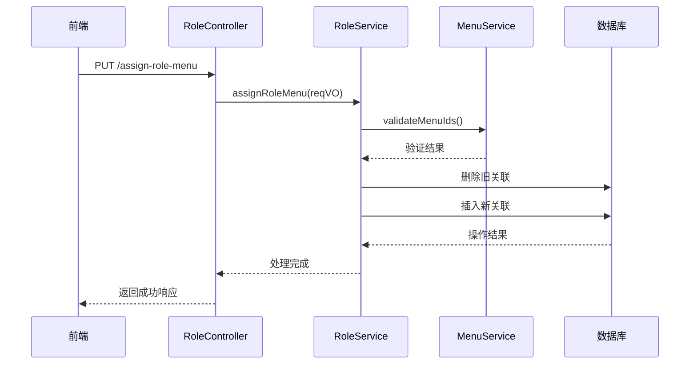

# 角色管理API

<cite>
**本文档引用文件**  
- [RoleController.java](file://yudao-module-system/src/main/java/cn/iocoder/yudao/module/system/controller/admin/permission/RoleController.java)
- [RoleService.java](file://yudao-module-system/src/main/java/cn/iocoder/yudao/module/system/service/permission/RoleService.java)
- [RoleServiceImpl.java](file://yudao-module-system/src/main/java/cn/iocoder/yudao/module/system/service/permission/RoleServiceImpl.java)
- [RoleDO.java](file://yudao-module-system/src/main/java/cn/iocoder/yudao/module/system/dal/dataobject/permission/RoleDO.java)
- [RoleSaveReqVO.java](file://yudao-module-system/src/main/java/cn/iocoder/yudao/module/system/controller/admin/permission/vo/role/RoleSaveReqVO.java)
- [RolePageReqVO.java](file://yudao-module-system/src/main/java/cn/iocoder/yudao/module/system/controller/admin/permission/vo/role/RolePageReqVO.java)
- [RoleRespVO.java](file://yudao-module-system/src/main/java/cn/iocoder/yudao/module/system/controller/admin/permission/vo/role/RoleRespVO.java)
- [RoleSimpleRespVO.java](file://yudao-module-system/src/main/java/cn/iocoder/yudao/module/system/controller/admin/permission/vo/role/RoleSimpleRespVO.java)
- [PermissionAssignRoleMenuReqVO.java](file://yudao-module-system/src/main/java/cn/iocoder/yudao/module/system/controller/admin/permission/vo/permission/PermissionAssignRoleMenuReqVO.java)
- [PermissionAssignRoleDataScopeReqVO.java](file://yudao-module-system/src/main/java/cn/iocoder/yudao/module/system/controller/admin/permission/vo/permission/PermissionAssignRoleDataScopeReqVO.java)
- [CommonResult.java](file://yudao-framework/yudao-common/src/main/java/cn/iocoder/yudao/framework/common/pojo/CommonResult.java)
- [RoleApi.java](file://yudao-module-system/src/main/java/cn/iocoder/yudao/module/system/api/permission/RoleApi.java)
- [RoleApiImpl.java](file://yudao-module-system/src/main/java/cn/iocoder/yudao/module/system/api/permission/RoleApiImpl.java)
- [RoleTypeEnum.java](file://yudao-module-system/src/main/java/cn/iocoder/yudao/module/system/enums/permission/RoleTypeEnum.java)
</cite>

## 目录

1. [简介](#简介)
2. [角色管理接口概览](#角色管理接口概览)
3. [角色增删改查接口](#角色增删改查接口)
4. [权限分配接口](#权限分配接口)
5. [角色状态与简单查询接口](#角色状态与简单查询接口)
6. [数据传输对象（DTO）定义](#数据传输对象dto定义)
7. [权限校验与业务约束](#权限校验与业务约束)
8. [错误处理与错误码](#错误处理与错误码)
9. [请求响应示例](#请求响应示例)
10. [总结](#总结)

## 简介

本文档详细描述了系统中角色管理模块的API接口，重点围绕 `RoleController` 提供的接口功能展开。涵盖角色的创建、更新、删除、分页查询等基本操作，以及角色与菜单权限、数据权限的分配机制。同时说明了角色状态管理（启用/禁用）、简单查询接口的设计与实现，并对相关数据传输对象、权限校验规则、业务约束及错误处理机制进行了全面阐述。

**本节不涉及具体源码分析，因此无源文件引用。**

## 角色管理接口概览

角色管理API由 `RoleController` 统一提供，位于系统模块的权限管理子系统中。该控制器通过RESTful风格的HTTP接口对外暴露服务，支持前端进行角色全生命周期管理。所有接口均遵循统一的响应结构 `CommonResult`，确保前后端交互的一致性与可预测性。



**图示来源**  
- [RoleController.java](file://yudao-module-system/src/main/java/cn/iocoder/yudao/module/system/controller/admin/permission/RoleController.java)
- [RoleService.java](file://yudao-module-system/src/main/java/cn/iocoder/yudao/module/system/service/permission/RoleService.java)
- [RoleDO.java](file://yudao-module-system/src/main/java/cn/iocoder/yudao/module/system/dal/dataobject/permission/RoleDO.java)

## 角色增删改查接口

### 创建角色
- **HTTP方法**: POST
- **URL路径**: `/system/role/create`
- **请求体**: `RoleSaveReqVO`
- **描述**: 创建新角色，需提供角色名称、编码、排序、状态、备注等信息。系统会校验角色编码的唯一性。

### 更新角色
- **HTTP方法**: PUT
- **URL路径**: `/system/role/update`
- **请求体**: `RoleSaveReqVO`
- **描述**: 根据角色ID更新角色信息，字段同创建接口。同样校验编码唯一性。

### 删除角色
- **HTTP方法**: DELETE
- **URL路径**: `/system/role/delete`
- **参数**: `id` (路径或查询参数)
- **描述**: 逻辑删除角色，设置删除标志位。删除前校验该角色是否已被用户关联。

### 分页查询角色
- **HTTP方法**: GET
- **URL路径**: `/system/role/page`
- **参数**: `RolePageReqVO`
- **响应**: `CommonResult<PageResult<RoleRespVO>>`
- **描述**: 支持按角色名称、状态、创建时间范围等条件进行分页查询。

**本节来源**  
- [RoleController.java](file://yudao-module-system/src/main/java/cn/iocoder/yudao/module/system/controller/admin/permission/RoleController.java#L25-L120)
- [RoleSaveReqVO.java](file://yudao-module-system/src/main/java/cn/iocoder/yudao/module/system/controller/admin/permission/vo/role/RoleSaveReqVO.java)
- [RolePageReqVO.java](file://yudao-module-system/src/main/java/cn/iocoder/yudao/module/system/controller/admin/permission/vo/role/RolePageReqVO.java)
- [RoleRespVO.java](file://yudao-module-system/src/main/java/cn/iocoder/yudao/module/system/controller/admin/permission/vo/role/RoleRespVO.java)

## 权限分配接口

### 分配角色菜单权限
- **HTTP方法**: PUT
- **URL路径**: `/system/permission/assign-role-menu`
- **请求体**: `PermissionAssignRoleMenuReqVO`
- **描述**: 为指定角色分配菜单权限，传入角色ID和菜单ID列表。系统将更新 `role_menu` 关联表。

### 分配角色数据权限
- **HTTP方法**: PUT
- **URL路径**: `/system/permission/assign-role-data-scope`
- **请求体**: `PermissionAssignRoleDataScopeReqVO`
- **描述**: 设置角色的数据权限范围，如全部、本部门、本部门及子部门等。支持细粒度控制。



**图示来源**  
- [RoleController.java](file://yudao-module-system/src/main/java/cn/iocoder/yudao/module/system/controller/admin/permission/RoleController.java#L150-L180)
- [PermissionAssignRoleMenuReqVO.java](file://yudao-module-system/src/main/java/cn/iocoder/yudao/module/system/controller/admin/permission/vo/permission/PermissionAssignRoleMenuReqVO.java)
- [RoleServiceImpl.java](file://yudao-module-system/src/main/java/cn/iocoder/yudao/module/system/service/permission/RoleServiceImpl.java#L80-L120)

## 角色状态与简单查询接口

### 启用/禁用角色
- **HTTP方法**: PUT
- **URL路径**: `/system/role/update-status`
- **参数**: `id`, `status`
- **描述**: 修改角色的启用状态。禁用后，拥有该角色的用户将无法获得相应权限。

### 获取角色精简信息列表
- **HTTP方法**: GET
- **URL路径**: `/system/role/list-simple`
- **响应**: `CommonResult<List<RoleSimpleRespVO>>`
- **描述**: 获取所有正常状态的角色ID、名称，用于前端下拉框等场景。

**本节来源**  
- [RoleController.java](file://yudao-module-system/src/main/java/cn/iocoder/yudao/module/system/controller/admin/permission/RoleController.java#L125-L145)
- [RoleSimpleRespVO.java](file://yudao-module-system/src/main/java/cn/iocoder/yudao/module/system/controller/admin/permission/vo/role/RoleSimpleRespVO.java)

## 数据传输对象（DTO）定义

| 类名 | 用途 |
|------|------|
| `RoleSaveReqVO` | 创建/更新角色请求参数，包含名称、编码、排序、状态、备注 |
| `RolePageReqVO` | 分页查询请求参数，支持按名称、状态、时间范围过滤 |
| `RoleRespVO` | 分页查询返回对象，包含完整角色信息 |
| `RoleSimpleRespVO` | 精简角色信息，仅含ID和名称，用于下拉选择 |
| `PermissionAssignRoleMenuReqVO` | 角色菜单权限分配请求，含角色ID和菜单ID列表 |
| `PermissionAssignRoleDataScopeReqVO` | 角色数据权限分配请求，含角色ID和数据范围类型 |

**本节来源**  
- [RoleSaveReqVO.java](file://yudao-module-system/src/main/java/cn/iocoder/yudao/module/system/controller/admin/permission/vo/role/RoleSaveReqVO.java)
- [RolePageReqVO.java](file://yudao-module-system/src/main/java/cn/iocoder/yudao/module/system/controller/admin/permission/vo/role/RolePageReqVO.java)
- [RoleRespVO.java](file://yudao-module-system/src/main/java/cn/iocoder/yudao/module/system/controller/admin/permission/vo/role/RoleRespVO.java)
- [RoleSimpleRespVO.java](file://yudao-module-system/src/main/java/cn/iocoder/yudao/module/system/controller/admin/permission/vo/role/RoleSimpleRespVO.java)
- [PermissionAssignRoleMenuReqVO.java](file://yudao-module-system/src/main/java/cn/iocoder/yudao/module/system/controller/admin/permission/vo/permission/PermissionAssignRoleMenuReqVO.java)
- [PermissionAssignRoleDataScopeReqVO.java](file://yudao-module-system/src/main/java/cn/iocoder/yudao/module/system/controller/admin/permission/vo/permission/PermissionAssignRoleDataScopeReqVO.java)

## 权限校验与业务约束

- **角色编码唯一性**: 创建或更新角色时，系统通过 `RoleService` 校验角色编码（code）在租户内唯一。
- **内置角色保护**: 类型为 `RoleTypeEnum.ADMIN` 的系统内置角色不可删除或修改关键属性。
- **权限变更校验**: 分配菜单权限前，会校验菜单ID的有效性及当前用户是否有权操作。
- **数据权限范围**: 数据权限分配遵循 `DataScopeEnum` 枚举定义的范围，如全部、本部门等。
- **操作权限控制**: 所有接口均通过Spring Security进行认证与鉴权，确保只有具备相应权限的管理员可操作。

**本节来源**  
- [RoleServiceImpl.java](file://yudao-module-system/src/main/java/cn/iocoder/yudao/module/system/service/permission/RoleServiceImpl.java#L30-L80)
- [RoleTypeEnum.java](file://yudao-module-system/src/main/java/cn/iocoder/yudao/module/system/enums/permission/RoleTypeEnum.java)
- [DataScopeEnum.java](file://yudao-module-system/src/main/java/cn/iocoder/yudao/module/system/enums/permission/DataScopeEnum.java)

## 错误处理与错误码

所有接口返回统一的 `CommonResult<T>` 结构，包含 `code`、`message` 和 `data` 字段。常见错误码如下：

| 错误码 | 含义 | 触发场景 |
|--------|------|----------|
| 0 | 成功 | 操作成功完成 |
| 20011 | 角色不存在 | 操作时指定的角色ID不存在 |
| 20012 | 角色已存在 | 创建角色时编码重复 |
| 20013 | 禁止操作内置角色 | 尝试删除或修改系统内置角色 |
| 20014 | 菜单不存在 | 分配权限时传入无效菜单ID |
| 401 | 未认证 | 用户未登录 |
| 403 | 禁止访问 | 用户无权执行该操作 |

错误由全局异常处理器捕获并封装，确保客户端能清晰识别问题原因。

**本节来源**  
- [CommonResult.java](file://yudao-framework/yudao-common/src/main/java/cn/iocoder/yudao/framework/common/pojo/CommonResult.java)
- [RoleServiceImpl.java](file://yudao-module-system/src/main/java/cn/iocoder/yudao/module/system/service/permission/RoleServiceImpl.java)
- [ErrorCodeConstants.java](file://yudao-module-system/src/main/java/cn/iocoder/yudao/module/system/enums/ErrorCodeConstants.java)（隐含引用）

## 请求响应示例

### 创建角色请求
```json
POST /system/role/create
{
  "name": "财务专员",
  "code": "FINANCE_USER",
  "sort": 10,
  "status": 0,
  "remark": "负责财务相关操作"
}
```

### 创建角色响应
```json
{
  "code": 0,
  "message": "成功",
  "data": 1024
}
```

### 分配菜单权限请求
```json
PUT /system/permission/assign-role-menu
{
  "roleId": 1024,
  "menuIds": [1, 2, 3, 4]
}
```

### 分页查询响应
```json
GET /system/role/page?name=财务
{
  "code": 0,
  "message": "成功",
  "data": {
    "list": [
      {
        "id": 1024,
        "name": "财务专员",
        "code": "FINANCE_USER",
        "status": 0,
        "createTime": "2023-01-01T10:00:00"
      }
    ],
    "total": 1
  }
}
```

**本节来源**  
- [RoleController.java](file://yudao-module-system/src/main/java/cn/iocoder/yudao/module/system/controller/admin/permission/RoleController.java)
- [RoleSaveReqVO.java](file://yudao-module-system/src/main/java/cn/iocoder/yudao/module/system/controller/admin/permission/vo/role/RoleSaveReqVO.java)
- [RoleRespVO.java](file://yudao-module-system/src/main/java/cn/iocoder/yudao/module/system/controller/admin/permission/vo/role/RoleRespVO.java)

## 总结

本文档全面介绍了角色管理API的设计与实现，涵盖了从基础CRUD到权限分配、状态管理的完整功能。通过标准化的DTO、统一的响应结构和严格的业务约束，确保了接口的稳定性与安全性。开发者可依据本文档快速集成角色管理功能，实现灵活的权限控制系统。

**本节为总结性内容，不涉及具体源码，因此无源文件引用。**