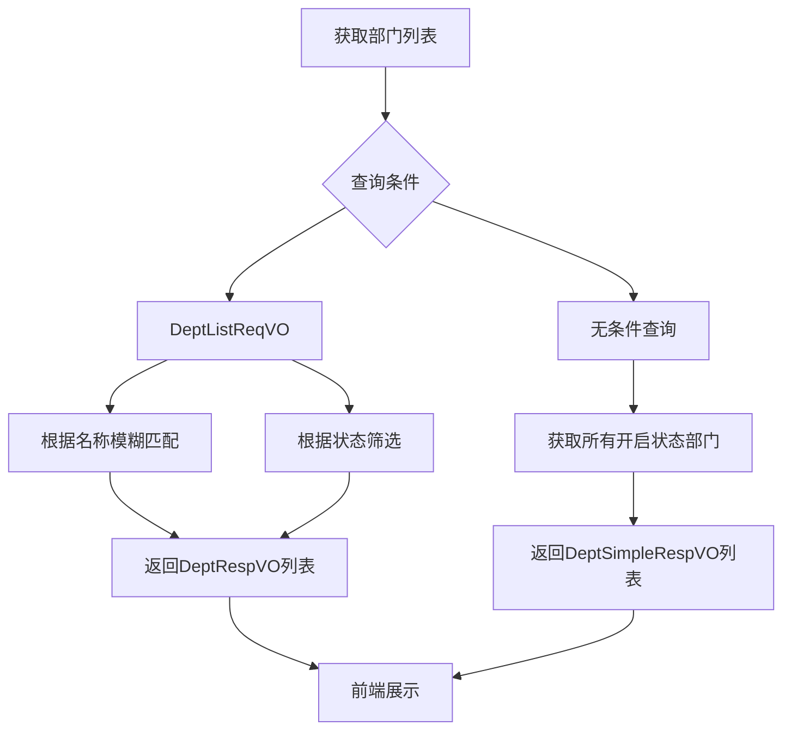
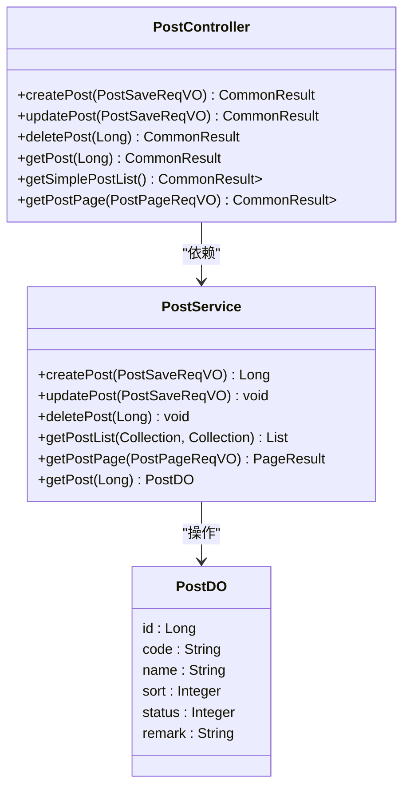
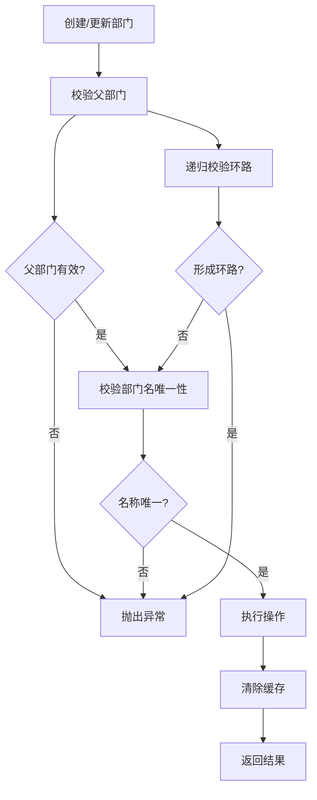

# 部门管理API

<cite>
**本文档引用的文件**
- [DeptController.java](file://yudao-module-system/src/main/java/cn/iocoder/yudao/module/system/controller/admin/dept/DeptController.java)
- [DeptSaveReqVO.java](file://yudao-module-system/src/main/java/cn/iocoder/yudao/module/system/controller/admin/dept/vo/dept/DeptSaveReqVO.java)
- [DeptListReqVO.java](file://yudao-module-system/src/main/java/cn/iocoder/yudao/module/system/controller/admin/dept/vo/dept/DeptListReqVO.java)
- [DeptRespVO.java](file://yudao-module-system/src/main/java/cn/iocoder/yudao/module/system/controller/admin/dept/vo/dept/DeptRespVO.java)
- [DeptSimpleRespVO.java](file://yudao-module-system/src/main/java/cn/iocoder/yudao/module/system/controller/admin/dept/vo/dept/DeptSimpleRespVO.java)
- [PostController.java](file://yudao-module-system/src/main/java/cn/iocoder/yudao/module/system/controller/admin/dept/PostController.java)
- [DeptService.java](file://yudao-module-system/src/main/java/cn/iocoder/yudao/module/system/service/dept/DeptService.java)
- [DeptServiceImpl.java](file://yudao-module-system/src/main/java/cn/iocoder/yudao/module/system/service/dept/DeptServiceImpl.java)
- [DeptDO.java](file://yudao-module-system/src/main/java/cn/iocoder/yudao/module/system/dal/dataobject/dept/DeptDO.java)
</cite>

## 目录
1. [简介](#简介)
2. [核心功能接口](#核心功能接口)
3. [请求与响应对象](#请求与响应对象)
4. [部门树形结构管理](#部门树形结构管理)
5. [部门与岗位关联管理](#部门与岗位关联管理)
6. [数据权限与业务规则](#数据权限与业务规则)
7. [认证授权与错误处理](#认证授权与错误处理)

## 简介

部门管理API提供了完整的部门生命周期管理功能，包括部门的创建、修改、删除和查询操作。系统通过树形结构组织部门层级关系，支持多级部门嵌套。API设计遵循RESTful规范，使用标准的HTTP方法进行资源操作。本系统还实现了部门与岗位的关联管理，支持组织架构的完整建模。

**Section sources**
- [DeptController.java](file://yudao-module-system/src/main/java/cn/iocoder/yudao/module/system/controller/admin/dept/DeptController.java#L1-L20)

## 核心功能接口

部门管理API提供了一套完整的CRUD操作接口，支持对部门资源的全面管理。

### 创建部门
- **接口路径**: `POST /system/dept/create`
- **权限要求**: `system:dept:create`
- **功能描述**: 创建新的部门记录，返回新创建部门的编号
- **使用场景**: 组织架构初始化、新增业务部门等

### 更新部门
- **接口路径**: `PUT /system/dept/update`
- **权限要求**: `system:dept:update`
- **功能描述**: 更新现有部门信息，根据部门ID进行更新操作
- **使用场景**: 部门信息变更、组织结构调整等

### 删除部门
- **接口路径**: `DELETE /system/dept/delete`
- **权限要求**: `system:dept:delete`
- **功能描述**: 删除指定ID的部门，支持单个删除和批量删除
- **使用场景**: 部门撤销、组织架构优化等

### 查询部门
- **接口路径**: `GET /system/dept/list`
- **权限要求**: `system:dept:query`
- **功能描述**: 根据查询条件获取部门列表，支持模糊匹配和状态筛选
- **使用场景**: 部门信息浏览、组织架构查看等

**Section sources**
- [DeptController.java](file://yudao-module-system/src/main/java/cn/iocoder/yudao/module/system/controller/admin/dept/DeptController.java#L25-L90)

## 请求与响应对象

### 请求对象

#### DeptSaveReqVO (部门保存请求对象)
用于创建和更新部门操作的请求参数，包含以下字段：
- **id**: 部门编号（更新时必需）
- **name**: 部门名称（必填，最大30字符）
- **parentId**: 父部门ID（用于构建层级关系）
- **sort**: 显示顺序（必填，整数）
- **leaderUserId**: 负责人用户编号
- **phone**: 联系电话（最大11字符）
- **email**: 邮箱（符合邮箱格式，最大50字符）
- **status**: 状态（必填，参考CommonStatusEnum枚举）

#### DeptListReqVO (部门列表查询请求对象)
用于查询部门列表的筛选条件，包含以下字段：
- **name**: 部门名称（模糊匹配）
- **status**: 展示状态（参考CommonStatusEnum枚举）

**Section sources**
- [DeptSaveReqVO.java](file://yudao-module-system/src/main/java/cn/iocoder/yudao/module/system/controller/admin/dept/vo/dept/DeptSaveReqVO.java#L1-L50)
- [DeptListReqVO.java](file://yudao-module-system/src/main/java/cn/iocoder/yudao/module/system/controller/admin/dept/vo/dept/DeptListReqVO.java#L1-L17)

### 响应对象

#### DeptRespVO (部门响应对象)
返回完整的部门信息，包含以下字段：
- **id**: 部门编号
- **name**: 部门名称
- **parentId**: 父部门ID
- **sort**: 显示顺序
- **leaderUserId**: 负责人用户编号
- **phone**: 联系电话
- **email**: 邮箱
- **status**: 状态
- **createTime**: 创建时间

#### DeptSimpleRespVO (部门精简响应对象)
返回部门的精简信息，主要用于前端下拉选项，包含以下字段：
- **id**: 部门编号
- **name**: 部门名称
- **parentId**: 父部门ID

**Section sources**
- [DeptRespVO.java](file://yudao-module-system/src/main/java/cn/iocoder/yudao/module/system/controller/admin/dept/vo/dept/DeptRespVO.java#L1-L40)
- [DeptSimpleRespVO.java](file://yudao-module-system/src/main/java/cn/iocoder/yudao/module/system/controller/admin/dept/vo/dept/DeptSimpleRespVO.java#L1-L24)

## 部门树形结构管理

### 树形结构构建
系统通过`parentId`字段构建部门的树形层级结构。根部门的`parentId`为0，其他部门通过`parentId`关联到其父部门。这种设计支持无限层级的部门嵌套，满足复杂组织架构的需求。

### 查询逻辑
系统提供了多种部门查询接口，支持不同的使用场景：

**Diagram sources**
- [DeptController.java](file://yudao-module-system/src/main/java/cn/iocoder/yudao/module/system/controller/admin/dept/DeptController.java#L67-L81)
- [DeptService.java](file://yudao-module-system/src/main/java/cn/iocoder/yudao/module/system/service/dept/DeptService.java#L67-L67)

### 层级关系获取
系统通过递归查询获取部门的完整层级关系。`getChildDeptList`方法会遍历所有子部门，直到没有更深层级的子部门为止。查询结果按`sort`字段排序，确保显示顺序的一致性。

**Section sources**
- [DeptServiceImpl.java](file://yudao-module-system/src/main/java/cn/iocoder/yudao/module/system/service/dept/DeptServiceImpl.java#L186-L203)
- [DeptService.java](file://yudao-module-system/src/main/java/cn/iocoder/yudao/module/system/service/dept/DeptService.java#L96-L96)

## 部门与岗位关联管理

### 岗位管理接口
系统提供了独立的岗位管理API，与部门管理协同工作：

**Diagram sources**
- [PostController.java](file://yudao-module-system/src/main/java/cn/iocoder/yudao/module/system/controller/admin/dept/PostController.java#L1-L107)
- [PostService.java](file://yudao-module-system/src/main/java/cn/iocoder/yudao/module/system/service/dept/PostService.java#L16-L90)

### 关联使用示例
部门和岗位信息通常在用户信息中联合使用，通过部门ID和岗位ID关联到具体的部门和岗位记录。

**Section sources**
- [PostController.java](file://yudao-module-system/src/main/java/cn/iocoder/yudao/module/system/controller/admin/dept/PostController.java#L1-L107)

## 数据权限与业务规则

### 数据权限控制
系统通过注解实现细粒度的数据权限控制：
- `@PreAuthorize("@ss.hasPermission('system:dept:create')")`: 创建权限
- `@PreAuthorize("@ss.hasPermission('system:dept:update')")`: 修改权限
- `@PreAuthorize("@ss.hasPermission('system:dept:delete')")`: 删除权限
- `@PreAuthorize("@ss.hasPermission('system:dept:query')")`: 查询权限

### 业务规则
系统实现了严格的业务规则校验：

**Diagram sources**
- [DeptServiceImpl.java](file://yudao-module-system/src/main/java/cn/iocoder/yudao/module/system/service/dept/DeptServiceImpl.java#L116-L149)
- [DeptServiceImpl.java](file://yudao-module-system/src/main/java/cn/iocoder/yudao/module/system/service/dept/DeptServiceImpl.java#L151-L164)

#### 部门名称唯一性
在同一父部门下，部门名称必须唯一。系统通过`validateDeptNameUnique`方法进行校验，确保组织架构的规范性。

#### 父部门校验
系统对父部门进行多重校验：
- 不能设置自己为父部门
- 父部门必须存在
- 不能形成环路（父部门不能是自己的子部门）

**Section sources**
- [DeptServiceImpl.java](file://yudao-module-system/src/main/java/cn/iocoder/yudao/module/system/service/dept/DeptServiceImpl.java#L39-L74)

## 认证授权与错误处理

### 认证授权要求
所有部门管理API都需要进行认证和授权：
- 用户必须已登录系统
- 必须具有相应的权限码才能访问特定接口
- 权限通过Spring Security的`@PreAuthorize`注解进行控制

### 可能返回的错误情况
系统定义了多种错误码，用于指示不同的错误情况：
- **DEPT_NOT_FOUND**: 部门不存在
- **DEPT_PARENT_NOT_EXITS**: 父部门不存在
- **DEPT_NAME_DUPLICATE**: 部门名称重复
- **DEPT_EXITS_CHILDREN**: 部门存在子部门，无法删除
- **DEPT_PARENT_IS_CHILD**: 父部门是自己的子部门，形成环路

错误信息通过`CommonResult`对象返回，包含错误码和描述信息，便于前端进行错误处理。

**Section sources**
- [DeptServiceImpl.java](file://yudao-module-system/src/main/java/cn/iocoder/yudao/module/system/service/dept/DeptServiceImpl.java#L105-L114)
- [DeptServiceImpl.java](file://yudao-module-system/src/main/java/cn/iocoder/yudao/module/system/service/dept/DeptServiceImpl.java#L151-L164)
- [DeptServiceImpl.java](file://yudao-module-system/src/main/java/cn/iocoder/yudao/module/system/service/dept/DeptServiceImpl.java#L75-L90)