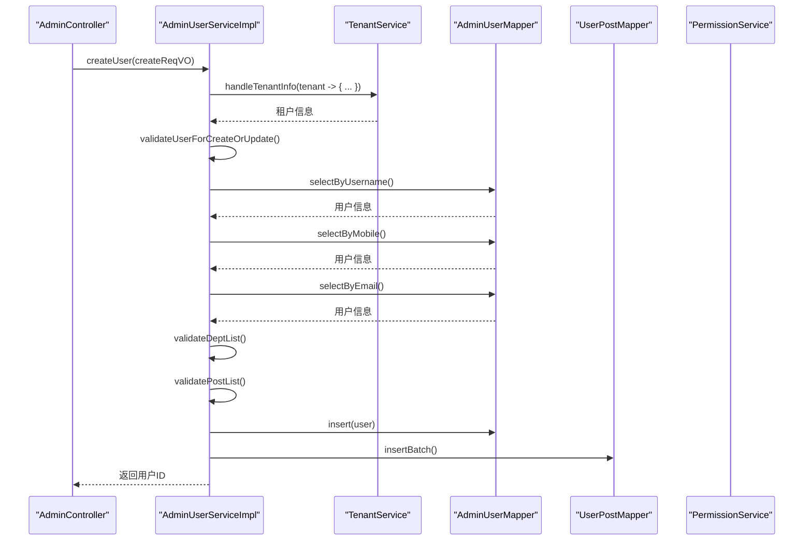
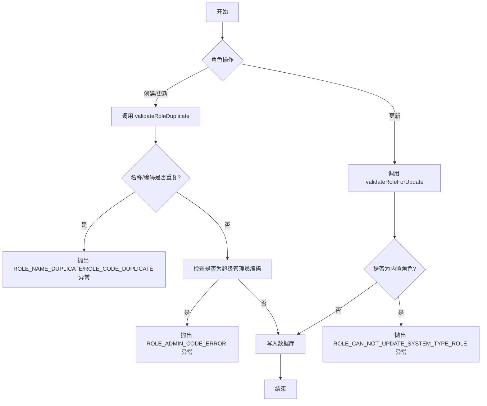
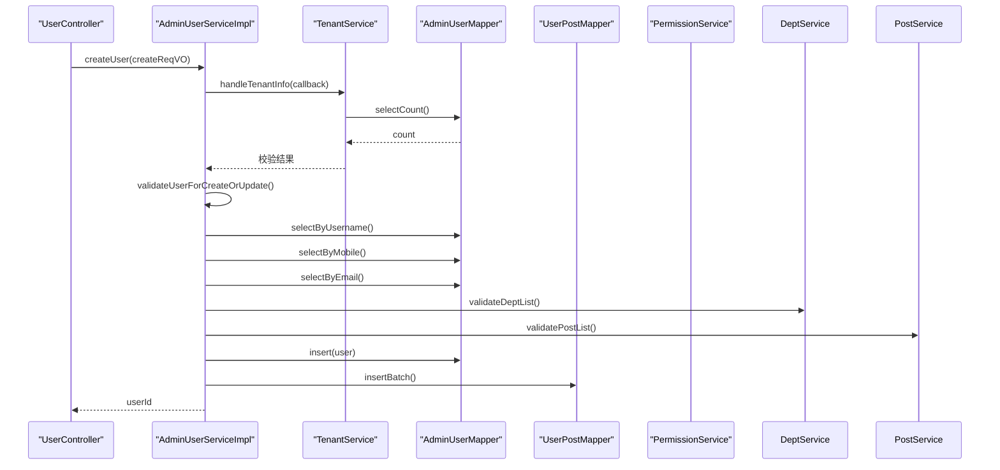

# 业务逻辑层

<cite>
**本文档引用的文件**   
- [AdminUserServiceImpl.java](file://yudao-module-system/src/main/java/cn/iocoder/yudao/module/system/service/user/AdminUserServiceImpl.java)
- [RoleServiceImpl.java](file://yudao-module-system/src/main/java/cn/iocoder/yudao/module/system/service/permission/RoleServiceImpl.java)
- [DeptServiceImpl.java](file://yudao-module-system/src/main/java/cn/iocoder/yudao/module/system/service/dept/DeptServiceImpl.java)
- [TenantServiceImpl.java](file://yudao-module-system/src/main/java/cn/iocoder/yudao/module/system/service/tenant/TenantServiceImpl.java)
- [ErrorCodeConstants.java](file://yudao-module-system/src/main/java/cn/iocoder/yudao/module/system/enums/ErrorCodeConstants.java)
- [GlobalErrorCodeConstants.java](file://yudao-framework/yudao-common/src/main/java/cn/iocoder/yudao/framework/common/exception/enums/GlobalErrorCodeConstants.java)
</cite>

## 目录
1. [引言](#引言)
2. [核心服务实现机制](#核心服务实现机制)
3. [用户管理服务](#用户管理服务)
4. [角色管理服务](#角色管理服务)
5. [部门管理服务](#部门管理服务)
6. [租户管理服务](#租户管理服务)
7. [事务管理机制](#事务管理机制)
8. [领域模型与业务规则](#领域模型与业务规则)
9. [服务间调用与依赖注入](#服务间调用与依赖注入)
10. [关键业务流程时序图](#关键业务流程时序图)
11. [异常处理与错误码管理](#异常处理与错误码管理)
12. [服务扩展与定制指南](#服务扩展与定制指南)

## 引言
本文档旨在深入剖析系统业务逻辑层的核心服务实现机制。重点分析`AdminUserServiceImpl`、`RoleServiceImpl`、`DeptServiceImpl`和`TenantServiceImpl`等核心服务类的业务逻辑流程，包括用户创建、角色分配、部门管理、租户配置等关键操作的实现细节。文档将详细说明服务层如何协调多个数据访问对象（DAO）完成复杂业务操作，阐述事务管理、领域模型设计、异常处理等核心机制，为开发者提供全面的技术指导。

## 核心服务实现机制
系统业务逻辑层采用典型的分层架构，服务实现类（ServiceImpl）位于业务逻辑层的核心，负责协调数据访问层（DAO/Mapper）和外部服务（API），实现复杂的业务规则。服务类通过Spring的依赖注入（`@Resource`）获取所需的DAO、其他服务和工具类，确保了组件间的松耦合。每个服务实现类都实现了对应的接口，遵循了面向接口编程的原则。

**Section sources**
- [AdminUserServiceImpl.java](file://yudao-module-system/src/main/java/cn/iocoder/yudao/module/system/service/user/AdminUserServiceImpl.java#L55-L532)
- [RoleServiceImpl.java](file://yudao-module-system/src/main/java/cn/iocoder/yudao/module/system/service/permission/RoleServiceImpl.java#L43-L273)

## 用户管理服务

`AdminUserServiceImpl`是用户管理的核心服务，负责处理所有与后台用户相关的业务逻辑，包括用户的创建、更新、删除、查询以及密码管理等。

### 用户创建流程
用户创建流程是一个典型的事务性操作，确保了数据的一致性。其核心流程如下：
1.  **租户配额校验**：通过`tenantService.handleTenantInfo()`回调，检查当前租户的账户数量是否已达到上限。
2.  **数据唯一性校验**：调用`validateUserForCreateOrUpdate()`方法，校验用户名、手机号、邮箱的唯一性，并确保关联的部门和岗位处于开启状态。
3.  **数据插入**：将用户信息（密码已加密）插入到`admin_user`表中。
4.  **关联岗位绑定**：如果用户关联了岗位，则将用户ID与岗位ID的映射关系批量插入到`user_post`关联表中。
5.  **操作日志记录**：通过`@LogRecord`注解，自动记录用户创建的操作日志。

**Diagram sources**
- [AdminUserServiceImpl.java](file://yudao-module-system/src/main/java/cn/iocoder/yudao/module/system/service/user/AdminUserServiceImpl.java#L55-L80)

### 用户更新与删除
- **更新**：`updateUser()`方法在更新用户基本信息的同时，会调用`updateUserPost()`方法，通过计算数据库中已存在的岗位ID与新提交的岗位ID的差集，来决定哪些岗位需要新增、哪些需要删除，从而实现精准的岗位关系维护。
- **删除**：`deleteUser()`方法不仅删除用户本身，还会通过`permissionService.processUserDeleted()`清理用户相关的权限数据，并删除`user_post`表中的关联记录，确保数据的完整性。

**Section sources**
- [AdminUserServiceImpl.java](file://yudao-module-system/src/main/java/cn/iocoder/yudao/module/system/service/user/AdminUserServiceImpl.java#L55-L532)

## 角色管理服务

`RoleServiceImpl`负责管理系统的角色，包括角色的创建、更新、删除和数据权限的分配。

### 角色创建与更新
角色的创建和更新流程非常相似，都遵循了严格的校验规则：
1.  **唯一性校验**：`validateRoleDuplicate()`方法会检查角色名称和编码是否已存在。特别地，它会阻止创建编码为“super-admin”的超级管理员角色。
2.  **内置角色保护**：`validateRoleForUpdate()`方法会检查角色类型，阻止对`SYSTEM`类型的内置角色进行更新或删除，保证了系统安全。
3.  **数据持久化**：校验通过后，将角色信息写入`role`表。

### 数据权限管理
角色服务的一个重要功能是管理数据权限。`updateRoleDataScope()`方法允许为角色设置不同的数据范围（如全部数据、指定部门数据等），这直接影响了该角色下的用户在查询数据时的可见范围。

**Diagram sources**
- [RoleServiceImpl.java](file://yudao-module-system/src/main/java/cn/iocoder/yudao/module/system/service/permission/RoleServiceImpl.java#L43-L273)

**Section sources**
- [RoleServiceImpl.java](file://yudao-module-system/src/main/java/cn/iocoder/yudao/module/system/service/permission/RoleServiceImpl.java#L43-L273)

## 部门管理服务

`DeptServiceImpl`负责管理组织架构中的部门，其设计充分考虑了树形结构的特性。

### 部门创建与父子关系校验
创建部门时，系统会进行严格的校验：
1.  **父部门有效性**：`validateParentDept()`方法会递归检查父部门是否存在，并且最关键的是，它会防止形成环路。例如，不能将部门A的父部门设置为A的子部门，这通过递归遍历父部门的父部门链来实现。
2.  **部门名唯一性**：`validateDeptNameUnique()`方法确保在同一父部门下，部门名称是唯一的。

### 部门删除限制
删除部门时，系统会检查该部门下是否存在子部门。如果存在子部门，则抛出`DEPT_EXITS_CHILDREN`异常，阻止删除操作，从而保证了组织架构的完整性。

**Section sources**
- [DeptServiceImpl.java](file://yudao-module-system/src/main/java/cn/iocoder/yudao/module/system/service/dept/DeptServiceImpl.java#L31-L237)

## 租户管理服务

`TenantServiceImpl`是多租户架构的核心，负责租户的全生命周期管理。

### 租户创建流程
创建租户是一个复杂的、跨数据源的事务操作，使用了`@DSTransactional`注解来保证事务性：
1.  **信息校验**：校验租户名称、域名的唯一性，并验证租户套餐的有效性。
2.  **创建租户**：在主数据源中插入租户基本信息。
3.  **切换数据源**：`TenantUtils.execute(tenantId, ...)`方法会将当前线程的租户ID设置为新创建的租户ID，并切换到该租户对应的数据源。
4.  **初始化租户数据**：在租户专属的数据源中，创建一个管理员角色，并为该角色分配套餐所包含的菜单权限，最后创建一个管理员用户并将其与角色关联。

### 租户套餐变更
当租户的套餐发生变更时，`updateTenantRoleMenu()`方法会遍历该租户下的所有角色，并根据新套餐的菜单ID重新分配权限，确保租户的权限范围与套餐保持一致。

**Section sources**
- [TenantServiceImpl.java](file://yudao-module-system/src/main/java/cn/iocoder/yudao/module/system/service/tenant/TenantServiceImpl.java#L52-L319)

## 事务管理机制
系统广泛使用了Spring的声明式事务管理，通过`@Transactional(rollbackFor = Exception.class)`注解来确保业务操作的原子性。当方法执行过程中抛出任何异常时，所有在该事务中进行的数据库操作都将被回滚。

- **用户批量删除**：`deleteUserList()`方法使用了`@Transactional`，确保在批量删除用户时，如果删除某个用户失败，整个操作都会回滚。
- **租户创建**：由于涉及主数据源和租户数据源的切换，使用了`@DSTransactional`注解来保证跨数据源的本地事务。

**Section sources**
- [AdminUserServiceImpl.java](file://yudao-module-system/src/main/java/cn/iocoder/yudao/module/system/service/user/AdminUserServiceImpl.java#L55-L532)
- [TenantServiceImpl.java](file://yudao-module-system/src/main/java/cn/iocoder/yudao/module/system/service/tenant/TenantServiceImpl.java#L52-L319)

## 领域模型与业务规则
系统通过定义清晰的领域模型（DO - Data Object）和业务规则来保证数据的正确性和一致性。

- **领域模型**：`AdminUserDO`、`RoleDO`、`DeptDO`、`TenantDO`等类定义了数据库表的映射，包含了业务实体的核心属性。
- **业务规则**：业务规则主要通过服务类中的`validateXxx()`方法来实现。例如，`validateOldPassword()`用于校验旧密码的正确性，`validateDeptExists()`用于校验部门是否存在。这些规则在执行核心业务逻辑前被强制执行。

**Section sources**
- [AdminUserServiceImpl.java](file://yudao-module-system/src/main/java/cn/iocoder/yudao/module/system/service/user/AdminUserServiceImpl.java#L55-L532)
- [DeptServiceImpl.java](file://yudao-module-system/src/main/java/cn/iocoder/yudao/module/system/service/dept/DeptServiceImpl.java#L31-L237)

## 服务间调用与依赖注入
服务层通过Spring的依赖注入机制紧密协作。例如：
- `AdminUserServiceImpl`依赖`DeptService`和`PostService`来校验用户关联的部门和岗位。
- `TenantServiceImpl`依赖`RoleService`和`PermissionService`来为新租户创建角色和分配权限。
- `RoleServiceImpl`依赖`PermissionService`来清理角色删除后的关联权限数据。

这种设计模式使得服务职责单一，代码复用性高，易于维护和测试。

**Section sources**
- [AdminUserServiceImpl.java](file://yudao-module-system/src/main/java/cn/iocoder/yudao/module/system/service/user/AdminUserServiceImpl.java#L55-L532)
- [TenantServiceImpl.java](file://yudao-module-system/src/main/java/cn/iocoder/yudao/module/system/service/tenant/TenantServiceImpl.java#L52-L319)
- [RoleServiceImpl.java](file://yudao-module-system/src/main/java/cn/iocoder/yudao/module/system/service/permission/RoleServiceImpl.java#L43-L273)

## 关键业务流程时序图
以下时序图展示了用户创建这一核心业务流程中，各组件间的交互。

**Diagram sources**
- [AdminUserServiceImpl.java](file://yudao-module-system/src/main/java/cn/iocoder/yudao/module/system/service/user/AdminUserServiceImpl.java#L55-L80)

## 异常处理与错误码管理
系统采用统一的异常处理机制，通过抛出自定义的`ServiceException`来中断业务流程并返回错误信息。

### 错误码体系
系统定义了清晰的错误码体系，便于前端和开发者快速定位问题：
- **全局错误码**：定义在`GlobalErrorCodeConstants`中，如`500`表示系统异常，`401`表示未登录。
- **业务错误码**：定义在`ErrorCodeConstants`中，采用`1-002-XXX-XXX`的格式，其中`002`代表`system`模块。例如：
    - `USER_USERNAME_EXISTS (1_002_003_000)`: 用户账号已存在。
    - `ROLE_CAN_NOT_UPDATE_SYSTEM_TYPE_ROLE (1_002_002_003)`: 不能操作内置角色。
    - `DEPT_EXITS_CHILDREN (1_002_004_003)`: 存在子部门，无法删除。

当业务校验失败时，服务层会直接调用`exception()`方法，传入对应的错误码常量，从而抛出带有明确错误信息的异常。

**Section sources**
- [ErrorCodeConstants.java](file://yudao-module-system/src/main/java/cn/iocoder/yudao/module/system/enums/ErrorCodeConstants.java)
- [GlobalErrorCodeConstants.java](file://yudao-framework/yudao-common/src/main/java/cn/iocoder/yudao/framework/common/exception/enums/GlobalErrorCodeConstants.java)
- [AdminUserServiceImpl.java](file://yudao-module-system/src/main/java/cn/iocoder/yudao/module/system/service/user/AdminUserServiceImpl.java#L55-L532)

## 服务扩展与定制指南
开发者在扩展或定制现有服务时，应遵循以下原则：
1.  **遵循现有模式**：新增的业务逻辑应尽量复用已有的`validateXxx()`校验方法和`@Transactional`事务注解。
2.  **保持单一职责**：避免在服务方法中编写过于复杂的逻辑，应将其拆分为多个小的、职责单一的私有方法。
3.  **正确使用缓存**：对于读多写少的数据，应使用`@Cacheable`和`@CacheEvict`注解来提升性能，如`RoleServiceImpl`中的`getRoleFromCache()`方法。
4.  **谨慎处理循环依赖**：当出现服务间的循环依赖时，应使用`@Lazy`注解进行延迟加载，如`AdminUserServiceImpl`中对`TenantService`的注入。
5.  **完善错误码**：为新的业务场景添加对应的错误码，并在`ErrorCodeConstants`中明确定义。