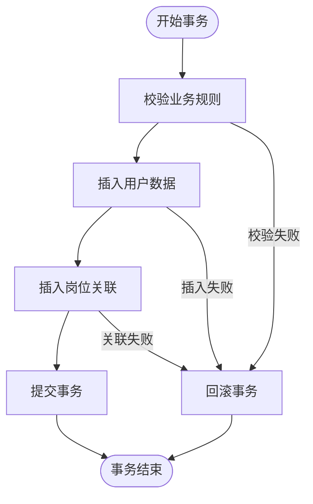
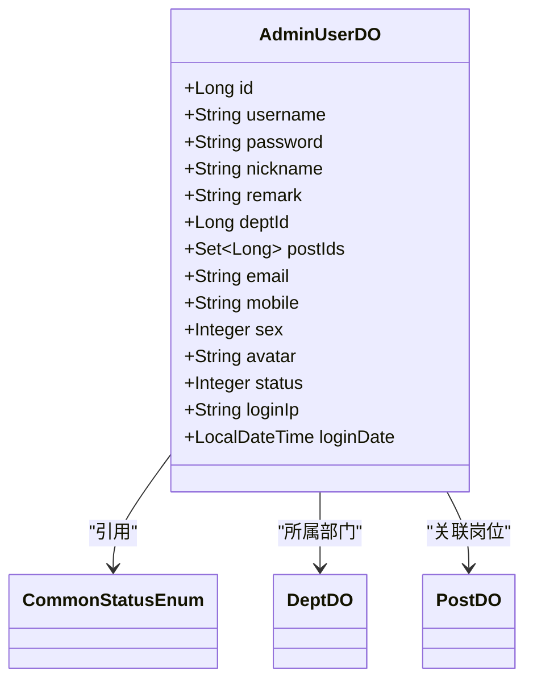
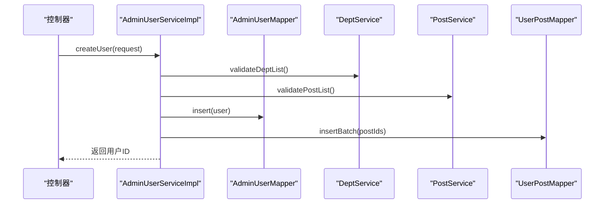

# 用户管理服务

<cite>
**本文档引用的文件**
- [AdminUserServiceImpl.java](file://yudao-module-system\src\main\java\cn\iocoder\yudao\module\system\service\user\AdminUserServiceImpl.java)
- [AdminUserDO.java](file://yudao-module-system\src\main\java\cn\iocoder\yudao\module\system\dal\dataobject\user\AdminUserDO.java)
- [AdminUserMapper.java](file://yudao-module-system\src\main\java\cn\iocoder\yudao\module\system\dal\mysql\user\AdminUserMapper.java)
- [RoleService.java](file://yudao-module-system\src\main\java\cn\iocoder\yudao\module\system\service\permission\RoleService.java)
- [DeptService.java](file://yudao-module-system\src\main\java\cn\iocoder\yudao\module\system\service\dept\DeptService.java)
</cite>

## 目录
1. [用户管理服务](#用户管理服务)
2. [核心操作业务逻辑](#核心操作业务逻辑)
3. [服务层协调机制](#服务层协调机制)
4. [事务管理实现](#事务管理实现)
5. [用户领域模型设计](#用户领域模型设计)
6. [服务调用关系](#服务调用关系)
7. [用户创建与角色分配时序图](#用户创建与角色分配时序图)
8. [异常处理策略](#异常处理策略)
9. [扩展与定制指导](#扩展与定制指导)

## 核心操作业务逻辑

`AdminUserServiceImpl` 类实现了用户管理的核心业务逻辑，包括用户创建、更新、删除、查询、密码重置和状态变更等操作。每个操作都遵循严格的校验流程，确保数据的完整性和一致性。

用户创建操作首先校验租户账户配额，然后验证用户名、手机号、邮箱的唯一性以及部门和岗位的有效性。通过校验后，系统会插入用户数据并关联岗位信息。用户更新操作采用部分更新策略，密码字段被特殊处理，不参与更新。系统会计算岗位变更的差异，执行相应的新增和删除操作。

用户删除操作具有级联效应，不仅删除用户本身，还会清理其关联的权限和岗位数据。查询操作支持多种条件组合，包括分页查询、按部门查询、按岗位查询等。密码重置操作包含旧密码校验环节，确保安全性。状态变更操作直接更新用户状态字段，用于启用或禁用账户。

**本节内容来源**
- [AdminUserServiceImpl.java](file://yudao-module-system\src\main\java\cn\iocoder\yudao\module\system\service\user\AdminUserServiceImpl.java#L55-L532)

## 服务层协调机制

用户管理服务通过协调多个组件完成复杂业务操作。`AdminUserServiceImpl` 依赖于 `AdminUserDO` 数据对象、`AdminUserMapper` 数据访问层以及其他相关服务，如角色服务和部门服务。

服务层采用分层架构设计，`AdminUserServiceImpl` 作为业务逻辑层，负责协调数据访问和业务规则。`AdminUserDO` 作为数据传输对象，封装了用户的所有属性。`AdminUserMapper` 提供了对数据库的访问接口，实现了数据的持久化操作。

在处理用户与岗位的关联关系时，服务层通过 `UserPostMapper` 操作中间表，实现了多对多关系的管理。当用户信息更新时，系统会计算岗位变更的差异，执行精确的新增和删除操作，避免了全量更新的性能开销。

**本节内容来源**
- [AdminUserServiceImpl.java](file://yudao-module-system\src\main\java\cn\iocoder\yudao\module\system\service\user\AdminUserServiceImpl.java#L55-L532)
- [AdminUserDO.java](file://yudao-module-system\src\main\java\cn\iocoder\yudao\module\system\dal\dataobject\user\AdminUserDO.java#L21-L95)
- [AdminUserMapper.java](file://yudao-module-system\src\main\java\cn\iocoder\yudao\module\system\dal\mysql\user\AdminUserMapper.java#L12-L50)

## 事务管理实现

用户管理服务中的关键操作都采用了声明式事务管理，确保数据的一致性和完整性。通过 `@Transactional(rollbackFor = Exception.class)` 注解，系统在发生异常时能够自动回滚所有数据库操作。

创建用户、更新用户、删除用户等操作都被标记为事务性方法。这意味着这些操作要么全部成功，要么全部失败，避免了数据不一致的情况。例如，在创建用户时，如果插入用户数据成功但关联岗位失败，整个操作将被回滚，确保数据的完整性。

事务管理还应用于批量操作，如批量删除用户。系统会将所有删除操作包装在一个事务中，确保批量操作的原子性。这种设计模式提高了系统的可靠性和数据的安全性。



**本节内容来源**
- [AdminUserServiceImpl.java](file://yudao-module-system\src\main\java\cn\iocoder\yudao\module\system\service\user\AdminUserServiceImpl.java#L55-L532)

## 用户领域模型设计

用户领域模型的设计遵循了清晰的业务规则和数据约束。`AdminUserDO` 类定义了用户的所有属性，包括基本的用户信息、组织架构信息和状态信息。

用户名的唯一性通过 `validateUsernameUnique` 方法实现，系统在创建或更新用户时会检查用户名是否已存在。密码采用加密存储，使用 `BCryptPasswordEncoder` 进行加密，确保密码的安全性。邮箱和手机号也实现了唯一性校验，防止重复注册。

用户状态采用枚举类型 `CommonStatusEnum` 管理，支持启用和禁用两种状态。部门和岗位信息通过外键关联，实现了组织架构的管理。用户领域模型还包含了最后登录IP和登录时间等审计信息，便于安全监控和问题排查。



**本节内容来源**
- [AdminUserDO.java](file://yudao-module-system\src\main\java\cn\iocoder\yudao\module\system\dal\dataobject\user\AdminUserDO.java#L21-L95)
- [AdminUserServiceImpl.java](file://yudao-module-system\src\main\java\cn\iocoder\yudao\module\system\service\user\AdminUserServiceImpl.java#L55-L532)

## 服务调用关系

用户管理服务与其他服务之间存在明确的依赖关系。`AdminUserServiceImpl` 通过依赖注入机制协调多个服务，包括角色服务、部门服务、租户服务和配置服务。

服务间的调用关系体现了清晰的职责分离。`AdminUserServiceImpl` 负责用户管理的核心逻辑，`DeptService` 负责部门管理，`RoleService` 负责角色管理。当用户信息更新时，`AdminUserServiceImpl` 会调用 `DeptService` 和 `PostService` 来验证部门和岗位的有效性。

在删除用户时，`AdminUserServiceImpl` 会通知 `PermissionService` 清理用户的权限数据。这种设计模式实现了松耦合，各个服务可以独立演进和维护。依赖注入通过 `@Resource` 注解实现，`@Lazy` 注解用于解决循环依赖问题。

```mermaid
graph TD
AdminUserServiceImpl --> AdminUserMapper : "数据访问"
AdminUserServiceImpl --> DeptService : "部门验证"
AdminUserServiceImpl --> PostService : "岗位验证"
AdminUserServiceImpl --> PermissionService : "权限清理"
AdminUserServiceImpl --> TenantService : "租户配额"
AdminUserServiceImpl --> ConfigApi : "配置获取"
AdminUserServiceImpl --> UserPostMapper : "岗位关联"
```

**本节内容来源**
- [AdminUserServiceImpl.java](file://yudao-module-system\src\main\java\cn\iocoder\yudao\module\system\service\user\AdminUserServiceImpl.java#L55-L532)
- [RoleService.java](file://yudao-module-system\src\main\java\cn\iocoder\yudao\module\system\service\permission\RoleService.java#L17-L130)
- [DeptService.java](file://yudao-module-system\src\main\java\cn\iocoder\yudao\module\system\service\dept\DeptService.java#L14-L123)

## 用户创建与角色分配时序图

用户创建和角色分配的过程涉及多个组件的协同工作。以下时序图展示了从用户创建请求到最终完成的完整流程。



**本节内容来源**
- [AdminUserServiceImpl.java](file://yudao-module-system\src\main\java\cn\iocoder\yudao\module\system\service\user\AdminUserServiceImpl.java#L55-L532)

## 异常处理策略

用户管理服务采用了全面的异常处理策略，确保系统的稳定性和用户体验。系统定义了专门的异常类 `ServiceException` 和错误码枚举 `ErrorCodeConstants`，用于统一管理业务异常。

每个业务操作都包含详细的校验逻辑，当校验失败时会抛出带有具体错误信息的异常。例如，创建用户时如果用户名已存在，系统会抛出 `USER_USERNAME_EXISTS` 异常。异常信息会被前端捕获并展示给用户，提供清晰的错误提示。

系统还实现了全局异常处理器，能够捕获未处理的异常并返回标准化的错误响应。这种分层的异常处理机制既保证了系统的健壮性，又提供了良好的用户体验。

**本节内容来源**
- [AdminUserServiceImpl.java](file://yudao-module-system\src\main\java\cn\iocoder\yudao\module\system\service\user\AdminUserServiceImpl.java#L55-L532)

## 扩展与定制指导

开发者可以通过多种方式扩展和定制用户管理服务。要添加自定义用户属性，可以在 `AdminUserDO` 类中添加新的字段，并相应地更新数据库表结构。

集成第三方认证可以通过实现自定义的 `AuthenticationProvider` 来完成。开发者可以创建新的服务类，实现与第三方认证系统的交互逻辑，并将其注入到安全配置中。

对于复杂的业务需求，可以通过继承 `AdminUserServiceImpl` 或使用装饰器模式来扩展功能。系统的设计支持灵活的扩展，同时保持了核心逻辑的稳定性。

**本节内容来源**
- [AdminUserServiceImpl.java](file://yudao-module-system\src\main\java\cn\iocoder\yudao\module\system\service\user\AdminUserServiceImpl.java#L55-L532)