# 租户管理服务

<cite>
**本文档引用的文件**
- [TenantServiceImpl.java](file://yudao-module-system/src/main/java/cn/iocoder/yudao/module/system/service/tenant/TenantServiceImpl.java)
- [TenantDO.java](file://yudao-module-system/src/main/java/cn/iocoder/yudao/module/system/dal/dataobject/tenant/TenantDO.java)
- [TenantMapper.java](file://yudao-module-system/src/main/java/cn/iocoder/yudao/module/system/dal/mysql/tenant/TenantMapper.java)
- [TenantContextHolder.java](file://yudao-framework/yudao-spring-boot-starter-biz-tenant/src/main/java/cn/iocoder/yudao/framework/tenant/core/context/TenantContextHolder.java)
- [TenantFrameworkService.java](file://yudao-framework/yudao-spring-boot-starter-biz-tenant/src/main/java/cn/iocoder/yudao/framework/tenant/core/service/TenantFrameworkService.java)
</cite>

## 目录
1. [简介](#简介)
2. [核心组件分析](#核心组件分析)
3. [租户服务实现机制](#租户服务实现机制)
4. [租户生命周期管理](#租户生命周期管理)
5. [事务管理实现](#事务管理实现)
6. [领域模型设计](#领域模型设计)
7. [系统模块集成](#系统模块集成)
8. [时序图](#时序图)
9. [异常处理策略](#异常处理策略)
10. [扩展与定制指南](#扩展与定制指南)

## 简介
本文档深入剖析租户管理服务（TenantServiceImpl）的实现机制，详细解释租户创建、更新、删除、查询、套餐配置以及租户与用户、套餐关联等核心操作的业务逻辑流程。文档说明服务层如何协调租户数据对象（TenantDO）、租户Mapper（TenantMapper）以及套餐服务完成复杂业务操作，并与框架层的租户上下文（TenantContextHolder）和服务（TenantFrameworkService）进行交互。

## 核心组件分析

**租户服务核心组件关系**

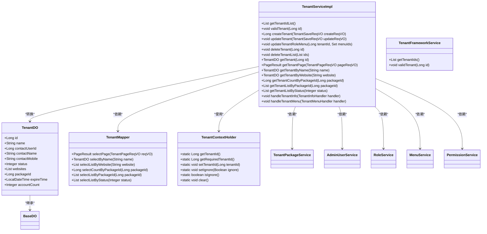

**图示来源**
- [TenantServiceImpl.java](file://yudao-module-system/src/main/java/cn/iocoder/yudao/module/system/service/tenant/TenantServiceImpl.java)
- [TenantDO.java](file://yudao-module-system/src/main/java/cn/iocoder/yudao/module/system/dal/dataobject/tenant/TenantDO.java)
- [TenantMapper.java](file://yudao-module-system/src/main/java/cn/iocoder/yudao/module/system/dal/mysql/tenant/TenantMapper.java)
- [TenantContextHolder.java](file://yudao-framework/yudao-spring-boot-starter-biz-tenant/src/main/java/cn/iocoder/yudao/framework/tenant/core/context/TenantContextHolder.java)
- [TenantFrameworkService.java](file://yudao-framework/yudao-spring-boot-starter-biz-tenant/src/main/java/cn/iocoder/yudao/framework/tenant/core/service/TenantFrameworkService.java)

**本节来源**
- [TenantServiceImpl.java](file://yudao-module-system/src/main/java/cn/iocoder/yudao/module/system/service/tenant/TenantServiceImpl.java)
- [TenantDO.java](file://yudao-module-system/src/main/java/cn/iocoder/yudao/module/system/dal/dataobject/tenant/TenantDO.java)

## 租户服务实现机制

### 租户创建流程
租户创建流程涉及多个服务的协同工作，包括租户信息校验、租户数据持久化、管理员角色创建和用户创建等步骤。

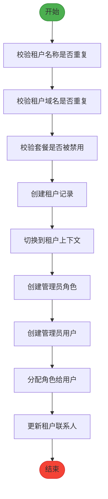

**图示来源**
- [TenantServiceImpl.java](file://yudao-module-system/src/main/java/cn/iocoder/yudao/module/system/service/tenant/TenantServiceImpl.java)

**本节来源**
- [TenantServiceImpl.java](file://yudao-module-system/src/main/java/cn/iocoder/yudao/module/system/service/tenant/TenantServiceImpl.java)

### 租户更新流程
租户更新流程包括租户存在性校验、名称和域名重复性校验、套餐有效性校验以及权限更新等步骤。

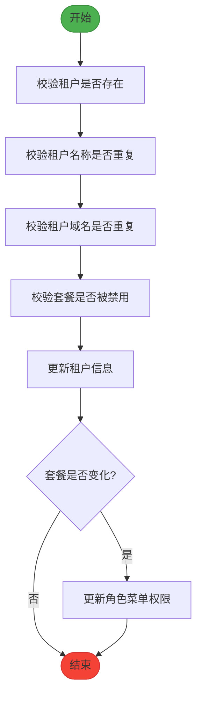

**图示来源**
- [TenantServiceImpl.java](file://yudao-module-system/src/main/java/cn/iocoder/yudao/module/system/service/tenant/TenantServiceImpl.java)

**本节来源**
- [TenantServiceImpl.java](file://yudao-module-system/src/main/java/cn/iocoder/yudao/module/system/service/tenant/TenantServiceImpl.java)

## 租户生命周期管理

### 租户状态管理
租户状态管理包括租户的有效性校验、状态查询和状态变更等操作。

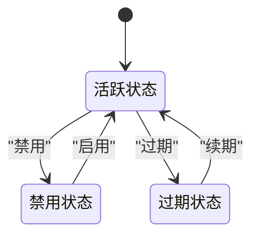

**图示来源**
- [TenantServiceImpl.java](file://yudao-module-system/src/main/java/cn/iocoder/yudao/module/system/service/tenant/TenantServiceImpl.java)

**本节来源**
- [TenantServiceImpl.java](file://yudao-module-system/src/main/java/cn/iocoder/yudao/module/system/service/tenant/TenantServiceImpl.java)

### 租户查询操作
租户查询操作支持多种查询方式，包括分页查询、按名称查询、按域名查询和按状态查询等。

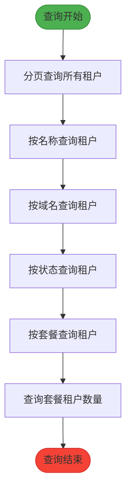

**图示来源**
- [TenantServiceImpl.java](file://yudao-module-system/src/main/java/cn/iocoder/yudao/module/system/service/tenant/TenantServiceImpl.java)

**本节来源**
- [TenantServiceImpl.java](file://yudao-module-system/src/main/java/cn/iocoder/yudao/module/system/service/tenant/TenantServiceImpl.java)

## 事务管理实现
租户服务使用@DSTransactional注解实现多数据源事务管理，确保在多数据源环境下事务的一致性和完整性。

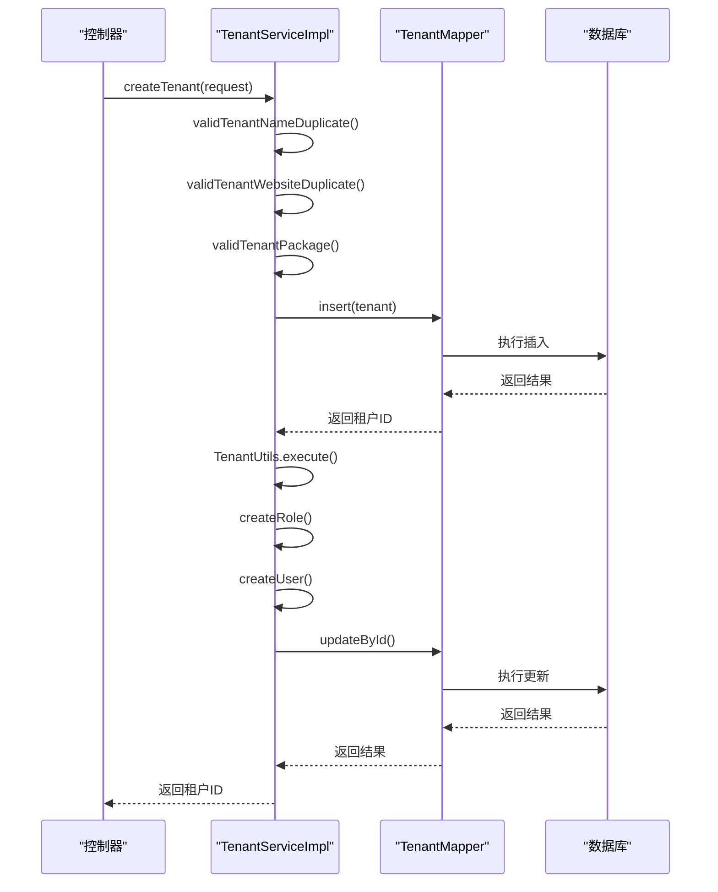

**图示来源**
- [TenantServiceImpl.java](file://yudao-module-system/src/main/java/cn/iocoder/yudao/module/system/service/tenant/TenantServiceImpl.java)

**本节来源**
- [TenantServiceImpl.java](file://yudao-module-system/src/main/java/cn/iocoder/yudao/module/system/service/tenant/TenantServiceImpl.java)

## 领域模型设计
租户领域模型设计遵循DDD原则，包含租户实体、值对象和聚合根等概念。

```mermaid
erDiagram
TENANT {
Long id PK
String name UK
Long contactUserId FK
String contactName
String contactMobile
Integer status
List<String> websites
Long packageId FK
LocalDateTime expireTime
Integer accountCount
}
USER {
Long id PK
String username UK
String password
Integer status
}
ROLE {
Long id PK
String name
String code
Integer type
}
MENU {
Long id PK
String name
String permission
}
PACKAGE {
Long id PK
String name
Set<Long> menuIds
}
TENANT ||--o{ USER : "拥有"
TENANT ||--o{ ROLE : "拥有"
TENANT }o--|| PACKAGE : "使用"
ROLE }o--o{ MENU : "拥有"
```

**图示来源**
- [TenantDO.java](file://yudao-module-system/src/main/java/cn/iocoder/yudao/module/system/dal/dataobject/tenant/TenantDO.java)

**本节来源**
- [TenantDO.java](file://yudao-module-system/src/main/java/cn/iocoder/yudao/module/system/dal/dataobject/tenant/TenantDO.java)

## 系统模块集成
租户服务与系统其他模块通过依赖注入机制进行集成，形成完整的业务闭环。

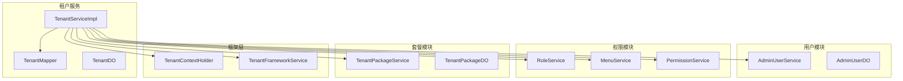

**图示来源**
- [TenantServiceImpl.java](file://yudao-module-system/src/main/java/cn/iocoder/yudao/module/system/service/tenant/TenantServiceImpl.java)

**本节来源**
- [TenantServiceImpl.java](file://yudao-module-system/src/main/java/cn/iocoder/yudao/module/system/service/tenant/TenantServiceImpl.java)

## 时序图

### 租户创建时序图
详细展示租户创建过程中各组件的交互顺序。

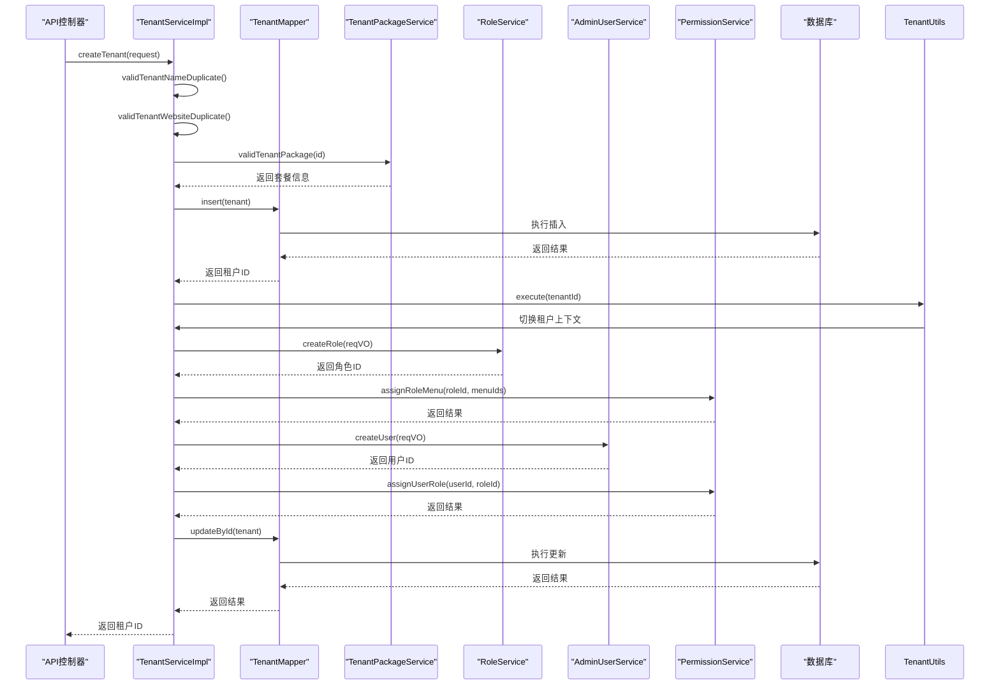

**图示来源**
- [TenantServiceImpl.java](file://yudao-module-system/src/main/java/cn/iocoder/yudao/module/system/service/tenant/TenantServiceImpl.java)

**本节来源**
- [TenantServiceImpl.java](file://yudao-module-system/src/main/java/cn/iocoder/yudao/module/system/service/tenant/TenantServiceImpl.java)

## 异常处理策略
租户服务采用统一的异常处理机制，确保系统稳定性和用户体验。

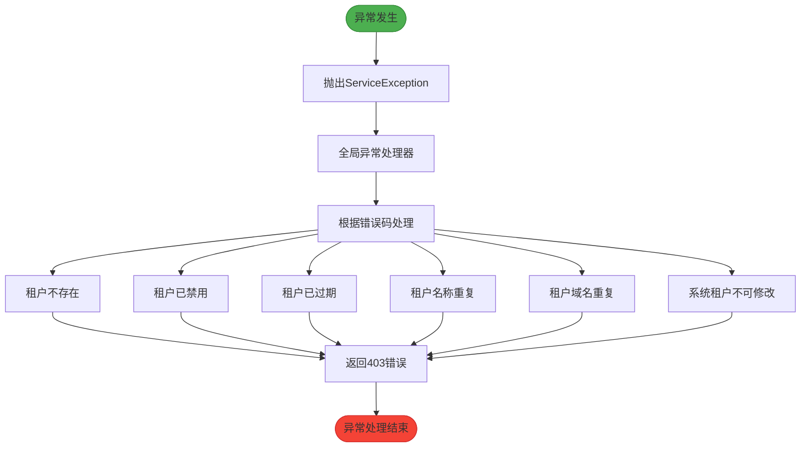

**图示来源**
- [TenantServiceImpl.java](file://yudao-module-system/src/main/java/cn/iocoder/yudao/module/system/service/tenant/TenantServiceImpl.java)

**本节来源**
- [TenantServiceImpl.java](file://yudao-module-system/src/main/java/cn/iocoder/yudao/module/system/service/tenant/TenantServiceImpl.java)

## 扩展与定制指南

### 数据隔离增强策略
为满足更严格的数据隔离需求，可实现以下增强策略：

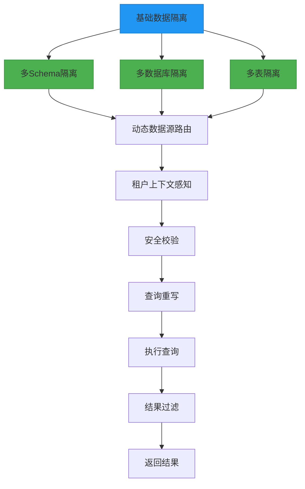

**图示来源**
- [TenantContextHolder.java](file://yudao-framework/yudao-spring-boot-starter-biz-tenant/src/main/java/cn/iocoder/yudao/framework/tenant/core/context/TenantContextHolder.java)

**本节来源**
- [TenantServiceImpl.java](file://yudao-module-system/src/main/java/cn/iocoder/yudao/module/system/service/tenant/TenantServiceImpl.java)
- [TenantContextHolder.java](file://yudao-framework/yudao-spring-boot-starter-biz-tenant/src/main/java/cn/iocoder/yudao/framework/tenant/core/context/TenantContextHolder.java)

### 外部计费系统集成
集成外部计费系统以实现租户的计费管理功能。

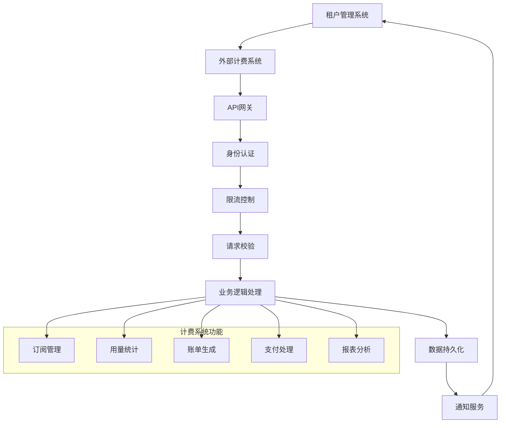

**图示来源**
- [TenantServiceImpl.java](file://yudao-module-system/src/main/java/cn/iocoder/yudao/module/system/service/tenant/TenantServiceImpl.java)

**本节来源**
- [TenantServiceImpl.java](file://yudao-module-system/src/main/java/cn/iocoder/yudao/module/system/service/tenant/TenantServiceImpl.java)