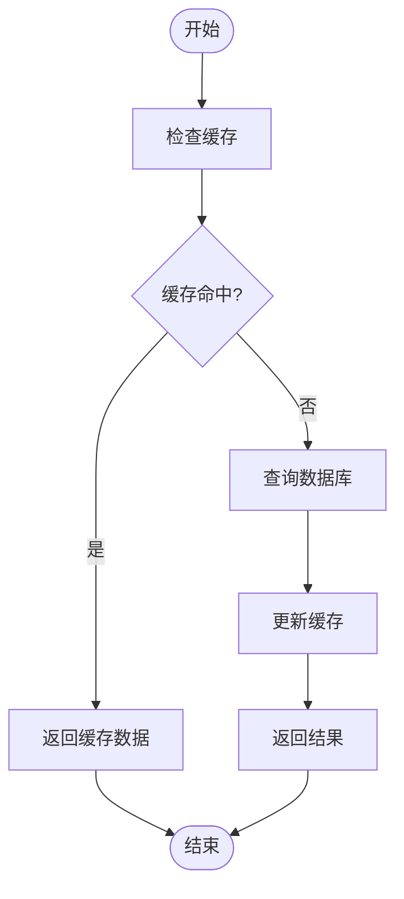
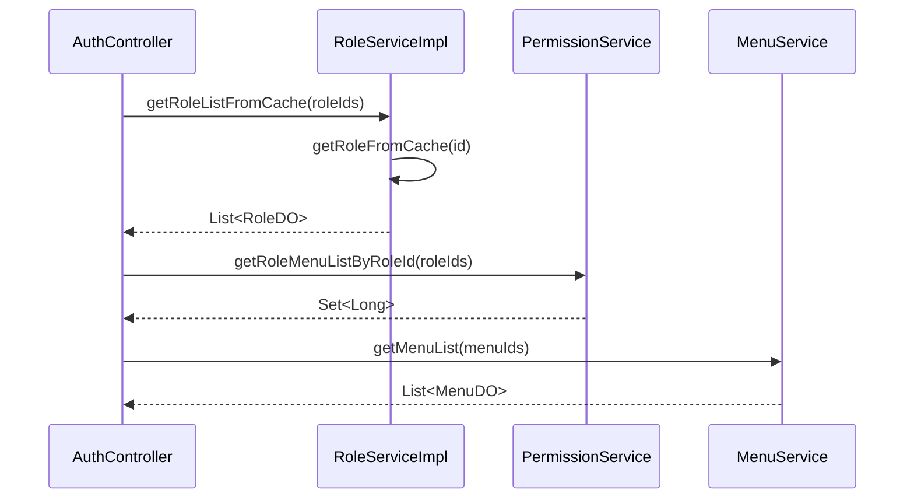

# 角色管理服务

<cite>
**Referenced Files in This Document**   
- [RoleServiceImpl.java](file://yudao-module-system/src/main/java/cn/iocoder/yudao/module/system/service/permission/RoleServiceImpl.java)
- [RoleDO.java](file://yudao-module-system/src/main/java/cn/iocoder/yudao/module/system/dal/dataobject/permission/RoleDO.java)
- [RoleMapper.java](file://yudao-module-system/src/main/java/cn/iocoder/yudao/module/system/dal/mysql/permission/RoleMapper.java)
- [MenuService.java](file://yudao-module-system/src/main/java/cn/iocoder/yudao/module/system/service/permission/MenuService.java)
- [AdminUserService.java](file://yudao-module-system/src/main/java/cn/iocoder/yudao/module/system/service/user/AdminUserService.java)
- [PermissionService.java](file://yudao-module-system/src/main/java/cn/iocoder/yudao/module/system/service/permission/PermissionService.java)
</cite>

## 目录
1. [角色管理服务](#角色管理服务)
2. [核心组件](#核心组件)
3. [角色领域模型设计](#角色领域模型设计)
4. [角色与菜单、权限关联机制](#角色与菜单权限关联机制)
5. [事务管理与缓存策略](#事务管理与缓存策略)
6. [异常处理与错误码管理](#异常处理与错误码管理)
7. [服务调用关系与时序图](#服务调用关系与时序图)
8. [扩展与定制建议](#扩展与定制建议)

## 核心组件

角色管理服务（RoleServiceImpl）是系统权限管理的核心组件，负责角色的全生命周期管理。该服务实现了`RoleService`接口，通过依赖注入协调`RoleMapper`、`PermissionService`等组件完成复杂业务操作。服务提供了角色创建、更新、删除、查询等核心功能，并通过`@Transactional`注解确保数据操作的原子性。`RoleServiceImpl`通过`@Cacheable`和`@CacheEvict`注解实现了Redis缓存的读写策略，提升系统性能。

**Section sources**
- [RoleServiceImpl.java](file://yudao-module-system/src/main/java/cn/iocoder/yudao/module/system/service/permission/RoleServiceImpl.java#L43-L273)

## 角色领域模型设计

角色领域模型（RoleDO）是角色管理的数据载体，遵循DDD（领域驱动设计）原则。`RoleDO`类继承自`TenantBaseDO`，支持多租户场景。模型包含角色ID、名称、标识、排序、状态、类型、备注、数据范围等核心属性。其中，`code`字段作为角色的唯一标识，`type`字段区分系统内置角色和自定义角色，`dataScope`和`dataScopeDeptIds`字段共同实现灵活的数据权限控制。`@TableField(typeHandler = JacksonTypeHandler.class)`注解用于处理`dataScopeDeptIds`集合类型的数据库序列化。

**Section sources**
- [RoleDO.java](file://yudao-module-system/src/main/java/cn/iocoder/yudao/module/system/dal/dataobject/permission/RoleDO.java#L21-L77)

## 角色与菜单、权限关联机制

角色管理服务通过`PermissionService`接口与菜单、权限系统进行交互。`assignRoleMenu`方法用于建立角色与菜单的关联关系，实现权限分配。`processRoleDeleted`方法在角色删除时，自动清理与该角色相关的菜单授权数据，保证数据一致性。`getRoleMenuListByRoleId`方法查询角色拥有的菜单列表，支持权限校验。`RoleServiceImpl`通过`permissionService`成员变量注入`PermissionService`，实现服务间的松耦合调用。

**Section sources**
- [PermissionService.java](file://yudao-module-system/src/main/java/cn/iocoder/yudao/module/system/service/permission/PermissionService.java#L30-L55)
- [RoleServiceImpl.java](file://yudao-module-system/src/main/java/cn/iocoder/yudao/module/system/service/permission/RoleServiceImpl.java#L106-L122)

## 事务管理与缓存策略

角色管理服务采用声明式事务管理，通过`@Transactional(rollbackFor = Exception.class)`注解确保`createRole`、`deleteRole`等关键操作的ACID特性。在角色删除操作中，数据库删除和关联数据清理被包裹在同一个事务中，保证操作的原子性。服务使用Spring Cache抽象实现Redis缓存，`getRoleFromCache`方法通过`@Cacheable`注解缓存角色数据，`updateRole`和`deleteRole`方法通过`@CacheEvict`注解清除缓存，实现缓存与数据库的最终一致性。

**Diagram sources**
- [RoleServiceImpl.java](file://yudao-module-system/src/main/java/cn/iocoder/yudao/module/system/service/permission/RoleServiceImpl.java#L191-L196)
- [RoleServiceImpl.java](file://yudao-module-system/src/main/java/cn/iocoder/yudao/module/system/service/permission/RoleServiceImpl.java#L73-L90)

## 异常处理与错误码管理

角色管理服务实现了完善的异常处理机制。`validateRoleDuplicate`方法在创建或更新角色时，校验角色名称和编码的唯一性，防止重复。`validateRoleForUpdate`方法校验角色是否存在以及是否为内置角色，内置角色不可修改。服务通过`ServiceExceptionUtil.exception`方法抛出带有错误码的业务异常，如`ROLE_NAME_DUPLICATE`、`ROLE_CODE_DUPLICATE`、`ROLE_NOT_EXISTS`等。这些错误码在`ErrorCodeConstants`枚举中定义，便于前端进行国际化处理。

**Section sources**
- [RoleServiceImpl.java](file://yudao-module-system/src/main/java/cn/iocoder/yudao/module/system/service/permission/RoleServiceImpl.java#L146-L166)
- [RoleServiceImpl.java](file://yudao-module-system/src/main/java/cn/iocoder/yudao/module/system/service/permission/RoleServiceImpl.java#L173-L184)

## 服务调用关系与时序图

角色管理服务与菜单服务、用户服务通过`PermissionService`接口进行交互。当需要获取用户权限信息时，`AuthController`调用`roleService.getRoleListFromCache`获取用户角色，再通过`menuService.getMenuList`获取角色对应的菜单列表。`getSelf()`方法通过Spring容器获取代理对象，解决AOP代理导致的`this`调用问题。

**Diagram sources**
- [RoleServiceImpl.java](file://yudao-module-system/src/main/java/cn/iocoder/yudao/module/system/service/permission/RoleServiceImpl.java#L218-L229)
- [MenuService.java](file://yudao-module-system/src/main/java/cn/iocoder/yudao/module/system/service/permission/MenuService.java#L70-L75)

## 扩展与定制建议

开发者可以通过继承`RoleServiceImpl`或实现`RoleService`接口来扩展角色管理功能。例如，实现角色继承机制，通过`parentRoleId`字段建立角色间的父子关系。对于动态权限计算，可以在`PermissionService`中添加`calculateDynamicPermissions`方法，根据用户属性实时计算权限。在扩展时，应遵循开闭原则，通过添加新类而非修改现有代码来实现新功能，确保系统的稳定性和可维护性。

**Section sources**
- [RoleServiceImpl.java](file://yudao-module-system/src/main/java/cn/iocoder/yudao/module/system/service/permission/RoleServiceImpl.java#L270-L273)
- [PermissionService.java](file://yudao-module-system/src/main/java/cn/iocoder/yudao/module/system/service/permission/PermissionService.java#L10-L15)