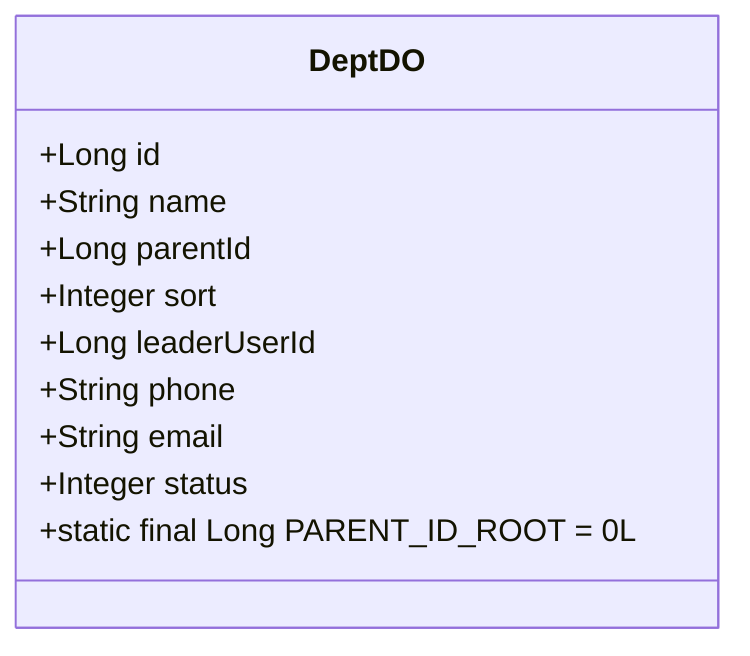
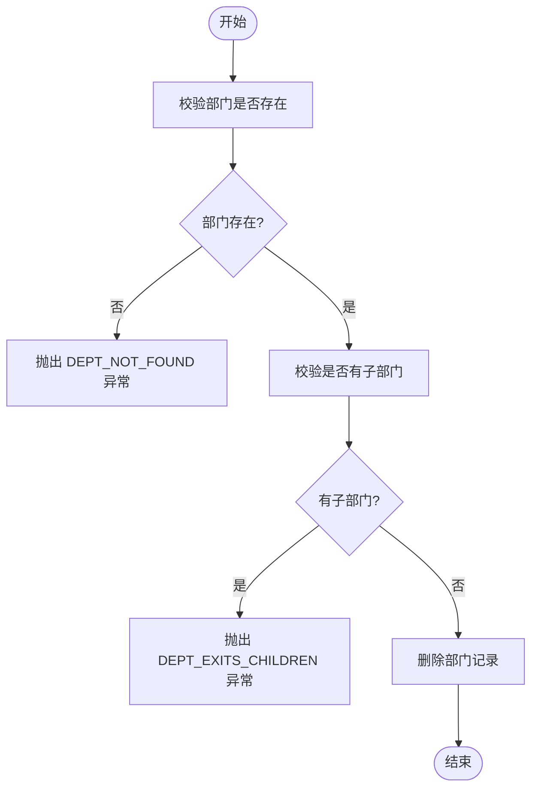
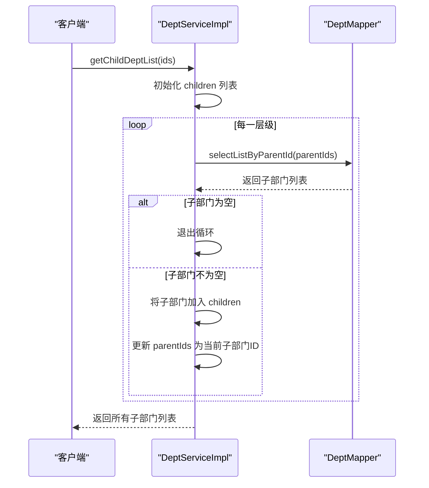
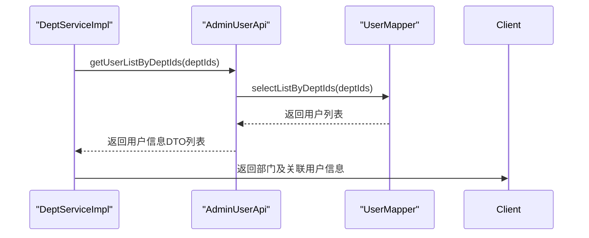
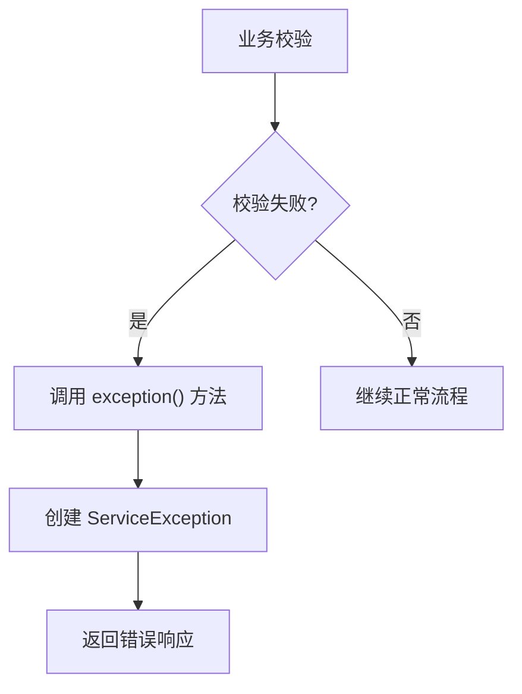

# 部门管理服务

<cite>
**本文档引用的文件**   
- [DeptServiceImpl.java](file://yudao-module-system/src/main/java/cn/iocoder/yudao/module/system/service/dept/DeptServiceImpl.java)
- [DeptDO.java](file://yudao-module-system/src/main/java/cn/iocoder/yudao/module/system/dal/dataobject/dept/DeptDO.java)
- [DeptMapper.java](file://yudao-module-system/src/main/java/cn/iocoder/yudao/module/system/dal/mysql/dept/DeptMapper.java)
- [ErrorCodeConstants.java](file://yudao-module-system/src/main/java/cn/iocoder/yudao/module/system/enums/ErrorCodeConstants.java)
- [AdminUserApi.java](file://yudao-module-system/src/main/java/cn/iocoder/yudao/module/system/api/user/AdminUserApi.java)
</cite>

## 目录
1. [简介](#简介)
2. [核心组件](#核心组件)
3. [部门领域模型设计](#部门领域模型设计)
4. [部门服务核心操作流程](#部门服务核心操作流程)
5. [部门树形结构维护机制](#部门树形结构维护机制)
6. [部门与用户关联管理](#部门与用户关联管理)
7. [异常处理与错误码管理](#异常处理与错误码管理)
8. [服务层协调与依赖注入](#服务层协调与依赖注入)
9. [扩展与定制指南](#扩展与定制指南)

## 简介
部门管理服务（DeptServiceImpl）是系统组织架构管理的核心组件，负责处理部门的全生命周期管理，包括创建、更新、删除、查询等操作。该服务通过协调部门数据对象（DeptDO）、部门Mapper（DeptMapper）以及用户服务，实现了复杂的业务逻辑。服务特别关注部门树形结构的数据一致性与事务管理，确保组织架构的完整性和有效性。本文档深入剖析该服务的实现机制，为开发者提供全面的技术参考。

## 核心组件

部门管理服务的核心由三个主要组件构成：服务实现类（DeptServiceImpl）、数据对象（DeptDO）和数据访问层（DeptMapper）。这些组件协同工作，共同完成部门管理的各项功能。

**本节引用**
- [DeptServiceImpl.java](file://yudao-module-system/src/main/java/cn/iocoder/yudao/module/system/service/dept/DeptServiceImpl.java#L31-L237)
- [DeptDO.java](file://yudao-module-system/src/main/java/cn/iocoder/yudao/module/system/dal/dataobject/dept/DeptDO.java#L17-L65)
- [DeptMapper.java](file://yudao-module-system/src/main/java/cn/iocoder/yudao/module/system/dal/mysql/dept/DeptMapper.java#L11-L36)

## 部门领域模型设计

部门领域模型（DeptDO）的设计遵循了组织架构管理的业务规则，其核心属性包括部门ID、名称、父部门ID、排序、负责人、联系电话、邮箱和状态。

**图示来源**
- [DeptDO.java](file://yudao-module-system/src/main/java/cn/iocoder/yudao/module/system/dal/dataobject/dept/DeptDO.java#L17-L65)

**本节引用**
- [DeptDO.java](file://yudao-module-system/src/main/java/cn/iocoder/yudao/module/system/dal/dataobject/dept/DeptDO.java#L17-L65)

## 部门服务核心操作流程

部门服务提供了创建、更新、删除和查询等核心操作。每个操作都遵循严格的业务校验流程，确保数据的完整性和一致性。

### 创建部门流程
创建部门时，服务首先校验父部门的有效性，防止形成环路或引用不存在的父部门。然后校验部门名称在同级部门中的唯一性。通过校验后，将请求参数转换为DeptDO对象并插入数据库。

### 更新部门流程
更新部门时，服务会校验部门自身是否存在、父部门的有效性以及部门名称的唯一性。所有校验通过后，使用MyBatis Plus的updateById方法更新数据库记录。

### 删除部门流程
删除部门前，服务会严格校验该部门是否存在子部门。如果存在子部门，则抛出异常，防止误删导致组织架构断裂。

**图示来源**
- [DeptServiceImpl.java](file://yudao-module-system/src/main/java/cn/iocoder/yudao/module/system/service/dept/DeptServiceImpl.java#L108-L118)

**本节引用**
- [DeptServiceImpl.java](file://yudao-module-system/src/main/java/cn/iocoder/yudao/module/system/service/dept/DeptServiceImpl.java#L52-L106)

## 部门树形结构维护机制

部门树形结构的维护是本服务的关键特性。服务通过递归查询和环路检测机制，确保树形结构的正确性。

### 环路检测
在设置父部门时，服务会执行递归校验，防止将部门设置为其自身的子部门作为父部门。该机制通过遍历父部门链，检查是否存在指向自身的引用。

### 子部门查询
服务提供了getChildDeptList方法，能够根据给定的部门ID列表，递归查询出所有层级的子部门。该方法通过循环查询每一层的子部门，直到没有更多子部门为止。

**图示来源**
- [DeptServiceImpl.java](file://yudao-module-system/src/main/java/cn/iocoder/yudao/module/system/service/dept/DeptServiceImpl.java#L178-L198)
- [DeptMapper.java](file://yudao-module-system/src/main/java/cn/iocoder/yudao/module/system/dal/mysql/dept/DeptMapper.java#L28-L30)

**本节引用**
- [DeptServiceImpl.java](file://yudao-module-system/src/main/java/cn/iocoder/yudao/module/system/service/dept/DeptServiceImpl.java#L178-L198)

## 部门与用户关联管理

部门服务与用户服务紧密集成，实现了部门与用户的关联管理。部门的负责人字段（leaderUserId）直接关联到用户系统的用户ID。

### 用户部门分配
通过AdminUserApi接口，可以查询指定部门下的所有用户。这使得系统能够实现基于部门的用户管理和权限控制。

### 数据权限集成
服务与数据权限框架集成，通过@DataPermission注解控制不同用户对部门数据的访问权限。例如，在缓存子部门ID列表时，会禁用数据权限以避免建立错误的缓存。

**图示来源**
- [DeptServiceImpl.java](file://yudao-module-system/src/main/java/cn/iocoder/yudao/module/system/service/dept/DeptServiceImpl.java#L218-L228)
- [AdminUserApi.java](file://yudao-module-system/src/main/java/cn/iocoder/yudao/module/system/api/user/AdminUserApi.java#L47-L51)

**本节引用**
- [AdminUserApi.java](file://yudao-module-system/src/main/java/cn/iocoder/yudao/module/system/api/user/AdminUserApi.java#L47-L51)

## 异常处理与错误码管理

部门服务采用了统一的异常处理机制，通过预定义的错误码来标识各种业务异常。

### 错误码体系
服务使用ErrorCodeConstants中定义的错误码，每个错误码都有唯一的编号和描述信息。例如：
- DEPT_NAME_DUPLICATE (1_002_004_000): 部门名称重复
- DEPT_PARENT_NOT_EXITS (1_002_004_001): 父级部门不存在
- DEPT_PARENT_IS_CHILD (1_002_004_007): 不能设置自己的子部门为父部门

### 异常抛出机制
服务通过ServiceExceptionUtil.exception()方法抛出ServiceException，该方法会根据错误码自动格式化错误信息。这种机制确保了异常信息的一致性和可追溯性。

**图示来源**
- [ErrorCodeConstants.java](file://yudao-module-system/src/main/java/cn/iocoder/yudao/module/system/enums/ErrorCodeConstants.java#L39-L54)
- [ServiceExceptionUtil.java](file://yudao-framework/yudao-common/src/main/java/cn/iocoder/yudao/framework/common/exception/util/ServiceExceptionUtil.java#L29-L35)

**本节引用**
- [ErrorCodeConstants.java](file://yudao-module-system/src/main/java/cn/iocoder/yudao/module/system/enums/ErrorCodeConstants.java#L39-L54)

## 服务层协调与依赖注入

部门服务通过Spring的依赖注入机制协调各个组件的工作。

### 依赖关系
服务主要依赖于DeptMapper进行数据访问，并通过AdminUserApi与用户服务通信。这种设计实现了关注点分离，使服务层专注于业务逻辑。

### 缓存管理
服务使用@CacheEvict注解在执行增删改操作时清除相关缓存，确保缓存与数据库的一致性。同时，使用@Cacheable注解缓存子部门ID列表，提高查询性能。

**本节引用**
- [DeptServiceImpl.java](file://yudao-module-system/src/main/java/cn/iocoder/yudao/module/system/service/dept/DeptServiceImpl.java#L33-L35)
- [DeptServiceImpl.java](file://yudao-module-system/src/main/java/cn/iocoder/yudao/module/system/service/dept/DeptServiceImpl.java#L210-L216)

## 扩展与定制指南

开发者可以根据业务需求对部门服务进行扩展和定制。

### 组织架构同步
可以通过实现定时任务或事件监听器，将部门数据与其他系统（如LDAP、HR系统）进行同步。建议在DeptServiceImpl中添加新的业务方法，并通过事件机制触发同步操作。

### 复杂数据权限
对于复杂的部门数据权限需求，可以扩展DataPermissionRule，实现自定义的数据权限规则。例如，可以实现"可见本部门及下属部门"或"仅可见特定部门"等复杂规则。

### 业务规则扩展
可以通过继承或装饰模式扩展DeptServiceImpl，添加新的业务校验规则。例如，在创建部门时，可以添加部门层级深度限制、部门负责人必须为特定岗位等业务规则。

**本节引用**
- [DeptServiceImpl.java](file://yudao-module-system/src/main/java/cn/iocoder/yudao/module/system/service/dept/DeptServiceImpl.java)
- [DataPermission.java](file://yudao-framework/yudao-spring-boot-starter-biz-data-permission/src/main/java/cn/iocoder/yudao/framework/datapermission/core/annotation/DataPermission.java)