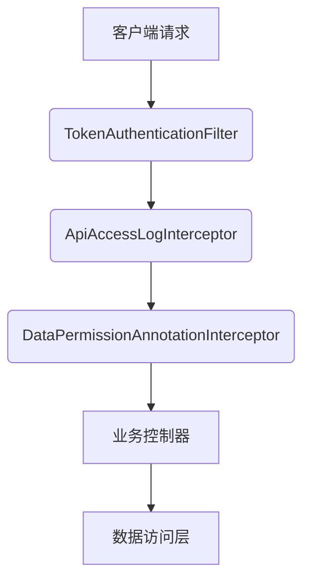
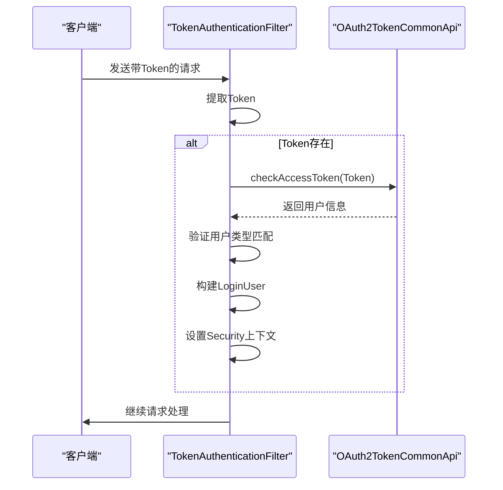
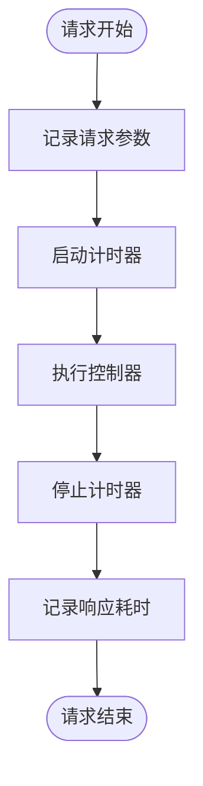
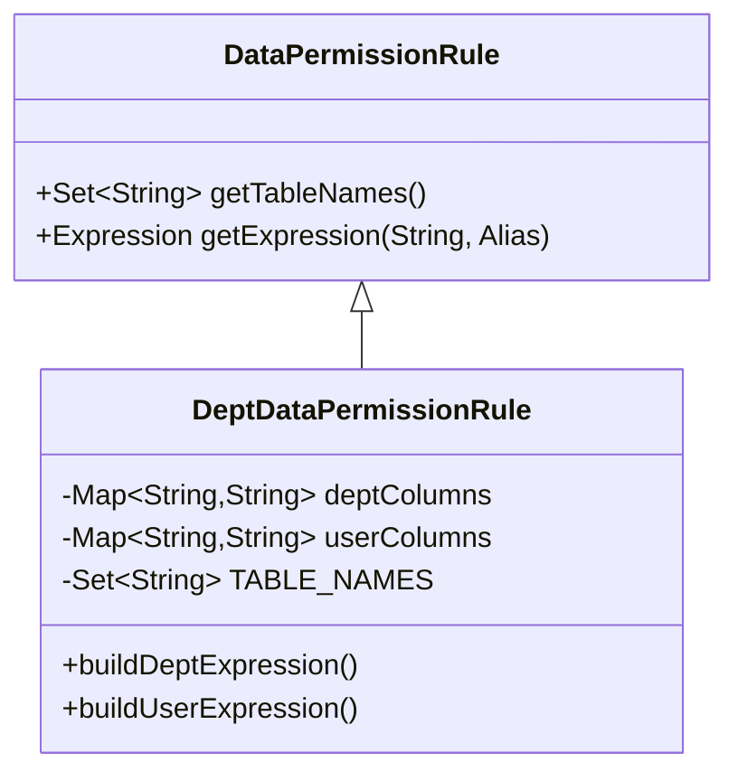
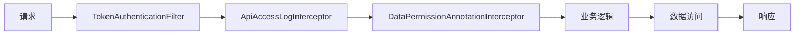

# 中间件与拦截器

<cite>
**本文档引用文件**  
- [TokenAuthenticationFilter.java](file://yudao-framework/yudao-spring-boot-starter-security/src/main/java/cn/iocoder/yudao/framework/security/core/filter/TokenAuthenticationFilter.java)
- [DataPermission.java](file://yudao-framework/yudao-spring-boot-starter-biz-data-permission/src/main/java/cn/iocoder/yudao/framework/datapermission/core/annotation/DataPermission.java)
- [DataPermissionAnnotationInterceptor.java](file://yudao-framework/yudao-spring-boot-starter-biz-data-permission/src/main/java/cn/iocoder/yudao/framework/datapermission/core/aop/DataPermissionAnnotationInterceptor.java)
- [DataPermissionContextHolder.java](file://yudao-framework/yudao-spring-boot-starter-biz-data-permission/src/main/java/cn/iocoder/yudao/framework/datapermission/core/aop/DataPermissionContextHolder.java)
- [DeptDataPermissionRule.java](file://yudao-framework/yudao-spring-boot-starter-biz-data-permission/src/main/java/cn/iocoder/yudao/framework/datapermission/core/rule/dept/DeptDataPermissionRule.java)
- [ApiAccessLogInterceptor.java](file://yudao-framework/yudao-spring-boot-starter-web/src/main/java/cn/iocoder/yudao/framework/apilog/core/interceptor/ApiAccessLogInterceptor.java)
- [YudaoWebSecurityConfigurerAdapter.java](file://yudao-framework/yudao-spring-boot-starter-security/src/main/java/cn/iocoder/yudao/framework/security/config/YudaoWebSecurityConfigurerAdapter.java)
</cite>

## 目录
1. [引言](#引言)
2. [核心中间件与拦截器概述](#核心中间件与拦截器概述)
3. [TokenAuthenticationFilter 认证机制](#tokenauthenticationfilter-认证机制)
4. [LogInterceptor 请求日志记录](#loginterceptor-请求日志记录)
5. [DataPermissionAnnotationInterceptor 数据权限控制](#datapremissionannotationinterceptor-数据权限控制)
6. [拦截器执行顺序与协作机制](#拦截器执行顺序与协作机制)
7. [自定义注解 @DataPermission 使用说明](#自定义注解-datapermission-使用说明)
8. [拦截器配置与扩展指南](#拦截器配置与扩展指南)
9. [总结](#总结)

## 引言
本文档系统性地介绍项目中关键的横切关注点实现，重点阐述基于JWT的认证机制、请求日志记录和数据权限控制三大核心功能。通过分析TokenAuthenticationFilter、LogInterceptor和DataPermissionAnnotationInterceptor的实现原理，揭示其在Spring MVC过滤器链中的执行顺序与协作方式，并提供自定义注解使用和拦截器扩展的指导。

## 核心中间件与拦截器概述
项目通过一系列中间件和拦截器实现了安全认证、操作审计和数据权限等横切关注点。这些组件在请求处理流程中各司其职，共同构建了系统的安全与可观测性基础。



**图示来源**  
- [TokenAuthenticationFilter.java](file://yudao-framework/yudao-spring-boot-starter-security/src/main/java/cn/iocoder/yudao/framework/security/core/filter/TokenAuthenticationFilter.java)
- [ApiAccessLogInterceptor.java](file://yudao-framework/yudao-spring-boot-starter-web/src/main/java/cn/iocoder/yudao/framework/apilog/core/interceptor/ApiAccessLogInterceptor.java)
- [DataPermissionAnnotationInterceptor.java](file://yudao-framework/yudao-spring-boot-starter-biz-data-permission/src/main/java/cn/iocoder/yudao/framework/datapermission/core/aop/DataPermissionAnnotationInterceptor.java)

**本节来源**  
- [TokenAuthenticationFilter.java](file://yudao-framework/yudao-spring-boot-starter-security/src/main/java/cn/iocoder/yudao/framework/security/core/filter/TokenAuthenticationFilter.java)
- [ApiAccessLogInterceptor.java](file://yudao-framework/yudao-spring-boot-starter-web/src/main/java/cn/iocoder/yudao/framework/apilog/core/interceptor/ApiAccessLogInterceptor.java)
- [DataPermissionAnnotationInterceptor.java](file://yudao-framework/yudao-spring-boot-starter-biz-data-permission/src/main/java/cn/iocoder/yudao/framework/datapermission/core/aop/DataPermissionAnnotationInterceptor.java)

## TokenAuthenticationFilter 认证机制
TokenAuthenticationFilter是基于JWT的认证过滤器，负责验证请求令牌的有效性并建立用户上下文。

### 令牌解析与验证流程
该过滤器从请求头或参数中提取JWT令牌，通过OAuth2TokenCommonApi服务进行校验。验证成功后，构建LoginUser对象并将其设置到Spring Security上下文中。



**图示来源**  
- [TokenAuthenticationFilter.java](file://yudao-framework/yudao-spring-boot-starter-security/src/main/java/cn/iocoder/yudao/framework/security/core/filter/TokenAuthenticationFilter.java)

**本节来源**  
- [TokenAuthenticationFilter.java](file://yudao-framework/yudao-spring-boot-starter-security/src/main/java/cn/iocoder/yudao/framework/security/core/filter/TokenAuthenticationFilter.java)

### 用户上下文建立
过滤器通过`SecurityFrameworkUtils.setLoginUser()`方法将认证后的用户信息存储在ThreadLocal中，供后续业务逻辑使用。同时支持开发环境下的模拟登录功能，便于调试。

## LogInterceptor 请求日志记录
ApiAccessLogInterceptor负责记录API访问日志，捕获请求参数、响应结果和执行时间。

### 日志捕获机制
拦截器在`preHandle`阶段记录请求开始时间，在`afterCompletion`阶段计算执行耗时。通过`ServletUtils`工具类获取请求参数和请求体内容。



**图示来源**  
- [ApiAccessLogInterceptor.java](file://yudao-framework/yudao-spring-boot-starter-web/src/main/java/cn/iocoder/yudao/framework/apilog/core/interceptor/ApiAccessLogInterceptor.java)

**本节来源**  
- [ApiAccessLogInterceptor.java](file://yudao-framework/yudao-spring-boot-starter-web/src/main/java/cn/iocoder/yudao/framework/apilog/core/interceptor/ApiAccessLogInterceptor.java)

### 非生产环境日志输出
该拦截器仅在非生产环境下输出详细日志，通过`SpringUtils.isProd()`判断当前环境。日志内容包括请求URL、参数、执行时间和Controller方法位置。

## DataPermissionAnnotationInterceptor 数据权限控制
该拦截器实现基于注解的数据权限控制，通过SQL条件注入限制数据访问范围。

### 部门数据权限规则
基于`DeptDataPermissionRule`实现部门级别的数据权限控制。系统会根据当前登录用户的部门权限，在SQL查询中自动注入`dept_id`过滤条件。



**图示来源**  
- [DeptDataPermissionRule.java](file://yudao-framework/yudao-spring-boot-starter-biz-data-permission/src/main/java/cn/iocoder/yudao/framework/datapermission/core/rule/dept/DeptDataPermissionRule.java)

**本节来源**  
- [DeptDataPermissionRule.java](file://yudao-framework/yudao-spring-boot-starter-biz-data-permission/src/main/java/cn/iocoder/yudao/framework/datapermission/core/rule/dept/DeptDataPermissionRule.java)

### SQL条件注入机制
拦截器通过MyBatis的SQL解析器，在查询语句中动态添加WHERE条件。对于配置了部门权限的表，自动添加`dept_id IN (?, ?, ?)`或`user_id = ?`等过滤条件。

## 拦截器执行顺序与协作方式
各拦截器在Spring MVC过滤器链中按特定顺序执行，形成完整的请求处理流水线。

### 过滤器链配置
通过`YudaoWebSecurityConfigurerAdapter`配置过滤器顺序，确保认证、日志和权限控制按正确顺序执行。



**图示来源**  
- [YudaoWebSecurityConfigurerAdapter.java](file://yudao-framework/yudao-spring-boot-starter-security/src/main/java/cn/iocoder/yudao/framework/security/config/YudaoWebSecurityConfigurerAdapter.java)

**本节来源**  
- [YudaoWebSecurityConfigurerAdapter.java](file://yudao-framework/yudao-spring-boot-starter-security/src/main/java/cn/iocoder/yudao/framework/security/config/YudaoWebSecurityConfigurerAdapter.java)

### 协作机制
各组件通过ThreadLocal上下文共享数据。TokenAuthenticationFilter设置用户信息，DataPermissionAnnotationInterceptor读取该信息进行权限判断，形成完整的安全控制闭环。

## 自定义注解 @DataPermission 使用说明
@DataPermission注解用于声明方法或类的数据权限控制策略。

### 注解属性说明
| 属性 | 类型 | 默认值 | 说明 |
|------|------|--------|------|
| enable | boolean | true | 是否启用数据权限 |
| includeRules | Class[] | {} | 包含的权限规则 |
| excludeRules | Class[] | {} | 排除的权限规则 |

**本节来源**  
- [DataPermission.java](file://yudao-framework/yudao-spring-boot-starter-biz-data-permission/src/main/java/cn/iocoder/yudao/framework/datapermission/core/annotation/DataPermission.java)

### 使用示例
```java
@DataPermission(includeRules = {DeptDataPermissionRule.class})
public List<User> getUsers() {
    // 方法将应用部门数据权限规则
}
```

## 拦截器配置与扩展指南
项目通过Spring Boot自动配置机制注册和管理拦截器。

### 添加新过滤器
通过创建`FilterRegistrationBean`并设置执行顺序来添加新的过滤器。执行顺序由`WebFilterOrderEnum`定义。

### 修改现有行为
可通过继承现有拦截器类并重写关键方法来定制行为，或通过配置属性调整功能开关。

**本节来源**  
- [YudaoWebSecurityConfigurerAdapter.java](file://yudao-framework/yudao-spring-boot-starter-security/src/main/java/cn/iocoder/yudao/framework/security/config/YudaoWebSecurityConfigurerAdapter.java)

## 总结
本文档详细介绍了项目中的核心中间件与拦截器实现，包括基于JWT的认证机制、请求日志记录和数据权限控制。这些组件通过精心设计的执行顺序和协作机制，共同构建了系统的安全基础。通过自定义注解和灵活的配置方式，系统提供了良好的可扩展性，便于根据业务需求进行定制和扩展。