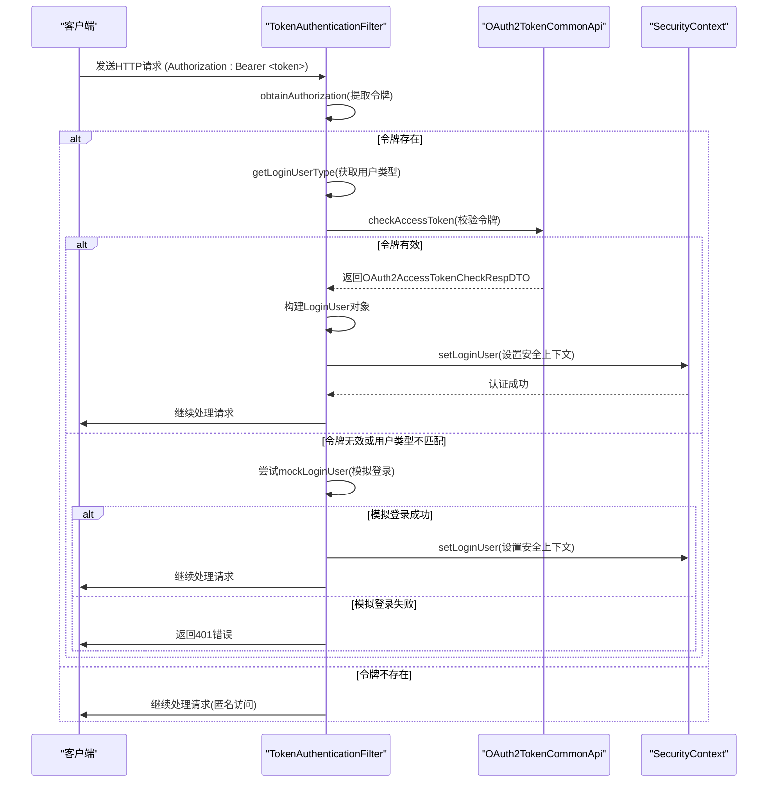
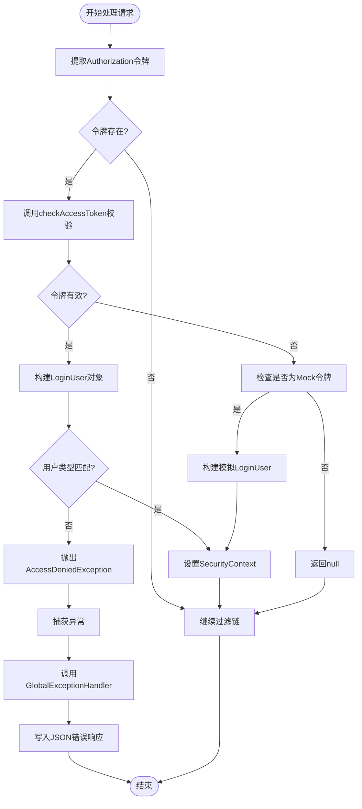
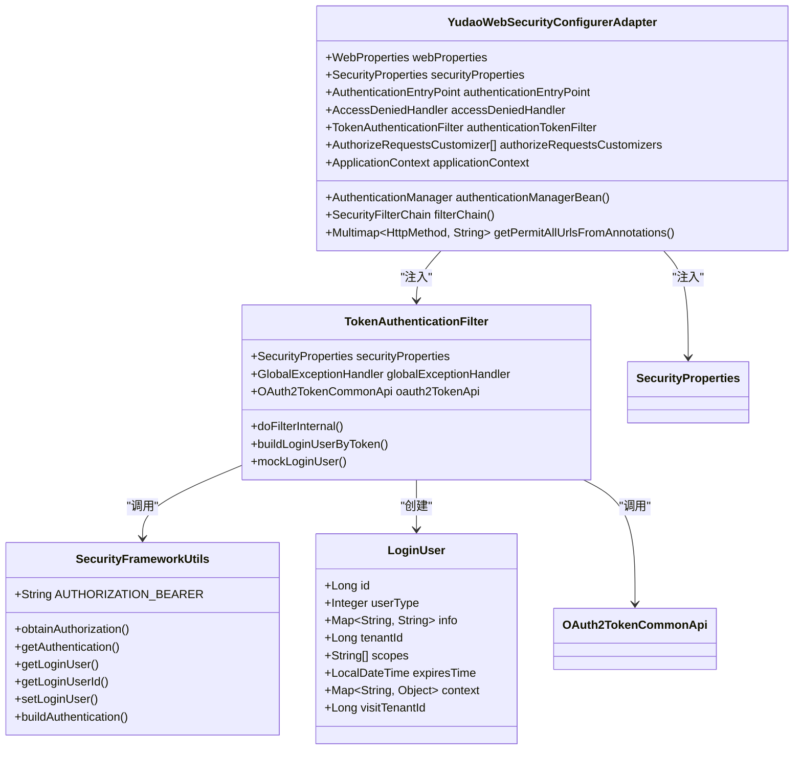

# 安全拦截器

<cite>
**本文档引用的文件**  
- [TokenAuthenticationFilter.java](file://yudao-framework/yudao-spring-boot-starter-security/src/main/java/cn/iocoder/yudao/framework/security/core/filter/TokenAuthenticationFilter.java)
- [LoginUser.java](file://yudao-framework/yudao-spring-boot-starter-security/src/main/java/cn/iocoder/yudao/framework/security/core/LoginUser.java)
- [YudaoWebSecurityConfigurerAdapter.java](file://yudao-framework/yudao-spring-boot-starter-security/src/main/java/cn/iocoder/yudao/framework/security/config/YudaoWebSecurityConfigurerAdapter.java)
- [SecurityFrameworkUtils.java](file://yudao-framework/yudao-spring-boot-starter-security/src/main/java/cn/iocoder/yudao/framework/security/core/util/SecurityFrameworkUtils.java)
- [WebFrameworkUtils.java](file://yudao-framework/yudao-spring-boot-starter-web/src/main/java/cn/iocoder/yudao/framework/web/core/util/WebFrameworkUtils.java)
- [GlobalExceptionHandler.java](file://yudao-framework/yudao-spring-boot-starter-web/src/main/java/cn/iocoder/yudao/framework/web/core/handler/GlobalExceptionHandler.java)
- [SecurityProperties.java](file://yudao-framework/yudao-spring-boot-starter-security/src/main/java/cn/iocoder/yudao/framework/security/config/SecurityProperties.java)
</cite>

## 目录
1. [简介](#简介)
2. [核心组件](#核心组件)
3. [认证流程详解](#认证流程详解)
4. [异常处理机制](#异常处理机制)
5. [扩展指南](#扩展指南)
6. [集成配置](#集成配置)
7. [总结](#总结)

## 简介
本文档详细说明了 `TokenAuthenticationFilter` 的实现机制，该过滤器是系统安全认证的核心组件。它基于 JWT（JSON Web Token）机制，在 Spring Security 框架下实现了无状态的认证流程。通过从 HTTP 请求头或参数中提取令牌，验证其有效性，并将用户信息注入安全上下文，实现了对系统资源的安全访问控制。

该机制支持多用户类型（如管理员、会员等）和租户隔离，同时提供了开发调试用的模拟登录功能。整个认证过程与 `LoginUser` 对象和 `YudaoWebSecurityConfigurerAdapter` 配置类紧密集成，构成了一个完整、灵活且安全的身份验证体系。

## 核心组件

### TokenAuthenticationFilter
`TokenAuthenticationFilter` 是一个 Spring Security 的过滤器，继承自 `OncePerRequestFilter`，确保每个请求只被处理一次。它的主要职责是从请求中提取认证令牌，并完成用户身份的验证与上下文设置。

该过滤器依赖于 `SecurityProperties` 来获取令牌的 Header 和参数名称，依赖 `OAuth2TokenCommonApi` 来校验令牌的有效性，并在发生异常时通过 `GlobalExceptionHandler` 返回统一的错误响应。

**组件源码**
- [TokenAuthenticationFilter.java](file://yudao-framework/yudao-spring-boot-starter-security/src/main/java/cn/iocoder/yudao/framework/security/core/filter/TokenAuthenticationFilter.java#L30-L118)

### LoginUser
`LoginUser` 类是系统中表示当前登录用户的核心数据结构。它封装了用户的身份信息，包括用户编号、用户类型、租户编号、授权范围、过期时间以及额外的用户信息（如昵称、部门ID等）。

该对象在认证成功后被创建，并通过 `SecurityFrameworkUtils` 设置到 Spring Security 的上下文中，供后续的业务逻辑使用。`LoginUser` 还包含一个 `context` 字段，用于存储基于用户维度的临时缓存数据。

**组件源码**
- [LoginUser.java](file://yudao-framework/yudao-spring-boot-starter-security/src/main/java/cn/iocoder/yudao/framework/security/core/LoginUser.java#L17-L74)

### YudaoWebSecurityConfigurerAdapter
`YudaoWebSecurityConfigurerAdapter` 是 Spring Security 的配置适配器，负责构建整个应用的安全过滤链。它通过 `@Bean` 注解定义了 `SecurityFilterChain`，配置了跨域、CSRF、会话管理等安全策略。

该配置类的关键作用是将 `TokenAuthenticationFilter` 添加到过滤链中，使其在 `UsernamePasswordAuthenticationFilter` 之前执行，从而实现基于 Token 的认证。同时，它还定义了 URL 的访问规则，包括静态资源、免登录接口和需要认证的接口。

**组件源码**
- [YudaoWebSecurityConfigurerAdapter.java](file://yudao-framework/yudao-spring-boot-starter-security/src/main/java/cn/iocoder/yudao/framework/security/config/YudaoWebSecurityConfigurerAdapter.java#L45-L220)

## 认证流程详解

**图示来源**
- [TokenAuthenticationFilter.java](file://yudao-framework/yudao-spring-boot-starter-security/src/main/java/cn/iocoder/yudao/framework/security/core/filter/TokenAuthenticationFilter.java#L30-L118)
- [SecurityFrameworkUtils.java](file://yudao-framework/yudao-spring-boot-starter-security/src/main/java/cn/iocoder/yudao/framework/security/core/util/SecurityFrameworkUtils.java#L50-L150)
- [WebFrameworkUtils.java](file://yudao-framework/yudao-spring-boot-starter-web/src/main/java/cn/iocoder/yudao/framework/web/core/util/WebFrameworkUtils.java#L50-L150)

### 令牌提取
过滤器首先调用 `SecurityFrameworkUtils.obtainAuthorization()` 方法从 HTTP 请求中提取令牌。该方法会优先从指定的 Header（默认为 `Authorization`）中获取，如果 Header 中不存在，则尝试从请求参数（默认为 `token`）中获取。提取到的令牌会去除 `Bearer ` 前缀。

### 令牌校验与用户构建
如果提取到令牌，过滤器会调用 `buildLoginUserByToken()` 方法。该方法通过 `OAuth2TokenCommonApi.checkAccessToken()` 接口远程校验令牌的有效性。如果令牌有效，会检查返回的用户类型是否与当前请求的用户类型匹配（通过 URL 前缀判断，如 `/admin-api` 对应管理员）。匹配成功后，使用令牌中的信息构建 `LoginUser` 对象。

### 模拟登录
当正式令牌校验失败时，系统会尝试进行模拟登录。此功能仅在开发环境下启用，通过检查令牌是否以 `mockSecret` 开头来判断。如果匹配，则从令牌中解析出用户编号，并构建一个模拟的 `LoginUser` 对象，极大地方便了日常开发和调试。

### 安全上下文设置
一旦成功构建 `LoginUser` 对象（无论是通过正式认证还是模拟登录），过滤器就会调用 `SecurityFrameworkUtils.setLoginUser()` 方法。该方法会创建一个 `UsernamePasswordAuthenticationToken` 对象，并将其设置到 Spring Security 的 `SecurityContext` 中，从而完成整个认证过程。

## 异常处理机制

**图示来源**
- [TokenAuthenticationFilter.java](file://yudao-framework/yudao-spring-boot-starter-security/src/main/java/cn/iocoder/yudao/framework/security/core/filter/TokenAuthenticationFilter.java#L30-L118)
- [GlobalExceptionHandler.java](file://yudao-framework/yudao-spring-boot-starter-web/src/main/java/cn/iocoder/yudao/framework/web/core/handler/GlobalExceptionHandler.java#L50-L400)

当在 `doFilterInternal` 方法中发生任何异常（如 `ServiceException` 或 `AccessDeniedException`）时，过滤器会捕获该异常，并立即调用 `GlobalExceptionHandler.allExceptionHandler()` 方法。该方法会根据异常类型生成一个统一的 `CommonResult` 错误响应，并通过 `ServletUtils.writeJSON()` 直接写入 HTTP 响应，然后返回，阻止请求继续向下执行。

这种机制确保了所有认证相关的错误都能以一致的格式返回给客户端，例如：
- **令牌过期或无效**：返回 `401 Unauthorized` 错误。
- **用户类型不匹配**：返回 `403 Forbidden` 错误。
- **其他系统异常**：返回 `500 Internal Server Error` 错误。

## 扩展指南

### 修改令牌验证规则
要自定义令牌的验证逻辑，可以考虑以下几种方式：
1.  **扩展 `OAuth2TokenCommonApi`**：实现自己的 `OAuth2TokenCommonApi` 接口，提供更复杂的令牌校验逻辑，例如集成第三方认证服务（如微信、钉钉）。
2.  **自定义 `TokenAuthenticationFilter`**：继承或修改现有的 `TokenAuthenticationFilter`，在 `buildLoginUserByToken` 方法中添加额外的校验步骤，如 IP 白名单、设备指纹等。

### 集成第三方认证服务
集成第三方服务（如 OAuth2.0 提供商）的典型流程如下：
1.  用户通过第三方登录，获取授权码（code）。
2.  后端服务使用授权码向第三方服务换取访问令牌（access token）。
3.  在系统内部，根据第三方返回的用户信息，调用内部的令牌签发服务，生成一个本地的 JWT 令牌。
4.  将这个本地 JWT 令牌返回给前端，后续的请求都使用这个本地令牌进行认证。

这样，`TokenAuthenticationFilter` 仍然只处理本地的 JWT 令牌，而与第三方服务的交互被封装在登录流程中，保持了认证过滤器的简洁性和通用性。

## 集成配置

**图示来源**
- [YudaoWebSecurityConfigurerAdapter.java](file://yudao-framework/yudao-spring-boot-starter-security/src/main/java/cn/iocoder/yudao/framework/security/config/YudaoWebSecurityConfigurerAdapter.java#L45-L220)
- [TokenAuthenticationFilter.java](file://yudao-framework/yudao-spring-boot-starter-security/src/main/java/cn/iocoder/yudao/framework/security/core/filter/TokenAuthenticationFilter.java#L30-L118)
- [SecurityFrameworkUtils.java](file://yudao-framework/yudao-spring-boot-starter-security/src/main/java/cn/iocoder/yudao/framework/security/core/util/SecurityFrameworkUtils.java#L17-L160)
- [LoginUser.java](file://yudao-framework/yudao-spring-boot-starter-security/src/main/java/cn/iocoder/yudao/framework/security/core/LoginUser.java#L17-L74)

`YudaoWebSecurityConfigurerAdapter` 通过 Spring 的依赖注入机制，将 `TokenAuthenticationFilter` 注入，并在 `filterChain` 方法中通过 `httpSecurity.addFilterBefore()` 将其添加到安全过滤链的适当位置。`SecurityProperties` 提供了配置项，如 `tokenHeader` 和 `permitAllUrls`，使得认证机制具有高度的可配置性。

## 总结
`TokenAuthenticationFilter` 构成了系统安全认证的基石。它通过一个清晰、高效的流程，实现了基于 JWT 的无状态认证。从令牌提取、远程校验、用户构建到安全上下文设置，每一步都设计得既安全又灵活。与 `LoginUser` 和 `YudaoWebSecurityConfigurerAdapter` 的紧密结合，确保了用户身份信息在整个应用中的统一和可访问性。其内置的异常处理和模拟登录功能，极大地提升了开发效率和用户体验。通过合理的扩展，该机制可以轻松适应各种复杂的认证需求。