# 数据权限拦截器

<cite>
**本文档引用文件**   
- [DataPermissionAnnotationInterceptor.java](file://yudao-framework/yudao-spring-boot-starter-biz-data-permission/src/main/java/cn/iocoder/yudao/framework/datapermission/core/aop/DataPermissionAnnotationInterceptor.java)
- [DataPermission.java](file://yudao-framework/yudao-spring-boot-starter-biz-data-permission/src/main/java/cn/iocoder/yudao/framework/datapermission/core/annotation/DataPermission.java)
- [DataPermissionRuleHandler.java](file://yudao-framework/yudao-spring-boot-starter-biz-data-permission/src/main/java/cn/iocoder/yudao/framework/datapermission/core/db/DataPermissionRuleHandler.java)
- [DataPermissionContextHolder.java](file://yudao-framework/yudao-spring-boot-starter-biz-data-permission/src/main/java/cn/iocoder/yudao/framework/datapermission/core/aop/DataPermissionContextHolder.java)
- [DeptDataPermissionRule.java](file://yudao-framework/yudao-spring-boot-starter-biz-data-permission/src/main/java/cn/iocoder/yudao/framework/datapermission/core/rule/dept/DeptDataPermissionRule.java)
- [DataPermissionConfiguration.java](file://yudao-module-system/src/main/java/cn/iocoder/yudao/module/system/framework/datapermission/config/DataPermissionConfiguration.java)
- [YudaoDeptDataPermissionAutoConfiguration.java](file://yudao-framework/yudao-spring-boot-starter-biz-data-permission/src/main/java/cn/iocoder/yudao/framework/datapermission/config/YudaoDeptDataPermissionAutoConfiguration.java)
- [DataPermissionRuleFactory.java](file://yudao-framework/yudao-spring-boot-starter-biz-data-permission/src/main/java/cn/iocoder/yudao/framework/datapermission/core/rule/DataPermissionRuleFactory.java)
</cite>

## 目录
1. [简介](#简介)
2. [核心组件分析](#核心组件分析)
3. [工作原理](#工作原理)
4. [@DataPermission注解详解](#datapermission注解详解)
5. [数据权限规则处理机制](#数据权限规则处理机制)
6. [部门数据权限配置](#部门数据权限配置)
7. [实际应用案例](#实际应用案例)
8. [性能影响与优化建议](#性能影响与优化建议)
9. [扩展机制](#扩展机制)

## 简介
数据权限拦截器是系统安全架构的重要组成部分，通过AOP技术实现细粒度的数据访问控制。该机制允许根据用户角色和部门信息动态修改SQL查询条件，确保用户只能访问其权限范围内的数据。本文档全面阐述数据权限拦截器的工作原理和配置方法。

## 核心组件分析

**组件关系图**

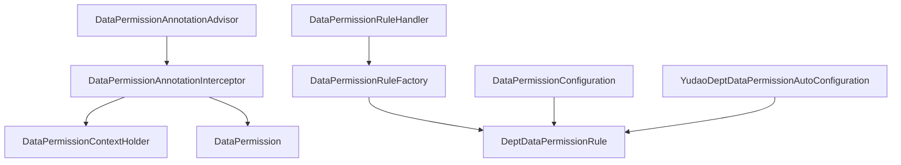

**图示来源**
- [DataPermissionAnnotationAdvisor.java](file://yudao-framework/yudao-spring-boot-starter-biz-data-permission/src/main/java/cn/iocoder/yudao/framework/datapermission/core/aop/DataPermissionAnnotationAdvisor.java)
- [DataPermissionAnnotationInterceptor.java](file://yudao-framework/yudao-spring-boot-starter-biz-data-permission/src/main/java/cn/iocoder/yudao/framework/datapermission/core/aop/DataPermissionAnnotationInterceptor.java)
- [DataPermissionContextHolder.java](file://yudao-framework/yudao-spring-boot-starter-biz-data-permission/src/main/java/cn/iocoder/yudao/framework/datapermission/core/aop/DataPermissionContextHolder.java)
- [DataPermission.java](file://yudao-framework/yudao-spring-boot-starter-biz-data-permission/src/main/java/cn/iocoder/yudao/framework/datapermission/core/annotation/DataPermission.java)
- [DataPermissionRuleHandler.java](file://yudao-framework/yudao-spring-boot-starter-biz-data-permission/src/main/java/cn/iocoder/yudao/framework/datapermission/core/db/DataPermissionRuleHandler.java)
- [DataPermissionRuleFactory.java](file://yudao-framework/yudao-spring-boot-starter-biz-data-permission/src/main/java/cn/iocoder/yudao/framework/datapermission/core/rule/DataPermissionRuleFactory.java)
- [DeptDataPermissionRule.java](file://yudao-framework/yudao-spring-boot-starter-biz-data-permission/src/main/java/cn/iocoder/yudao/framework/datapermission/core/rule/dept/DeptDataPermissionRule.java)
- [DataPermissionConfiguration.java](file://yudao-module-system/src/main/java/cn/iocoder/yudao/module/system/framework/datapermission/config/DataPermissionConfiguration.java)
- [YudaoDeptDataPermissionAutoConfiguration.java](file://yudao-framework/yudao-spring-boot-starter-biz-data-permission/src/main/java/cn/iocoder/yudao/framework/datapermission/config/YudaoDeptDataPermissionAutoConfiguration.java)

**核心组件说明**

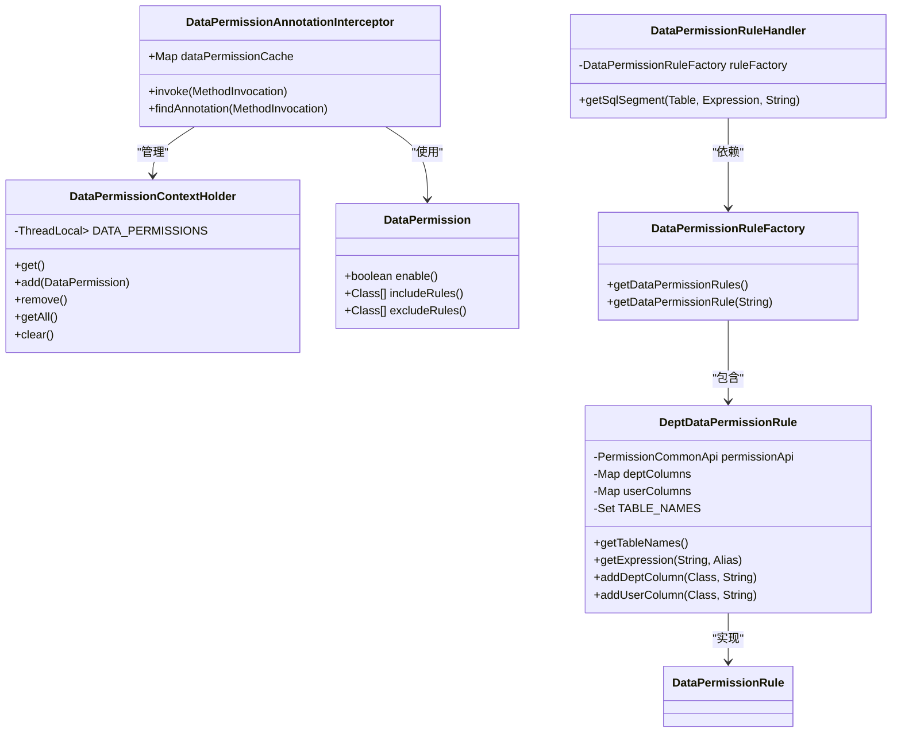

**图示来源**
- [DataPermissionAnnotationInterceptor.java](file://yudao-framework/yudao-spring-boot-starter-biz-data-permission/src/main/java/cn/iocoder/yudao/framework/datapermission/core/aop/DataPermissionAnnotationInterceptor.java)
- [DataPermissionContextHolder.java](file://yudao-framework/yudao-spring-boot-starter-biz-data-permission/src/main/java/cn/iocoder/yudao/framework/datapermission/core/aop/DataPermissionContextHolder.java)
- [DataPermission.java](file://yudao-framework/yudao-spring-boot-starter-biz-data-permission/src/main/java/cn/iocoder/yudao/framework/datapermission/core/annotation/DataPermission.java)
- [DataPermissionRuleHandler.java](file://yudao-framework/yudao-spring-boot-starter-biz-data-permission/src/main/java/cn/iocoder/yudao/framework/datapermission/core/db/DataPermissionRuleHandler.java)
- [DataPermissionRuleFactory.java](file://yudao-framework/yudao-spring-boot-starter-biz-data-permission/src/main/java/cn/iocoder/yudao/framework/datapermission/core/rule/DataPermissionRuleFactory.java)
- [DeptDataPermissionRule.java](file://yudao-framework/yudao-spring-boot-starter-biz-data-permission/src/main/java/cn/iocoder/yudao/framework/datapermission/core/rule/dept/DeptDataPermissionRule.java)

## 工作原理

**拦截器执行流程**

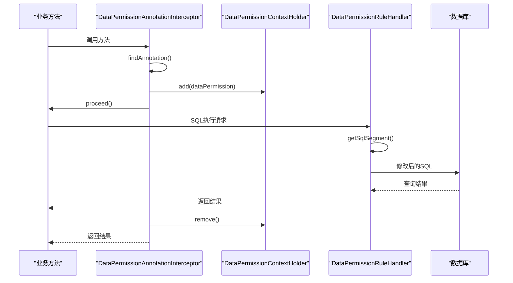

**图示来源**
- [DataPermissionAnnotationInterceptor.java](file://yudao-framework/yudao-spring-boot-starter-biz-data-permission/src/main/java/cn/iocoder/yudao/framework/datapermission/core/aop/DataPermissionAnnotationInterceptor.java)
- [DataPermissionContextHolder.java](file://yudao-framework/yudao-spring-boot-starter-biz-data-permission/src/main/java/cn/iocoder/yudao/framework/datapermission/core/aop/DataPermissionContextHolder.java)
- [DataPermissionRuleHandler.java](file://yudao-framework/yudao-spring-boot-starter-biz-data-permission/src/main/java/cn/iocoder/yudao/framework/datapermission/core/db/DataPermissionRuleHandler.java)

**SQL条件动态修改流程**

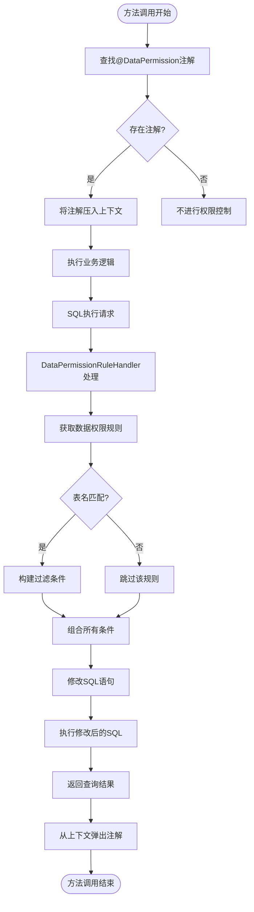

**图示来源**
- [DataPermissionAnnotationInterceptor.java](file://yudao-framework/yudao-spring-boot-starter-biz-data-permission/src/main/java/cn/iocoder/yudao/framework/datapermission/core/aop/DataPermissionAnnotationInterceptor.java)
- [DataPermissionRuleHandler.java](file://yudao-framework/yudao-spring-boot-starter-biz-data-permission/src/main/java/cn/iocoder/yudao/framework/datapermission/core/db/DataPermissionRuleHandler.java)
- [DeptDataPermissionRule.java](file://yudao-framework/yudao-spring-boot-starter-biz-data-permission/src/main/java/cn/iocoder/yudao/framework/datapermission/core/rule/dept/DeptDataPermissionRule.java)

## @DataPermission注解详解

**注解属性说明**

| 属性 | 类型 | 默认值 | 说明 |
|------|------|--------|------|
| enable | boolean | true | 是否启用数据权限控制 |
| includeRules | Class<? extends DataPermissionRule>[] | {} | 包含的数据权限规则数组 |
| excludeRules | Class<? extends DataPermissionRule>[] | {} | 排除的数据权限规则数组 |

**使用示例**

```java
// 在类级别启用数据权限
@DataPermission
@Service
public class UserService {
    
    // 在方法级别启用数据权限
    @DataPermission
    public List<User> getUsers() {
        // 业务逻辑
    }
    
    // 禁用数据权限
    @DataPermission(enable = false)
    public List<User> getAllUsers() {
        // 业务逻辑
    }
    
    // 指定包含的规则
    @DataPermission(includeRules = {DeptDataPermissionRule.class})
    public List<User> getDeptUsers() {
        // 业务逻辑
    }
}
```

**注解处理流程**

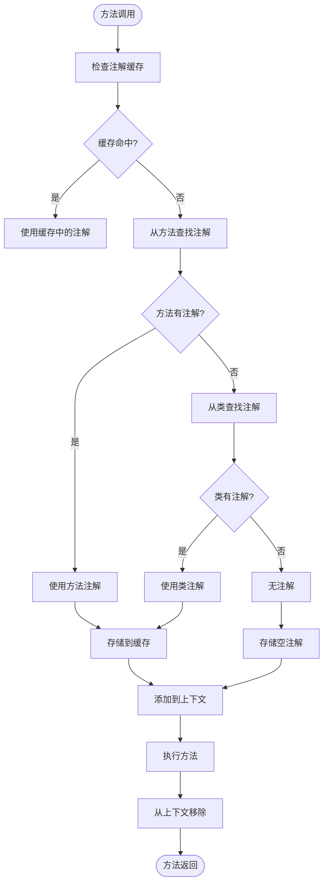

**图示来源**
- [DataPermission.java](file://yudao-framework/yudao-spring-boot-starter-biz-data-permission/src/main/java/cn/iocoder/yudao/framework/datapermission/core/annotation/DataPermission.java)
- [DataPermissionAnnotationInterceptor.java](file://yudao-framework/yudao-spring-boot-starter-biz-data-permission/src/main/java/cn/iocoder/yudao/framework/datapermission/core/aop/DataPermissionAnnotationInterceptor.java)

## 数据权限规则处理机制

**规则处理核心逻辑**

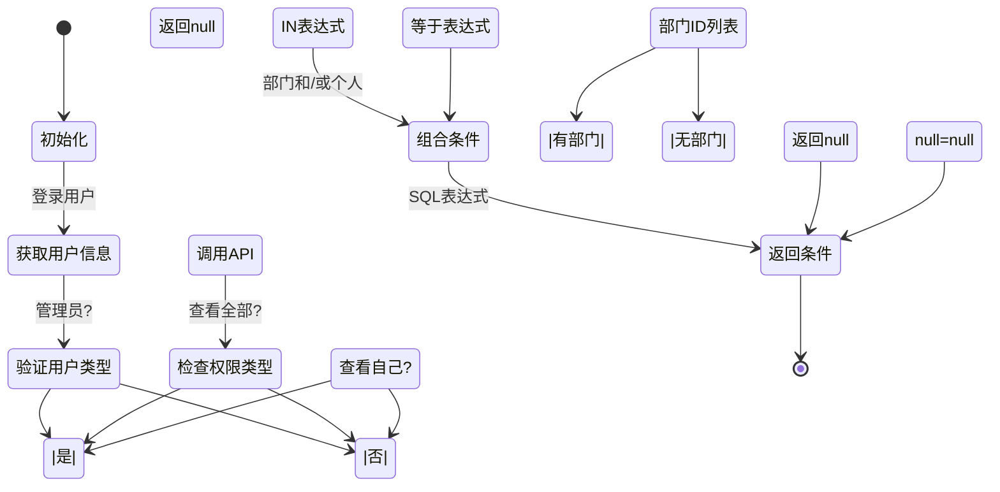

**图示来源**
- [DeptDataPermissionRule.java](file://yudao-framework/yudao-spring-boot-starter-biz-data-permission/src/main/java/cn/iocoder/yudao/framework/datapermission/core/rule/dept/DeptDataPermissionRule.java)
- [DataPermissionRuleHandler.java](file://yudao-framework/yudao-spring-boot-starter-biz-data-permission/src/main/java/cn/iocoder/yudao/framework/datapermission/core/db/DataPermissionRuleHandler.java)

**权限条件构建规则**

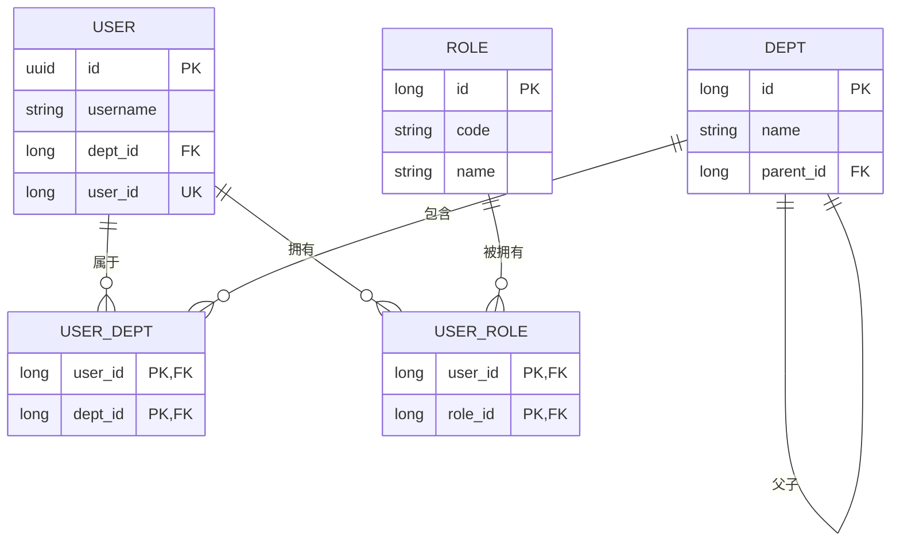

**图示来源**
- [DeptDataPermissionRule.java](file://yudao-framework/yudao-spring-boot-starter-biz-data-permission/src/main/java/cn/iocoder/yudao/framework/datapermission/core/rule/dept/DeptDataPermissionRule.java)
- [AdminUserDO.java](file://yudao-module-system/src/main/java/cn/iocoder/yudao/module/system/dal/dataobject/user/AdminUserDO.java)
- [DeptDO.java](file://yudao-module-system/src/main/java/cn/iocoder/yudao/module/system/dal/dataobject/dept/DeptDO.java)

## 部门数据权限配置

**配置类结构**

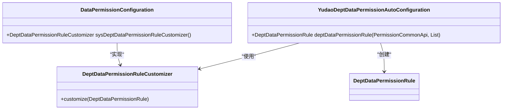

**图示来源**
- [DataPermissionConfiguration.java](file://yudao-module-system/src/main/java/cn/iocoder/yudao/module/system/framework/datapermission/config/DataPermissionConfiguration.java)
- [YudaoDeptDataPermissionAutoConfiguration.java](file://yudao-framework/yudao-spring-boot-starter-biz-data-permission/src/main/java/cn/iocoder/yudao/framework/datapermission/config/YudaoDeptDataPermissionAutoConfiguration.java)

**部门权限配置示例**

```java
@Configuration(proxyBeanMethods = false)
public class DataPermissionConfiguration {

    @Bean
    public DeptDataPermissionRuleCustomizer sysDeptDataPermissionRuleCustomizer() {
        return rule -> {
            // 配置部门字段
            rule.addDeptColumn(AdminUserDO.class); // 用户表的部门字段
            rule.addDeptColumn(DeptDO.class, "id"); // 部门表的主键作为部门字段
            // 配置用户字段
            rule.addUserColumn(AdminUserDO.class, "id"); // 用户表的主键作为用户字段
        };
    }
}
```

**配置处理流程**

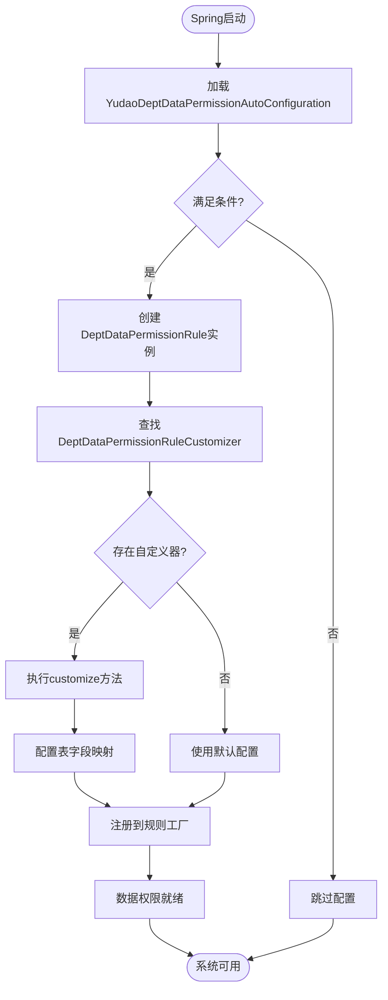

**图示来源**
- [DataPermissionConfiguration.java](file://yudao-module-system/src/main/java/cn/iocoder/yudao/module/system/framework/datapermission/config/DataPermissionConfiguration.java)
- [YudaoDeptDataPermissionAutoConfiguration.java](file://yudao-framework/yudao-spring-boot-starter-biz-data-permission/src/main/java/cn/iocoder/yudao/framework/datapermission/config/YudaoDeptDataPermissionAutoConfiguration.java)
- [DeptDataPermissionRule.java](file://yudao-framework/yudao-spring-boot-starter-biz-data-permission/src/main/java/cn/iocoder/yudao/framework/datapermission/core/rule/dept/DeptDataPermissionRule.java)

## 实际应用案例

**用户管理场景**

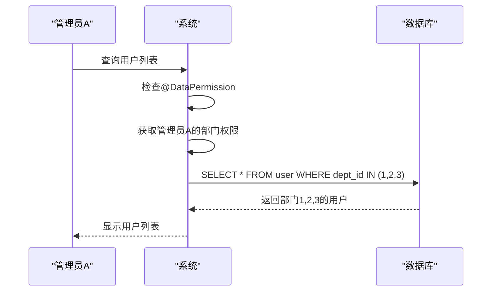

**图示来源**
- [DeptDataPermissionRule.java](file://yudao-framework/yudao-spring-boot-starter-biz-data-permission/src/main/java/cn/iocoder/yudao/framework/datapermission/core/rule/dept/DeptDataPermissionRule.java)

**跨部门查询场景**

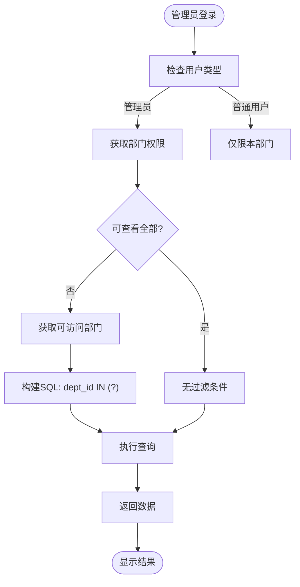

**图示来源**
- [DeptDataPermissionRule.java](file://yudao-framework/yudao-spring-boot-starter-biz-data-permission/src/main/java/cn/iocoder/yudao/framework/datapermission/core/rule/dept/DeptDataPermissionRule.java)

## 性能影响与优化建议

**性能分析**

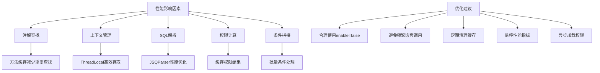

**图示来源**
- [DataPermissionAnnotationInterceptor.java](file://yudao-framework/yudao-spring-boot-starter-biz-data-permission/src/main/java/cn/iocoder/yudao/framework/datapermission/core/aop/DataPermissionAnnotationInterceptor.java)
- [DataPermissionContextHolder.java](file://yudao-framework/yudao-spring-boot-starter-biz-data-permission/src/main/java/cn/iocoder/yudao/framework/datapermission/core/aop/DataPermissionContextHolder.java)
- [DeptDataPermissionRule.java](file://yudao-framework/yudao-spring-boot-starter-biz-data-permission/src/main/java/cn/iocoder/yudao/framework/datapermission/core/rule/dept/DeptDataPermissionRule.java)

## 扩展机制

**自定义规则实现**

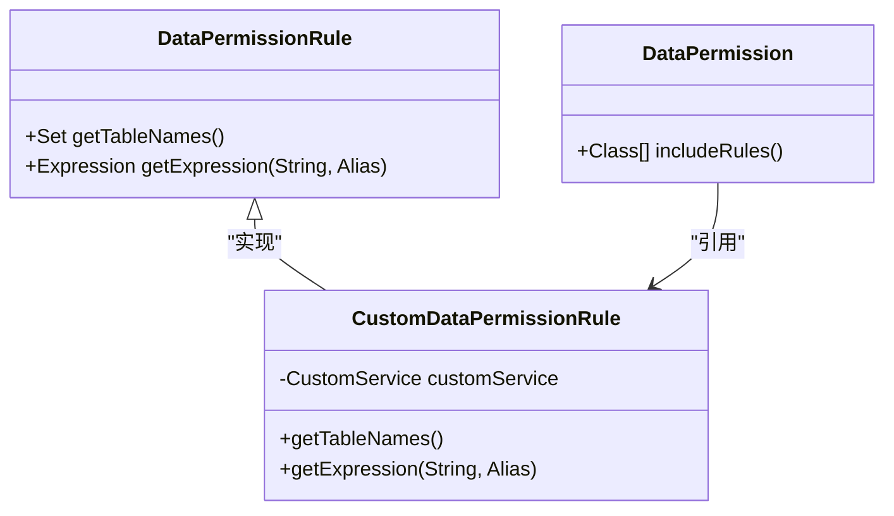

**图示来源**
- [DataPermissionRule.java](file://yudao-framework/yudao-spring-boot-starter-biz-data-permission/src/main/java/cn/iocoder/yudao/framework/datapermission/core/rule/DataPermissionRule.java)
- [DataPermission.java](file://yudao-framework/yudao-spring-boot-starter-biz-data-permission/src/main/java/cn/iocoder/yudao/framework/datapermission/core/annotation/DataPermission.java)

**扩展配置流程**

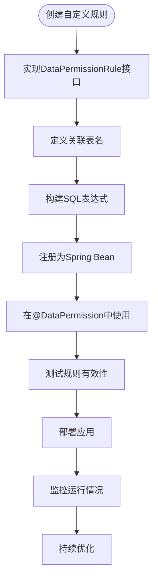

**图示来源**
- [DataPermissionRule.java](file://yudao-framework/yudao-spring-boot-starter-biz-data-permission/src/main/java/cn/iocoder/yudao/framework/datapermission/core/rule/DataPermissionRule.java)
- [DataPermission.java](file://yudao-framework/yudao-spring-boot-starter-biz-data-permission/src/main/java/cn/iocoder/yudao/framework/datapermission/core/annotation/DataPermission.java)