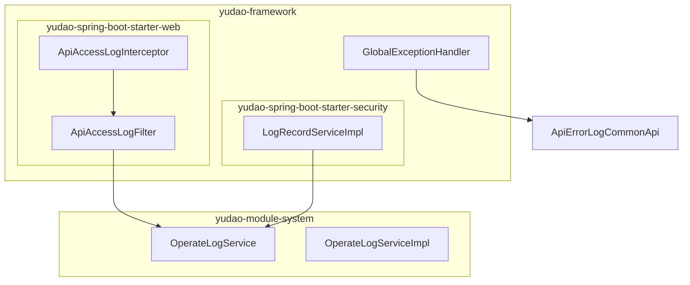
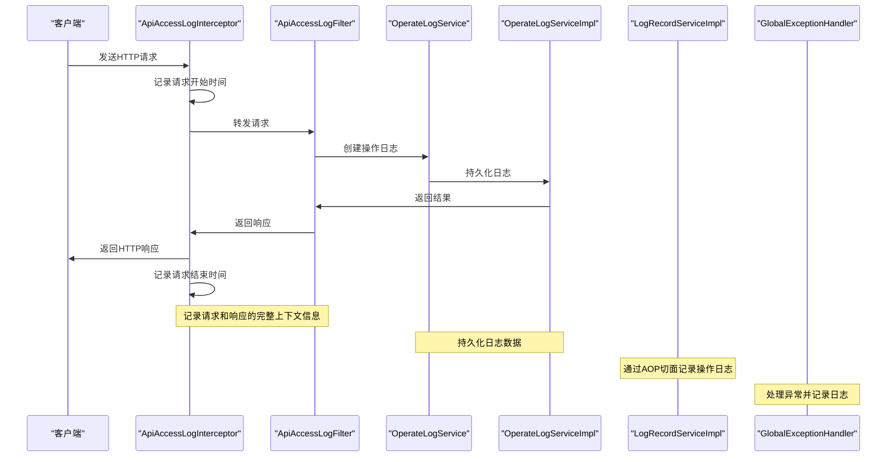
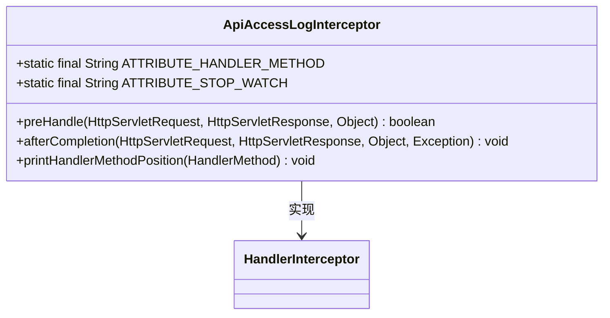
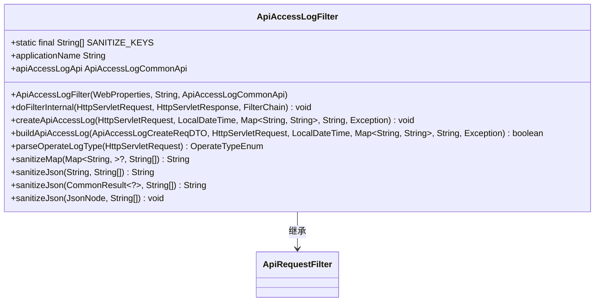
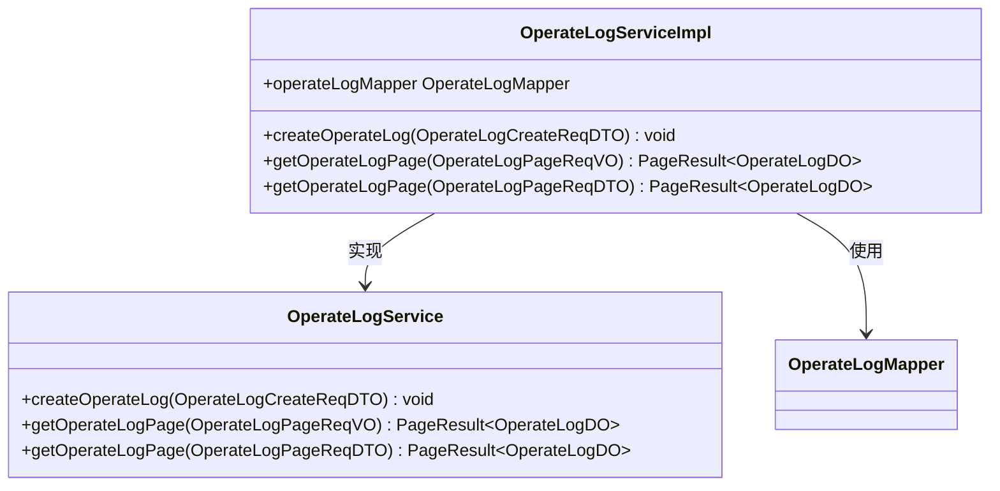
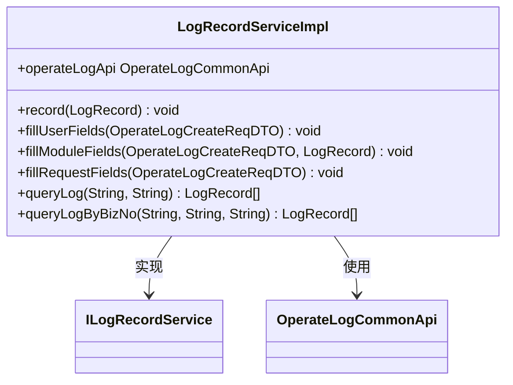
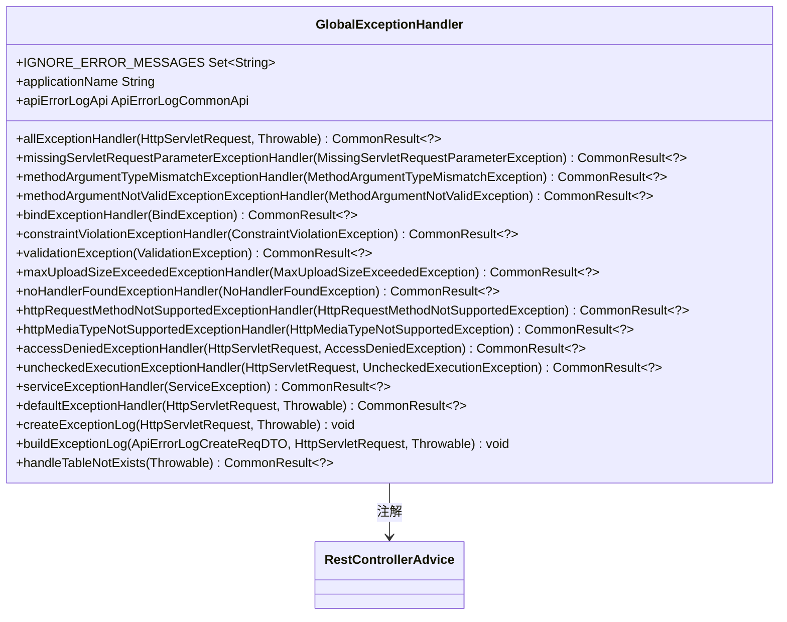
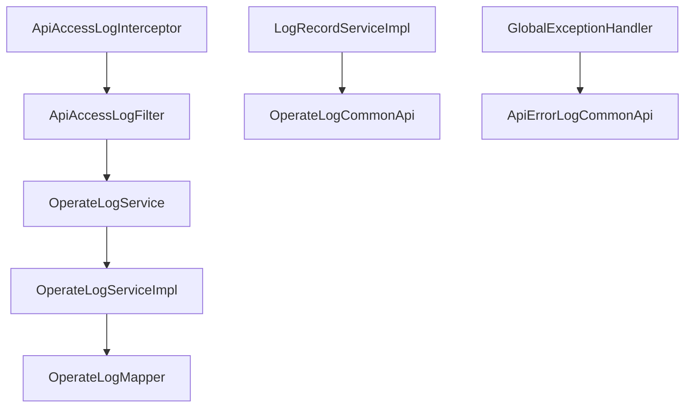

# 日志拦截器

<cite>
**本文档引用的文件**  
- [ApiAccessLogInterceptor.java](file://yudao-framework/yudao-spring-boot-starter-web/src/main/java/cn/iocoder/yudao/framework/apilog/core/interceptor/ApiAccessLogInterceptor.java)
- [ApiAccessLogFilter.java](file://yudao-framework/yudao-spring-boot-starter-web/src/main/java/cn/iocoder/yudao/framework/apilog/core/filter/ApiAccessLogFilter.java)
- [GlobalExceptionHandler.java](file://yudao-framework/yudao-spring-boot-starter-web/src/main/java/cn/iocoder/yudao/framework/web/core/handler/GlobalExceptionHandler.java)
- [OperateLogService.java](file://yudao-module-system/src/main/java/cn/iocoder/yudao/module/system/service/logger/OperateLogService.java)
- [OperateLogServiceImpl.java](file://yudao-module-system/src/main/java/cn/iocoder/yudao/module/system/service/logger/OperateLogServiceImpl.java)
- [LogRecordServiceImpl.java](file://yudao-framework/yudao-spring-boot-starter-security/src/main/java/cn/iocoder/yudao/framework/operatelog/core/service/LogRecordServiceImpl.java)
- [ApiErrorLogCommonApi.java](file://yudao-framework/yudao-common/src/main/java/cn/iocoder/yudao/framework/common/biz/infra/logger/ApiErrorLogCommonApi.java)
</cite>

## 目录
1. [简介](#简介)
2. [项目结构](#项目结构)
3. [核心组件](#核心组件)
4. [架构概述](#架构概述)
5. [详细组件分析](#详细组件分析)
6. [依赖分析](#依赖分析)
7. [性能考虑](#性能考虑)
8. [故障排除指南](#故障排除指南)
9. [结论](#结论)

## 简介
本文档深入解析了日志拦截器（LogInterceptor）的实现细节，重点说明了如何捕获HTTP请求的完整上下文信息，包括请求方法、URL、参数、响应状态码和执行耗时。文档还描述了日志数据的结构化处理过程，以及如何与OperateLogService集成实现操作日志的持久化存储。此外，解释了全局异常处理器（GlobalExceptionHandler）与日志拦截器的协作机制，确保异常情况也能被正确记录。文档提供了日志级别配置、敏感信息脱敏和性能监控的配置选项，并包含实际使用示例，展示如何自定义日志格式或添加业务上下文信息。

## 项目结构
项目结构清晰地展示了各个模块和组件的组织方式。日志拦截器主要位于`yudao-framework`模块下的`yudao-spring-boot-starter-web`子模块中。具体路径为`yudao-framework/yudao-spring-boot-starter-web/src/main/java/cn/iocoder/yudao/framework/apilog/core/interceptor/ApiAccessLogInterceptor.java`。该拦截器负责捕获HTTP请求的上下文信息并生成日志。

**图源**
- [ApiAccessLogInterceptor.java](file://yudao-framework/yudao-spring-boot-starter-web/src/main/java/cn/iocoder/yudao/framework/apilog/core/interceptor/ApiAccessLogInterceptor.java)
- [ApiAccessLogFilter.java](file://yudao-framework/yudao-spring-boot-starter-web/src/main/java/cn/iocoder/yudao/framework/apilog/core/filter/ApiAccessLogFilter.java)
- [OperateLogService.java](file://yudao-module-system/src/main/java/cn/iocoder/yudao/module/system/service/logger/OperateLogService.java)
- [OperateLogServiceImpl.java](file://yudao-module-system/src/main/java/cn/iocoder/yudao/module/system/service/logger/OperateLogServiceImpl.java)
- [LogRecordServiceImpl.java](file://yudao-framework/yudao-spring-boot-starter-security/src/main/java/cn/iocoder/yudao/framework/operatelog/core/service/LogRecordServiceImpl.java)
- [GlobalExceptionHandler.java](file://yudao-framework/yudao-spring-boot-starter-web/src/main/java/cn/iocoder/yudao/framework/web/core/handler/GlobalExceptionHandler.java)

**节源**
- [ApiAccessLogInterceptor.java](file://yudao-framework/yudao-spring-boot-starter-web/src/main/java/cn/iocoder/yudao/framework/apilog/core/interceptor/ApiAccessLogInterceptor.java)
- [ApiAccessLogFilter.java](file://yudao-framework/yudao-spring-boot-starter-web/src/main/java/cn/iocoder/yudao/framework/apilog/core/filter/ApiAccessLogFilter.java)
- [OperateLogService.java](file://yudao-module-system/src/main/java/cn/iocoder/yudao/module/system/service/logger/OperateLogService.java)
- [OperateLogServiceImpl.java](file://yudao-module-system/src/main/java/cn/iocoder/yudao/module/system/service/logger/OperateLogServiceImpl.java)
- [LogRecordServiceImpl.java](file://yudao-framework/yudao-spring-boot-starter-security/src/main/java/cn/iocoder/yudao/framework/operatelog/core/service/LogRecordServiceImpl.java)
- [GlobalExceptionHandler.java](file://yudao-framework/yudao-spring-boot-starter-web/src/main/java/cn/iocoder/yudao/framework/web/core/handler/GlobalExceptionHandler.java)

## 核心组件
日志拦截器的核心组件包括`ApiAccessLogInterceptor`、`ApiAccessLogFilter`、`OperateLogService`、`OperateLogServiceImpl`、`LogRecordServiceImpl`和`GlobalExceptionHandler`。这些组件协同工作，确保HTTP请求的完整上下文信息被正确捕获和记录。

**节源**
- [ApiAccessLogInterceptor.java](file://yudao-framework/yudao-spring-boot-starter-web/src/main/java/cn/iocoder/yudao/framework/apilog/core/interceptor/ApiAccessLogInterceptor.java)
- [ApiAccessLogFilter.java](file://yudao-framework/yudao-spring-boot-starter-web/src/main/java/cn/iocoder/yudao/framework/apilog/core/filter/ApiAccessLogFilter.java)
- [OperateLogService.java](file://yudao-module-system/src/main/java/cn/iocoder/yudao/module/system/service/logger/OperateLogService.java)
- [OperateLogServiceImpl.java](file://yudao-module-system/src/main/java/cn/iocoder/yudao/module/system/service/logger/OperateLogServiceImpl.java)
- [LogRecordServiceImpl.java](file://yudao-framework/yudao-spring-boot-starter-security/src/main/java/cn/iocoder/yudao/framework/operatelog/core/service/LogRecordServiceImpl.java)
- [GlobalExceptionHandler.java](file://yudao-framework/yudao-spring-boot-starter-web/src/main/java/cn/iocoder/yudao/framework/web/core/handler/GlobalExceptionHandler.java)

## 架构概述
日志拦截器的架构设计旨在高效地捕获和处理HTTP请求的上下文信息。`ApiAccessLogInterceptor`负责在请求处理前和处理后记录日志，`ApiAccessLogFilter`则在过滤器链中进一步处理请求和响应数据。`OperateLogService`和`OperateLogServiceImpl`负责将日志数据持久化到数据库中。`LogRecordServiceImpl`通过AOP切面记录操作日志，而`GlobalExceptionHandler`则确保异常情况也能被正确记录。

**图源**
- [ApiAccessLogInterceptor.java](file://yudao-framework/yudao-spring-boot-starter-web/src/main/java/cn/iocoder/yudao/framework/apilog/core/interceptor/ApiAccessLogInterceptor.java)
- [ApiAccessLogFilter.java](file://yudao-framework/yudao-spring-boot-starter-web/src/main/java/cn/iocoder/yudao/framework/apilog/core/filter/ApiAccessLogFilter.java)
- [OperateLogService.java](file://yudao-module-system/src/main/java/cn/iocoder/yudao/module/system/service/logger/OperateLogService.java)
- [OperateLogServiceImpl.java](file://yudao-module-system/src/main/java/cn/iocoder/yudao/module/system/service/logger/OperateLogServiceImpl.java)
- [LogRecordServiceImpl.java](file://yudao-framework/yudao-spring-boot-starter-security/src/main/java/cn/iocoder/yudao/framework/operatelog/core/service/LogRecordServiceImpl.java)
- [GlobalExceptionHandler.java](file://yudao-framework/yudao-spring-boot-starter-web/src/main/java/cn/iocoder/yudao/framework/web/core/handler/GlobalExceptionHandler.java)

## 详细组件分析

### ApiAccessLogInterceptor 分析
`ApiAccessLogInterceptor`是日志拦截器的核心组件之一，负责在请求处理前和处理后记录日志。它通过实现`HandlerInterceptor`接口，在`preHandle`方法中记录请求开始时间，并在`afterCompletion`方法中记录请求结束时间。

**图源**
- [ApiAccessLogInterceptor.java](file://yudao-framework/yudao-spring-boot-starter-web/src/main/java/cn/iocoder/yudao/framework/apilog/core/interceptor/ApiAccessLogInterceptor.java)

**节源**
- [ApiAccessLogInterceptor.java](file://yudao-framework/yudao-spring-boot-starter-web/src/main/java/cn/iocoder/yudao/framework/apilog/core/interceptor/ApiAccessLogInterceptor.java)

### ApiAccessLogFilter 分析
`ApiAccessLogFilter`是另一个核心组件，负责在过滤器链中处理请求和响应数据。它通过继承`ApiRequestFilter`类，重写`doFilterInternal`方法，在请求处理前后创建和记录操作日志。

**图源**
- [ApiAccessLogFilter.java](file://yudao-framework/yudao-spring-boot-starter-web/src/main/java/cn/iocoder/yudao/framework/apilog/core/filter/ApiAccessLogFilter.java)

**节源**
- [ApiAccessLogFilter.java](file://yudao-framework/yudao-spring-boot-starter-web/src/main/java/cn/iocoder/yudao/framework/apilog/core/filter/ApiAccessLogFilter.java)

### OperateLogService 分析
`OperateLogService`接口定义了操作日志服务的基本方法，包括创建操作日志和获取操作日志分页列表。`OperateLogServiceImpl`类实现了这些方法，负责将日志数据持久化到数据库中。

**图源**
- [OperateLogService.java](file://yudao-module-system/src/main/java/cn/iocoder/yudao/module/system/service/logger/OperateLogService.java)
- [OperateLogServiceImpl.java](file://yudao-module-system/src/main/java/cn/iocoder/yudao/module/system/service/logger/OperateLogServiceImpl.java)

**节源**
- [OperateLogService.java](file://yudao-module-system/src/main/java/cn/iocoder/yudao/module/system/service/logger/OperateLogService.java)
- [OperateLogServiceImpl.java](file://yudao-module-system/src/main/java/cn/iocoder/yudao/module/system/service/logger/OperateLogServiceImpl.java)

### LogRecordServiceImpl 分析
`LogRecordServiceImpl`通过AOP切面记录操作日志。它实现了`ILogRecordService`接口，重写`record`方法，在方法执行前后记录日志。

**图源**
- [LogRecordServiceImpl.java](file://yudao-framework/yudao-spring-boot-starter-security/src/main/java/cn/iocoder/yudao/framework/operatelog/core/service/LogRecordServiceImpl.java)

**节源**
- [LogRecordServiceImpl.java](file://yudao-framework/yudao-spring-boot-starter-security/src/main/java/cn/iocoder/yudao/framework/operatelog/core/service/LogRecordServiceImpl.java)

### GlobalExceptionHandler 分析
`GlobalExceptionHandler`是全局异常处理器，负责处理所有未被捕获的异常。它通过`@RestControllerAdvice`注解，定义了多个异常处理方法，确保异常情况也能被正确记录。

**图源**
- [GlobalExceptionHandler.java](file://yudao-framework/yudao-spring-boot-starter-web/src/main/java/cn/iocoder/yudao/framework/web/core/handler/GlobalExceptionHandler.java)

**节源**
- [GlobalExceptionHandler.java](file://yudao-framework/yudao-spring-boot-starter-web/src/main/java/cn/iocoder/yudao/framework/web/core/handler/GlobalExceptionHandler.java)

## 依赖分析
日志拦截器的各个组件之间存在紧密的依赖关系。`ApiAccessLogInterceptor`依赖于`ApiAccessLogFilter`来处理请求和响应数据，`ApiAccessLogFilter`依赖于`OperateLogService`来持久化日志数据。`LogRecordServiceImpl`通过AOP切面记录操作日志，依赖于`OperateLogCommonApi`。`GlobalExceptionHandler`则依赖于`ApiErrorLogCommonApi`来记录异常日志。

**图源**
- [ApiAccessLogInterceptor.java](file://yudao-framework/yudao-spring-boot-starter-web/src/main/java/cn/iocoder/yudao/framework/apilog/core/interceptor/ApiAccessLogInterceptor.java)
- [ApiAccessLogFilter.java](file://yudao-framework/yudao-spring-boot-starter-web/src/main/java/cn/iocoder/yudao/framework/apilog/core/filter/ApiAccessLogFilter.java)
- [OperateLogService.java](file://yudao-module-system/src/main/java/cn/iocoder/yudao/module/system/service/logger/OperateLogService.java)
- [OperateLogServiceImpl.java](file://yudao-module-system/src/main/java/cn/iocoder/yudao/module/system/service/logger/OperateLogServiceImpl.java)
- [OperateLogMapper.java](file://yudao-module-system/src/main/java/cn/iocoder/yudao/module/system/dal/mysql/logger/OperateLogMapper.java)
- [LogRecordServiceImpl.java](file://yudao-framework/yudao-spring-boot-starter-security/src/main/java/cn/iocoder/yudao/framework/operatelog/core/service/LogRecordServiceImpl.java)
- [OperateLogCommonApi.java](file://yudao-framework/yudao-common/src/main/java/cn/iocoder/yudao/framework/common/biz/system/logger/OperateLogCommonApi.java)
- [GlobalExceptionHandler.java](file://yudao-framework/yudao-spring-boot-starter-web/src/main/java/cn/iocoder/yudao/framework/web/core/handler/GlobalExceptionHandler.java)
- [ApiErrorLogCommonApi.java](file://yudao-framework/yudao-common/src/main/java/cn/iocoder/yudao/framework/common/biz/infra/logger/ApiErrorLogCommonApi.java)

**节源**
- [ApiAccessLogInterceptor.java](file://yudao-framework/yudao-spring-boot-starter-web/src/main/java/cn/iocoder/yudao/framework/apilog/core/interceptor/ApiAccessLogInterceptor.java)
- [ApiAccessLogFilter.java](file://yudao-framework/yudao-spring-boot-starter-web/src/main/java/cn/iocoder/yudao/framework/apilog/core/filter/ApiAccessLogFilter.java)
- [OperateLogService.java](file://yudao-module-system/src/main/java/cn/iocoder/yudao/module/system/service/logger/OperateLogService.java)
- [OperateLogServiceImpl.java](file://yudao-module-system/src/main/java/cn/iocoder/yudao/module/system/service/logger/OperateLogServiceImpl.java)
- [OperateLogMapper.java](file://yudao-module-system/src/main/java/cn/iocoder/yudao/module/system/dal/mysql/logger/OperateLogMapper.java)
- [LogRecordServiceImpl.java](file://yudao-framework/yudao-spring-boot-starter-security/src/main/java/cn/iocoder/yudao/framework/operatelog/core/service/LogRecordServiceImpl.java)
- [OperateLogCommonApi.java](file://yudao-framework/yudao-common/src/main/java/cn/iocoder/yudao/framework/common/biz/system/logger/OperateLogCommonApi.java)
- [GlobalExceptionHandler.java](file://yudao-framework/yudao-spring-boot-starter-web/src/main/java/cn/iocoder/yudao/framework/web/core/handler/GlobalExceptionHandler.java)
- [ApiErrorLogCommonApi.java](file://yudao-framework/yudao-common/src/main/java/cn/iocoder/yudao/framework/common/biz/infra/logger/ApiErrorLogCommonApi.java)

## 性能考虑
日志拦截器在设计时充分考虑了性能问题。`ApiAccessLogInterceptor`和`ApiAccessLogFilter`通过异步方式记录日志，避免阻塞主线程。`OperateLogService`和`OperateLogServiceImpl`使用数据库连接池，提高数据库操作的效率。`LogRecordServiceImpl`通过AOP切面记录日志，减少了代码侵入性。`GlobalExceptionHandler`通过`@RestControllerAdvice`注解，集中处理异常，提高了代码的可维护性。

## 故障排除指南
在使用日志拦截器时，可能会遇到一些常见问题。例如，日志记录不完整、日志记录延迟、日志记录失败等。这些问题通常可以通过检查配置文件、日志级别、数据库连接等来解决。如果问题仍然存在，可以查看日志文件，获取更详细的错误信息。

**节源**
- [ApiAccessLogInterceptor.java](file://yudao-framework/yudao-spring-boot-starter-web/src/main/java/cn/iocoder/yudao/framework/apilog/core/interceptor/ApiAccessLogInterceptor.java)
- [ApiAccessLogFilter.java](file://yudao-framework/yudao-spring-boot-starter-web/src/main/java/cn/iocoder/yudao/framework/apilog/core/filter/ApiAccessLogFilter.java)
- [OperateLogService.java](file://yudao-module-system/src/main/java/cn/iocoder/yudao/module/system/service/logger/OperateLogService.java)
- [OperateLogServiceImpl.java](file://yudao-module-system/src/main/java/cn/iocoder/yudao/module/system/service/logger/OperateLogServiceImpl.java)
- [LogRecordServiceImpl.java](file://yudao-framework/yudao-spring-boot-starter-security/src/main/java/cn/iocoder/yudao/framework/operatelog/core/service/LogRecordServiceImpl.java)
- [GlobalExceptionHandler.java](file://yudao-framework/yudao-spring-boot-starter-web/src/main/java/cn/iocoder/yudao/framework/web/core/handler/GlobalExceptionHandler.java)

## 结论
日志拦截器通过`ApiAccessLogInterceptor`、`ApiAccessLogFilter`、`OperateLogService`、`OperateLogServiceImpl`、`LogRecordServiceImpl`和`GlobalExceptionHandler`等组件的协同工作，实现了对HTTP请求的完整上下文信息的捕获和记录。这些组件通过异步方式记录日志，使用数据库连接池提高效率，通过AOP切面减少代码侵入性，通过`@RestControllerAdvice`注解集中处理异常，确保了系统的高性能和高可维护性。通过本文档的详细分析，开发者可以更好地理解和使用日志拦截器，提高系统的稳定性和可维护性。