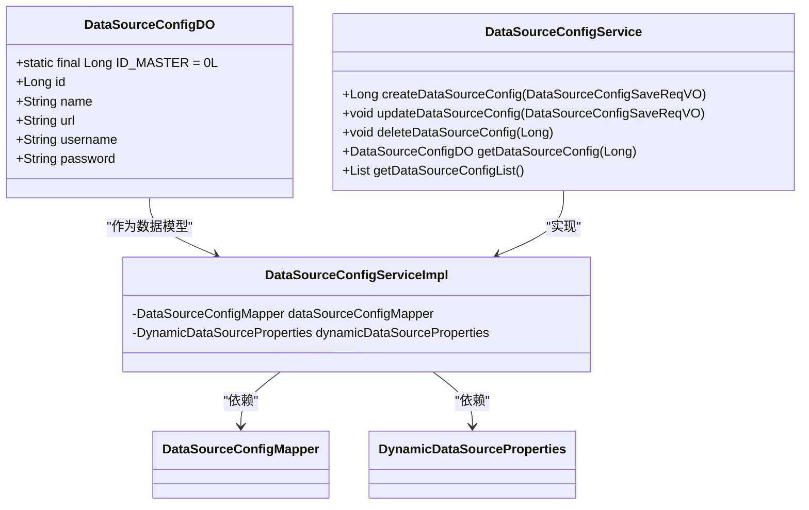
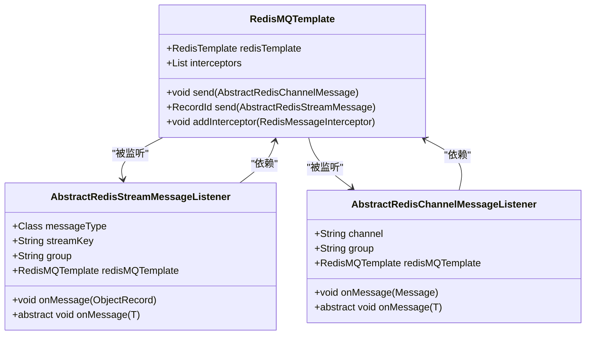
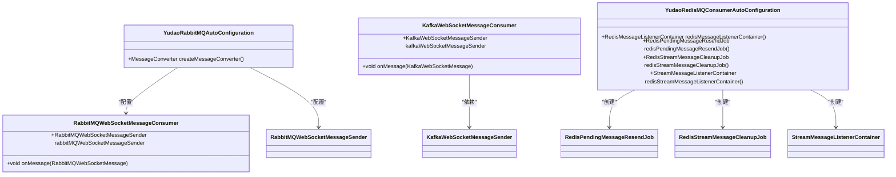
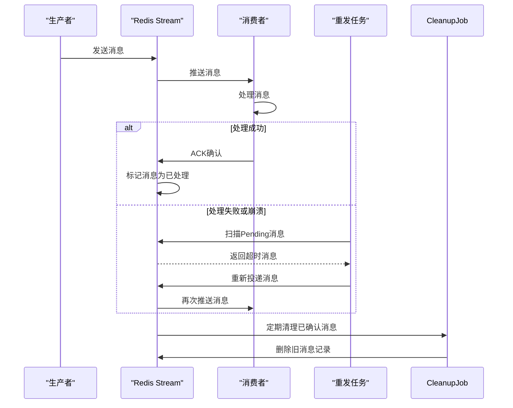
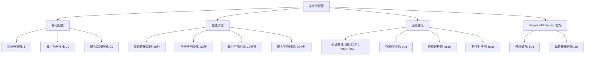

# 外部集成

<cite>
**本文档引用文件**  
- [DataSourceConfigDO.java](file://yudao-module-infra/src/main/java/cn/iocoder/yudao/module/infra/dal/dataobject/db/DataSourceConfigDO.java)
- [DataSourceConfigServiceImpl.java](file://yudao-module-infra/src/main/java/cn/iocoder/yudao/module/infra/service/db/DataSourceConfigServiceImpl.java)
- [application-dev.yaml](file://yudao-server/src/main/resources/application-dev.yaml)
- [RedisMQTemplate.java](file://yudao-framework/yudao-spring-boot-starter-mq/src/main/java/cn/iocoder/yudao/framework/mq/redis/core/RedisMQTemplate.java)
- [AbstractRedisStreamMessageListener.java](file://yudao-framework/yudao-spring-boot-starter-mq/src/main/java/cn/iocoder/yudao/framework/mq/redis/core/stream/AbstractRedisStreamMessageListener.java)
- [YudaoRedisMQConsumerAutoConfiguration.java](file://yudao-framework/yudao-spring-boot-starter-mq/src/main/java/cn/iocoder/yudao/framework/mq/redis/config/YudaoRedisMQConsumerAutoConfiguration.java)
- [RedisPendingMessageResendJob.java](file://yudao-framework/yudao-spring-boot-starter-mq/src/main/java/cn/iocoder/yudao/framework/mq/redis/core/job/RedisPendingMessageResendJob.java)
- [RedisStreamMessageCleanupJob.java](file://yudao-framework/yudao-spring-boot-starter-mq/src/main/java/cn/iocoder/yudao/framework/mq/redis/core/job/RedisStreamMessageCleanupJob.java)
- [YudaoRabbitMQAutoConfiguration.java](file://yudao-framework/yudao-spring-boot-starter-mq/src/main/java/cn/iocoder/yudao/framework/mq/rabbitmq/config/YudaoRabbitMQAutoConfiguration.java)
- [KafkaWebSocketMessageConsumer.java](file://yudao-framework/yudao-spring-boot-starter-websocket/src/main/java/cn/iocoder/yudao/framework/websocket/core/sender/kafka/KafkaWebSocketMessageConsumer.java)
- [RabbitMQWebSocketMessageConsumer.java](file://yudao-framework/yudao-spring-boot-starter-websocket/src/main/java/cn/iocoder/yudao/framework/websocket/core/sender/rabbitmq/RabbitMQWebSocketMessageConsumer.java)
</cite>

## 目录
1. [多数据源配置机制](#多数据源配置机制)
2. [Redis集成](#redis集成)
3. [消息队列集成](#消息队列集成)
4. [异步消息处理模式](#异步消息处理模式)
5. [外部服务连接池配置](#外部服务连接池配置)
6. [集成故障排查指南](#集成故障排查指南)
7. [监控指标说明](#监控指标说明)

## 多数据源配置机制

系统通过 `DataSourceConfigDO` 数据对象管理多个数据库连接配置，支持动态数据源路由。主数据源通过 `ID_MASTER` 常量标识，其他数据源通过数据库配置表进行管理。系统使用 `DynamicDataSourceProperties` 配置主数据源名称，并从 `application.yaml` 中读取多数据源配置。

动态数据源服务 `DataSourceConfigServiceImpl` 提供了创建、更新、删除和查询数据源配置的功能。在获取数据源配置时，若请求ID为0，则返回主数据源配置；否则从数据库中查询对应配置。系统还提供了连接验证功能，确保配置的数据库连接可用。

**图示来源**
- [DataSourceConfigDO.java](file://yudao-module-infra/src/main/java/cn/iocoder/yudao/module/infra/dal/dataobject/db/DataSourceConfigDO.java#L15-L49)
- [DataSourceConfigServiceImpl.java](file://yudao-module-infra/src/main/java/cn/iocoder/yudao/module/infra/service/db/DataSourceConfigServiceImpl.java#L0-L110)

**本节来源**
- [DataSourceConfigDO.java](file://yudao-module-infra/src/main/java/cn/iocoder/yudao/module/infra/dal/dataobject/db/DataSourceConfigDO.java#L15-L49)
- [DataSourceConfigServiceImpl.java](file://yudao-module-infra/src/main/java/cn/iocoder/yudao/module/infra/service/db/DataSourceConfigServiceImpl.java#L0-L110)

## Redis集成

系统通过 `RedisMQTemplate` 实现全面的Redis集成，支持缓存管理、分布式锁、会话共享和消息队列功能。Redis配置通过 `YudaoRedisAutoConfiguration` 自动配置，确保连接的稳定性和性能。

Redis消息模板 `RedisMQTemplate` 提供了基于Redis pub/sub和Redis Stream两种消息传递机制。系统通过拦截器机制支持消息发送前后的处理逻辑，确保消息的可靠性和可扩展性。

**图示来源**
- [RedisMQTemplate.java](file://yudao-framework/yudao-spring-boot-starter-mq/src/main/java/cn/iocoder/yudao/framework/mq/redis/core/RedisMQTemplate.java#L21-L86)
- [AbstractRedisStreamMessageListener.java](file://yudao-framework/yudao-spring-boot-starter-mq/src/main/java/cn/iocoder/yudao/framework/mq/redis/core/stream/AbstractRedisStreamMessageListener.java#L24-L118)

**本节来源**
- [RedisMQTemplate.java](file://yudao-framework/yudao-spring-boot-starter-mq/src/main/java/cn/iocoder/yudao/framework/mq/redis/core/RedisMQTemplate.java#L21-L86)
- [AbstractRedisStreamMessageListener.java](file://yudao-framework/yudao-spring-boot-starter-mq/src/main/java/cn/iocoder/yudao/framework/mq/redis/core/stream/AbstractRedisStreamMessageListener.java#L24-L118)

## 消息队列集成

系统支持多种消息中间件的集成，包括RabbitMQ、Kafka、RocketMQ和Redis Stream。每种消息中间件都有相应的自动配置类和消费者实现。

对于RabbitMQ，系统通过 `YudaoRabbitMQAutoConfiguration` 配置Jackson2JsonMessageConverter，实现消息的JSON序列化。WebSocket消息通过RabbitMQ进行广播，每个消费者创建独立的队列以实现广播消费模式。

Kafka集成通过 `KafkaWebSocketMessageConsumer` 实现，使用UUID生成消费者组后缀，确保消息的广播消费。系统还支持RocketMQ集成，但具体实现未在代码中展示。

Redis Stream作为内置消息队列解决方案，通过 `YudaoRedisMQConsumerAutoConfiguration` 配置消费者容器和相关任务。

**图示来源**
- [YudaoRabbitMQAutoConfiguration.java](file://yudao-framework/yudao-spring-boot-starter-mq/src/main/java/cn/iocoder/yudao/framework/mq/rabbitmq/config/YudaoRabbitMQAutoConfiguration.java#L14-L27)
- [RabbitMQWebSocketMessageConsumer.java](file://yudao-framework/yudao-spring-boot-starter-websocket/src/main/java/cn/iocoder/yudao/framework/websocket/core/sender/rabbitmq/RabbitMQWebSocketMessageConsumer.java#L0-L38)
- [KafkaWebSocketMessageConsumer.java](file://yudao-framework/yudao-spring-boot-starter-websocket/src/main/java/cn/iocoder/yudao/framework/websocket/core/sender/kafka/KafkaWebSocketMessageConsumer.java#L0-L27)
- [YudaoRedisMQConsumerAutoConfiguration.java](file://yudao-framework/yudao-spring-boot-starter-mq/src/main/java/cn/iocoder/yudao/framework/mq/redis/config/YudaoRedisMQConsumerAutoConfiguration.java#L0-L161)

**本节来源**
- [YudaoRabbitMQAutoConfiguration.java](file://yudao-framework/yudao-spring-boot-starter-mq/src/main/java/cn/iocoder/yudao/framework/mq/rabbitmq/config/YudaoRabbitMQAutoConfiguration.java#L14-L27)
- [RabbitMQWebSocketMessageConsumer.java](file://yudao-framework/yudao-spring-boot-starter-websocket/src/main/java/cn/iocoder/yudao/framework/websocket/core/sender/rabbitmq/RabbitMQWebSocketMessageConsumer.java#L0-L38)
- [KafkaWebSocketMessageConsumer.java](file://yudao-framework/yudao-spring-boot-starter-websocket/src/main/java/cn/iocoder/yudao/framework/websocket/core/sender/kafka/KafkaWebSocketMessageConsumer.java#L0-L27)
- [YudaoRedisMQConsumerAutoConfiguration.java](file://yudao-framework/yudao-spring-boot-starter-mq/src/main/java/cn/iocoder/yudao/framework/mq/redis/config/YudaoRedisMQConsumerAutoConfiguration.java#L0-L161)

## 异步消息处理模式

系统采用生产者-消费者模型实现异步消息处理，确保系统的响应性和可扩展性。消息可靠性保障机制包括消息重发、消息清理和消费者崩溃恢复。

`RedisPendingMessageResendJob` 定时任务每分钟执行一次，检查并重新投递超时未确认的消息。该任务使用Redisson分布式锁确保集群环境下的单实例执行，避免重复处理。

`RedisStreamMessageCleanupJob` 定时任务每小时执行一次，清理已确认消费的消息，防止Redis内存占用过大。系统默认保留最近10000条消息，平衡了历史消息查询需求和内存使用。

消息消费过程中，系统通过拦截器机制支持消费前后的处理逻辑，为日志记录、事务管理和幂等性控制提供了扩展点。

**图示来源**
- [RedisPendingMessageResendJob.java](file://yudao-framework/yudao-spring-boot-starter-mq/src/main/java/cn/iocoder/yudao/framework/mq/redis/core/job/RedisPendingMessageResendJob.java#L0-L98)
- [RedisStreamMessageCleanupJob.java](file://yudao-framework/yudao-spring-boot-starter-mq/src/main/java/cn/iocoder/yudao/framework/mq/redis/core/job/RedisStreamMessageCleanupJob.java#L0-L40)

**本节来源**
- [RedisPendingMessageResendJob.java](file://yudao-framework/yudao-spring-boot-starter-mq/src/main/java/cn/iocoder/yudao/framework/mq/redis/core/job/RedisPendingMessageResendJob.java#L0-L98)
- [RedisStreamMessageCleanupJob.java](file://yudao-framework/yudao-spring-boot-starter-mq/src/main/java/cn/iocoder/yudao/framework/mq/redis/core/job/RedisStreamMessageCleanupJob.java#L0-L40)

## 外部服务连接池配置

系统使用Druid作为数据库连接池，通过 `application.yaml` 文件进行详细配置。连接池配置包括初始连接数、最小空闲连接、最大活跃连接、获取连接超时时间等关键参数。

主数据源配置在 `application-dev.yaml` 中定义，包括JDBC URL、用户名和密码。连接池通过验证查询确保连接的有效性，并配置了空闲连接检测机制。

**图示来源**
- [application-dev.yaml](file://yudao-server/src/main/resources/application-dev.yaml#L32-L51)

**本节来源**
- [application-dev.yaml](file://yudao-server/src/main/resources/application-dev.yaml#L32-L51)

## 集成故障排查指南

当遇到外部集成问题时，建议按照以下步骤进行排查：

1. **检查配置文件**：确认 `application.yaml` 中的数据库连接、Redis配置和消息队列配置正确无误。
2. **验证连接可用性**：使用系统提供的数据源测试功能验证数据库连接是否正常。
3. **检查日志输出**：查看应用日志中是否有连接失败、认证错误或网络超时等相关错误信息。
4. **监控Redis状态**：检查Redis服务器是否正常运行，内存使用情况是否正常。
5. **检查消息队列**：确认RabbitMQ、Kafka等消息中间件服务是否正常运行，队列是否有积压。
6. **验证版本兼容性**：特别是Redis版本，系统要求Redis版本不低于5.0.0。
7. **检查网络连接**：确保应用服务器与外部服务之间的网络连接正常，防火墙规则允许相应端口通信。

对于消息积压问题，检查 `RedisPendingMessageResendJob` 是否正常执行，确认消费者处理能力是否足够。对于内存占用过高问题，检查 `RedisStreamMessageCleanupJob` 是否正常清理旧消息。

**本节来源**
- [YudaoRedisMQConsumerAutoConfiguration.java](file://yudao-framework/yudao-spring-boot-starter-mq/src/main/java/cn/iocoder/yudao/framework/mq/redis/config/YudaoRedisMQConsumerAutoConfiguration.java#L130-L161)
- [RedisPendingMessageResendJob.java](file://yudao-framework/yudao-spring-boot-starter-mq/src/main/java/cn/iocoder/yudao/framework/mq/redis/core/job/RedisPendingMessageResendJob.java#L34-L67)
- [RedisStreamMessageCleanupJob.java](file://yudao-framework/yudao-spring-boot-starter-mq/src/main/java/cn/iocoder/yudao/framework/mq/redis/core/job/RedisStreamMessageCleanupJob.java#L0-L40)

## 监控指标说明

系统提供了多种监控指标用于外部集成的健康状况监测：

- **数据库连接池指标**：包括活跃连接数、空闲连接数、等待获取连接的线程数等。
- **Redis连接指标**：包括连接数、内存使用率、命令执行速率等。
- **消息队列指标**：包括消息生产速率、消费速率、队列长度、未确认消息数等。
- **任务执行指标**：包括 `RedisPendingMessageResendJob` 和 `RedisStreamMessageCleanupJob` 的执行频率和执行时间。
- **网络延迟指标**：包括数据库查询延迟、Redis命令执行延迟、消息传递延迟等。

这些指标可以通过系统的监控端点进行查看，帮助运维人员及时发现和解决潜在问题。

**本节来源**
- [YudaoRedisMQConsumerAutoConfiguration.java](file://yudao-framework/yudao-spring-boot-starter-mq/src/main/java/cn/iocoder/yudao/framework/mq/redis/config/YudaoRedisMQConsumerAutoConfiguration.java#L0-L161)
- [RedisPendingMessageResendJob.java](file://yudao-framework/yudao-spring-boot-starter-mq/src/main/java/cn/iocoder/yudao/framework/mq/redis/core/job/RedisPendingMessageResendJob.java#L0-L98)
- [RedisStreamMessageCleanupJob.java](file://yudao-framework/yudao-spring-boot-starter-mq/src/main/java/cn/iocoder/yudao/framework/mq/redis/core/job/RedisStreamMessageCleanupJob.java#L0-L40)