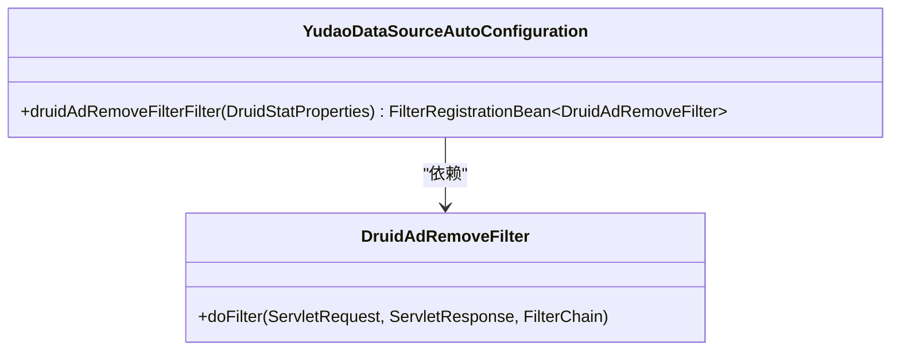
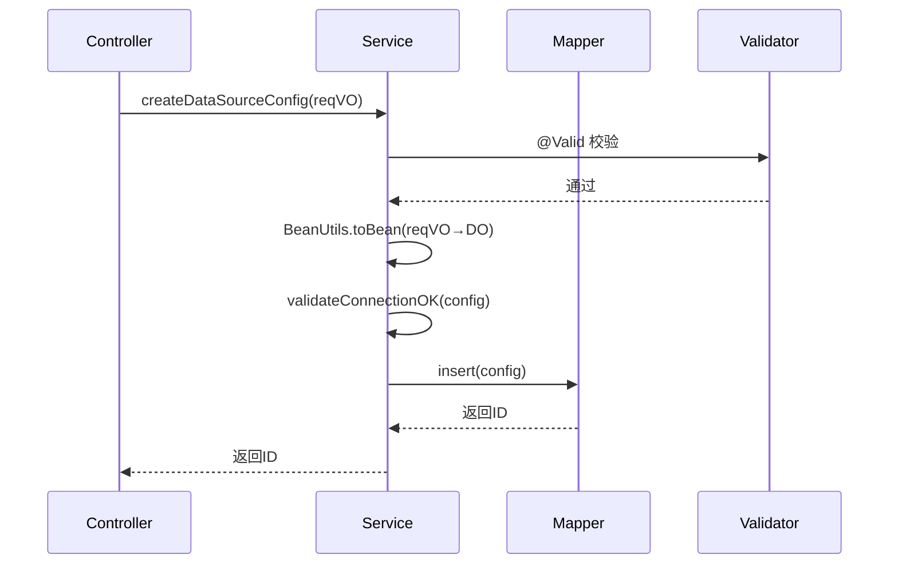
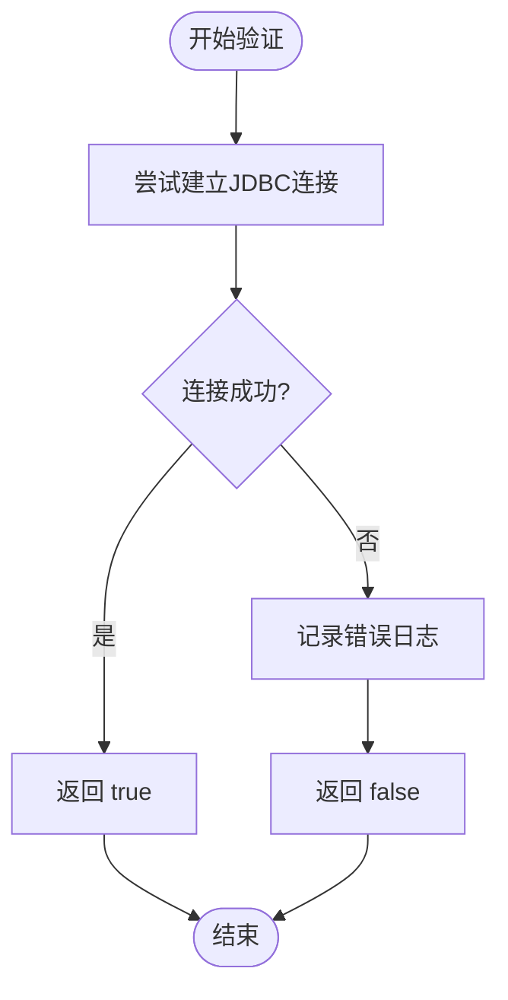

# 数据库集成

<cite>
**本文档引用文件**  
- [DataSourceConfigDO.java](file://yudao-module-infra/src/main/java/cn/iocoder/yudao/module/infra/dal/dataobject/db/DataSourceConfigDO.java)
- [YudaoDataSourceAutoConfiguration.java](file://yudao-framework/yudao-spring-boot-starter-mybatis/src/main/java/cn/iocoder/yudao/framework/datasource/config/YudaoDataSourceAutoConfiguration.java)
- [DataSourceConfigService.java](file://yudao-module-infra/src/main/java/cn/iocoder/yudao/module/infra/service/db/DataSourceConfigService.java)
- [DataSourceConfigServiceImpl.java](file://yudao-module-infra/src/main/java/cn/iocoder/yudao/module/infra/service/db/DataSourceConfigServiceImpl.java)
- [JdbcUtils.java](file://yudao-framework/yudao-spring-boot-starter-mybatis/src/main/java/cn/iocoder/yudao/framework/mybatis/core/util/JdbcUtils.java)
</cite>

## 目录
1. [引言](#引言)
2. [数据源配置实体设计](#数据源配置实体设计)
3. [动态数据源自动配置机制](#动态数据源自动配置机制)
4. [数据源配置服务接口与实现](#数据源配置服务接口与实现)
5. [数据源健康检查与连接验证](#数据源健康检查与连接验证)
6. [主数据源构建逻辑](#主数据源构建逻辑)
7. [多数据源使用场景与读写分离支持](#多数据源使用场景与读写分离支持)
8. [Druid连接池与监控集成](#druid连接池与监控集成)
9. [数据源切换与事务管理协同](#数据源切换与事务管理协同)
10. [性能调优建议](#性能调优建议)
11. [常见连接问题排查方法](#常见连接问题排查方法)

## 引言
本系统通过灵活的多数据源配置机制，支持异构数据库集成与主从架构部署。系统允许在运行时动态添加、修改和删除数据源配置，并通过统一的服务接口进行管理。核心机制基于Spring Boot自动配置与MyBatis Plus扩展能力，结合Druid连接池实现高性能数据库访问。本文档详细说明数据源配置模型、动态路由机制、健康检查流程及实际应用场景。

## 数据源配置实体设计

`DataSourceConfigDO` 是定义数据源连接参数的核心数据对象，继承自 `BaseDO` 并映射到数据库表 `infra_data_source_config`。该实体包含以下关键属性：

- **id**: 主键编号，其中 `ID_MASTER = 0L` 表示默认主数据源
- **name**: 数据源连接名，用于标识不同数据源
- **url**: JDBC连接字符串，指定数据库类型、地址、端口和实例
- **username**: 数据库登录用户名
- **password**: 密码字段使用 `@TableField(typeHandler = EncryptTypeHandler.class)` 注解，通过加密处理器实现存储加密，保障敏感信息安全性
- **createTime / updateTime**: 继承自 `BaseDO` 的审计字段，自动填充创建与更新时间

该实体被 `@TenantIgnore` 注解标记，表示在多租户环境下忽略租户隔离逻辑，适用于基础设施级别的数据源配置管理。

**Section sources**
- [DataSourceConfigDO.java](file://yudao-module-infra/src/main/java/cn/iocoder/yudao/module/infra/dal/dataobject/db/DataSourceConfigDO.java#L15-L49)
- [BaseDO.java](file://yudao-framework/yudao-spring-boot-starter-mybatis/src/main/java/cn/iocoder/yudao/framework/mybatis/core/dataobject/BaseDO.java#L21-L65)
- [TenantIgnore.java](file://yudao-framework/yudao-spring-boot-starter-biz-tenant/src/main/java/cn/iocoder/yudao/framework/tenant/core/aop/TenantIgnore.java#L19-L31)

## 动态数据源自动配置机制

`YudaoDataSourceAutoConfiguration` 是Spring Boot自动配置类，负责初始化多数据源相关组件。其核心功能包括：

- 使用 `@EnableTransactionManagement(proxyTargetClass = true)` 启用基于CGLIB的事务管理代理，确保在复杂继承结构下事务正常生效
- 通过 `@EnableConfigurationProperties(DruidStatProperties.class)` 加载Druid监控配置属性
- 提供 `druidAdRemoveFilterFilter` Bean，用于移除Druid监控页面中的广告脚本（common.js），提升管理界面体验
- 该过滤器仅在 `spring.datasource.druid.stat-view-servlet.enabled=true` 时启用，具备条件化加载能力

此配置类为动态数据源提供了基础支撑环境，但实际的数据源路由与切换逻辑由框架其他模块实现。

**Diagram sources**
- [YudaoDataSourceAutoConfiguration.java](file://yudao-framework/yudao-spring-boot-starter-mybatis/src/main/java/cn/iocoder/yudao/framework/datasource/config/YudaoDataSourceAutoConfiguration.java#L16-L39)
- [DruidAdRemoveFilter.java](file://yudao-framework/yudao-spring-boot-starter-mybatis/src/main/java/cn/iocoder/yudao/framework/datasource/core/filter/DruidAdRemoveFilter.java)

**Section sources**
- [YudaoDataSourceAutoConfiguration.java](file://yudao-framework/yudao-spring-boot-starter-mybatis/src/main/java/cn/iocoder/yudao/framework/datasource/config/YudaoDataSourceAutoConfiguration.java#L16-L39)

## 数据源配置服务接口与实现

### 接口定义
`DataSourceConfigService` 接口定义了对数据源配置的CRUD操作契约：

- `createDataSourceConfig`: 创建新数据源配置，返回生成的ID
- `updateDataSourceConfig`: 更新现有数据源配置
- `deleteDataSourceConfig`: 删除指定ID的数据源
- `deleteDataSourceConfigList`: 批量删除多个数据源
- `getDataSourceConfig`: 根据ID获取单个数据源配置
- `getDataSourceConfigList`: 获取所有数据源配置列表

所有方法参数均使用 `@Valid` 注解触发JSR-303校验，确保输入合法性。

### 实现逻辑
`DataSourceConfigServiceImpl` 实现了上述接口，核心逻辑如下：

- 使用 `dataSourceConfigMapper` 操作数据库持久化配置
- 在创建和更新前调用 `validateConnectionOK` 验证连接有效性
- 删除操作支持单个及批量删除
- 查询时自动补充主数据源（ID=0）至列表首位

**Diagram sources**
- [DataSourceConfigService.java](file://yudao-module-infra/src/main/java/cn/iocoder/yudao/module/infra/service/db/DataSourceConfigService.java#L13-L59)
- [DataSourceConfigServiceImpl.java](file://yudao-module-infra/src/main/java/cn/iocoder/yudao/module/infra/service/db/DataSourceConfigServiceImpl.java#L35-L44)

**Section sources**
- [DataSourceConfigService.java](file://yudao-module-infra/src/main/java/cn/iocoder/yudao/module/infra/service/db/DataSourceConfigService.java#L13-L59)
- [DataSourceConfigServiceImpl.java](file://yudao-module-infra/src/main/java/cn/iocoder/yudao/module/infra/service/db/DataSourceConfigServiceImpl.java#L25-L110)

## 数据源健康检查与连接验证

系统在每次创建或更新数据源配置时执行连接验证，防止无效配置入库。验证逻辑封装在 `validateConnectionOK` 方法中：

- 调用 `JdbcUtils.isConnectionOK(url, username, password)` 工具方法
- 内部通过 `DriverManager.getConnection()` 尝试建立连接
- 设置短超时时间（默认3秒）避免长时间阻塞
- 连接成功返回 `true`，否则捕获异常并返回 `false`
- 验证失败抛出 `DATA_SOURCE_CONFIG_NOT_OK` 业务异常

该机制确保所有配置的数据源均可正常连接，提高系统稳定性。

**Diagram sources**
- [DataSourceConfigServiceImpl.java](file://yudao-module-infra/src/main/java/cn/iocoder/yudao/module/infra/service/db/DataSourceConfigServiceImpl.java#L94-L99)
- [JdbcUtils.java](file://yudao-framework/yudao-spring-boot-starter-mybatis/src/main/java/cn/iocoder/yudao/framework/mybatis/core/util/JdbcUtils.java)

**Section sources**
- [DataSourceConfigServiceImpl.java](file://yudao-module-infra/src/main/java/cn/iocoder/yudao/module/infra/service/db/DataSourceConfigServiceImpl.java#L94-L99)

## 主数据源构建逻辑

系统通过 `buildMasterDataSourceConfig()` 方法动态构建主数据源配置：

- 读取 `DynamicDataSourceProperties` 中的 `primary` 属性确定主数据源名称
- 从 `datasource` 映射中获取对应的 `DataSourceProperty` 配置
- 构造 `DataSourceConfigDO` 对象，设置ID为 `ID_MASTER`（0L）
- 填充URL、用户名、密码等信息
- 此对象不持久化，仅用于运行时引用

该设计使得主数据源可从配置文件灵活指定，无需硬编码。

**Section sources**
- [DataSourceConfigServiceImpl.java](file://yudao-module-infra/src/main/java/cn/iocoder/yudao/module/infra/service/db/DataSourceConfigServiceImpl.java#L101-L108)

## 多数据源使用场景与读写分离支持

### 应用场景
1. **主从数据库架构**：主库处理写操作，多个从库分担读请求，提升系统吞吐量
2. **异构数据库集成**：同时连接MySQL、Oracle、PostgreSQL等不同类型数据库，实现数据聚合
3. **多租户数据隔离**：为不同租户配置独立数据库实例，增强数据安全性
4. **数据迁移与同步**：临时接入源/目标数据库，执行跨库数据迁移任务

### 读写分离实现
虽然当前代码未直接展示读写分离逻辑，但系统架构支持通过以下方式实现：
- 基于 `DynamicDataSource` 实现路由策略
- 结合AOP在Service层根据方法名（如save/update/delete → write, get/query → read）自动切换数据源
- 使用 `@DS("datasourceName")` 注解显式指定数据源

## Druid连接池与监控集成

系统集成Druid连接池提供以下能力：
- 高性能数据库连接管理
- SQL执行监控与慢查询告警
- 连接泄漏检测
- 内存溢出防护

通过 `YudaoDataSourceAutoConfiguration` 自动注册 `DruidAdRemoveFilter`，优化Druid监控页面体验。用户可通过 `/druid` 路径访问监控面板，查看实时连接数、SQL执行统计等信息。

**Section sources**
- [YudaoDataSourceAutoConfiguration.java](file://yudao-framework/yudao-spring-boot-starter-mybatis/src/main/java/cn/iocoder/yudao/framework/datasource/config/YudaoDataSourceAutoConfiguration.java#L24-L37)

## 数据源切换与事务管理协同

数据源切换与Spring事务管理需协同工作：
- 使用 `@Transactional` 注解时，事务绑定到当前线程的数据源上下文
- 若在事务中切换数据源，可能导致不可预期行为，建议避免
- 推荐模式：将数据源切换逻辑置于事务边界之外，或使用 `TransactionSynchronizationManager.isActualTransactionActive()` 判断当前是否存在事务
- 支持分布式事务场景下通过XA DataSource整合Atomikos等事务协调器

## 性能调优建议
1. **连接池配置**：合理设置初始连接数、最大连接数、空闲超时时间，避免资源浪费
2. **SQL优化**：启用Druid的慢SQL日志，定期分析并优化执行计划
3. **连接验证**：开启 `testWhileIdle` 和 `validationQuery`，定期检测连接有效性
4. **缓存策略**：对频繁查询但不常变更的数据启用二级缓存
5. **批量操作**：使用MyBatis的批量插入/更新功能减少网络往返

## 常见连接问题排查方法
| 问题现象 | 可能原因 | 排查步骤 |
|--------|--------|--------|
| 连接超时 | 网络不通、数据库宕机、防火墙拦截 | 1. 使用telnet测试端口连通性 2. 检查数据库服务状态 3. 查看防火墙规则 |
| 认证失败 | 用户名/密码错误、账户锁定 | 1. 验证凭据正确性 2. 检查数据库用户权限 3. 查看加密是否匹配 |
| 驱动类缺失 | JDBC驱动未引入 | 1. 确认pom.xml包含对应数据库驱动 2. 检查URL协议是否正确（mysql:// vs oracle://） |
| 连接泄漏 | 未正确关闭连接 | 1. 启用Druid连接泄漏监控 2. 检查代码中是否有未关闭的ResultSet/Statement |
| 性能低下 | 连接池配置不合理、SQL效率低 | 1. 分析Druid监控面板 2. 启用慢查询日志 3. 优化索引和查询语句 |