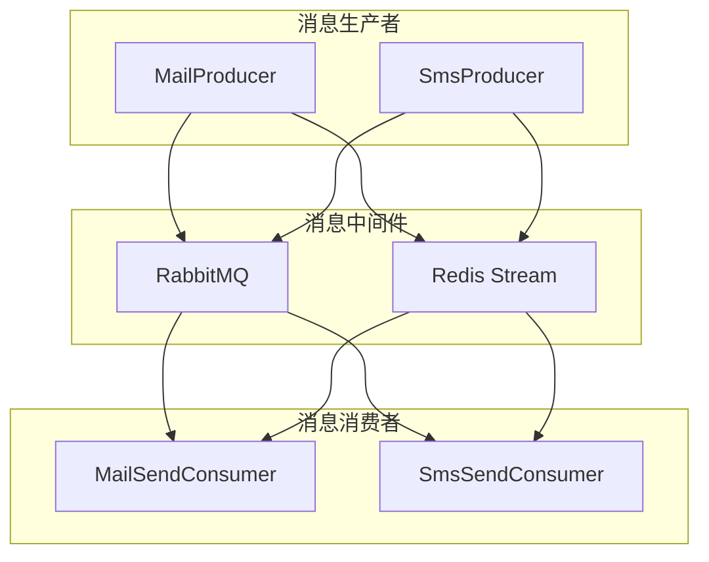
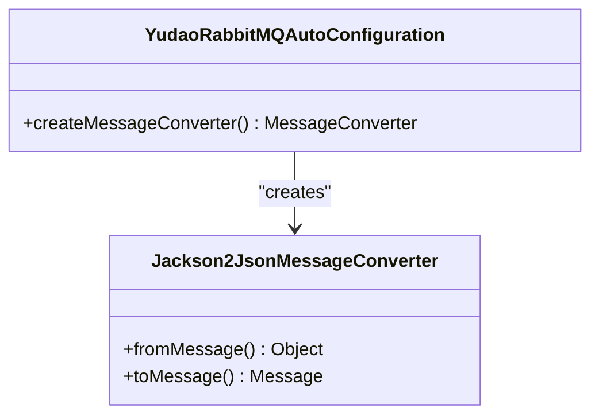
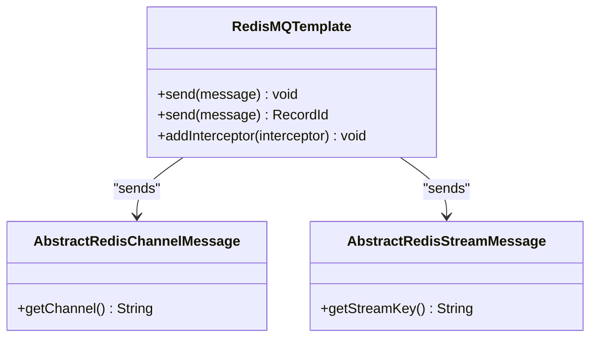
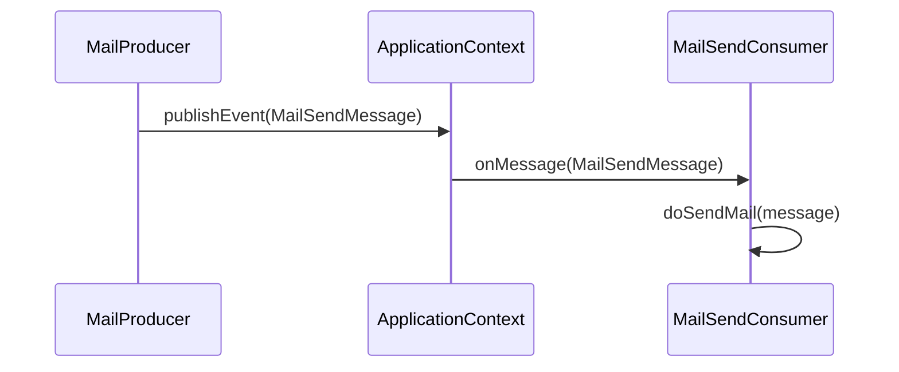
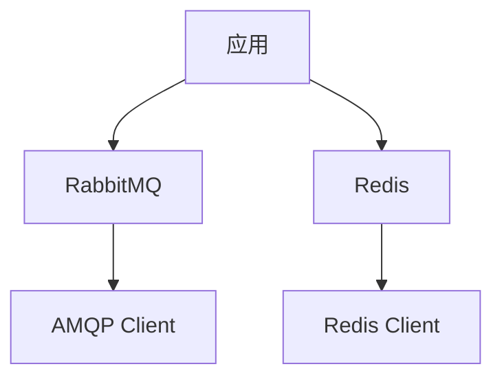

# 消息队列集成

<cite>
**本文档引用文件**  
- [YudaoRabbitMQAutoConfiguration.java](file://yudao-framework/yudao-spring-boot-starter-mq/src/main/java/cn/iocoder/yudao/framework/mq/rabbitmq/config/YudaoRabbitMQAutoConfiguration.java)
- [RedisMQTemplate.java](file://yudao-framework/yudao-spring-boot-starter-mq/src/main/java/cn/iocoder/yudao/framework/mq/redis/core/RedisMQTemplate.java)
- [MailProducer.java](file://yudao-module-system/src/main/java/cn/iocoder/yudao/module/system/mq/producer/mail/MailProducer.java)
- [MailSendConsumer.java](file://yudao-module-system/src/main/java/cn/iocoder/yudao/module/system/mq/consumer/mail/MailSendConsumer.java)
- [MailSendMessage.java](file://yudao-module-system/src/main/java/cn/iocoder/yudao/module/system/mq/message/mail/MailSendMessage.java)
</cite>

## 目录
1. [引言](#引言)
2. [项目结构](#项目结构)
3. [核心组件](#核心组件)
4. [架构概述](#架构概述)
5. [详细组件分析](#详细组件分析)
6. [依赖分析](#依赖分析)
7. [性能考虑](#性能考虑)
8. [故障排除指南](#故障排除指南)
9. [结论](#结论)

## 引言
本文档旨在深入分析Yudao项目中RabbitMQ与Redis Stream两种消息中间件的集成方式，涵盖配置、生产者与消费者实现、消息可靠性保障机制、异常处理及选型建议等内容，为开发者提供全面的技术参考。

## 项目结构
Yudao项目采用模块化设计，消息队列相关功能主要集中在`yudao-framework`和`yudao-module-system`两个模块中。`yudao-spring-boot-starter-mq`提供了RabbitMQ和Redis消息队列的自动配置支持，而`yudao-module-system`则实现了具体的邮件和短信消息的生产与消费逻辑。

**Section sources**
- [YudaoRabbitMQAutoConfiguration.java](file://yudao-framework/yudao-spring-boot-starter-mq/src/main/java/cn/iocoder/yudao/framework/mq/rabbitmq/config/YudaoRabbitMQAutoConfiguration.java)
- [RedisMQTemplate.java](file://yudao-framework/yudao-spring-boot-starter-mq/src/main/java/cn/iocoder/yudao/framework/mq/redis/core/RedisMQTemplate.java)

## 核心组件
核心组件包括RabbitMQ自动配置类、Redis消息模板类、邮件生产者与消费者等，分别负责消息队列的初始化、消息的发送与接收、以及业务逻辑的处理。

**Section sources**
- [MailProducer.java](file://yudao-module-system/src/main/java/cn/iocoder/yudao/module/system/mq/producer/mail/MailProducer.java)
- [MailSendConsumer.java](file://yudao-module-system/src/main/java/cn/iocoder/yudao/module/system/mq/consumer/mail/MailSendConsumer.java)

## 架构概述
系统通过Spring Event机制实现异步消息处理，结合RabbitMQ和Redis Stream两种消息中间件，提供高可用、高性能的消息队列服务。RabbitMQ用于复杂的消息路由和持久化需求，而Redis Stream则适用于轻量级、高吞吐量的场景。

**Diagram sources**
- [YudaoRabbitMQAutoConfiguration.java](file://yudao-framework/yudao-spring-boot-starter-mq/src/main/java/cn/iocoder/yudao/framework/mq/rabbitmq/config/YudaoRabbitMQAutoConfiguration.java)
- [RedisMQTemplate.java](file://yudao-framework/yudao-spring-boot-starter-mq/src/main/java/cn/iocoder/yudao/framework/mq/redis/core/RedisMQTemplate.java)

## 详细组件分析

### RabbitMQ 配置分析
`YudaoRabbitMQAutoConfiguration`类通过`@AutoConfiguration`注解实现RabbitMQ的自动配置，注册了`Jackson2JsonMessageConverter`作为消息转换器，确保消息以JSON格式进行序列化和反序列化，提升跨语言兼容性。

**Diagram sources**
- [YudaoRabbitMQAutoConfiguration.java](file://yudao-framework/yudao-spring-boot-starter-mq/src/main/java/cn/iocoder/yudao/framework/mq/rabbitmq/config/YudaoRabbitMQAutoConfiguration.java)

**Section sources**
- [YudaoRabbitMQAutoConfiguration.java](file://yudao-framework/yudao-spring-boot-starter-mq/src/main/java/cn/iocoder/yudao/framework/mq/rabbitmq/config/YudaoRabbitMQAutoConfiguration.java)

### Redis 消息模板分析
`RedisMQTemplate`类封装了基于Redis Pub/Sub和Stream两种模式的消息发送功能，支持消息拦截器，可在消息发送前后执行自定义逻辑，如日志记录、监控等。

**Diagram sources**
- [RedisMQTemplate.java](file://yudao-framework/yudao-spring-boot-starter-mq/src/main/java/cn/iocoder/yudao/framework/mq/redis/core/RedisMQTemplate.java)

**Section sources**
- [RedisMQTemplate.java](file://yudao-framework/yudao-spring-boot-starter-mq/src/main/java/cn/iocoder/yudao/framework/mq/redis/core/RedisMQTemplate.java)

### 邮件生产者分析
`MailProducer`类通过Spring的`ApplicationContext`发布`MailSendMessage`事件，实现邮件消息的异步发送。该设计解耦了消息发送与业务逻辑，提升了系统的响应速度和可维护性。

**Diagram sources**
- [MailProducer.java](file://yudao-module-system/src/main/java/cn/iocoder/yudao/module/system/mq/producer/mail/MailProducer.java)
- [MailSendConsumer.java](file://yudao-module-system/src/main/java/cn/iocoder/yudao/module/system/mq/consumer/mail/MailSendConsumer.java)

**Section sources**
- [MailProducer.java](file://yudao-module-system/src/main/java/cn/iocoder/yudao/module/system/mq/producer/mail/MailProducer.java)
- [MailSendConsumer.java](file://yudao-module-system/src/main/java/cn/iocoder/yudao/module/system/mq/consumer/mail/MailSendConsumer.java)

## 依赖分析
系统依赖于Spring框架的事件机制和消息中间件客户端库，通过自动配置简化了集成过程。RabbitMQ依赖于AMQP协议，而Redis Stream则依赖于Redis服务器，两者均需在运行环境中正确配置。

**Diagram sources**
- [YudaoRabbitMQAutoConfiguration.java](file://yudao-framework/yudao-spring-boot-starter-mq/src/main/java/cn/iocoder/yudao/framework/mq/rabbitmq/config/YudaoRabbitMQAutoConfiguration.java)
- [RedisMQTemplate.java](file://yudao-framework/yudao-spring-boot-starter-mq/src/main/java/cn/iocoder/yudao/framework/mq/redis/core/RedisMQTemplate.java)

**Section sources**
- [YudaoRabbitMQAutoConfiguration.java](file://yudao-framework/yudao-spring-boot-starter-mq/src/main/java/cn/iocoder/yudao/framework/mq/rabbitmq/config/YudaoRabbitMQAutoConfiguration.java)
- [RedisMQTemplate.java](file://yudao-framework/yudao-spring-boot-starter-mq/src/main/java/cn/iocoder/yudao/framework/mq/redis/core/RedisMQTemplate.java)

## 性能考虑
选择合适的消息中间件对系统性能至关重要。RabbitMQ适合需要复杂路由和高可靠性的场景，而Redis Stream则更适合高吞吐量、低延迟的应用。合理配置消息持久化、确认机制和重试策略，可以有效提升消息传递的可靠性。

## 故障排除指南
当遇到消息丢失或延迟问题时，应首先检查消息中间件的配置是否正确，确认网络连接稳定。对于RabbitMQ，可查看队列状态和消费者数量；对于Redis Stream，需关注消费者组的状态和消息积压情况。

**Section sources**
- [MailSendConsumer.java](file://yudao-module-system/src/main/java/cn/iocoder/yudao/module/system/mq/consumer/mail/MailSendConsumer.java)

## 结论
Yudao项目通过集成RabbitMQ和Redis Stream，提供了灵活、高效的消息队列解决方案。开发者可根据具体需求选择合适的消息中间件，并利用Spring Event机制实现业务逻辑的异步处理，从而构建出高性能、高可用的应用系统。