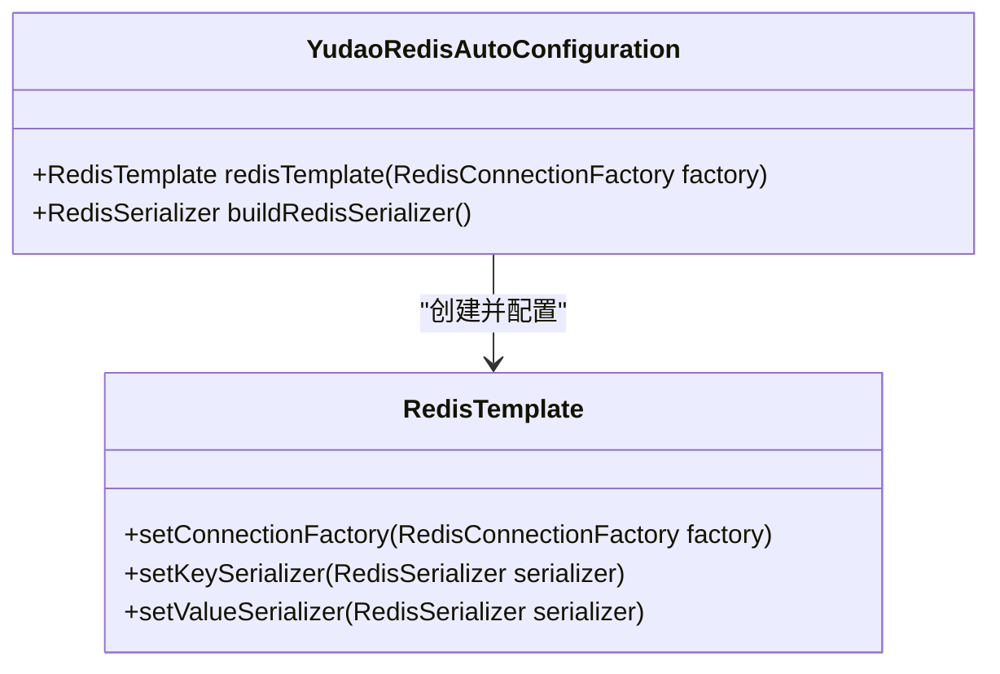
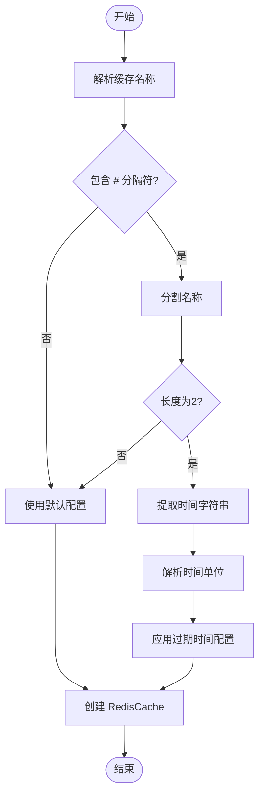
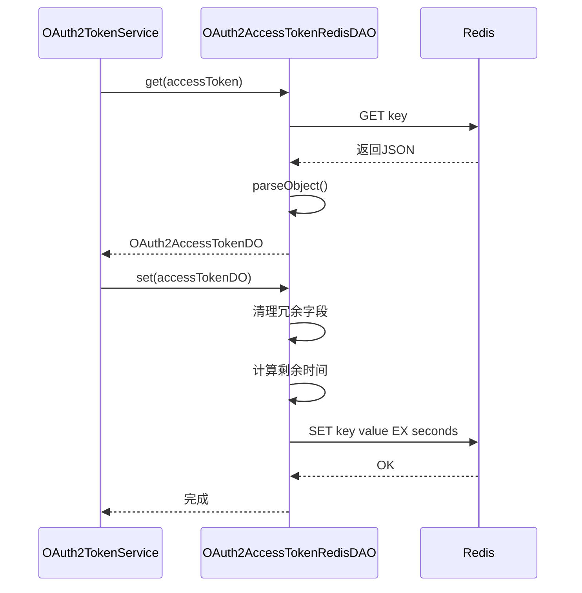
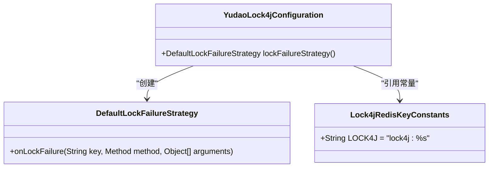

# 缓存集成

<cite>
**本文档引用的文件**  
- [YudaoRedisAutoConfiguration.java](file://yudao-framework/yudao-spring-boot-starter-redis/src/main/java/cn/iocoder/yudao/framework/redis/config/YudaoRedisAutoConfiguration.java)
- [YudaoCacheAutoConfiguration.java](file://yudao-framework/yudao-spring-boot-starter-redis/src/main/java/cn/iocoder/yudao/framework/redis/config/YudaoCacheAutoConfiguration.java)
- [TimeoutRedisCacheManager.java](file://yudao-framework/yudao-spring-boot-starter-redis/src/main/java/cn/iocoder/yudao/framework/redis/core/TimeoutRedisCacheManager.java)
- [OAuth2AccessTokenRedisDAO.java](file://yudao-module-system/src/main/java/cn/iocoder/yudao/module/system/dal/redis/oauth2/OAuth2AccessTokenRedisDAO.java)
- [OAuth2TokenServiceImpl.java](file://yudao-module-system/src/main/java/cn/iocoder/yudao/module/system/service/oauth2/OAuth2TokenServiceImpl.java)
- [YudaoCacheProperties.java](file://yudao-framework/yudao-spring-boot-starter-redis/src/main/java/cn/iocoder/yudao/framework/redis/config/YudaoCacheProperties.java)
- [Lock4jRedisKeyConstants.java](file://yudao-framework/yudao-spring-boot-starter-protection/src/main/java/cn/iocoder/yudao/framework/lock4j/core/Lock4jRedisKeyConstants.java)
</cite>

## 目录
1. [简介](#简介)
2. [Redis 配置机制](#redis-配置机制)
3. [带过期时间的缓存管理](#带过期时间的缓存管理)
4. [OAuth2 令牌缓存实现](#oauth2-令牌缓存实现)
5. [缓存防护策略](#缓存防护策略)
6. [缓存使用最佳实践](#缓存使用最佳实践)
7. [分布式锁实现](#分布式锁实现)
8. [监控与性能优化](#监控与性能优化)

## 简介
本项目通过 Redis 实现高性能缓存机制，支持多种业务场景下的数据缓存与会话管理。系统采用 Spring Data Redis 作为底层框架，结合自定义配置实现灵活的缓存策略。核心功能包括：Redis 连接工厂配置、JSON 序列化支持、带过期时间的缓存管理、OAuth2 令牌存储以及分布式锁机制。通过合理的缓存设计，有效提升系统响应速度，降低数据库压力。

## Redis 配置机制

### 连接工厂与序列化配置
`YudaoRedisAutoConfiguration` 类负责配置 Redis 连接工厂和序列化方式。该类通过 `@AutoConfiguration` 注解在 Spring Boot 启动时自动加载，优先于 Redisson 配置生效，确保使用自定义的 `RedisTemplate` Bean。

在 `redisTemplate` 方法中，创建了 `RedisTemplate<String, Object>` 实例，并设置连接工厂。KEY 的序列化采用 `RedisSerializer.string()`，保证键的可读性；VALUE 的序列化则使用 JSON 格式（基于 Jackson），通过 `buildRedisSerializer` 方法构建。特别地，该方法还注册了 `JavaTimeModule` 模块，解决了 `LocalDateTime` 类型的序列化问题。

**图示来源**  
- [YudaoRedisAutoConfiguration.java](file://yudao-framework/yudao-spring-boot-starter-redis/src/main/java/cn/iocoder/yudao/framework/redis/config/YudaoRedisAutoConfiguration.java#L15-L44)

**本节来源**  
- [YudaoRedisAutoConfiguration.java](file://yudao-framework/yudao-spring-boot-starter-redis/src/main/java/cn/iocoder/yudao/framework/redis/config/YudaoRedisAutoConfiguration.java#L15-L44)

## 带过期时间的缓存管理

### TimeoutRedisCacheManager 实现原理
`TimeoutRedisCacheManager` 继承自 `RedisCacheManager`，实现了基于命名约定的动态过期时间控制。其核心机制在于重写 `createRedisCache` 方法，解析缓存名称中的过期时间信息。

当缓存名称格式为 "key#ttl" 时，系统会解析 `#` 后的 `ttl` 部分作为过期时间。时间单位由最后一个字母决定：d（天）、h（小时）、m（分钟）、s（秒），默认单位为秒。例如，`userCache#1h` 表示该缓存的过期时间为1小时。

**图示来源**  
- [TimeoutRedisCacheManager.java](file://yudao-framework/yudao-spring-boot-starter-redis/src/main/java/cn/iocoder/yudao/framework/redis/core/TimeoutRedisCacheManager.java#L20-L85)

**本节来源**  
- [TimeoutRedisCacheManager.java](file://yudao-framework/yudao-spring-boot-starter-redis/src/main/java/cn/iocoder/yudao/framework/redis/core/TimeoutRedisCacheManager.java#L20-L85)

## OAuth2 令牌缓存实现

### OAuth2AccessTokenRedisDAO 设计
`OAuth2AccessTokenRedisDAO` 是专门用于管理 OAuth2 访问令牌的 Redis 数据访问对象。它通过 `StringRedisTemplate` 操作 Redis，实现了令牌的增删查功能。

在存储令牌时，系统会清理 `updater`、`updateTime`、`createTime`、`creator` 和 `deleted` 等冗余字段，避免不必要的数据缓存。过期时间根据令牌的 `expiresTime` 字段动态计算，确保缓存与业务逻辑一致。

**图示来源**  
- [OAuth2AccessTokenRedisDAO.java](file://yudao-module-system/src/main/java/cn/iocoder/yudao/module/system/dal/redis/oauth2/OAuth2AccessTokenRedisDAO.java#L23-L58)
- [OAuth2TokenServiceImpl.java](file://yudao-module-system/src/main/java/cn/iocoder/yudao/module/system/service/oauth2/OAuth2TokenServiceImpl.java#L42-L221)

**本节来源**  
- [OAuth2AccessTokenRedisDAO.java](file://yudao-module-system/src/main/java/cn/iocoder/yudao/module/system/dal/redis/oauth2/OAuth2AccessTokenRedisDAO.java#L23-L58)
- [OAuth2TokenServiceImpl.java](file://yudao-module-system/src/main/java/cn/iocoder/yudao/module/system/service/oauth2/OAuth2TokenServiceImpl.java#L42-L221)

## 缓存防护策略

### 缓存穿透、雪崩、击穿防护
系统通过多层次策略应对常见的缓存问题：

1. **缓存穿透**：对于查询不存在的数据，可采用布隆过滤器或缓存空值的方式。在 `OAuth2AccessTokenRedisDAO` 中，当从 Redis 获取不到令牌时，会回查数据库，若仍不存在则返回 null，避免频繁查询数据库。

2. **缓存雪崩**：通过 `TimeoutRedisCacheManager` 的差异化过期时间设置，避免大量缓存同时失效。建议对不同类型的缓存设置不同的过期时间。

3. **缓存击穿**：对于热点数据，可采用互斥锁或逻辑过期策略。系统中的 `@Lock4j` 注解可用于实现分布式锁，防止并发请求击穿缓存。

## 缓存使用最佳实践

### 缓存键设计与更新策略
1. **键设计规范**：采用统一的命名空间前缀，如 `oauth2:access_token:`，提高可读性和管理性。避免使用特殊字符，推荐使用冒号 `:` 作为分隔符。

2. **过期时间设置**：根据业务需求合理设置过期时间。对于频繁更新的数据，可设置较短的过期时间；对于相对静态的数据，可适当延长。

3. **缓存更新策略**：
   - 写操作时同步更新缓存
   - 使用 `@Cacheable` 注解实现方法级缓存
   - 对于复杂更新逻辑，采用先删除缓存再更新数据库的策略

## 分布式锁实现

### Lock4j 分布式锁机制
系统集成 `lock4j` 框架实现分布式锁功能。`YudaoLock4jConfiguration` 配置类定义了默认的锁失败策略 `DefaultLockFailureStrategy`，当获取锁失败时抛出 `ServiceException` 异常。

锁的 Key 格式为 `lock4j:%s`，使用 Redis 的 Hash 数据结构存储。通过 `@Lock4j` 注解可方便地在方法级别添加分布式锁，有效防止并发操作带来的数据一致性问题。

**图示来源**  
- [Lock4jRedisKeyConstants.java](file://yudao-framework/yudao-spring-boot-starter-protection/src/main/java/cn/iocoder/yudao/framework/lock4j/core/Lock4jRedisKeyConstants.java#L0-L18)
- [DefaultLockFailureStrategy.java](file://yudao-framework/yudao-spring-boot-starter-protection/src/main/java/cn/iocoder/yudao/framework/lock4j/core/DefaultLockFailureStrategy.java#L0-L20)

**本节来源**  
- [Lock4jRedisKeyConstants.java](file://yudao-framework/yudao-spring-boot-starter-protection/src/main/java/cn/iocoder/yudao/framework/lock4j/core/Lock4jRedisKeyConstants.java#L0-L18)
- [DefaultLockFailureStrategy.java](file://yudao-framework/yudao-spring-boot-starter-protection/src/main/java/cn/iocoder/yudao/framework/lock4j/core/DefaultLockFailureStrategy.java#L0-L20)

## 监控与性能优化

### 缓存监控指标
1. **命中率**：监控 `RedisCacheManager` 的缓存命中情况，及时发现低效缓存
2. **内存使用**：跟踪 Redis 内存占用，避免内存溢出
3. **响应时间**：记录缓存操作的耗时，识别性能瓶颈

### 性能优化建议
1. 合理设置 `redisScanBatchSize` 参数（默认30），优化批量操作性能
2. 使用 `StringRedisTemplate` 处理字符串类型数据，提高序列化效率
3. 避免缓存大对象，必要时进行数据压缩
4. 定期清理过期缓存，保持 Redis 健康状态