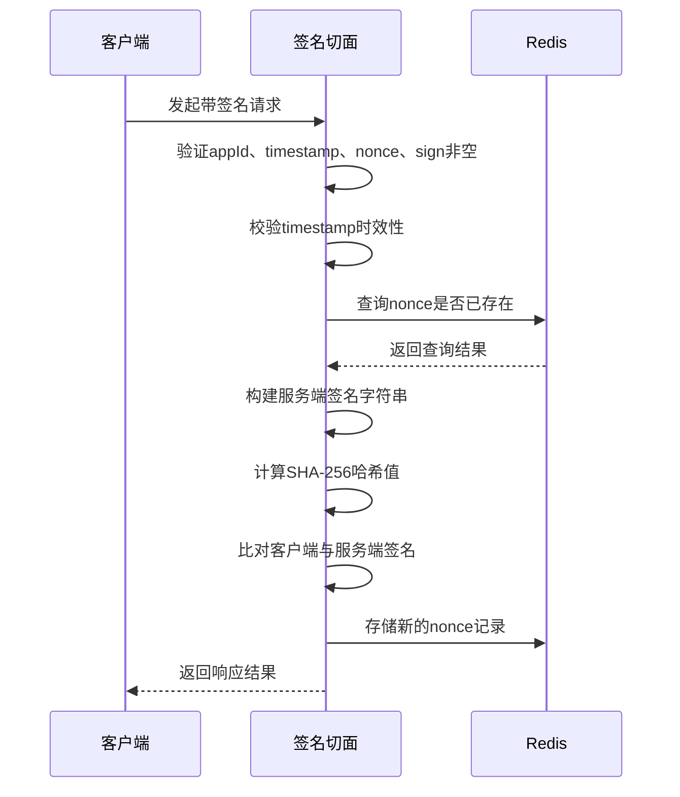
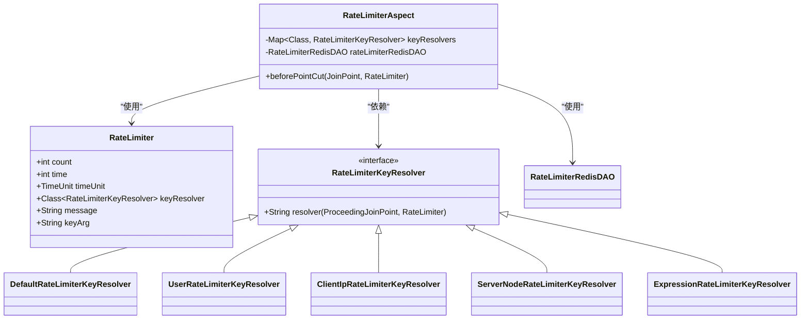
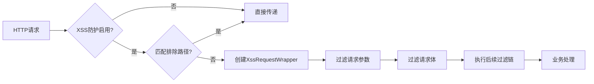

# API安全防护

<cite>
**本文档引用文件**  
- [ApiSignature.java](file://yudao-framework/yudao-spring-boot-starter-protection/src/main/java/cn/iocoder/yudao/framework/signature/core/annotation/ApiSignature.java)
- [ApiSignatureAspect.java](file://yudao-framework/yudao-spring-boot-starter-protection/src/main/java/cn/iocoder/yudao/framework/signature/core/aop/ApiSignatureAspect.java)
- [YudaoApiSignatureAutoConfiguration.java](file://yudao-framework/yudao-spring-boot-starter-protection/src/main/java/cn/iocoder/yudao/framework/signature/config/YudaoApiSignatureAutoConfiguration.java)
- [Idempotent.java](file://yudao-framework/yudao-spring-boot-starter-protection/src/main/java/cn/iocoder/yudao/framework/idempotent/core/annotation/Idempotent.java)
- [IdempotentAspect.java](file://yudao-framework/yudao-spring-boot-starter-protection/src/main/java/cn/iocoder/yudao/framework/idempotent/core/aop/IdempotentAspect.java)
- [RateLimiter.java](file://yudao-framework/yudao-spring-boot-starter-protection/src/main/java/cn/iocoder/yudao/framework/ratelimiter/core/annotation/RateLimiter.java)
- [RateLimiterAspect.java](file://yudao-framework/yudao-spring-boot-starter-protection/src/main/java/cn/iocoder/yudao/framework/ratelimiter/core/aop/RateLimiterAspect.java)
- [XssProperties.java](file://yudao-framework/yudao-spring-boot-starter-web/src/main/java/cn/iocoder/yudao/framework/xss/config/XssProperties.java)
- [JsoupXssCleaner.java](file://yudao-framework/yudao-spring-boot-starter-web/src/main/java/cn/iocoder/yudao/framework/xss/core/clean/JsoupXssCleaner.java)
- [XssFilter.java](file://yudao-framework/yudao-spring-boot-starter-web/src/main/java/cn/iocoder/yudao/framework/xss/core/filter/XssFilter.java)
</cite>

## 目录
1. [引言](#引言)
2. [API签名认证机制](#api签名认证机制)
3. [接口幂等性控制](#接口幂等性控制)
4. [限流保护机制](#限流保护机制)
5. [XSS跨站脚本防护](#xss跨站脚本防护)
6. [其他安全防护措施](#其他安全防护措施)
7. [安全配置最佳实践](#安全配置最佳实践)
8. [总结](#总结)

## 引言
本文档全面介绍API层面的安全防护体系，涵盖签名认证、幂等控制、限流策略、XSS防护等核心安全机制。通过分析框架中的关键注解与实现类，详细说明各项安全功能的技术实现原理与配置方式，为开发者提供完整的API安全防护指南。

## API签名认证机制

### 签名算法实现
API签名认证通过`@ApiSignature`注解实现，采用SHA-256哈希算法生成签名。服务端根据请求参数、请求体、请求头及应用密钥（appSecret）拼接字符串后进行哈希计算，与客户端提交的签名比对验证。

### 时间戳验证
通过`timestamp`请求头字段进行时间戳验证，系统允许的最大时间偏差由`timeout`参数控制（默认60秒）。服务端计算当前时间与请求时间的绝对差值，超出阈值则拒绝请求，防止重放攻击。

### 防重放攻击策略
采用`nonce`随机数机制防止请求重放。系统将`appId`与`nonce`组合成唯一键，通过Redis存储并设置过期时间（为`timeout`的两倍）。每次请求前检查该键是否存在，若存在则判定为重复请求并拒绝。



**图示来源**
- [ApiSignatureAspect.java](file://yudao-framework/yudao-spring-boot-starter-protection/src/main/java/cn/iocoder/yudao/framework/signature/core/aop/ApiSignatureAspect.java)
- [ApiSignature.java](file://yudao-framework/yudao-spring-boot-starter-protection/src/main/java/cn/iocoder/yudao/framework/signature/core/annotation/ApiSignature.java)

**本节来源**
- [ApiSignatureAspect.java](file://yudao-framework/yudao-spring-boot-starter-protection/src/main/java/cn/iocoder/yudao/framework/signature/core/aop/ApiSignatureAspect.java)
- [ApiSignature.java](file://yudao-framework/yudao-spring-boot-starter-protection/src/main/java/cn/iocoder/yudao/framework/signature/core/annotation/ApiSignature.java)

## 接口幂等性控制

### @Idempotent注解使用
通过`@Idempotent`注解实现接口幂等控制，支持在方法级别声明。关键参数包括：
- `timeout`：幂等锁超时时间（默认1秒）
- `message`：重复请求提示信息
- `keyResolver`：键解析器类型
- `keyArg`：自定义键参数

### Redis去重机制
基于Redis的`SETNX`命令实现分布式锁机制。系统根据`keyResolver`生成唯一键，在方法执行前尝试设置该键，设置成功则继续执行，失败则抛出重复请求异常。异常发生时可根据`deleteKeyWhenException`配置决定是否删除键。

```mermaid
flowchart TD
A[方法调用] --> B{存在@Idempotent注解?}
B --> |是| C[通过KeyResolver生成唯一键]
C --> D[尝试Redis SETNX设置键]
D --> E{设置成功?}
E --> |否| F[抛出重复请求异常]
E --> |是| G[执行业务逻辑]
G --> H{发生异常?}
H --> |是| I[根据配置决定是否删除键]
H --> |否| J[正常返回]
I --> K[重新抛出异常]
```

**图示来源**
- [IdempotentAspect.java](file://yudao-framework/yudao-spring-boot-starter-protection/src/main/java/cn/iocoder/yudao/framework/idempotent/core/aop/IdempotentAspect.java)
- [Idempotent.java](file://yudao-framework/yudao-spring-boot-starter-protection/src/main/java/cn/iocoder/yudao/framework/idempotent/core/annotation/Idempotent.java)

**本节来源**
- [IdempotentAspect.java](file://yudao-framework/yudao-spring-boot-starter-protection/src/main/java/cn/iocoder/yudao/framework/idempotent/core/aop/IdempotentAspect.java)
- [Idempotent.java](file://yudao-framework/yudao-spring-boot-starter-protection/src/main/java/cn/iocoder/yudao/framework/idempotent/core/annotation/Idempotent.java)

## 限流保护机制

### 多维度限流策略
支持基于多种维度的限流控制：
- **全局级别**：所有请求共享配额
- **用户级别**：按用户ID区分限流
- **IP级别**：按客户端IP地址区分
- **服务器节点级别**：按部署节点区分
- **自定义表达式**：通过SpEL表达式灵活定义

### RateLimiter注解配置
`@RateLimiter`注解提供灵活的限流配置：
- `count`：单位时间内的最大请求数
- `time`：时间窗口长度
- `timeUnit`：时间单位（默认秒）
- `keyResolver`：选择限流维度
- `message`：限流触发提示信息



**图示来源**
- [RateLimiterAspect.java](file://yudao-framework/yudao-spring-boot-starter-protection/src/main/java/cn/iocoder/yudao/framework/ratelimiter/core/aop/RateLimiterAspect.java)
- [RateLimiter.java](file://yudao-framework/yudao-spring-boot-starter-protection/src/main/java/cn/iocoder/yudao/framework/ratelimiter/core/annotation/RateLimiter.java)

**本节来源**
- [RateLimiterAspect.java](file://yudao-framework/yudao-spring-boot-starter-protection/src/main/java/cn/iocoder/yudao/framework/ratelimiter/core/aop/RateLimiterAspect.java)
- [RateLimiter.java](file://yudao-framework/yudao-spring-boot-starter-protection/src/main/java/cn/iocoder/yudao/framework/ratelimiter/core/annotation/RateLimiter.java)

## XSS跨站脚本防护

### JsoupXssCleaner过滤规则
基于Jsoup库实现HTML内容净化，采用白名单机制：
- 基础规则继承自`Safelist.relaxed()`
- 扩展支持`style`和`class`属性
- `a`标签额外支持`target`属性
- `img`标签支持`data:`协议（用于base64图片）
- 移除危险协议如`javascript:`

### XssFilter实现机制
通过Servlet过滤器链实现XSS防护：
1. 配置`XssFilter`拦截所有请求
2. 根据`yudao.xss.excludeUrls`排除特定URL
3. 使用`XssRequestWrapper`包装请求
4. 对请求参数、请求体进行内容过滤
5. 将净化后的请求传递给后续处理



**图示来源**
- [XssFilter.java](file://yudao-framework/yudao-spring-boot-starter-web/src/main/java/cn/iocoder/yudao/framework/xss/core/filter/XssFilter.java)
- [JsoupXssCleaner.java](file://yudao-framework/yudao-spring-boot-starter-web/src/main/java/cn/iocoder/yudao/framework/xss/core/clean/JsoupXssCleaner.java)

**本节来源**
- [XssFilter.java](file://yudao-framework/yudao-spring-boot-starter-web/src/main/java/cn/iocoder/yudao/framework/xss/core/filter/XssFilter.java)
- [JsoupXssCleaner.java](file://yudao-framework/yudao-spring-boot-starter-web/src/main/java/cn/iocoder/yudao/framework/xss/core/clean/JsoupXssCleaner.java)
- [XssProperties.java](file://yudao-framework/yudao-spring-boot-starter-web/src/main/java/cn/iocoder/yudao/framework/xss/config/XssProperties.java)

## 其他安全防护措施

### CSRF防护
系统通过基于Token的机制防御CSRF攻击，要求敏感操作携带有效的安全令牌。结合Spring Security框架实现会话绑定验证，确保请求来源合法性。

### SQL注入防御
通过MyBatis框架的预编译机制自动防御SQL注入。所有数据库操作均使用参数化查询，禁止字符串拼接SQL。同时提供自定义验证注解，对输入参数进行格式校验。

### 安全传输
强制使用HTTPS协议传输敏感数据，所有API接口在生产环境均配置SSL加密。敏感信息如密码、密钥等采用加密存储，避免明文暴露。

**本节来源**
- [YudaoSecurityAutoConfiguration.java](file://yudao-framework/yudao-spring-boot-starter-security/src/main/java/cn/iocoder/yudao/framework/security/config/YudaoSecurityAutoConfiguration.java)
- [YudaoWebSecurityConfigurerAdapter.java](file://yudao-framework/yudao-spring-boot-starter-security/src/main/java/cn/iocoder/yudao/framework/security/config/YudaoWebSecurityConfigurerAdapter.java)

## 安全配置最佳实践

### 配置项管理
所有安全相关配置通过`application.yaml`集中管理：
```yaml
yudao:
  xss:
    enable: true
    excludeUrls:
      - /api/upload
  signature:
    timeout: 60
  ratelimiter:
    default-count: 100
    default-time: 1
```

### Redis依赖配置
安全组件依赖Redis实现分布式状态管理，需确保：
- Redis集群高可用
- 合理设置连接池参数
- 配置适当的超时时间
- 启用持久化保障数据安全

### 监控与告警
集成链路追踪系统监控安全事件：
- 记录所有签名验证失败日志
- 统计限流触发频率
- 监控幂等键冲突情况
- 设置异常请求告警阈值

**本节来源**
- [YudaoApiSignatureAutoConfiguration.java](file://yudao-framework/yudao-spring-boot-starter-protection/src/main/java/cn/iocoder/yudao/framework/signature/config/YudaoApiSignatureAutoConfiguration.java)
- [YudaoRedisAutoConfiguration.java](file://yudao-framework/yudao-spring-boot-starter-redis/src/main/java/cn/iocoder/yudao/framework/redis/config/YudaoRedisAutoConfiguration.java)

## 总结
本文档系统阐述了API安全防护体系的各个组成部分。通过签名认证确保请求合法性，利用幂等控制防止重复提交，实施多维度限流保护系统稳定，结合XSS过滤抵御前端攻击。各项安全机制均通过AOP切面实现，对业务代码无侵入，配置灵活可扩展。建议在实际项目中根据安全等级要求合理配置各项参数，并配合监控系统及时发现和响应安全事件。