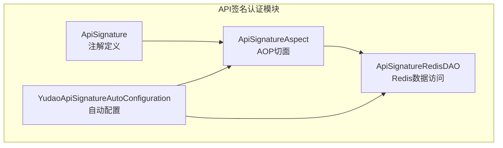
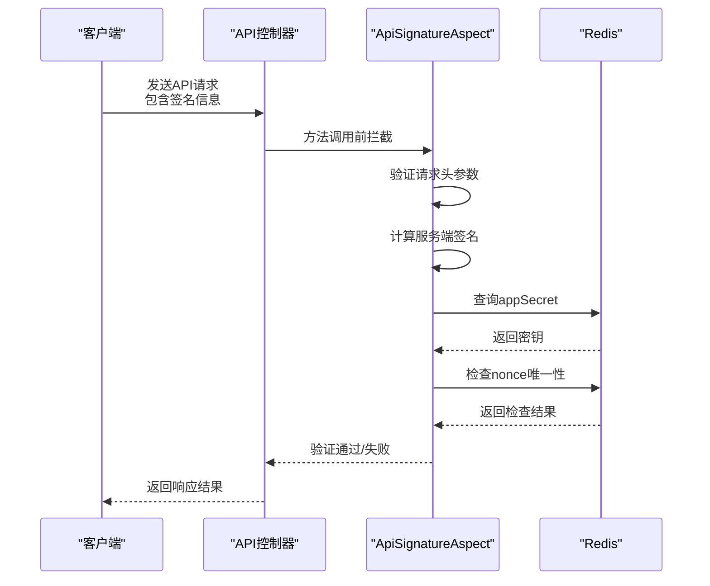
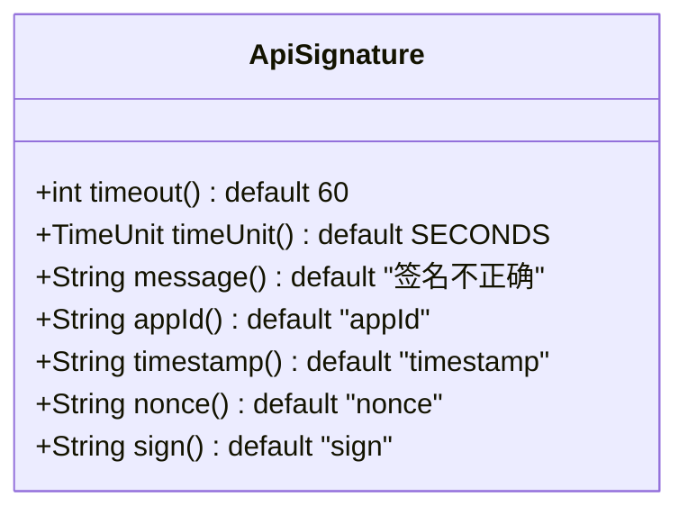
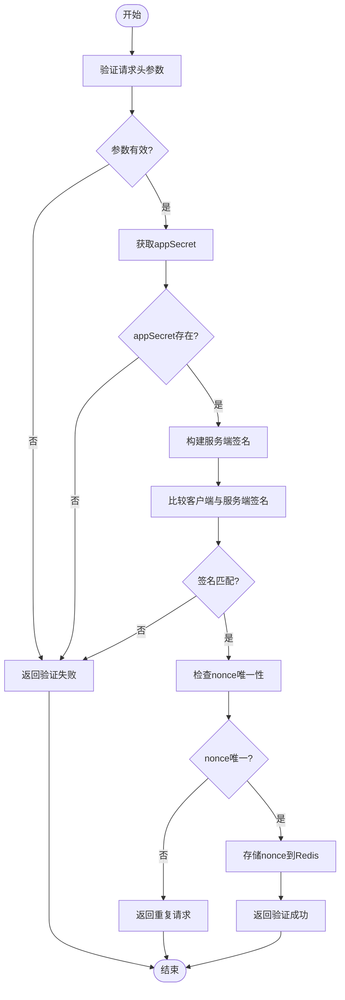
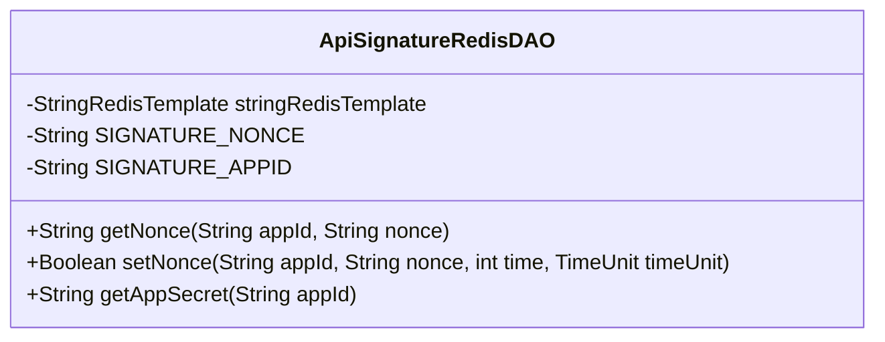
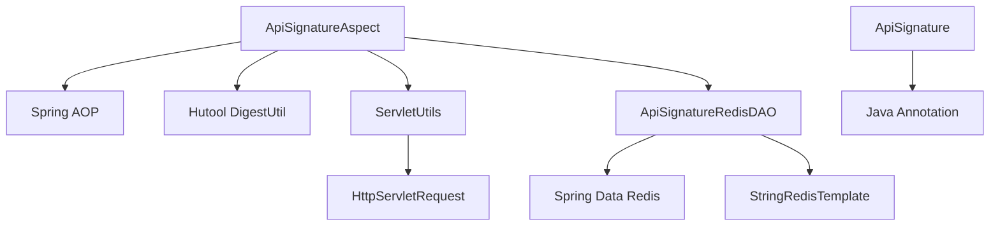

# API签名认证

<cite>
**Referenced Files in This Document**   
- [ApiSignature.java](file://yudao-framework/yudao-spring-boot-starter-protection/src/main/java/cn/iocoder/yudao/framework/signature/core/annotation/ApiSignature.java)
- [ApiSignatureAspect.java](file://yudao-framework/yudao-spring-boot-starter-protection/src/main/java/cn/iocoder/yudao/framework/signature/core/aop/ApiSignatureAspect.java)
- [ApiSignatureRedisDAO.java](file://yudao-framework/yudao-spring-boot-starter-protection/src/main/java/cn/iocoder/yudao/framework/signature/core/redis/ApiSignatureRedisDAO.java)
- [YudaoApiSignatureAutoConfiguration.java](file://yudao-framework/yudao-spring-boot-starter-protection/src/main/java/cn/iocoder/yudao/framework/signature/config/YudaoApiSignatureAutoConfiguration.java)
</cite>

## 目录
1. [简介](#简介)
2. [项目结构](#项目结构)
3. [核心组件](#核心组件)
4. [架构概述](#架构概述)
5. [详细组件分析](#详细组件分析)
6. [依赖分析](#依赖分析)
7. [性能考虑](#性能考虑)
8. [故障排除指南](#故障排除指南)
9. [结论](#结论)

## 简介
本文档详细说明了API签名认证机制的实现，重点介绍@ApiSignature注解的使用方法、AOP切面实现原理、HMAC-SHA256签名算法应用、时间戳验证机制以及防重放攻击策略。文档还涵盖了客户端签名生成的最佳实践、密钥管理方案以及在高并发场景下的性能优化建议。

## 项目结构
API签名认证功能位于yudao-framework模块下的yudao-spring-boot-starter-protection组件中，采用分层架构设计，包含注解定义、AOP切面、Redis数据访问等核心组件。

**Diagram sources**
- [ApiSignature.java](file://yudao-framework/yudao-spring-boot-starter-protection/src/main/java/cn/iocoder/yudao/framework/signature/core/annotation/ApiSignature.java)
- [ApiSignatureAspect.java](file://yudao-framework/yudao-spring-boot-starter-protection/src/main/java/cn/iocoder/yudao/framework/signature/core/aop/ApiSignatureAspect.java)
- [ApiSignatureRedisDAO.java](file://yudao-framework/yudao-spring-boot-starter-protection/src/main/java/cn/iocoder/yudao/framework/signature/core/redis/ApiSignatureRedisDAO.java)
- [YudaoApiSignatureAutoConfiguration.java](file://yudao-framework/yudao-spring-boot-starter-protection/src/main/java/cn/iocoder/yudao/framework/signature/config/YudaoApiSignatureAutoConfiguration.java)

**Section sources**
- [ApiSignature.java](file://yudao-framework/yudao-spring-boot-starter-protection/src/main/java/cn/iocoder/yudao/framework/signature/core/annotation/ApiSignature.java)
- [ApiSignatureAspect.java](file://yudao-framework/yudao-spring-boot-starter-protection/src/main/java/cn/iocoder/yudao/framework/signature/core/aop/ApiSignatureAspect.java)

## 核心组件
API签名认证系统由四个核心组件构成：ApiSignature注解用于声明需要签名验证的接口；ApiSignatureAspect切面实现具体的验证逻辑；ApiSignatureRedisDAO负责与Redis交互存储和查询签名数据；YudaoApiSignatureAutoConfiguration提供自动配置支持。

**Section sources**
- [ApiSignature.java](file://yudao-framework/yudao-spring-boot-starter-protection/src/main/java/cn/iocoder/yudao/framework/signature/core/annotation/ApiSignature.java)
- [ApiSignatureAspect.java](file://yudao-framework/yudao-spring-boot-starter-protection/src/main/java/cn/iocoder/yudao/framework/signature/core/aop/ApiSignatureAspect.java)
- [ApiSignatureRedisDAO.java](file://yudao-framework/yudao-spring-boot-starter-protection/src/main/java/cn/iocoder/yudao/framework/signature/core/redis/ApiSignatureRedisDAO.java)
- [YudaoApiSignatureAutoConfiguration.java](file://yudao-framework/yudao-spring-boot-starter-protection/src/main/java/cn/iocoder/yudao/framework/signature/config/YudaoApiSignatureAutoConfiguration.java)

## 架构概述
系统采用AOP（面向切面编程）技术实现API签名认证，通过在方法执行前拦截请求，验证签名的合法性。整体架构遵循分层设计原则，各组件职责分明，便于维护和扩展。

**Diagram sources**
- [ApiSignatureAspect.java](file://yudao-framework/yudao-spring-boot-starter-protection/src/main/java/cn/iocoder/yudao/framework/signature/core/aop/ApiSignatureAspect.java)
- [ApiSignatureRedisDAO.java](file://yudao-framework/yudao-spring-boot-starter-protection/src/main/java/cn/iocoder/yudao/framework/signature/core/redis/ApiSignatureRedisDAO.java)

## 详细组件分析

### ApiSignature注解分析
@ApiSignature注解用于标记需要进行签名验证的API接口，支持在类级别和方法级别使用，提供灵活的配置选项。

**Diagram sources**
- [ApiSignature.java](file://yudao-framework/yudao-spring-boot-starter-protection/src/main/java/cn/iocoder/yudao/framework/signature/core/annotation/ApiSignature.java)

**Section sources**
- [ApiSignature.java](file://yudao-framework/yudao-spring-boot-starter-protection/src/main/java/cn/iocoder/yudao/framework/signature/core/annotation/ApiSignature.java)

### ApiSignatureAspect切面分析
ApiSignatureAspect是签名验证的核心实现，通过AOP技术在目标方法执行前进行拦截，完成完整的签名验证流程。

**Diagram sources**
- [ApiSignatureAspect.java](file://yudao-framework/yudao-spring-boot-starter-protection/src/main/java/cn/iocoder/yudao/framework/signature/core/aop/ApiSignatureAspect.java)

**Section sources**
- [ApiSignatureAspect.java](file://yudao-framework/yudao-spring-boot-starter-protection/src/main/java/cn/iocoder/yudao/framework/signature/core/aop/ApiSignatureAspect.java)

### ApiSignatureRedisDAO分析
ApiSignatureRedisDAO负责与Redis交互，存储和查询API签名相关的数据，包括应用密钥和防重放攻击的nonce值。

**Diagram sources**
- [ApiSignatureRedisDAO.java](file://yudao-framework/yudao-spring-boot-starter-protection/src/main/java/cn/iocoder/yudao/framework/signature/core/redis/ApiSignatureRedisDAO.java)

**Section sources**
- [ApiSignatureRedisDAO.java](file://yudao-framework/yudao-spring-boot-starter-protection/src/main/java/cn/iocoder/yudao/framework/signature/core/redis/ApiSignatureRedisDAO.java)

## 依赖分析
API签名认证组件依赖于Spring框架的AOP功能、Hutool工具库的加密功能以及Redis作为数据存储。

**Diagram sources**
- [ApiSignatureAspect.java](file://yudao-framework/yudao-spring-boot-starter-protection/src/main/java/cn/iocoder/yudao/framework/signature/core/aop/ApiSignatureAspect.java)
- [ApiSignatureRedisDAO.java](file://yudao-framework/yudao-spring-boot-starter-protection/src/main/java/cn/iocoder/yudao/framework/signature/core/redis/ApiSignatureRedisDAO.java)

**Section sources**
- [ApiSignatureAspect.java](file://yudao-framework/yudao-spring-boot-starter-protection/src/main/java/cn/iocoder/yudao/framework/signature/core/aop/ApiSignatureAspect.java)
- [ApiSignatureRedisDAO.java](file://yudao-framework/yudao-spring-boot-starter-protection/src/main/java/cn/iocoder/yudao/framework/signature/core/redis/ApiSignatureRedisDAO.java)

## 性能考虑
在高并发场景下，API签名认证系统的性能主要受Redis访问速度和签名计算复杂度影响。系统通过以下方式优化性能：
1. 使用Redis作为高速缓存存储appSecret和nonce
2. 采用SHA256哈希算法，计算速度快且安全性高
3. 合理设置nonce的过期时间，平衡安全性和存储开销
4. 利用Spring的自动配置机制，减少启动时的初始化开销

## 故障排除指南
常见问题及解决方案：
- **签名验证失败**：检查客户端签名算法是否与服务端一致，确认请求参数排序正确
- **重复请求错误**：确认客户端每次请求生成不同的nonce值
- **时间戳超时**：检查客户端和服务端系统时间是否同步
- **找不到appSecret**：确认应用密钥已正确配置到Redis中

**Section sources**
- [ApiSignatureAspect.java](file://yudao-framework/yudao-spring-boot-starter-protection/src/main/java/cn/iocoder/yudao/framework/signature/core/aop/ApiSignatureAspect.java)
- [ApiSignatureRedisDAO.java](file://yudao-framework/yudao-spring-boot-starter-protection/src/main/java/cn/iocoder/yudao/framework/signature/core/redis/ApiSignatureRedisDAO.java)

## 结论
API签名认证系统通过AOP切面、注解驱动和Redis存储的组合，实现了安全可靠的API访问控制。系统设计灵活，易于集成，能够有效防止未授权访问和重放攻击，为API接口提供了坚实的安全保障。