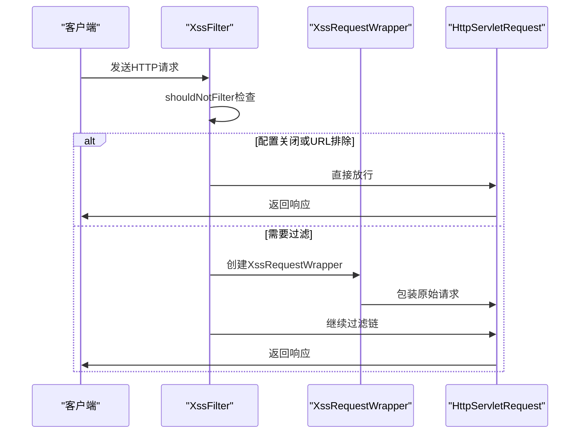
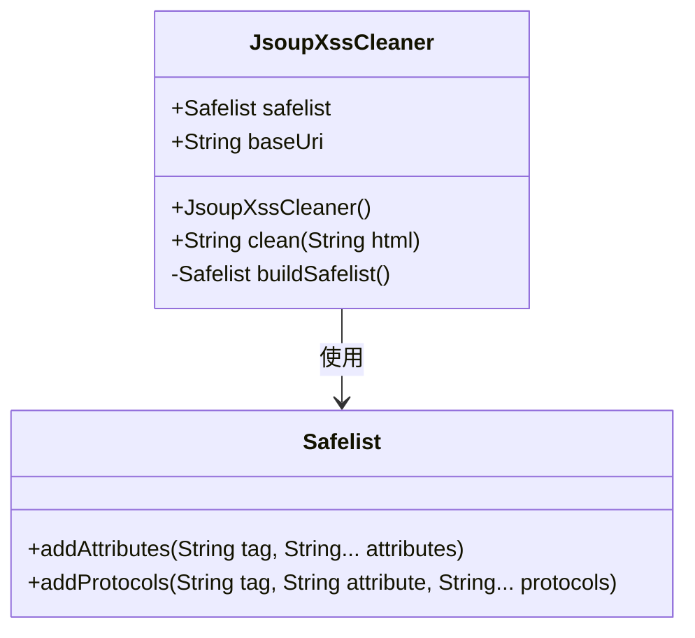
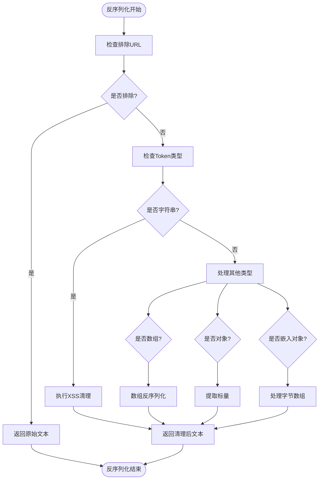
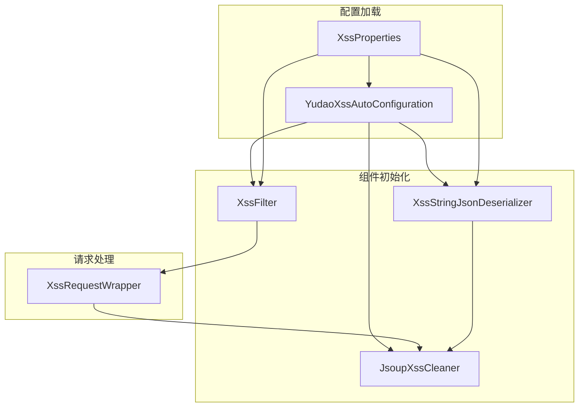
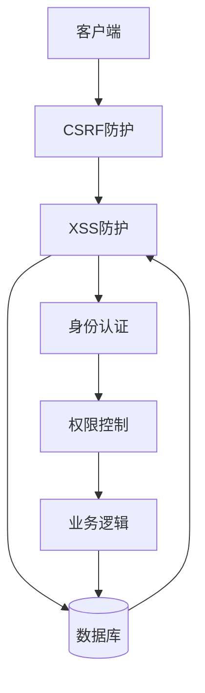

# XSS跨站脚本防护

<cite>
**本文档引用的文件**  
- [XssFilter.java](file://yudao-framework/yudao-spring-boot-starter-web/src/main/java/cn/iocoder/yudao/framework/xss/core/filter/XssFilter.java)
- [JsoupXssCleaner.java](file://yudao-framework/yudao-spring-boot-starter-web/src/main/java/cn/iocoder/yudao/framework/xss/core/clean/JsoupXssCleaner.java)
- [XssStringJsonDeserializer.java](file://yudao-framework/yudao-spring-boot-starter-web/src/main/java/cn/iocoder/yudao/framework/xss/core/json/XssStringJsonDeserializer.java)
- [XssProperties.java](file://yudao-framework/yudao-spring-boot-starter-web/src/main/java/cn/iocoder/yudao/framework/xss/config/XssProperties.java)
- [XssRequestWrapper.java](file://yudao-framework/yudao-spring-boot-starter-web/src/main/java/cn/iocoder/yudao/framework/xss/core/filter/XssRequestWrapper.java)
- [YudaoXssAutoConfiguration.java](file://yudao-framework/yudao-spring-boot-starter-web/src/main/java/cn/iocoder/yudao/framework/xss/config/YudaoXssAutoConfiguration.java)
</cite>

## 目录
1. [引言](#引言)
2. [XssFilter请求处理流程](#xssfilter请求处理流程)
3. [JsoupXssCleaner白名单策略](#jsoupxsscleaner白名单策略)
4. [XssStringJsonDeserializer反序列化清理机制](#xssstringjsondeserializer反序列化清理机制)
5. [XSS防护配置选项](#xss防护配置选项)
6. [常见XSS攻击案例防护效果](#常见xss攻击案例防护效果)
7. [与其他安全机制的协同工作](#与其他安全机制的协同工作)
8. [总结](#总结)

## 引言
本文档详细说明了系统中XSS（跨站脚本）防护机制的实现原理和配置方式。通过分析XssFilter过滤器、JsoupXssCleaner清理器和XssStringJsonDeserializer反序列化器的协同工作，阐述了如何有效防止恶意脚本注入攻击，同时确保正常HTML内容的展示不受影响。

## XssFilter请求处理流程
XssFilter作为Spring MVC的过滤器，负责拦截所有HTTP请求并进行XSS防护处理。其核心处理流程如下：



**流程说明：**
1. 请求首先经过`shouldNotFilter`方法判断是否需要过滤
2. 如果XSS防护已关闭或请求URL在排除列表中，则直接放行
3. 否则创建`XssRequestWrapper`包装原始请求对象
4. 将包装后的请求传递给后续的过滤链

**代码流程：**
- `shouldNotFilter`方法检查`XssProperties`中的启用状态和排除URL列表
- `doFilterInternal`方法创建`XssRequestWrapper`实例并继续过滤链

**本节来源**
- [XssFilter.java](file://yudao-framework/yudao-spring-boot-starter-web/src/main/java/cn/iocoder/yudao/framework/xss/core/filter/XssFilter.java#L30-L51)
- [YudaoXssAutoConfiguration.java](file://yudao-framework/yudao-spring-boot-starter-web/src/main/java/cn/iocoder/yudao/framework/xss/config/YudaoXssAutoConfiguration.java#L55-L59)

## JsoupXssCleaner白名单策略
JsoupXssCleaner基于Jsoup库的Safelist机制实现HTML标签和属性的白名单过滤策略，有效防止恶意脚本注入。

### 白名单规则构建


**白名单具体规则：**
1. **基础规则**：基于Jsoup的`Safelist.relaxed()`宽松策略
2. **扩展属性**：
   - 为所有标签添加`style`和`class`属性支持
   - 为`a`标签添加`target`属性支持
3. **协议支持**：
   - 为`img`标签的`src`属性添加`data`协议，支持base64图片
4. **安全限制**：
   - 保留对`javascript:`等危险协议的默认过滤
   - 防止`style`属性中的CSS表达式注入

**实现细节：**
- `buildSafelist`方法构建自定义的安全列表
- `clean`方法使用Jsoup的`clean`函数执行实际的过滤操作
- 通过`baseUri`参数处理相对路径转换（当前未启用）

**本节来源**
- [JsoupXssCleaner.java](file://yudao-framework/yudao-spring-boot-starter-web/src/main/java/cn/iocoder/yudao/framework/xss/core/clean/JsoupXssCleaner.java#L35-L55)
- [XssCleaner.java](file://yudao-framework/yudao-spring-boot-starter-web/src/main/java/cn/iocoder/yudao/framework/xss/core/clean/XssCleaner.java#L5-L15)

## XssStringJsonDeserializer反序列化清理机制
XssStringJsonDeserializer在JSON反序列化过程中自动清理字符串字段，防止JSON数据中的XSS攻击。

### 处理流程


**关键处理逻辑：**
1. **排除检查**：首先检查当前请求URL是否在排除列表中
2. **字符串处理**：对`VALUE_STRING`类型的Token执行XSS清理
3. **复合类型处理**：
   - 数组类型：递归处理每个元素
   - 对象类型：提取标量值进行清理
   - 嵌入对象：特殊处理字节数组（如Base64编码）
4. **标量值处理**：对所有标量值执行XSS清理

**安全特性：**
- 只在反序列化时进行过滤，不影响序列化输出
- 支持复杂JSON结构的深度清理
- 保持Jackson原有的类型处理逻辑

**本节来源**
- [XssStringJsonDeserializer.java](file://yudao-framework/yudao-spring-boot-starter-web/src/main/java/cn/iocoder/yudao/framework/xss/core/json/XssStringJsonDeserializer.java#L39-L81)
- [YudaoXssAutoConfiguration.java](file://yudao-framework/yudao-spring-boot-starter-web/src/main/java/cn/iocoder/yudao/framework/xss/config/YudaoXssAutoConfiguration.java#L41-L50)

## XSS防护配置选项
系统提供了灵活的XSS防护配置选项，通过`XssProperties`类进行配置管理。

### 配置参数说明
| 配置项 | 默认值 | 说明 |
|-------|-------|------|
| yudao.xss.enable | true | 是否启用XSS防护 |
| yudao.xss.excludeUrls | 空列表 | 需要排除的URL路径列表 |

### 配置示例
```yaml
yudao:
  xss:
    enable: true
    excludeUrls:
      - /api/public/**
      - /static/**
      - /upload/**
```

### 配置生效机制


**配置特点：**
- 使用Spring Boot的`@ConfigurationProperties`机制
- 支持条件化配置（`@ConditionalOnProperty`）
- 提供合理的默认值
- 支持Ant风格的路径匹配

**本节来源**
- [XssProperties.java](file://yudao-framework/yudao-spring-boot-starter-web/src/main/java/cn/iocoder/yudao/framework/xss/config/XssProperties.java#L14-L28)
- [YudaoXssAutoConfiguration.java](file://yudao-framework/yudao-spring-boot-starter-web/src/main/java/cn/iocoder/yudao/framework/xss/config/YudaoXssAutoConfiguration.java#L20-L61)

## 常见XSS攻击案例防护效果
本节分析系统对常见XSS攻击的防护效果，以及如何在安全性和功能性之间取得平衡。

### 攻击案例与防护
| 攻击类型 | 攻击示例 | 防护效果 | 说明 |
|---------|---------|---------|------|
| 脚本标签注入 | `<script>alert('xss')</script>` | 完全过滤 | 移除script标签 |
| 事件处理器 | `` | 完全过滤 | 移除onerror等事件属性 |
| JavaScript协议 | `<a href="javascript:alert(1)">链接</a>` | 完全过滤 | 过滤javascript:协议 |
| CSS表达式 | `<div style="width:expression(alert(1))">` | 部分过滤 | 允许style属性但过滤危险表达式 |
| Base64图片 | `` | 允许 | 支持data协议用于图片 |
| 富文本样式 | `<p style="color:red">红色文本</p>` | 允许 | 保留style和class属性 |

### 正常HTML内容支持
系统在防护XSS的同时，确保以下正常HTML内容的展示：
- **富文本编辑**：支持`style`、`class`等样式属性
- **链接目标**：保留`a`标签的`target`属性
- **内联图片**：支持`data:`协议的base64编码图片
- **表格布局**：支持`table`、`tr`、`td`等表格相关标签

### 平衡策略
1. **白名单优先**：只允许明确列出的安全标签和属性
2. **渐进式严格**：从宽松策略开始，根据实际需求调整
3. **排除机制**：为特定接口提供排除配置
4. **深度清理**：对嵌套的JSON和表单数据进行全面清理

**本节来源**
- [JsoupXssCleaner.java](file://yudao-framework/yudao-spring-boot-starter-web/src/main/java/cn/iocoder/yudao/framework/xss/core/clean/JsoupXssCleaner.java#L35-L55)
- [XssRequestWrapper.java](file://yudao-framework/yudao-spring-boot-starter-web/src/main/java/cn/iocoder/yudao/framework/xss/core/filter/XssRequestWrapper.java#L24-L89)

## 与其他安全机制的协同工作
XSS防护机制与其他安全组件协同工作，构建多层次的安全防护体系。

### 协同架构


### 与CSRF防护的协同
1. **处理顺序**：CSRF过滤器在XSS过滤器之前执行
2. **数据保护**：XSS防护确保CSRF Token不被篡改
3. **请求完整性**：双重验证确保请求的合法性和安全性

### 与其他安全组件的交互
- **与身份认证**：确保认证信息不被XSS窃取
- **与权限控制**：防止通过XSS绕过权限检查
- **与日志记录**：清理后的数据才被记录到日志
- **与输入验证**：XSS清理作为输入验证的前置步骤

### 安全层级
1. **网络层**：防火墙、WAF等基础设施防护
2. **应用层**：CSRF、XSS、SQL注入等Web安全防护
3. **业务层**：权限控制、数据验证等业务安全规则
4. **数据层**：数据库加密、访问控制等数据安全措施

**本节来源**
- [XssFilter.java](file://yudao-framework/yudao-spring-boot-starter-web/src/main/java/cn/iocoder/yudao/framework/xss/core/filter/XssFilter.java#L30-L51)
- [YudaoXssAutoConfiguration.java](file://yudao-framework/yudao-spring-boot-starter-web/src/main/java/cn/iocoder/yudao/framework/xss/config/YudaoXssAutoConfiguration.java#L20-L61)

## 总结
本文档详细阐述了系统中XSS防护机制的实现原理和配置方式。通过XssFilter、JsoupXssCleaner和XssStringJsonDeserializer的协同工作，系统实现了全面的XSS防护：

1. **多层防护**：从请求参数到JSON数据，全面覆盖各种输入渠道
2. **白名单策略**：基于Jsoup的Safelist机制，平衡安全性和功能性
3. **灵活配置**：支持启用开关和URL排除，满足不同场景需求
4. **无缝集成**：与Spring MVC和Jackson框架深度集成，透明化防护
5. **协同工作**：与其他安全机制共同构建多层次的安全防护体系

该防护机制在确保系统安全的同时，最大限度地保持了正常HTML内容的展示能力，为用户提供安全可靠的使用体验。