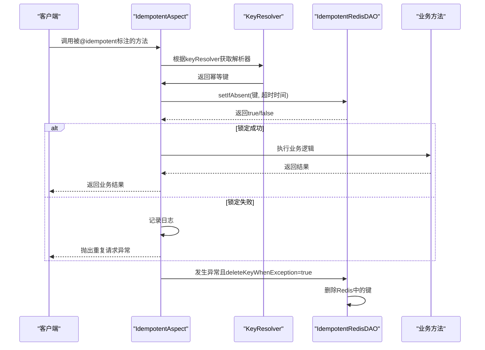
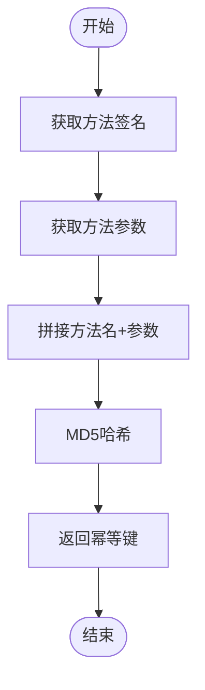
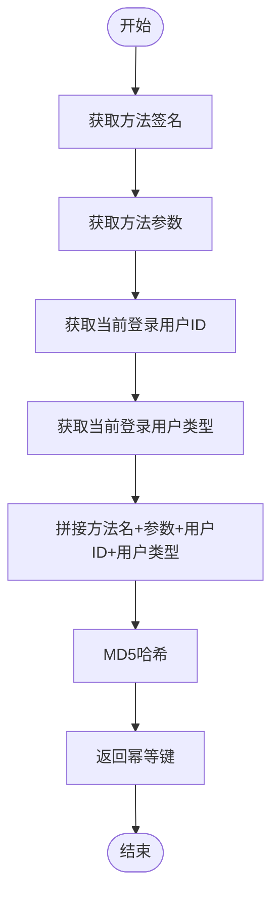
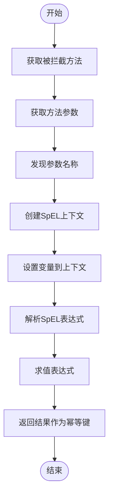
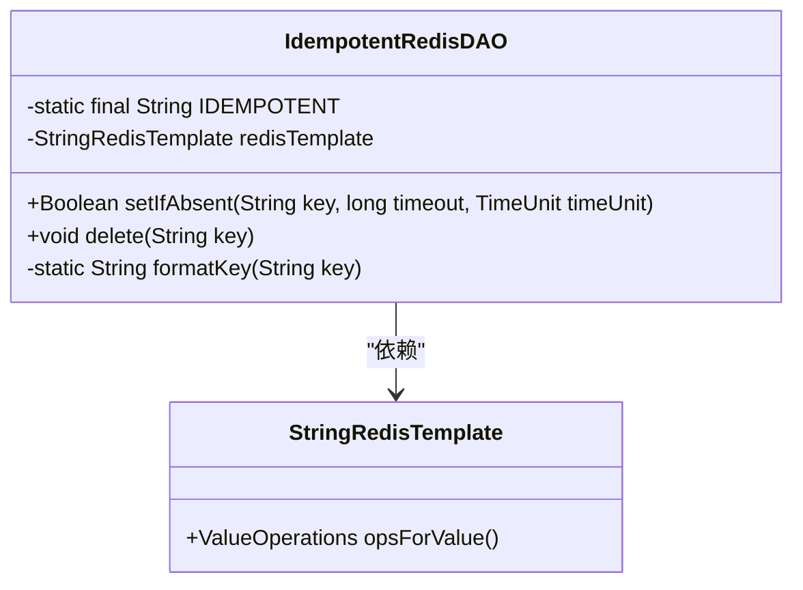
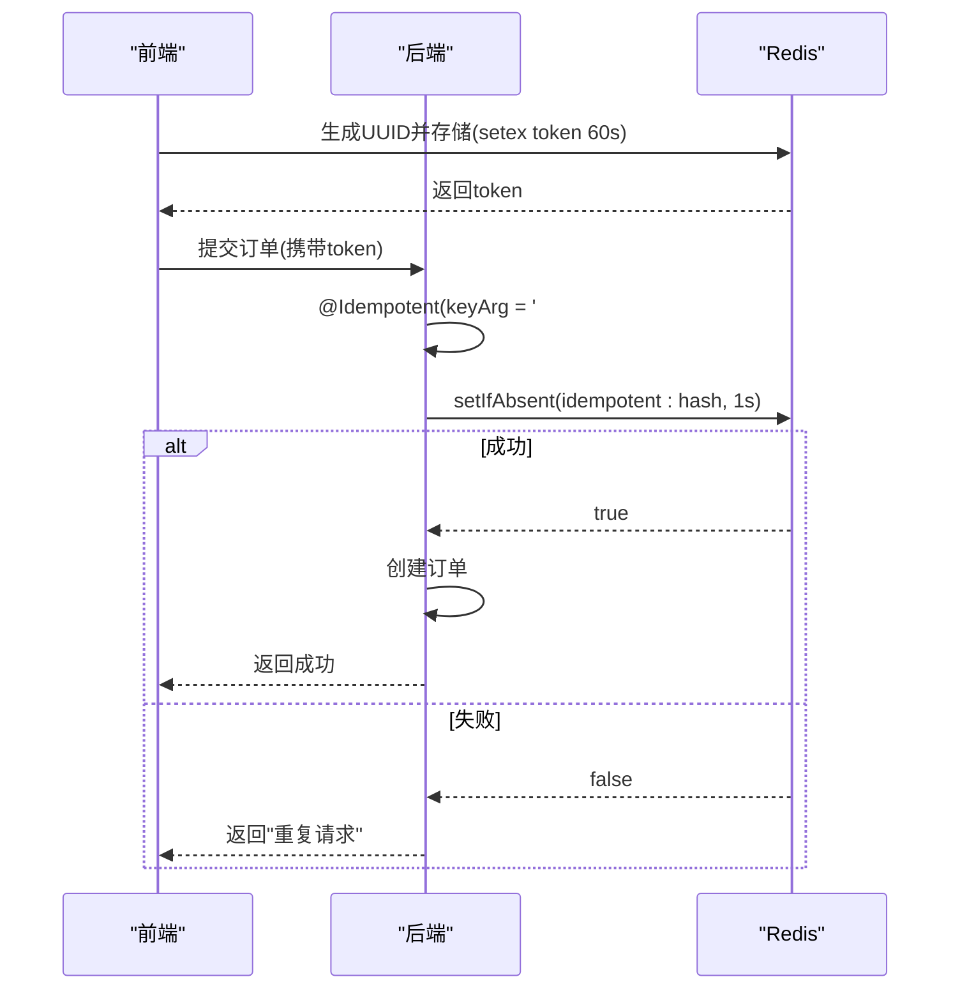
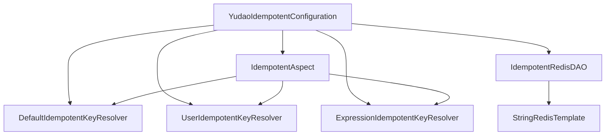

# 接口幂等性控制

<cite>
**本文档引用文件**  
- [Idempotent.java](file://yudao-framework/yudao-spring-boot-starter-protection/src/main/java/cn/iocoder/yudao/framework/idempotent/core/annotation/Idempotent.java)
- [IdempotentAspect.java](file://yudao-framework/yudao-spring-boot-starter-protection/src/main/java/cn/iocoder/yudao/framework/idempotent/core/aop/IdempotentAspect.java)
- [IdempotentRedisDAO.java](file://yudao-framework/yudao-spring-boot-starter-protection/src/main/java/cn/iocoder/yudao/framework/idempotent/core/redis/IdempotentRedisDAO.java)
- [DefaultIdempotentKeyResolver.java](file://yudao-framework/yudao-spring-boot-starter-protection/src/main/java/cn/iocoder/yudao/framework/idempotent/core/keyresolver/impl/DefaultIdempotentKeyResolver.java)
- [UserIdempotentKeyResolver.java](file://yudao-framework/yudao-spring-boot-starter-protection/src/main/java/cn/iocoder/yudao/framework/idempotent/core/keyresolver/impl/UserIdempotentKeyResolver.java)
- [ExpressionIdempotentKeyResolver.java](file://yudao-framework/yudao-spring-boot-starter-protection/src/main/java/cn/iocoder/yudao/framework/idempotent/core/keyresolver/impl/ExpressionIdempotentKeyResolver.java)
- [YudaoIdempotentConfiguration.java](file://yudao-framework/yudao-spring-boot-starter-protection/src/main/java/cn/iocoder/yudao/framework/idempotent/config/YudaoIdempotentConfiguration.java)
</cite>

## 目录
1. [引言](#引言)
2. [核心组件分析](#核心组件分析)
3. [幂等性AOP切面工作流程](#幂等性aop切面工作流程)
4. [幂等键生成策略](#幂等键生成策略)
5. [Redis去重机制实现](#redis去重机制实现)
6. [关键业务场景应用](#关键业务场景应用)
7. [配置选项与异常处理](#配置选项与异常处理)
8. [性能监控指标](#性能监控指标)

## 引言
在分布式系统中，接口幂等性是确保业务操作重复执行不会产生副作用的关键机制。本系统通过 `@Idempotent` 注解结合AOP与Redis实现了一套完整的幂等控制方案，广泛应用于订单创建、支付等关键业务场景。

## 核心组件分析

### @Idempotent 注解定义
该注解用于标记需要幂等控制的方法，支持多种配置参数：

**参数说明**
- `timeout`: 幂等锁的超时时间，默认为1秒
- `timeUnit`: 时间单位，默认为秒
- `message`: 重复请求时返回的提示信息
- `keyResolver`: 指定幂等键解析器实现类
- `keyArg`: 传递给解析器的参数（如SpEL表达式）
- `deleteKeyWhenException`: 异常时是否删除幂等键

**Section sources**
- [Idempotent.java](file://yudao-framework/yudao-spring-boot-starter-protection/src/main/java/cn/iocoder/yudao/framework/idempotent/core/annotation/Idempotent.java#L18-L62)

## 幂等性AOP切面工作流程

**Diagram sources**
- [IdempotentAspect.java](file://yudao-framework/yudao-spring-boot-starter-protection/src/main/java/cn/iocoder/yudao/framework/idempotent/core/aop/IdempotentAspect.java#L38-L65)

**Section sources**
- [IdempotentAspect.java](file://yudao-framework/yudao-spring-boot-starter-protection/src/main/java/cn/iocoder/yudao/framework/idempotent/core/aop/IdempotentAspect.java#L1-L68)

## 幂等键生成策略

系统提供了三种内置的幂等键解析器实现：

### 默认全局级别解析器
使用方法签名和参数值组合后进行MD5哈希，适用于全局唯一的操作。

**Diagram sources**
- [DefaultIdempotentKeyResolver.java](file://yudao-framework/yudao-spring-boot-starter-protection/src/main/java/cn/iocoder/yudao/framework/idempotent/core/keyresolver/impl/DefaultIdempotentKeyResolver.java#L17-L22)

### 用户级别解析器
在默认策略基础上增加用户ID和用户类型，实现用户维度的幂等控制。

**Diagram sources**
- [UserIdempotentKeyResolver.java](file://yudao-framework/yudao-spring-boot-starter-protection/src/main/java/cn/iocoder/yudao/framework/idempotent/core/keyresolver/impl/UserIdempotentKeyResolver.java#L18-L25)

### 表达式解析器
支持通过SpEL表达式自定义幂等键，提供最大的灵活性。

**Diagram sources**
- [ExpressionIdempotentKeyResolver.java](file://yudao-framework/yudao-spring-boot-starter-protection/src/main/java/cn/iocoder/yudao/framework/idempotent/core/keyresolver/impl/ExpressionIdempotentKeyResolver.java#L26-L43)

**Section sources**
- [DefaultIdempotentKeyResolver.java](file://yudao-framework/yudao-spring-boot-starter-protection/src/main/java/cn/iocoder/yudao/framework/idempotent/core/keyresolver/impl/DefaultIdempotentKeyResolver.java#L1-L25)
- [UserIdempotentKeyResolver.java](file://yudao-framework/yudao-spring-boot-starter-protection/src/main/java/cn/iocoder/yudao/framework/idempotent/core/keyresolver/impl/UserIdempotentKeyResolver.java#L1-L28)
- [ExpressionIdempotentKeyResolver.java](file://yudao-framework/yudao-spring-boot-starter-protection/src/main/java/cn/iocoder/yudao/framework/idempotent/core/keyresolver/impl/ExpressionIdempotentKeyResolver.java#L1-L63)

## Redis去重机制实现

### IdempotentRedisDAO设计
基于Redis的SETNX命令实现原子性操作，确保分布式环境下的线程安全。

**Diagram sources**
- [IdempotentRedisDAO.java](file://yudao-framework/yudao-spring-boot-starter-protection/src/main/java/cn/iocoder/yudao/framework/idempotent/core/redis/IdempotentRedisDAO.java#L1-L41)

### SETNX命令工作原理
利用Redis的`SET key value NX EX seconds`特性，在一个原子操作中完成"检查并设置"，避免了传统先get后set可能引发的竞争条件。

**Section sources**
- [IdempotentRedisDAO.java](file://yudao-framework/yudao-spring-boot-starter-protection/src/main/java/cn/iocoder/yudao/framework/idempotent/core/redis/IdempotentRedisDAO.java#L1-L41)

## 关键业务场景应用

### 订单创建场景
前端在提交订单前生成唯一Token并存储于Redis，后端通过表达式解析器验证该Token的有效性。

### 支付处理场景
采用用户级别幂等控制，防止同一用户短时间内重复提交支付请求。

**Section sources**
- [Idempotent.java](file://yudao-framework/yudao-spring-boot-starter-protection/src/main/java/cn/iocoder/yudao/framework/idempotent/core/annotation/Idempotent.java#L18-L62)
- [IdempotentAspect.java](file://yudao-framework/yudao-spring-boot-starter-protection/src/main/java/cn/iocoder/yudao/framework/idempotent/core/aop/IdempotentAspect.java#L38-L65)

## 配置选项与异常处理

### 自动配置机制
通过`YudaoIdempotentConfiguration`自动装配所有必要的Bean，包括切面、DAO和各种解析器实现。

**Diagram sources**
- [YudaoIdempotentConfiguration.java](file://yudao-framework/yudao-spring-boot-starter-protection/src/main/java/cn/iocoder/yudao/framework/idempotent/config/YudaoIdempotentConfiguration.java#L1-L46)

### 异常处理策略
当业务逻辑抛出异常时，根据`deleteKeyWhenException`配置决定是否删除幂等键，遵循"失败可重试"的设计理念。

**Section sources**
- [YudaoIdempotentConfiguration.java](file://yudao-framework/yudao-spring-boot-starter-protection/src/main/java/cn/iocoder/yudao/framework/idempotent/config/YudaoIdempotentConfiguration.java#L1-L46)

## 性能监控指标
建议监控以下关键指标：
- 幂等拦截成功率（成功/失败比例）
- Redis操作延迟
- 因幂等限制被拒绝的请求量
- 不同解析器的使用频率