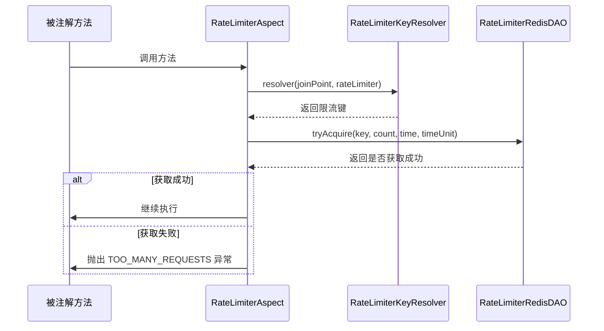
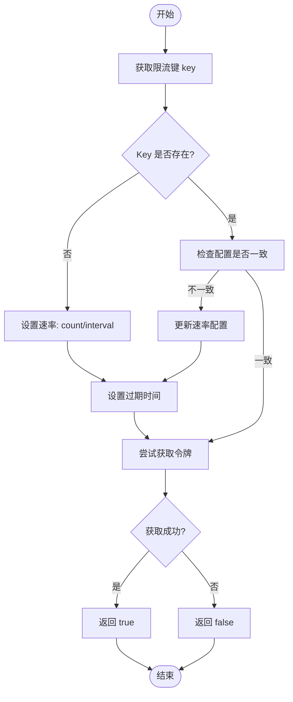

# 接口限流保护

<cite>
**本文档引用文件**   
- [RateLimiter.java](file://yudao-framework/yudao-spring-boot-starter-protection/src/main/java/cn/iocoder/yudao/framework/ratelimiter/core/annotation/RateLimiter.java)
- [RateLimiterAspect.java](file://yudao-framework/yudao-spring-boot-starter-protection/src/main/java/cn/iocoder/yudao/framework/ratelimiter/core/aop/RateLimiterAspect.java)
- [RateLimiterRedisDAO.java](file://yudao-framework/yudao-spring-boot-starter-protection/src/main/java/cn/iocoder/yudao/framework/ratelimiter/core/redis/RateLimiterRedisDAO.java)
- [RateLimiterKeyResolver.java](file://yudao-framework/yudao-spring-boot-starter-protection/src/main/java/cn/iocoder/yudao/framework/ratelimiter/core/keyresolver/RateLimiterKeyResolver.java)
- [DefaultRateLimiterKeyResolver.java](file://yudao-framework/yudao-spring-boot-starter-protection/src/main/java/cn/iocoder/yudao/framework/ratelimiter/core/keyresolver/impl/DefaultRateLimiterKeyResolver.java)
- [UserRateLimiterKeyResolver.java](file://yudao-framework/yudao-spring-boot-starter-protection/src/main/java/cn/iocoder/yudao/framework/ratelimiter/core/keyresolver/impl/UserRateLimiterKeyResolver.java)
- [ClientIpRateLimiterKeyResolver.java](file://yudao-framework/yudao-spring-boot-starter-protection/src/main/java/cn/iocoder/yudao/framework/ratelimiter/core/keyresolver/impl/ClientIpRateLimiterKeyResolver.java)
- [ServerNodeRateLimiterKeyResolver.java](file://yudao-framework/yudao-spring-boot-starter-protection/src/main/java/cn/iocoder/yudao/framework/ratelimiter/core/keyresolver/impl/ServerNodeRateLimiterKeyResolver.java)
- [ExpressionRateLimiterKeyResolver.java](file://yudao-framework/yudao-spring-boot-starter-protection/src/main/java/cn/iocoder/yudao/framework/ratelimiter/core/keyresolver/impl/ExpressionRateLimiterKeyResolver.java)
</cite>

## 目录
1. [简介](#简介)
2. [@RateLimiter 注解配置参数](#ratelimiter-注解配置参数)
3. [基于 AOP 的限流实现机制](#基于-aop-的限流实现机制)
4. [限流键生成策略](#限流键生成策略)
5. [分布式限流实现：RateLimiterRedisDAO](#分布式限流实现ratelimiterredisdao)
6. [高并发场景下的限流配置建议](#高并发场景下的限流配置建议)
7. [总结](#总结)

## 简介
本文档全面介绍 `@RateLimiter` 注解的使用方法及其底层实现机制。系统通过 AOP 拦截带有 `@RateLimiter` 注解的方法，结合 Redis 实现分布式环境下的接口限流。支持多种限流维度，包括全局、用户、IP、服务器节点及自定义表达式，确保系统在高并发场景下的稳定性。

## @RateLimiter 注解配置参数

`@RateLimiter` 是用于方法级别的限流控制注解，其核心配置参数如下：

- **time**：限流时间窗口，默认为 1
- **timeUnit**：时间单位，默认为 `TimeUnit.SECONDS`
- **count**：在指定时间窗口内允许的最大请求数，默认为 100
- **message**：触发限流时返回的提示信息，若为空则使用默认错误码提示
- **keyResolver**：限流键解析器类，决定限流的粒度
- **keyArg**：传递给键解析器的参数，用于动态生成限流键

通过组合这些参数，可灵活配置不同接口的限流策略。

**节来源**
- [RateLimiter.java](file://yudao-framework/yudao-spring-boot-starter-protection/src/main/java/cn/iocoder/yudao/framework/ratelimiter/core/annotation/RateLimiter.java#L21-L61)

## 基于 AOP 的限流实现机制

系统采用 Spring AOP 实现对 `@RateLimiter` 注解的拦截。核心类 `RateLimiterAspect` 在方法执行前进行限流判断。

### 执行流程
1. 使用 `@Before("@annotation(rateLimiter)")` 拦截标注了 `@RateLimiter` 的方法
2. 根据注解中配置的 `keyResolver` 获取对应的 `RateLimiterKeyResolver` 实例
3. 调用 `resolver` 方法生成唯一限流键
4. 调用 `RateLimiterRedisDAO.tryAcquire()` 尝试获取令牌
5. 若获取失败，则抛出 `ServiceException` 异常，返回“请求过于频繁”提示

该机制基于环绕通知模式，在业务逻辑执行前完成限流校验，避免无效请求进入核心处理流程。



**图来源**
- [RateLimiterAspect.java](file://yudao-framework/yudao-spring-boot-starter-protection/src/main/java/cn/iocoder/yudao/framework/ratelimiter/core/aop/RateLimiterAspect.java#L23-L58)

**节来源**
- [RateLimiterAspect.java](file://yudao-framework/yudao-spring-boot-starter-protection/src/main/java/cn/iocoder/yudao/framework/ratelimiter/core/aop/RateLimiterAspect.java#L23-L58)

## 限流键生成策略

系统提供多种 `RateLimiterKeyResolver` 实现，支持不同维度的限流控制。

### 全局级别限流（DefaultRateLimiterKeyResolver）
使用方法签名与参数拼接后进行 MD5 哈希，形成全局唯一的限流键。适用于对整个方法进行统一限流。

```java
SecureUtil.md5(methodName + argsStr);
```

### 用户级别限流（UserRateLimiterKeyResolver）
在全局键基础上加入用户 ID 和用户类型，实现按用户维度的限流，适用于保护用户敏感操作接口。

```java
SecureUtil.md5(methodName + argsStr + userId + userType);
```

### 客户端 IP 级别限流（ClientIpRateLimiterKeyResolver）
结合客户端 IP 地址生成限流键，有效防止恶意 IP 刷接口，常用于登录、注册等公共接口。

```java
SecureUtil.md5(methodName + argsStr + clientIp);
```

### 服务器节点级别限流（ServerNodeRateLimiterKeyResolver）
使用服务器 IP 和进程 ID 生成键，用于限制单个服务实例的调用频率，防止某节点过载。

```java
SecureUtil.md5(methodName + argsStr + serverNode);
```

### 自定义表达式限流（ExpressionRateLimiterKeyResolver）
支持通过 SpEL 表达式动态计算限流键，提供最大灵活性，可用于复杂业务场景。

```java
// 示例：@RateLimiter(keyResolver = ExpressionRateLimiterKeyResolver.class, keyArg = "#userId + '_' + #type")
```

所有键生成策略均通过 MD5 压缩避免 Redis Key 过长，提升存储与查询效率。

**节来源**
- [DefaultRateLimiterKeyResolver.java](file://yudao-framework/yudao-spring-boot-starter-protection/src/main/java/cn/iocoder/yudao/framework/ratelimiter/core/keyresolver/impl/DefaultRateLimiterKeyResolver.java#L1-L25)
- [UserRateLimiterKeyResolver.java](file://yudao-framework/yudao-spring-boot-starter-protection/src/main/java/cn/iocoder/yudao/framework/ratelimiter/core/keyresolver/impl/UserRateLimiterKeyResolver.java#L1-L28)
- [ClientIpRateLimiterKeyResolver.java](file://yudao-framework/yudao-spring-boot-starter-protection/src/main/java/cn/iocoder/yudao/framework/ratelimiter/core/keyresolver/impl/ClientIpRateLimiterKeyResolver.java#L1-L27)
- [ServerNodeRateLimiterKeyResolver.java](file://yudao-framework/yudao-spring-boot-starter-protection/src/main/java/cn/iocoder/yudao/framework/ratelimiter/core/keyresolver/impl/ServerNodeRateLimiterKeyResolver.java#L1-L26)
- [ExpressionRateLimiterKeyResolver.java](file://yudao-framework/yudao-spring-boot-starter-protection/src/main/java/cn/iocoder/yudao/framework/ratelimiter/core/keyresolver/impl/ExpressionRateLimiterKeyResolver.java)

## 分布式限流实现：RateLimiterRedisDAO

`RateLimiterRedisDAO` 基于 Redisson 客户端封装，利用 Redis 的分布式特性实现跨服务实例的统一限流。

### 核心机制
- 使用 Redisson 的 `RRateLimiter` 组件，底层基于 Redis 的 `INCR` 和 `EXPIRE` 命令实现令牌桶算法
- Key 格式为 `rate_limiter:{key}`，其中 `{key}` 由 `RateLimiterKeyResolver` 生成
- 首次访问时设置速率限制（`trySetRate`），后续请求复用或更新配置
- 设置过期时间与限流时间窗口一致，避免内存泄漏

### 令牌桶算法实现
1. 初始化时设置单位时间内的最大令牌数（count）和时间间隔（duration）
2. 每次请求尝试获取一个令牌（`tryAcquire()`）
3. Redisson 内部通过 Lua 脚本保证原子性操作
4. 若当前令牌数不足，则返回失败

该实现具备高并发下的线程安全与分布式一致性保障。



**图来源**
- [RateLimiterRedisDAO.java](file://yudao-framework/yudao-spring-boot-starter-protection/src/main/java/cn/iocoder/yudao/framework/ratelimiter/core/redis/RateLimiterRedisDAO.java#L14-L65)

**节来源**
- [RateLimiterRedisDAO.java](file://yudao-framework/yudao-spring-boot-starter-protection/src/main/java/cn/iocoder/yudao/framework/ratelimiter/core/redis/RateLimiterRedisDAO.java#L14-L65)

## 高并发场景下的限流配置建议

### 差异化限流策略
| 接口类型 | 限流维度 | 示例配置 |
|--------|--------|--------|
| 登录接口 | IP + 用户 | 60次/分钟 |
| 支付接口 | 用户 ID | 5次/秒 |
| 查询接口 | 全局 | 100次/秒 |
| 后台管理 | 服务器节点 | 200次/秒 |

### 突发流量处理
- 采用令牌桶算法而非固定窗口，允许一定程度的突发流量通过
- 设置合理的 `count` 和 `time` 参数，如 100次/10秒 比 10次/秒 更能容忍突发
- 对非关键接口可适当放宽限制，提升用户体验

### 限流降级方案
1. **快速失败**：直接返回 `TOO_MANY_REQUESTS` 错误码
2. **排队等待**：结合消息队列异步处理，适用于非实时业务
3. **服务降级**：返回缓存数据或简化响应内容
4. **熔断机制**：连续触发限流时自动熔断接口，防止雪崩

### 性能优化建议
- 合理设置 Redis Key 过期时间，避免内存积压
- 使用 MD5 压缩长 Key，减少网络传输开销
- 监控限流触发频率，动态调整策略
- 在压力测试中验证限流效果，确保配置合理

## 总结
本文档详细介绍了基于 `@RateLimiter` 注解的接口限流保护机制。系统通过 AOP 拦截、多维度键生成策略和 Redisson 分布式限流组件，构建了一套灵活、高效、可靠的限流体系。开发者可根据业务需求选择合适的限流维度和参数配置，有效应对高并发挑战，保障系统稳定运行。