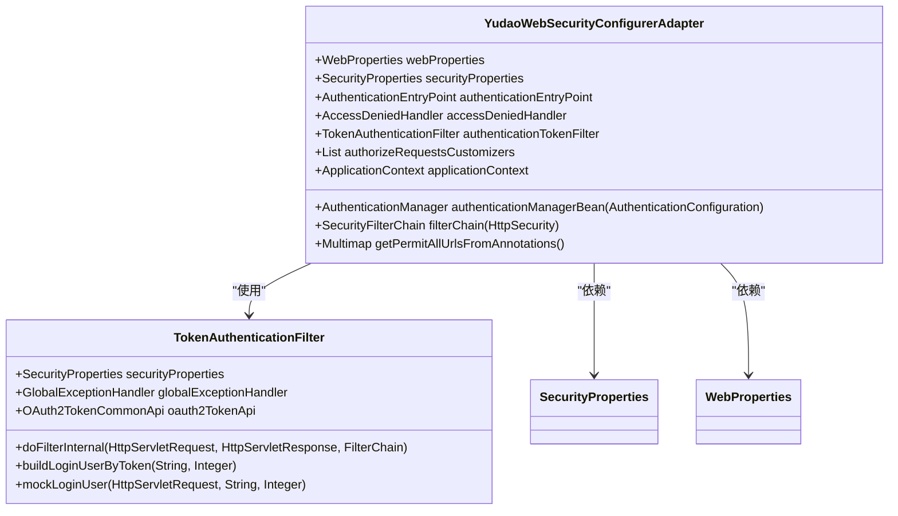
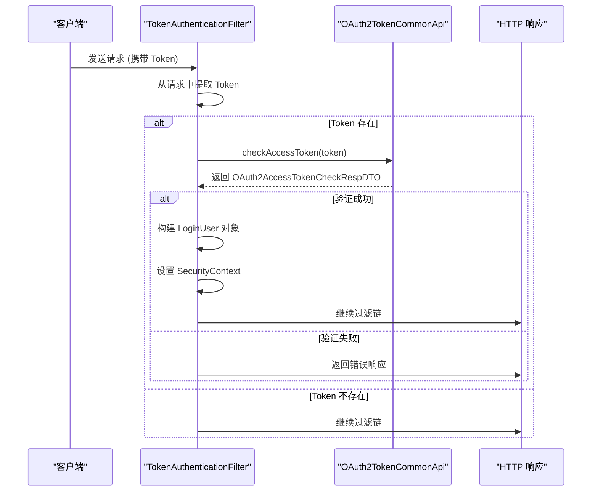
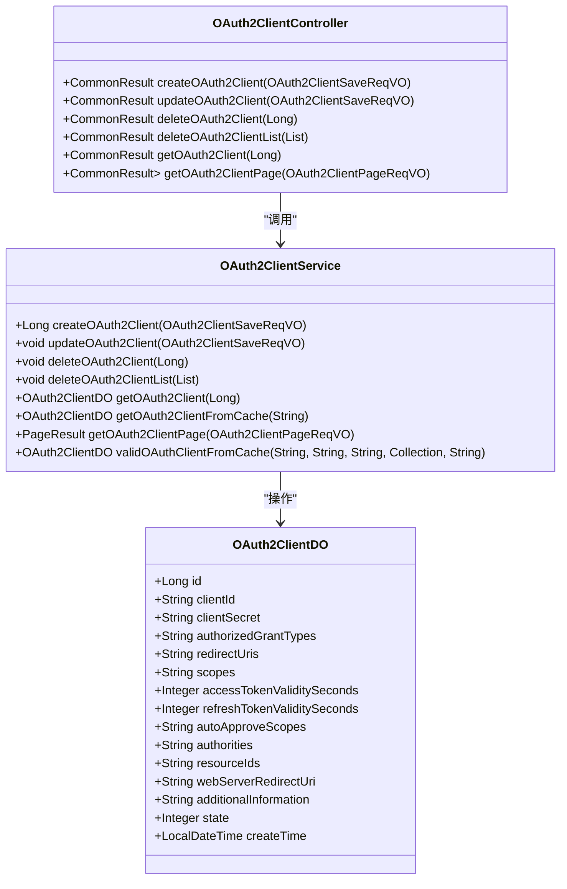
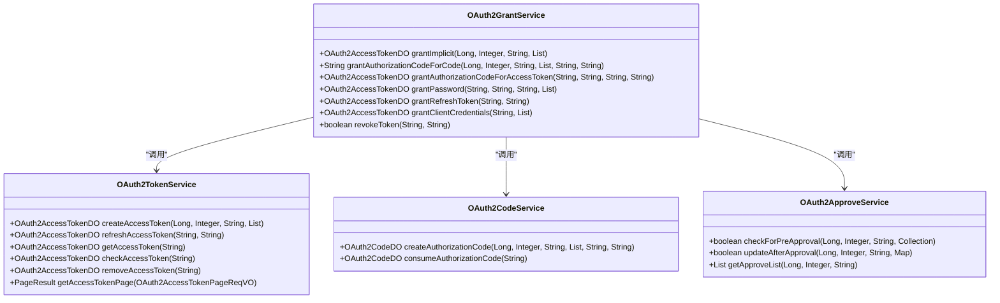

# 安全机制

<cite>
**本文档引用文件**  
- [YudaoWebSecurityConfigurerAdapter.java](file://yudao-framework/yudao-spring-boot-starter-security/src/main/java/cn/iocoder/yudao/framework/security/config/YudaoWebSecurityConfigurerAdapter.java)
- [TokenAuthenticationFilter.java](file://yudao-framework/yudao-spring-boot-starter-security/src/main/java/cn/iocoder/yudao/framework/security/core/filter/TokenAuthenticationFilter.java)
- [OAuth2ClientController.java](file://yudao-module-system/src/main/java/cn/iocoder/yudao/module/system/controller/admin/oauth2/OAuth2ClientController.java)
- [OAuth2TokenController.java](file://yudao-module-system/src/main/java/cn/iocoder/yudao/module/system/controller/admin/oauth2/OAuth2TokenController.java)
- [OAuth2ClientService.java](file://yudao-module-system/src/main/java/cn/iocoder/yudao/module/system/service/oauth2/OAuth2ClientService.java)
- [OAuth2TokenService.java](file://yudao-module-system/src/main/java/cn/iocoder/yudao/module/system/service/oauth2/OAuth2TokenService.java)
- [OAuth2ApproveService.java](file://yudao-module-system/src/main/java/cn/iocoder/yudao/module/system/service/oauth2/OAuth2ApproveService.java)
- [OAuth2CodeService.java](file://yudao-module-system/src/main/java/cn/iocoder/yudao/module/system/service/oauth2/OAuth2CodeService.java)
- [OAuth2GrantService.java](file://yudao-module-system/src/main/java/cn/iocoder/yudao/module/system/service/oauth2/OAuth2GrantService.java)
</cite>

## 目录
1. [简介](#简介)
2. [认证与授权机制](#认证与授权机制)
3. [OAuth2.0 授权服务器实现](#oauth20-授权服务器实现)
4. [API 签名与防重放攻击](#api-签名与防重放攻击)
5. [敏感数据保护](#敏感数据保护)
6. [常见安全漏洞防护](#常见安全漏洞防护)
7. [安全配置最佳实践](#安全配置最佳实践)

## 简介
本项目构建了一套完整的安全防护体系，基于 Spring Security 框架实现细粒度的认证与授权控制。系统支持多因素认证、密码策略、账户锁定等安全功能，并集成 OAuth2.0 授权服务器，支持多种授权类型。通过 API 签名机制和防重放攻击策略保障接口安全，同时对敏感数据进行加密和脱敏处理。系统还具备 CSRF 防护、XSS 过滤和 SQL 注入防御等常见安全漏洞的防护措施。

## 认证与授权机制

### Spring Security 配置
系统通过 `YudaoWebSecurityConfigurerAdapter` 类实现 Spring Security 的自定义配置。该配置类采用 `@EnableMethodSecurity` 注解启用方法级安全控制，支持 `@PreAuthorize` 等注解进行细粒度权限管理。

**图示来源**
- [YudaoWebSecurityConfigurerAdapter.java](file://yudao-framework/yudao-spring-boot-starter-security/src/main/java/cn/iocoder/yudao/framework/security/config/YudaoWebSecurityConfigurerAdapter.java)
- [TokenAuthenticationFilter.java](file://yudao-framework/yudao-spring-boot-starter-security/src/main/java/cn/iocoder/yudao/framework/security/core/filter/TokenAuthenticationFilter.java)

### 安全配置规则
`filterChain` 方法配置了系统的安全过滤链，主要包含以下规则：

1. **跨域配置**：启用 CORS 支持，允许跨域请求
2. **CSRF 防护**：禁用 CSRF 防护，因为系统采用 Token 机制而非 Session
3. **会话管理**：配置为无状态会话（STATELESS），不使用服务器端会话
4. **异常处理**：配置自定义的认证失败处理器和权限不足处理器

**安全访问控制策略：**
- 静态资源（HTML、CSS、JS）允许匿名访问
- 标记 `@PermitAll` 注解的接口无需认证
- 基于 `yudao.security.permit-all-urls` 配置项的 URL 无需认证
- 异步请求（SSE 场景）无需认证
- 其他所有请求必须经过认证

**节来源**
- [YudaoWebSecurityConfigurerAdapter.java](file://yudao-framework/yudao-spring-boot-starter-security/src/main/java/cn/iocoder/yudao/framework/security/config/YudaoWebSecurityConfigurerAdapter.java#L108-L152)

### Token 认证过滤器
`TokenAuthenticationFilter` 是系统的核心认证过滤器，负责验证 Token 的有效性。过滤器从请求头或请求参数中获取 Token，通过调用 `OAuth2TokenCommonApi` 的 `checkAccessToken` 方法验证 Token。

**图示来源**
- [TokenAuthenticationFilter.java](file://yudao-framework/yudao-spring-boot-starter-security/src/main/java/cn/iocoder/yudao/framework/security/core/filter/TokenAuthenticationFilter.java)

## OAuth2.0 授权服务器实现

### 客户端管理
系统通过 `OAuth2ClientService` 接口提供 OAuth2 客户端的管理功能，包括创建、更新、删除和查询客户端。客户端信息存储在数据库中，并提供缓存支持以提高性能。

**图示来源**
- [OAuth2ClientService.java](file://yudao-module-system/src/main/java/cn/iocoder/yudao/module/system/service/oauth2/OAuth2ClientService.java)
- [OAuth2ClientController.java](file://yudao-module-system/src/main/java/cn/iocoder/yudao/module/system/controller/admin/oauth2/OAuth2ClientController.java)

### 授权类型实现
系统通过 `OAuth2GrantService` 接口实现多种 OAuth2.0 授权类型：

**图示来源**
- [OAuth2GrantService.java](file://yudao-module-system/src/main/java/cn/iocoder/yudao/module/system/service/oauth2/OAuth2GrantService.java)
- [OAuth2TokenService.java](file://yudao-module-system/src/main/java/cn/iocoder/yudao/module/system/service/oauth2/OAuth2TokenService.java)
- [OAuth2CodeService.java](file://yudao-module-system/src/main/java/cn/iocoder/yudao/module/system/service/oauth2/OAuth2CodeService.java)
- [OAuth2ApproveService.java](file://yudao-module-system/src/main/java/cn/iocoder/yudao/module/system/service/oauth2/OAuth2ApproveService.java)

### 授权流程
系统支持以下 OAuth2.0 授权流程：

1. **授权码模式**：
   - 用户访问第三方应用
   - 应用重定向到授权服务器
   - 用户登录并授权
   - 授权服务器返回授权码
   - 应用使用授权码换取访问令牌

2. **简化模式**：
   - 用户访问第三方应用
   - 应用重定向到授权服务器
   - 用户登录并授权
   - 授权服务器直接返回访问令牌

3. **密码模式**：
   - 用户提供用户名和密码
   - 应用直接调用授权服务器获取访问令牌

4. **客户端模式**：
   - 客户端使用自己的凭证获取访问令牌
   - 适用于服务器到服务器的通信

**节来源**
- [OAuth2GrantService.java](file://yudao-module-system/src/main/java/cn/iocoder/yudao/module/system/service/oauth2/OAuth2GrantService.java)

## API 签名与防重放攻击

### API 签名机制
系统通过 `yudao-spring-boot-starter-protection` 模块提供 API 签名认证机制。客户端在请求时需要提供签名，服务器端验证签名的合法性。

签名生成算法：
1. 将请求参数按字典序排序
2. 拼接参数名和参数值
3. 使用 HMAC-SHA256 算法与客户端密钥生成签名
4. 将签名作为请求参数或请求头发送

### 防重放攻击策略
系统采用以下策略防止重放攻击：

1. **时间戳验证**：检查请求时间戳，拒绝过期的请求
2. **Nonce 验证**：使用一次性随机数，防止同一请求被重复使用
3. **请求缓存**：缓存最近处理的请求，拒绝重复的请求

这些功能由 `yudao-spring-boot-starter-protection` 模块中的 `signature` 组件实现，通过拦截器验证每个请求的签名和防重放参数。

**节来源**
- [yudao-spring-boot-starter-protection](file://yudao-framework/yudao-spring-boot-starter-protection)

## 敏感数据保护

### 字段级加密
系统支持字段级数据加密，敏感字段在存储到数据库前进行加密，读取时自动解密。加密算法采用 AES-256，密钥由系统安全管理。

实现方式：
1. 在实体类字段上添加 `@Encrypt` 注解
2. 持久层框架自动处理加密和解密
3. 数据库中存储的是加密后的密文

### 日志脱敏
系统对日志中的敏感信息进行自动脱敏处理，防止敏感数据泄露。

脱敏规则：
- 手机号：显示为 138****1234
- 身份证号：显示为 110101****1234
- 银行卡号：显示为 6222****1234
- 邮箱：显示为 user***@example.com

脱敏功能由日志框架的自定义转换器实现，在日志输出前自动处理敏感字段。

**节来源**
- [yudao-spring-boot-starter-web](file://yudao-framework/yudao-spring-boot-starter-web)
- [yudao-common](file://yudao-framework/yudao-common)

## 常见安全漏洞防护

### CSRF 防护
系统采用 Token 机制而非 Session，因此禁用了 CSRF 防护。对于需要 CSRF 防护的场景，系统提供基于 Token 的验证机制。

### XSS 过滤
系统通过以下方式防止 XSS 攻击：
1. 输入验证：对用户输入进行严格的格式验证
2. 输出编码：在输出到页面时对特殊字符进行 HTML 编码
3. 内容安全策略（CSP）：限制可执行的脚本来源

### SQL 注入防御
系统通过以下方式防止 SQL 注入：
1. 使用 MyBatis 框架，避免拼接 SQL 语句
2. 参数化查询：所有用户输入都作为参数传递
3. 输入验证：对用户输入进行严格的格式验证
4. ORM 框架：使用对象关系映射，避免直接操作 SQL

### 其他安全措施
1. **密码策略**：强制使用复杂密码，定期更换
2. **账户锁定**：连续失败登录后锁定账户
3. **多因素认证**：支持短信验证码、邮箱验证码等二次验证
4. **操作日志**：记录关键操作，便于审计追踪

**节来源**
- [yudao-spring-boot-starter-security](file://yudao-framework/yudao-spring-boot-starter-security)
- [yudao-spring-boot-starter-web](file://yudao-framework/yudao-spring-boot-starter-web)

## 安全配置最佳实践

### 配置建议
1. **生产环境**：
   - 禁用模拟登录功能
   - 启用完整的安全防护
   - 配置 HTTPS 加密传输
   - 定期更新安全依赖

2. **开发环境**：
   - 可以启用模拟登录方便调试
   - 保持与生产环境一致的安全配置
   - 定期进行安全扫描

### 合规性指南
1. **数据保护**：
   - 遵循 GDPR 等数据保护法规
   - 敏感数据加密存储
   - 提供数据导出和删除功能

2. **审计要求**：
   - 记录所有关键操作日志
   - 保留日志至少 6 个月
   - 提供日志查询和分析功能

3. **访问控制**：
   - 实施最小权限原则
   - 定期审查权限分配
   - 提供权限变更审计功能

**节来源**
- [SecurityProperties.java](file://yudao-framework/yudao-spring-boot-starter-security/src/main/java/cn/iocoder/yudao/framework/security/config/SecurityProperties.java)
- [WebProperties.java](file://yudao-framework/yudao-spring-boot-starter-web/src/main/java/cn/iocoder/yudao/framework/web/config/WebProperties.java)