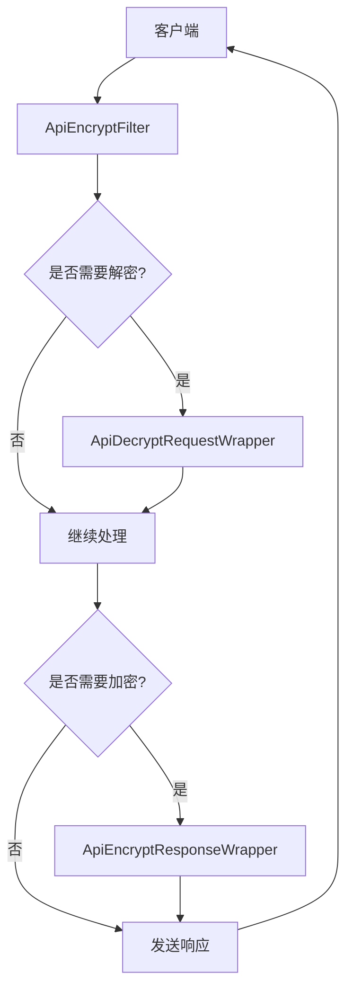
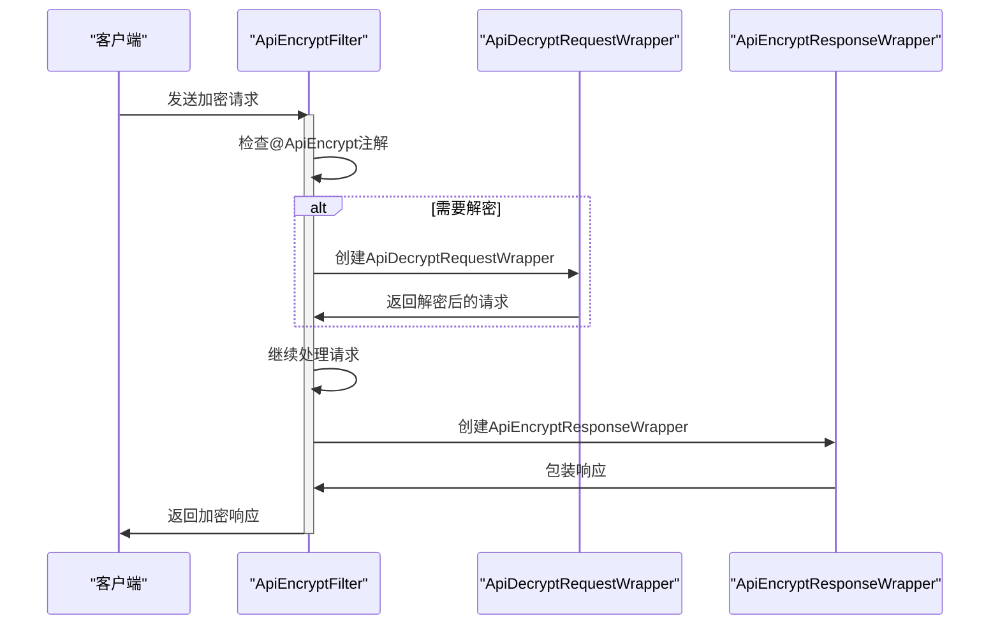
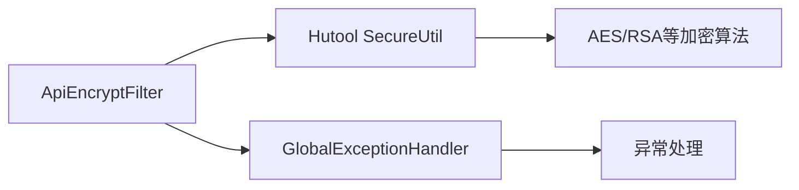

# 字段级加密

<cite>
**本文档引用的文件**
- [ApiEncrypt.java](file://yudao-framework/yudao-spring-boot-starter-web/src/main/java/cn/iocoder/yudao/framework/encrypt/core/annotation/ApiEncrypt.java)
- [ApiEncryptFilter.java](file://yudao-framework/yudao-spring-boot-starter-web/src/main/java/cn/iocoder/yudao/framework/encrypt/core/filter/ApiEncryptFilter.java)
- [ApiDecryptRequestWrapper.java](file://yudao-framework/yudao-spring-boot-starter-web/src/main/java/cn/iocoder/yudao/framework/encrypt/core/filter/ApiDecryptRequestWrapper.java)
- [ApiEncryptResponseWrapper.java](file://yudao-framework/yudao-spring-boot-starter-web/src/main/java/cn/iocoder/yudao/framework/encrypt/core/filter/ApiEncryptResponseWrapper.java)
- [ApiEncryptProperties.java](file://yudao-framework/yudao-spring-boot-starter-web/src/main/java/cn/iocoder/yudao/framework/encrypt/config/ApiEncryptProperties.java)
- [YudaoApiEncryptAutoConfiguration.java](file://yudao-framework/yudao-spring-boot-starter-web/src/main/java/cn/iocoder/yudao/framework/encrypt/config/YudaoApiEncryptAutoConfiguration.java)
- [GlobalExceptionHandler.java](file://yudao-framework/yudao-spring-boot-starter-web/src/main/java/cn/iocoder/yudao/framework/web/core/handler/GlobalExceptionHandler.java)
- [ApiEncryptTest.java](file://yudao-framework/yudao-spring-boot-starter-web/src/test/java/cn/iocoder/yudao/framework/encrypt/ApiEncryptTest.java)
</cite>

## 目录
1. [简介](#简介)
2. [核心组件](#核心组件)
3. [架构概述](#架构概述)
4. [详细组件分析](#详细组件分析)
5. [依赖分析](#依赖分析)
6. [性能考虑](#性能考虑)
7. [故障排除指南](#故障排除指南)
8. [结论](#结论)

## 简介
字段级加密机制为API请求和响应提供了自动加密解密功能，确保数据在传输过程中的安全性。通过使用@ApiEncrypt注解，开发者可以轻松地在Controller类或方法上启用加密功能。该机制由ApiEncryptFilter过滤器驱动，它拦截请求和响应，并利用ApiDecryptRequestWrapper和ApiEncryptResponseWrapper对HttpServletRequest和HttpServletResponse对象进行包装处理。支持的加密算法包括AES、RSA等，且提供了灵活的配置选项来满足不同的安全需求。

## 核心组件

字段级加密的核心在于@ApiEncrypt注解、ApiEncryptFilter过滤器以及相关的请求响应包装器。这些组件共同作用，实现了对API请求参数的解密和响应结果的加密。此外，还涉及到了加密属性配置类ApiEncryptProperties，用于定义加密算法、密钥等信息。

**本文档引用的文件**
- [ApiEncrypt.java](file://yudao-framework/yudao-spring-boot-starter-web/src/main/java/cn/iocoder/yudao/framework/encrypt/core/annotation/ApiEncrypt.java)
- [ApiEncryptFilter.java](file://yudao-framework/yudao-spring-boot-starter-web/src/main/java/cn/iocoder/yudao/framework/encrypt/core/filter/ApiEncryptFilter.java)
- [ApiDecryptRequestWrapper.java](file://yudao-framework/yudao-spring-boot-starter-web/src/main/java/cn/iocoder/yudao/framework/encrypt/core/filter/ApiDecryptRequestWrapper.java)
- [ApiEncryptResponseWrapper.java](file://yudao-framework/yudao-spring-boot-starter-web/src/main/java/cn/iocoder/yudao/framework/encrypt/core/filter/ApiEncryptResponseWrapper.java)
- [ApiEncryptProperties.java](file://yudao-framework/yudao-spring-boot-starter-web/src/main/java/cn/iocoder/yudao/framework/encrypt/config/ApiEncryptProperties.java)

## 架构概述

字段级加密机制采用了一种基于过滤器的设计模式，其中ApiEncryptFilter作为核心组件，负责拦截所有进入的HTTP请求和即将发出的HTTP响应。当请求到达时，如果存在指定的加密头（如X-Api-Encrypt），则ApiEncryptFilter会创建一个ApiDecryptRequestWrapper实例来解密请求体；同样地，在响应返回给客户端之前，若启用了响应加密，则会通过ApiEncryptResponseWrapper对响应体进行加密处理。



**图表来源**
- [ApiEncryptFilter.java](file://yudao-framework/yudao-spring-boot-starter-web/src/main/java/cn/iocoder/yudao/framework/encrypt/core/filter/ApiEncryptFilter.java)
- [ApiDecryptRequestWrapper.java](file://yudao-framework/yudao-spring-boot-starter-web/src/main/java/cn/iocoder/yudao/framework/encrypt/core/filter/ApiDecryptRequestWrapper.java)
- [ApiEncryptResponseWrapper.java](file://yudao-framework/yudao-spring-boot-starter-web/src/main/java/cn/iocoder/yudao/framework/encrypt/core/filter/ApiEncryptResponseWrapper.java)

## 详细组件分析

### ApiEncrypt注解分析
@ApiEncrypt注解允许开发者在Controller类或方法级别上声明是否需要对请求参数进行解密及对响应结果进行加密。此注解包含两个布尔型属性：`request` 和 `response`，分别控制请求解密与响应加密的功能开关，默认值均为true。

#### 注解定义
```java
@Target({ElementType.TYPE, ElementType.METHOD})
@Retention(RetentionPolicy.RUNTIME)
public @interface ApiEncrypt {
    boolean request() default true;
    boolean response() default true;
}
```

**本文档引用的文件**
- [ApiEncrypt.java](file://yudao-framework/yudao-spring-boot-starter-web/src/main/java/cn/iocoder/yudao/framework/encrypt/core/annotation/ApiEncrypt.java#L7-L22)

### ApiEncryptFilter过滤器分析
ApiEncryptFilter是实现字段级加密的关键组件之一，它继承自ApiRequestFilter并重写了doFilterInternal方法以执行具体的加密解密逻辑。该过滤器首先检查请求中是否存在特定的加密头，然后根据@ApiEncrypt注解的状态决定是否需要对请求体进行解密或对响应体进行加密。

#### 过滤器工作流程
1. 获取@ApiEncrypt注解。
2. 判断是否需要解密请求体。
3. 若需解密，则使用ApiDecryptRequestWrapper包装原始请求。
4. 执行后续的过滤链。
5. 若需加密响应，则使用ApiEncryptResponseWrapper包装响应。
6. 调用chain.doFilter()让请求继续传递。
7. 最后，调用ApiEncryptResponseWrapper的encrypt方法完成响应体的加密。



**图表来源**
- [ApiEncryptFilter.java](file://yudao-framework/yudao-spring-boot-starter-web/src/main/java/cn/iocoder/yudao/framework/encrypt/core/filter/ApiEncryptFilter.java#L42-L160)
- [ApiDecryptRequestWrapper.java](file://yudao-framework/yudao-spring-boot-starter-web/src/main/java/cn/iocoder/yudao/framework/encrypt/core/filter/ApiDecryptRequestWrapper.java#L22-L85)
- [ApiEncryptResponseWrapper.java](file://yudao-framework/yudao-spring-boot-starter-web/src/main/java/cn/iocoder/yudao/framework/encrypt/core/filter/ApiEncryptResponseWrapper.java#L21-L108)

### 加密算法与配置
系统支持多种加密算法，包括对称加密（如AES）和非对称加密（如RSA）。具体的加密算法类型及其相关密钥可以通过application.yml文件中的`yudao.api-encrypt`配置项进行设置。例如：

```yaml
yudao:
  api-encrypt:
    enable: true
    header: X-Api-Encrypt
    algorithm: AES
    request-key: your-request-key
    response-key: your-response-key
```

**本文档引用的文件**
- [ApiEncryptProperties.java](file://yudao-framework/yudao-spring-boot-starter-web/src/main/java/cn/iocoder/yudao/framework/encrypt/config/ApiEncryptProperties.java#L14-L70)

## 依赖分析

字段级加密机制依赖于Hutool库提供的加密工具类，如SecureUtil，用于执行实际的加密解密操作。同时，为了确保异常情况下的正确处理，该机制还依赖于GlobalExceptionHandler来捕获并处理可能出现的各种异常。



**图表来源**
- [ApiEncryptFilter.java](file://yudao-framework/yudao-spring-boot-starter-web/src/main/java/cn/iocoder/yudao/framework/encrypt/core/filter/ApiEncryptFilter.java#L50-L57)
- [GlobalExceptionHandler.java](file://yudao-framework/yudao-spring-boot-starter-web/src/main/java/cn/iocoder/yudao/framework/web/core/handler/GlobalExceptionHandler.java#L53-L179)

## 性能考虑

尽管字段级加密增强了数据的安全性，但同时也引入了额外的计算开销。特别是对于高并发场景下的应用来说，频繁的加密解密操作可能会成为性能瓶颈。因此，在启用此功能时应充分评估其对系统性能的影响，并考虑采取适当的优化措施，比如缓存常用的加密密钥或者选择更高效的加密算法。

## 故障排除指南

当遇到与字段级加密相关的错误时，首先应该检查配置文件中关于加密的相关设置是否正确无误。其次，确认请求头中包含了正确的加密标识。最后，查看日志输出以获取更多关于失败原因的信息。如果问题仍然无法解决，建议参考ApiEncryptTest.java中的测试用例来进行调试。

**本文档引用的文件**
- [ApiEncryptTest.java](file://yudao-framework/yudao-spring-boot-starter-web/src/test/java/cn/iocoder/yudao/framework/encrypt/ApiEncryptTest.java#L0-L35)

## 结论

字段级加密为API通信提供了一层重要的安全保障，通过简单的配置即可实现请求和响应数据的自动加密解密。然而，开发者也应注意权衡安全性和性能之间的关系，合理选择加密策略以满足业务需求。