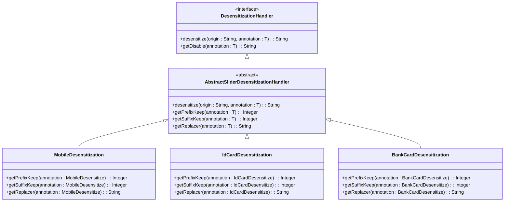
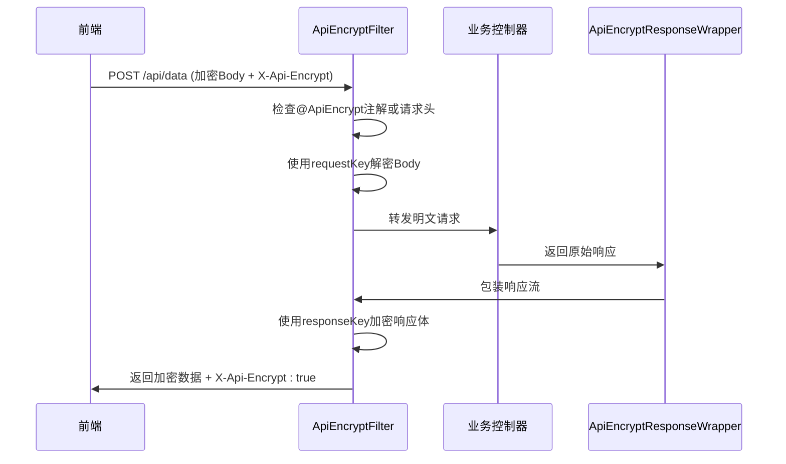

# 数据加密与脱敏

<cite>
**本文档引用文件**  
- [ApiEncryptFilter.java](file://yudao-framework/yudao-spring-boot-starter-web/src/main/java/cn/iocoder/yudao/framework/encrypt/core/filter/ApiEncryptFilter.java)
- [ApiEncryptProperties.java](file://yudao-framework/yudao-spring-boot-starter-web/src/main/java/cn/iocoder/yudao/framework/encrypt/config/ApiEncryptProperties.java)
- [ApiEncrypt.java](file://yudao-framework/yudao-spring-boot-starter-web/src/main/java/cn/iocoder/yudao/framework/encrypt/core/annotation/ApiEncrypt.java)
- [ApiDecryptRequestWrapper.java](file://yudao-framework/yudao-spring-boot-starter-web/src/main/java/cn/iocoder/yudao/framework/encrypt/core/filter/ApiDecryptRequestWrapper.java)
- [ApiEncryptResponseWrapper.java](file://yudao-framework/yudao-spring-boot-starter-web/src/main/java/cn/iocoder/yudao/framework/encrypt/core/filter/ApiEncryptResponseWrapper.java)
- [DesensitizationHandler.java](file://yudao-framework/yudao-spring-boot-starter-web/src/main/java/cn/iocoder/yudao/framework/desensitize/core/base/handler/DesensitizationHandler.java)
- [StringDesensitizeSerializer.java](file://yudao-framework/yudao-spring-boot-starter-web/src/main/java/cn/iocoder/yudao/framework/desensitize/core/base/serializer/StringDesensitizeSerializer.java)
- [AbstractSliderDesensitizationHandler.java](file://yudao-framework/yudao-spring-boot-starter-web/src/main/java/cn/iocoder/yudao/framework/desensitize/core/slider/handler/AbstractSliderDesensitizationHandler.java)
- [MobileDesensitization.java](file://yudao-framework/yudao-spring-boot-starter-web/src/main/java/cn/iocoder/yudao/framework/desensitize/core/slider/handler/MobileDesensitization.java)
- [IdCardDesensitization.java](file://yudao-framework/yudao-spring-boot-starter-web/src/main/java/cn/iocoder/yudao/framework/desensitize/core/slider/handler/IdCardDesensitization.java)
- [BankCardDesensitization.java](file://yudao-framework/yudao-spring-boot-starter-web/src/main/java/cn/iocoder/yudao/framework/desensitize/core/slider/handler/BankCardDesensitization.java)
</cite>

## 目录
1. [引言](#引言)
2. [字段级加密机制](#字段级加密机制)
3. [注解驱动的脱敏机制](#注解驱动的脱敏机制)
4. [API请求/响应加解密流程](#api请求响应加解密流程)
5. [脱敏处理器链设计与扩展](#脱敏处理器链设计与扩展)
6. [敏感数据处理最佳实践](#敏感数据处理最佳实践)
7. [合规性要求](#合规性要求)

## 引言
本文档详细说明系统中敏感数据的保护机制，涵盖字段级加密、注解驱动脱敏、API加解密流程及脱敏处理器链的设计原理。通过本机制，确保手机号、身份证号、银行卡号等敏感信息在传输与展示过程中的安全性，满足数据安全合规要求。

## 字段级加密机制

系统支持对敏感字段进行加密存储与传输，采用对称加密（如AES）或非对称加密（如RSA）算法。加密配置通过 `ApiEncryptProperties` 类定义，包含加密算法、请求解密密钥和响应加密密钥等参数。

加密过程由 `ApiEncryptFilter` 统一拦截处理，根据配置的算法初始化相应的加解密器（`SymmetricDecryptor` / `AsymmetricDecryptor`），并在请求进入业务逻辑前完成解密，在响应返回客户端前完成加密。

目前支持的算法包括：
- 对称加密：AES、SM4（需扩展）
- 非对称加密：RSA、SM2（需扩展）

**Section sources**
- [ApiEncryptProperties.java](file://yudao-framework/yudao-spring-boot-starter-web/src/main/java/cn/iocoder/yudao/framework/encrypt/config/ApiEncryptProperties.java#L1-L71)
- [ApiEncryptFilter.java](file://yudao-framework/yudao-spring-boot-starter-web/src/main/java/cn/iocoder/yudao/framework/encrypt/core/filter/ApiEncryptFilter.java#L57-L79)

## 注解驱动的脱敏机制

系统采用注解方式实现字段级数据脱敏，通过在实体类字段上添加特定注解（如 `@MobileDesensitize`、`@IdCardDesensitize`）来声明脱敏规则。

脱敏机制基于 Jackson 序列化扩展实现，核心为 `StringDesensitizeSerializer`，该序列化器在 JSON 序列化过程中自动识别带有 `@DesensitizeBy` 元注解的字段，并调用对应的 `DesensitizationHandler` 进行脱敏处理。

常见脱敏注解包括：
- `@MobileDesensitize`：手机号脱敏
- `@IdCardDesensitize`：身份证号脱敏
- `@BankCardDesensitize`：银行卡号脱敏
- `@ChineseNameDesensitize`：中文姓名脱敏
- `@PasswordDesensitize`：密码字段隐藏
- `@FixedPhoneDesensitize`：固定电话脱敏
- `@CarLicenseDesensitize`：车牌号脱敏

每个注解均可配置前缀保留位数、后缀保留位数及替换字符。



**Diagram sources**
- [DesensitizationHandler.java](file://yudao-framework/yudao-spring-boot-starter-web/src/main/java/cn/iocoder/yudao/framework/desensitize/core/base/handler/DesensitizationHandler.java#L11-L39)
- [AbstractSliderDesensitizationHandler.java](file://yudao-framework/yudao-spring-boot-starter-web/src/main/java/cn/iocoder/yudao/framework/desensitize/core/slider/handler/AbstractSliderDesensitizationHandler.java#L13-L77)
- [MobileDesensitization.java](file://yudao-framework/yudao-spring-boot-starter-web/src/main/java/cn/iocoder/yudao/framework/desensitize/core/slider/handler/MobileDesensitization.java#L9-L26)
- [IdCardDesensitization.java](file://yudao-framework/yudao-spring-boot-starter-web/src/main/java/cn/iocoder/yudao/framework/desensitize/core/slider/handler/IdCardDesensitization.java#L9-L25)
- [BankCardDesensitization.java](file://yudao-framework/yudao-spring-boot-starter-web/src/main/java/cn/iocoder/yudao/framework/desensitize/core/slider/handler/BankCardDesensitization.java#L9-L31)

**Section sources**
- [StringDesensitizeSerializer.java](file://yudao-framework/yudao-spring-boot-starter-web/src/main/java/cn/iocoder/yudao/framework/desensitize/core/base/serializer/StringDesensitizeSerializer.java#L31-L67)
- [DesensitizationHandler.java](file://yudao-framework/yudao-spring-boot-starter-web/src/main/java/cn/iocoder/yudao/framework/desensitize/core/base/handler/DesensitizationHandler.java#L11-L39)

## API请求/响应加解密流程

API 加解密由 `ApiEncryptFilter` 实现，作为 Spring MVC 的过滤器，在请求处理链中执行加解密操作。

### 流程说明：
1. **请求解密**：当请求头包含指定加密标识（默认 `X-Api-Encrypt`）或方法被 `@ApiEncrypt(request = true)` 标记时，使用配置的解密密钥对请求体进行解密。
2. **响应加密**：当方法被 `@ApiEncrypt(response = true)` 标记时，将响应内容加密并设置加密响应头。
3. **异常处理**：解密失败时，通过全局异常处理器返回统一错误信息。



**Diagram sources**
- [ApiEncryptFilter.java](file://yudao-framework/yudao-spring-boot-starter-web/src/main/java/cn/iocoder/yudao/framework/encrypt/core/filter/ApiEncryptFilter.java#L42-L160)
- [ApiDecryptRequestWrapper.java](file://yudao-framework/yudao-spring-boot-starter-web/src/main/java/cn/iocoder/yudao/framework/encrypt/core/filter/ApiDecryptRequestWrapper.java#L0-L86)
- [ApiEncryptResponseWrapper.java](file://yudao-framework/yudao-spring-boot-starter-web/src/main/java/cn/iocoder/yudao/framework/encrypt/core/filter/ApiEncryptResponseWrapper.java#L0-L108)

**Section sources**
- [ApiEncryptFilter.java](file://yudao-framework/yudao-spring-boot-starter-web/src/main/java/cn/iocoder/yudao/framework/encrypt/core/filter/ApiEncryptFilter.java#L42-L160)

## 脱敏处理器链设计与扩展

脱敏处理器基于责任链模式设计，所有处理器实现 `DesensitizationHandler` 接口，并通过 `@DesensitizeBy` 注解与具体脱敏注解关联。

### 处理器分类：
- **滑动脱敏处理器**（`AbstractSliderDesensitizationHandler`）：适用于固定格式字段（如手机号、身份证），通过保留前后字符、中间替换实现脱敏。
- **正则脱敏处理器**（`AbstractRegexDesensitizationHandler`）：适用于复杂格式匹配，通过正则表达式替换实现脱敏。

### 扩展方式：
1. 定义新的脱敏注解，使用 `@DesensitizeBy(handler = CustomHandler.class)` 指定处理器。
2. 实现 `DesensitizationHandler<T>` 接口或继承抽象类，重写脱敏逻辑。
3. 注册为 Spring Bean（若需依赖注入）。

```mermaid
flowchart TD
A[JSON序列化开始] --> B{字段是否有@DesensitizeBy?}
B --> |否| C[正常序列化]
B --> |是| D[创建StringDesensitizeSerializer]
D --> E[获取对应DesensitizationHandler]
E --> F[调用desensitize方法]
F --> G[返回脱敏后字符串]
G --> H[写入JSON输出]
```

**Diagram sources**
- [StringDesensitizeSerializer.java](file://yudao-framework/yudao-spring-boot-starter-web/src/main/java/cn/iocoder/yudao/framework/desensitize/core/base/serializer/StringDesensitizeSerializer.java#L31-L67)
- [DesensitizationHandler.java](file://yudao-framework/yudao-spring-boot-starter-web/src/main/java/cn/iocoder/yudao/framework/desensitize/core/base/handler/DesensitizationHandler.java#L11-L39)
- [AbstractSliderDesensitizationHandler.java](file://yudao-framework/yudao-spring-boot-starter-web/src/main/java/cn/iocoder/yudao/framework/desensitize/core/slider/handler/AbstractSliderDesensitizationHandler.java#L13-L77)

**Section sources**
- [DesensitizationHandler.java](file://yudao-framework/yudao-spring-boot-starter-web/src/main/java/cn/iocoder/yudao/framework/desensitize/core/base/handler/DesensitizationHandler.java#L11-L39)
- [StringDesensitizeSerializer.java](file://yudao-framework/yudao-spring-boot-starter-web/src/main/java/cn/iocoder/yudao/framework/desensitize/core/base/serializer/StringDesensitizeSerializer.java#L31-L67)

## 敏感数据处理最佳实践

1. **最小化暴露**：仅在必要场景展示敏感信息，优先使用脱敏数据。
2. **传输加密**：所有包含敏感信息的 API 必须启用 `@ApiEncrypt`。
3. **密钥管理**：加密密钥应通过配置中心管理，禁止硬编码。
4. **日志脱敏**：记录日志时自动脱敏敏感字段，避免日志泄露。
5. **权限控制**：敏感数据访问需进行严格的权限校验。
6. **定期审计**：对敏感数据访问行为进行日志审计与监控。

## 合规性要求

1. **符合《个人信息保护法》**：对手机号、身份证号等个人敏感信息进行脱敏处理。
2. **满足等保要求**：网络传输中敏感数据必须加密。
3. **遵循GDPR原则**：数据最小化、目的限制、存储限制。
4. **金融行业规范**：银行卡号展示遵循“前四位后四位”规则。
5. **审计可追溯**：所有敏感数据访问需记录操作日志。