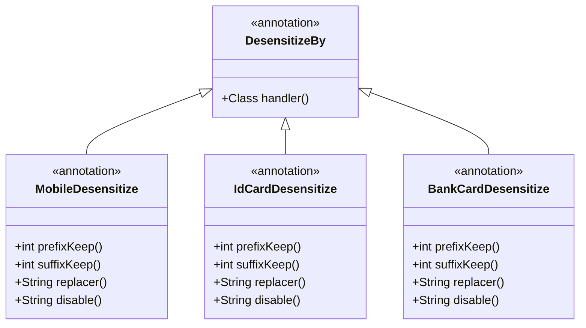
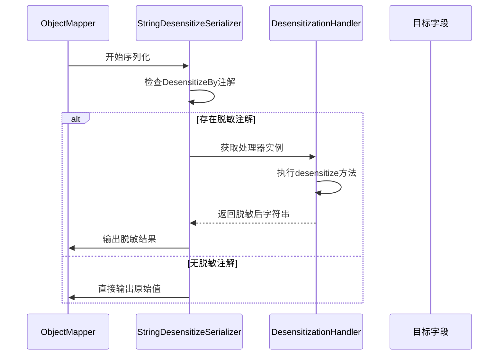

# 基于注解的脱敏

<cite>
**本文档引用文件**  
- [MobileDesensitize.java](file://yudao-framework/yudao-spring-boot-starter-web/src/main/java/cn/iocoder/yudao/framework/desensitize/core/slider/annotation/MobileDesensitize.java)
- [IdCardDesensitize.java](file://yudao-framework/yudao-spring-boot-starter-web/src/main/java/cn/iocoder/yudao/framework/desensitize/core/slider/annotation/IdCardDesensitize.java)
- [BankCardDesensitize.java](file://yudao-framework/yudao-spring-boot-starter-web/src/main/java/cn/iocoder/yudao/framework/desensitize/core/slider/annotation/BankCardDesensitize.java)
- [DesensitizeBy.java](file://yudao-framework/yudao-spring-boot-starter-web/src/main/java/cn/iocoder/yudao/framework/desensitize/core/base/annotation/DesensitizeBy.java)
- [StringDesensitizeSerializer.java](file://yudao-framework/yudao-spring-boot-starter-web/src/main/java/cn/iocoder/yudao/framework/desensitize/core/base/serializer/StringDesensitizeSerializer.java)
- [DesensitizationHandler.java](file://yudao-framework/yudao-spring-boot-starter-web/src/main/java/cn/iocoder/yudao/framework/desensitize/core/base/handler/DesensitizationHandler.java)
</cite>

## 目录
1. [简介](#简介)
2. [核心脱敏注解](#核心脱敏注解)
3. [高级脱敏机制](#高级脱敏机制)
4. [注解在POJO中的应用](#注解在pojo中的应用)
5. [脱敏处理流程](#脱敏处理流程)
6. [实际应用场景](#实际应用场景)
7. [性能优化策略](#性能优化策略)

## 简介
本系统提供了一套基于注解的数据脱敏解决方案，通过在实体类字段上添加特定注解，实现敏感信息的自动脱敏处理。该机制与Jackson序列化深度集成，在JSON数据输出时自动触发脱敏逻辑，确保敏感数据在传输过程中的安全性。

**本节不涉及具体源码分析，因此无源文件引用**

## 核心脱敏注解

系统提供了多种预定义的脱敏注解，用于标记不同类型的敏感字段：

### 手机号脱敏 @MobileDesensitize
用于手机号字段的脱敏处理，保留前3位和后4位数字，中间部分用星号替换。

**属性说明：**
- `prefixKeep`：前缀保留长度，默认3位
- `suffixKeep`：后缀保留长度，默认4位
- `replacer`：替换字符，默认为"*"
- `disable`：是否禁用脱敏的Spring EL表达式

### 身份证脱敏 @IdCardDesensitize
用于身份证号码的脱敏处理，保留前6位和后2位，中间部分用星号替换。

**属性说明：**
- `prefixKeep`：前缀保留长度，默认6位
- `suffixKeep`：后缀保留长度，默认2位
- `replacer`：替换字符，默认为"*"
- `disable`：是否禁用脱敏的Spring EL表达式

### 银行卡脱敏 @BankCardDesensitize
用于银行卡号的脱敏处理，保留前6位和后2位，中间部分用星号替换。

**属性说明：**
- `prefixKeep`：前缀保留长度，默认6位
- `suffixKeep`：后缀保留长度，默认2位
- `replacer`：替换字符，默认为"*"
- `disable`：是否禁用脱敏的Spring EL表达式

**节来源**
- [MobileDesensitize.java](file://yudao-framework/yudao-spring-boot-starter-web/src/main/java/cn/iocoder/yudao/framework/desensitize/core/slider/annotation/MobileDesensitize.java#L1-L47)
- [IdCardDesensitize.java](file://yudao-framework/yudao-spring-boot-starter-web/src/main/java/cn/iocoder/yudao/framework/desensitize/core/slider/annotation/IdCardDesensitize.java#L1-L47)
- [BankCardDesensitize.java](file://yudao-framework/yudao-spring-boot-starter-web/src/main/java/cn/iocoder/yudao/framework/desensitize/core/slider/annotation/BankCardDesensitize.java#L1-L47)

## 高级脱敏机制

### @DesensitizeBy 注解
`@DesensitizeBy` 是所有脱敏注解的元注解，用于指定具体的脱敏处理器类。

**关键特性：**
- 通过 `handler` 属性指定脱敏处理器实现类
- 使用 `@JacksonAnnotationsInside` 与Jackson序列化框架集成
- 通过 `@JsonSerialize` 指定使用 `StringDesensitizeSerializer` 作为序列化器



**图来源**  
- [DesensitizeBy.java](file://yudao-framework/yudao-spring-boot-starter-web/src/main/java/cn/iocoder/yudao/framework/desensitize/core/base/annotation/DesensitizeBy.java#L1-L32)

**节来源**
- [DesensitizeBy.java](file://yudao-framework/yudao-spring-boot-starter-web/src/main/java/cn/iocoder/yudao/framework/desensitize/core/base/annotation/DesensitizeBy.java#L1-L32)

## 注解在POJO中的应用

在实体类中使用脱敏注解非常简单，只需在需要脱敏的字段上添加相应的注解即可。

**使用示例：**
```java
public class UserVO {
    private Long id;
    
    @MobileDesensitize
    private String mobile;
    
    @IdCardDesensitize
    private String idCard;
    
    @BankCardDesensitize
    private String bankCard;
}
```

当该对象被序列化为JSON时，标记了脱敏注解的字段会自动进行脱敏处理。

**节来源**
- [MobileDesensitize.java](file://yudao-framework/yudao-spring-boot-starter-web/src/main/java/cn/iocoder/yudao/framework/desensitize/core/slider/annotation/MobileDesensitize.java#L1-L47)
- [IdCardDesensitize.java](file://yudao-framework/yudao-spring-boot-starter-web/src/main/java/cn/iocoder/yudao/framework/desensitize/core/slider/annotation/IdCardDesensitize.java#L1-L47)
- [BankCardDesensitize.java](file://yudao-framework/yudao-spring-boot-starter-web/src/main/java/cn/iocoder/yudao/framework/desensitize/core/slider/annotation/BankCardDesensitize.java#L1-L47)

## 脱敏处理流程

### 处理器接口 DesensitizationHandler
所有脱敏处理器都实现 `DesensitizationHandler` 接口，该接口定义了核心的脱敏方法。

**接口方法：**
- `desensitize(String origin, T annotation)`：执行脱敏处理的核心方法
- `getDisable(T annotation)`：获取是否禁用脱敏的Spring EL表达式

### 序列化器 StringDesensitizeSerializer
`StringDesensitizeSerializer` 是脱敏功能的核心实现，它在序列化过程中拦截并处理标记了脱敏注解的字段。

**处理流程：**
1. 检查字段是否包含 `DesensitizeBy` 注解
2. 获取对应的脱敏处理器实例
3. 执行脱敏处理
4. 输出脱敏后的字符串



**图来源**  
- [StringDesensitizeSerializer.java](file://yudao-framework/yudao-spring-boot-starter-web/src/main/java/cn/iocoder/yudao/framework/desensitize/core/base/serializer/StringDesensitizeSerializer.java#L1-L92)
- [DesensitizationHandler.java](file://yudao-framework/yudao-spring-boot-starter-web/src/main/java/cn/iocoder/yudao/framework/desensitize/core/base/handler/DesensitizationHandler.java#L1-L40)

**节来源**
- [StringDesensitizeSerializer.java](file://yudao-framework/yudao-spring-boot-starter-web/src/main/java/cn/iocoder/yudao/framework/desensitize/core/base/serializer/StringDesensitizeSerializer.java#L1-L92)
- [DesensitizationHandler.java](file://yudao-framework/yudao-spring-boot-starter-web/src/main/java/cn/iocoder/yudao/framework/desensitize/core/base/handler/DesensitizationHandler.java#L1-L40)

## 实际应用场景

### 用户信息脱敏
在用户信息展示场景中，对敏感字段进行脱敏处理：

```java
public class UserInfoDTO {
    private Long userId;
    
    @ChineseNameDesensitize
    private String realName;
    
    @MobileDesensitize
    private String phoneNumber;
    
    @IdCardDesensitize
    private String idNumber;
    
    @EmailDesensitize
    private String email;
}
```

### 订单数据脱敏
在订单详情展示中，对支付相关信息进行脱敏：

```java
public class OrderDetailDTO {
    private String orderId;
    
    @BankCardDesensitize
    private String cardNumber;
    
    @FixedPhoneDesensitize
    private String contactPhone;
    
    @AddressDesensitize
    private String deliveryAddress;
}
```

**节来源**
- [MobileDesensitize.java](file://yudao-framework/yudao-spring-boot-starter-web/src/main/java/cn/iocoder/yudao/framework/desensitize/core/slider/annotation/MobileDesensitize.java#L1-L47)
- [IdCardDesensitize.java](file://yudao-framework/yudao-spring-boot-starter-web/src/main/java/cn/iocoder/yudao/framework/desensitize/core/slider/annotation/IdCardDesensitize.java#L1-L47)
- [BankCardDesensitize.java](file://yudao-framework/yudao-spring-boot-starter-web/src/main/java/cn/iocoder/yudao/framework/desensitize/core/slider/annotation/BankCardDesensitize.java#L1-L47)

## 性能优化策略

### 单例模式
脱敏处理器通过Hutool的Singleton工具类实现单例模式，避免重复创建处理器实例，提高性能。

### 注解缓存
系统利用Hutool的注解工具类对注解信息进行缓存，减少反射调用的开销。

### 条件判断优化
在序列化过程中，首先检查字段是否包含脱敏注解，避免对非敏感字段进行不必要的处理。

### 空值处理
对空值或空白字符串进行特殊处理，直接返回null，避免不必要的脱敏计算。

**节来源**
- [StringDesensitizeSerializer.java](file://yudao-framework/yudao-spring-boot-starter-web/src/main/java/cn/iocoder/yudao/framework/desensitize/core/base/serializer/StringDesensitizeSerializer.java#L1-L92)
- [DesensitizationHandler.java](file://yudao-framework/yudao-spring-boot-starter-web/src/main/java/cn/iocoder/yudao/framework/desensitize/core/base/handler/DesensitizationHandler.java#L1-L40)