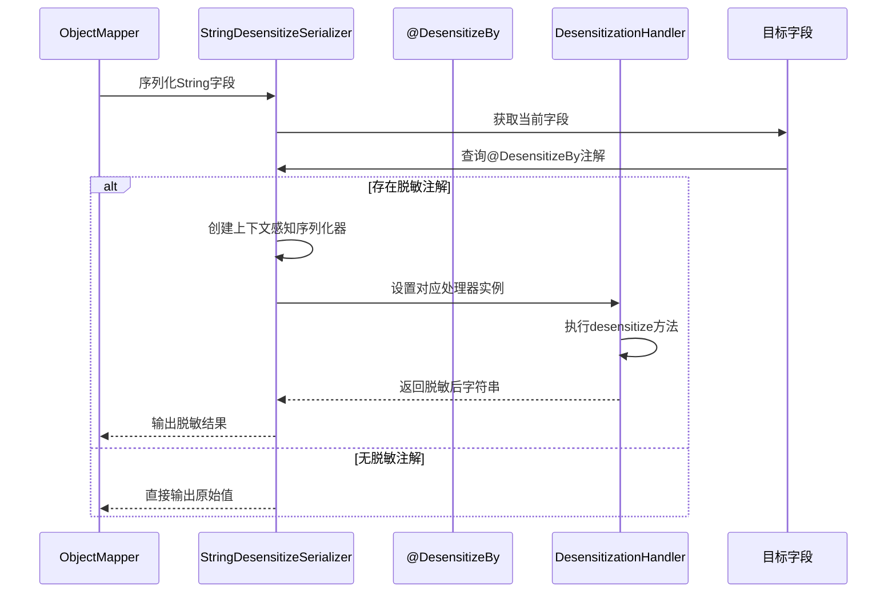
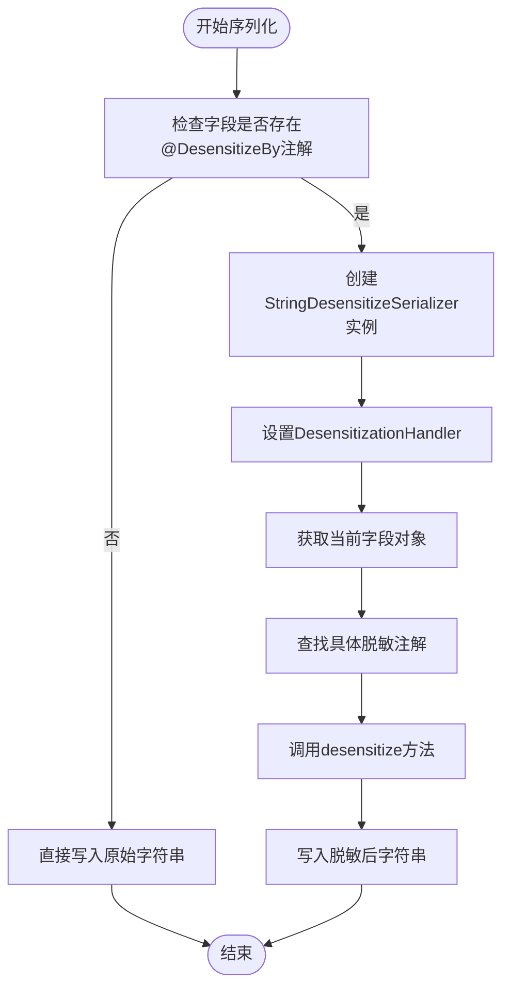

# 序列化集成

<cite>
**本文档引用文件**  
- [StringDesensitizeSerializer.java](file://yudao-framework/yudao-spring-boot-starter-web/src/main/java/cn/iocoder/yudao/framework/desensitize/core/base/serializer/StringDesensitizeSerializer.java)
- [DesensitizeBy.java](file://yudao-framework/yudao-spring-boot-starter-web/src/main/java/cn/iocoder/yudao/framework/desensitize/core/base/annotation/DesensitizeBy.java)
- [DesensitizationHandler.java](file://yudao-framework/yudao-spring-boot-starter-web/src/main/java/cn/iocoder/yudao/framework/desensitize/core/base/handler/DesensitizationHandler.java)
- [RegexDesensitize.java](file://yudao-framework/yudao-spring-boot-starter-web/src/main/java/cn/iocoder/yudao/framework/desensitize/core/regex/annotation/RegexDesensitize.java)
- [PasswordDesensitize.java](file://yudao-framework/yudao-spring-boot-starter-web/src/main/java/cn/iocoder/yudao/framework/desensitize/core/slider/annotation/PasswordDesensitize.java)
- [EmailDesensitize.java](file://yudao-framework/yudao-spring-boot-starter-web/src/main/java/cn/iocoder/yudao/framework/desensitize/core/regex/annotation/EmailDesensitize.java)
</cite>

## 目录
1. [简介](#简介)
2. [核心组件](#核心组件)
3. [集成机制](#集成机制)
4. [执行流程](#执行流程)
5. [配置方式](#配置方式)
6. [性能优化建议](#性能优化建议)
7. [应用场景](#应用场景)
8. [结论](#结论)

## 简介
本系统通过 `StringDesensitizeSerializer` 实现数据脱敏功能，该序列化器与 Spring Boot 的 Jackson 框架深度集成，能够在对象序列化为 JSON 时自动检测字段上的脱敏注解（如 `@DesensitizeBy`），并应用相应的脱敏规则。此机制广泛应用于 RESTful API 响应中，确保敏感信息（如手机号、邮箱、密码等）在传输过程中被自动脱敏处理。

## 核心组件

`StringDesensitizeSerializer` 是实现脱敏功能的核心类，继承自 Jackson 的 `StdSerializer<String>` 并实现 `ContextualSerializer` 接口。它负责在序列化过程中动态判断字段是否需要脱敏，并调用对应的处理器完成脱敏逻辑。

`DesensitizeBy` 是一个元注解，用于标记自定义脱敏注解，指定其关联的脱敏处理器和序列化器。所有具体的脱敏注解（如 `@MobileDesensitize`、`@EmailDesensitize`）均基于此注解构建。

`DesensitizationHandler` 是脱敏处理器接口，定义了 `desensitize` 方法，用于执行具体的脱敏算法。不同类型的脱敏逻辑通过实现该接口完成。

**本节来源**  
- [StringDesensitizeSerializer.java](file://yudao-framework/yudao-spring-boot-starter-web/src/main/java/cn/iocoder/yudao/framework/desensitize/core/base/serializer/StringDesensitizeSerializer.java#L29-L91)
- [DesensitizeBy.java](file://yudao-framework/yudao-spring-boot-starter-web/src/main/java/cn/iocoder/yudao/framework/desensitize/core/base/annotation/DesensitizeBy.java#L18-L31)
- [DesensitizationHandler.java](file://yudao-framework/yudao-spring-boot-starter-web/src/main/java/cn/iocoder/yudao/framework/desensitize/core/base/handler/DesensitizationHandler.java#L0-L39)

## 集成机制



**图示来源**  
- [StringDesensitizeSerializer.java](file://yudao-framework/yudao-spring-boot-starter-web/src/main/java/cn/iocoder/yudao/framework/desensitize/core/base/serializer/StringDesensitizeSerializer.java#L40-L50)
- [DesensitizeBy.java](file://yudao-framework/yudao-spring-boot-starter-web/src/main/java/cn/iocoder/yudao/framework/desensitize/core/base/annotation/DesensitizeBy.java#L18-L31)

## 执行流程

当 Jackson 进行对象序列化时，`StringDesensitizeSerializer` 的执行流程如下：

1. **调用时机**：每当需要序列化一个 `String` 类型字段时，Jackson 会检查该字段是否配置了自定义序列化器。
2. **上下文创建**：通过 `createContextual()` 方法获取字段上的 `@DesensitizeBy` 注解，若存在则创建一个新的 `StringDesensitizeSerializer` 实例，并注入对应的 `DesensitizationHandler`。
3. **字段识别**：在 `serialize()` 方法中，通过 `JsonGenerator` 获取当前正在序列化的字段对象（`Field`）。
4. **注解检测**：使用 `AnnotationUtil.getCombinationAnnotations()` 检查字段上是否存在任何带有 `@DesensitizeBy` 元注解的脱敏注解。
5. **处理器调用**：若检测到脱敏注解，则遍历字段注解，找到首个匹配的注解并调用其处理器的 `desensitize()` 方法进行脱敏处理。
6. **结果输出**：将脱敏后的字符串写入 JSON 输出流。



**图示来源**  
- [StringDesensitizeSerializer.java](file://yudao-framework/yudao-spring-boot-starter-web/src/main/java/cn/iocoder/yudao/framework/desensitize/core/base/serializer/StringDesensitizeSerializer.java#L52-L67)
- [DesensitizationHandler.java](file://yudao-framework/yudao-spring-boot-starter-web/src/main/java/cn/iocoder/yudao/framework/desensitize/core/base/handler/DesensitizationHandler.java#L15-L25)

## 配置方式

要将 `StringDesensitizeSerializer` 注册为默认字符串序列化器，需通过 `ObjectMapper` 进行配置：

```java
SimpleModule module = new SimpleModule();
module.addSerializer(String.class, new StringDesensitizeSerializer());
objectMapper.registerModule(module);
```

或者通过 Spring Boot 的 `Jackson2ObjectMapperBuilder` 自动装配：

```java
@Bean
public Jackson2ObjectMapperBuilder jackson2ObjectMapperBuilder() {
    return new Jackson2ObjectMapperBuilder()
        .serializers(new StringDesensitizeSerializer());
}
```

此外，用户可定义自己的脱敏注解，只需使用 `@DesensitizeBy` 标记并指定处理器类即可。例如：

```java
@DesensitizeBy(handler = EmailDesensitizationHandler.class)
@Target({ElementType.FIELD})
@Retention(RetentionPolicy.RUNTIME)
public @interface EmailDesensitize {
    String regex() default "(^.)[^@]*(@.*$)";
    String replacer() default "$1****$2";
}
```

**本节来源**  
- [StringDesensitizeSerializer.java](file://yudao-framework/yudao-spring-boot-starter-web/src/main/java/cn/iocoder/yudao/framework/desensitize/core/base/serializer/StringDesensitizeSerializer.java#L36-L38)
- [EmailDesensitize.java](file://yudao-framework/yudao-spring-boot-starter-web/src/main/java/cn/iocoder/yudao/framework/desensitize/core/regex/annotation/EmailDesensitize.java#L0-L43)
- [PasswordDesensitize.java](file://yudao-framework/yudao-spring-boot-starter-web/src/main/java/cn/iocoder/yudao/framework/desensitize/core/slider/annotation/PasswordDesensitize.java#L0-L48)

## 性能优化建议

为提升脱敏性能，建议采取以下措施：

- **处理器缓存**：利用 `Singleton.get()` 方法缓存 `DesensitizationHandler` 实例，避免重复创建对象。
- **减少反射调用**：`getField()` 方法中使用 `ReflectUtil.getField()` 获取字段，应尽量减少频繁反射操作，可通过字段缓存机制优化。
- **注解预处理**：在应用启动阶段预扫描所有实体类中的脱敏注解，建立字段与处理器的映射表，减少运行时查找开销。
- **条件判断前置**：对空值或空白字符串提前返回，避免不必要的处理逻辑。
- **正则编译缓存**：对于基于正则的脱敏（如 `RegexDesensitize`），应对正则表达式进行编译缓存，避免每次执行都重新编译。

**本节来源**  
- [StringDesensitizeSerializer.java](file://yudao-framework/yudao-spring-boot-starter-web/src/main/java/cn/iocoder/yudao/framework/desensitize/core/base/serializer/StringDesensitizeSerializer.java#L52-L55)
- [DesensitizeBy.java](file://yudao-framework/yudao-spring-boot-starter-web/src/main/java/cn/iocoder/yudao/framework/desensitize/core/base/annotation/DesensitizeBy.java#L25-L31)
- [RegexDesensitize.java](file://yudao-framework/yudao-spring-boot-starter-web/src/main/java/cn/iocoder/yudao/framework/desensitize/core/regex/annotation/RegexDesensitize.java#L0-L45)

## 应用场景

该脱敏机制适用于以下典型场景：

- **用户信息展示**：在返回用户列表或详情时，自动对手机号、身份证号、邮箱等敏感字段进行脱敏。
- **日志记录**：结合 AOP 或拦截器，在记录 API 请求日志时对敏感参数脱敏。
- **审计追踪**：在操作日志中隐藏密码、密钥等关键信息。
- **数据导出**：在 Excel 导出功能中集成脱敏逻辑，确保导出文件不包含明文敏感数据。

通过注解驱动的方式，开发者只需在实体类字段上添加相应注解即可实现全自动脱敏，无需修改业务逻辑代码。

**本节来源**  
- [StringDesensitizeSerializer.java](file://yudao-framework/yudao-spring-boot-starter-web/src/main/java/cn/iocoder/yudao/framework/desensitize/core/base/serializer/StringDesensitizeSerializer.java#L29-L91)
- [DesensitizeBy.java](file://yudao-framework/yudao-spring-boot-starter-web/src/main/java/cn/iocoder/yudao/framework/desensitize/core/base/annotation/DesensitizeBy.java#L18-L31)

## 结论

`StringDesensitizeSerializer` 提供了一种高效、灵活且易于扩展的数据脱敏解决方案。通过与 Jackson 框架的无缝集成，实现了在序列化过程中自动识别脱敏注解并执行相应处理逻辑的能力。结合 `@DesensitizeBy` 元注解机制，支持多种脱敏策略的统一管理。通过合理的性能优化手段，可在高并发场景下稳定运行，保障系统安全与性能的双重需求。