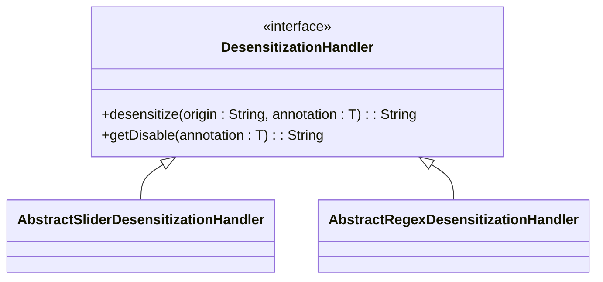
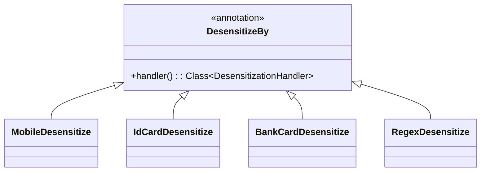
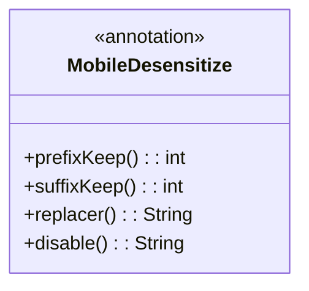
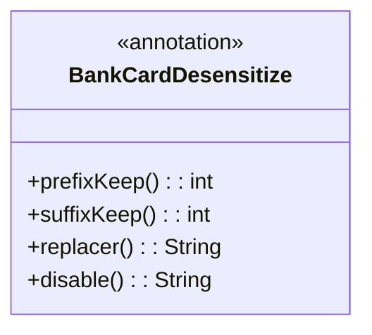
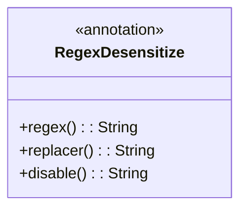
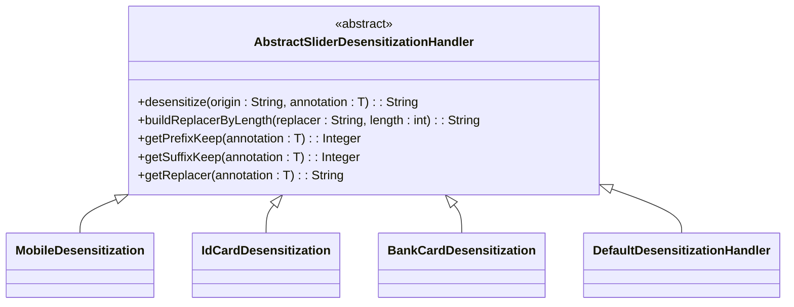
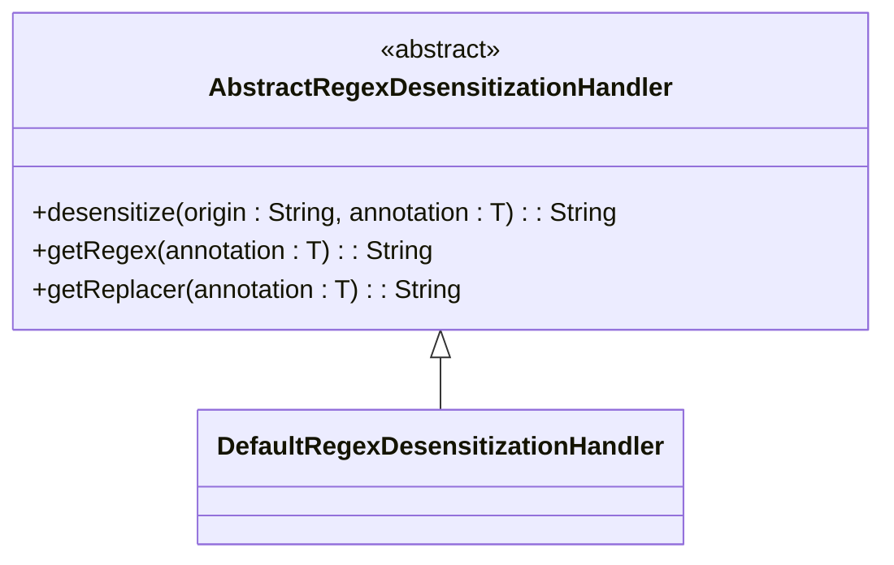
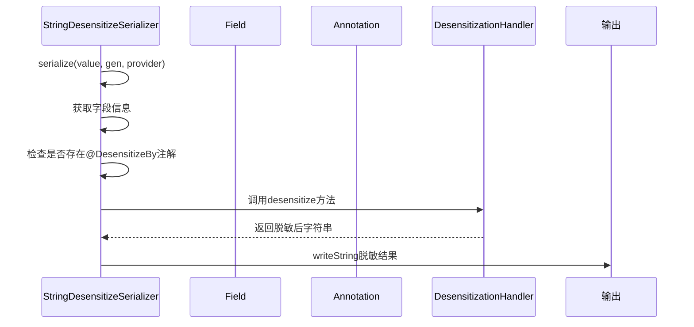

# 数据脱敏

<cite>
**本文档引用文件**   
- [DesensitizationHandler.java](file://yudao-framework/yudao-spring-boot-starter-web/src/main/java/cn/iocoder/yudao/framework/desensitize/core/base/handler/DesensitizationHandler.java)
- [StringDesensitizeSerializer.java](file://yudao-framework/yudao-spring-boot-starter-web/src/main/java/cn/iocoder/yudao/framework/desensitize/core/base/serializer/StringDesensitizeSerializer.java)
- [DesensitizeBy.java](file://yudao-framework/yudao-spring-boot-starter-web/src/main/java/cn/iocoder/yudao/framework/desensitize/core/base/annotation/DesensitizeBy.java)
- [AbstractSliderDesensitizationHandler.java](file://yudao-framework/yudao-spring-boot-starter-web/src/main/java/cn/iocoder/yudao/framework/desensitize/core/slider/handler/AbstractSliderDesensitizationHandler.java)
- [AbstractRegexDesensitizationHandler.java](file://yudao-framework/yudao-spring-boot-starter-web/src/main/java/cn/iocoder/yudao/framework/desensitize/core/regex/handler/AbstractRegexDesensitizationHandler.java)
- [MobileDesensitize.java](file://yudao-framework/yudao-spring-boot-starter-web/src/main/java/cn/iocoder/yudao/framework/desensitize/core/slider/annotation/MobileDesensitize.java)
- [IdCardDesensitize.java](file://yudao-framework/yudao-spring-boot-starter-web/src/main/java/cn/iocoder/yudao/framework/desensitize/core/slider/annotation/IdCardDesensitize.java)
- [BankCardDesensitize.java](file://yudao-framework/yudao-spring-boot-starter-web/src/main/java/cn/iocoder/yudao/framework/desensitize/core/slider/annotation/BankCardDesensitize.java)
- [RegexDesensitize.java](file://yudao-framework/yudao-spring-boot-starter-web/src/main/java/cn/iocoder/yudao/framework/desensitize/core/regex/annotation/RegexDesensitize.java)
</cite>

## 目录
1. [引言](#引言)
2. [核心组件](#核心组件)
3. [脱敏注解机制](#脱敏注解机制)
4. [脱敏处理器链设计](#脱敏处理器链设计)
5. [序列化器集成](#序列化器集成)
6. [常见脱敏场景配置](#常见脱敏场景配置)
7. [自定义扩展](#自定义扩展)

## 引言
本文档详细说明了系统中敏感信息的脱敏处理机制。通过基于注解的方式实现数据脱敏，确保在数据展示过程中保护用户隐私和敏感信息。

## 核心组件

### 脱敏处理器接口
脱敏功能的核心是 `DesensitizationHandler` 接口，定义了所有脱敏处理器必须实现的基本方法。



**图示来源**
- [DesensitizationHandler.java](file://yudao-framework/yudao-spring-boot-starter-web/src/main/java/cn/iocoder/yudao/framework/desensitize/core/base/handler/DesensitizationHandler.java#L11-L39)

**本节来源**
- [DesensitizationHandler.java](file://yudao-framework/yudao-spring-boot-starter-web/src/main/java/cn/iocoder/yudao/framework/desensitize/core/base/handler/DesensitizationHandler.java#L11-L39)

## 脱敏注解机制

### 基础注解结构
系统采用 `@DesensitizeBy` 作为顶级脱敏注解，所有具体的脱敏注解都基于此构建。



**图示来源**
- [DesensitizeBy.java](file://yudao-framework/yudao-spring-boot-starter-web/src/main/java/cn/iocoder/yudao/framework/desensitize/core/base/annotation/DesensitizeBy.java#L18-L31)

### 具体脱敏注解
#### 手机号脱敏
`@MobileDesensitize` 注解用于手机号码的脱敏处理，支持配置前缀保留长度、后缀保留长度和替换字符。



**图示来源**
- [MobileDesensitize.java](file://yudao-framework/yudao-spring-boot-starter-web/src/main/java/cn/iocoder/yudao/framework/desensitize/core/slider/annotation/MobileDesensitize.java#L1-L48)

#### 身份证号脱敏
`@IdCardDesensitize` 注解专门用于身份证号码的脱敏处理。


**图示来源**
- [IdCardDesensitize.java](file://yudao-framework/yudao-spring-boot-starter-web/src/main/java/cn/iocoder/yudao/framework/desensitize/core/slider/annotation/IdCardDesensitize.java#L1-L48)

#### 银行卡号脱敏
`@BankCardDesensitize` 注解用于银行卡号码的脱敏处理。



**图示来源**
- [BankCardDesensitize.java](file://yudao-framework/yudao-spring-boot-starter-web/src/main/java/cn/iocoder/yudao/framework/desensitize/core/slider/annotation/BankCardDesensitize.java#L1-L48)

#### 自定义正则脱敏
`@RegexDesensitize` 提供了基于正则表达式的灵活脱敏能力。



**图示来源**
- [RegexDesensitize.java](file://yudao-framework/yudao-spring-boot-starter-web/src/main/java/cn/iocoder/yudao/framework/desensitize/core/regex/annotation/RegexDesensitize.java#L1-L47)

**本节来源**
- [MobileDesensitize.java](file://yudao-framework/yudao-spring-boot-starter-web/src/main/java/cn/iocoder/yudao/framework/desensitize/core/slider/annotation/MobileDesensitize.java#L1-L48)
- [IdCardDesensitize.java](file://yudao-framework/yudao-spring-boot-starter-web/src/main/java/cn/iocoder/yudao/framework/desensitize/core/slider/annotation/IdCardDesensitize.java#L1-L48)
- [BankCardDesensitize.java](file://yudao-framework/yudao-spring-boot-starter-web/src/main/java/cn/iocoder/yudao/framework/desensitize/core/slider/annotation/BankCardDesensitize.java#L1-L48)
- [RegexDesensitize.java](file://yudao-framework/yudao-spring-boot-starter-web/src/main/java/cn/iocoder/yudao/framework/desensitize/core/regex/annotation/RegexDesensitize.java#L1-L47)

## 脱敏处理器链设计

### 滑动脱敏处理器
`AbstractSliderDesensitizationHandler` 是滑动脱敏的抽象基类，实现了通用的滑动脱敏逻辑。



**图示来源**
- [AbstractSliderDesensitizationHandler.java](file://yudao-framework/yudao-spring-boot-starter-web/src/main/java/cn/iocoder/yudao/framework/desensitize/core/slider/handler/AbstractSliderDesensitizationHandler.java#L13-L77)

### 正则脱敏处理器
`AbstractRegexDesensitizationHandler` 提供了基于正则表达式的脱敏处理能力。



**图示来源**
- [AbstractRegexDesensitizationHandler.java](file://yudao-framework/yudao-spring-boot-starter-web/src/main/java/cn/iocoder/yudao/framework/desensitize/core/regex/handler/AbstractRegexDesensitizationHandler.java#L12-L45)

**本节来源**
- [AbstractSliderDesensitizationHandler.java](file://yudao-framework/yudao-spring-boot-starter-web/src/main/java/cn/iocoder/yudao/framework/desensitize/core/slider/handler/AbstractSliderDesensitizationHandler.java#L13-L77)
- [AbstractRegexDesensitizationHandler.java](file://yudao-framework/yudao-spring-boot-starter-web/src/main/java/cn/iocoder/yudao/framework/desensitize/core/regex/handler/AbstractRegexDesensitizationHandler.java#L12-L45)

## 序列化器集成

### StringDesensitizeSerializer
该序列化器与 Jackson 深度集成，在序列化过程中自动应用脱敏规则。



**图示来源**
- [StringDesensitizeSerializer.java](file://yudao-framework/yudao-spring-boot-starter-web/src/main/java/cn/iocoder/yudao/framework/desensitize/core/base/serializer/StringDesensitizeSerializer.java#L29-L91)

**本节来源**
- [StringDesensitizeSerializer.java](file://yudao-framework/yudao-spring-boot-starter-web/src/main/java/cn/iocoder/yudao/framework/desensitize/core/base/serializer/StringDesensitizeSerializer.java#L29-L91)

## 常见脱敏场景配置

### 手机号脱敏示例
使用 `@MobileDesensitize` 注解对手机号字段进行脱敏：

```java
@MobileDesensitize(prefixKeep = 3, suffixKeep = 4, replacer = "*")
private String mobile;
```

### 身份证号脱敏示例
使用 `@IdCardDesensitize` 注解对身份证号字段进行脱敏：

```java
@IdCardDesensitize(prefixKeep = 6, suffixKeep = 2, replacer = "*")
private String idCard;
```

### 银行卡号脱敏示例
使用 `@BankCardDesensitize` 注解对银行卡号字段进行脱敏：

```java
@BankCardDesensitize(prefixKeep = 6, suffixKeep = 2, replacer = "*")
private String bankCard;
```

### 邮箱脱敏示例
使用 `@RegexDesensitize` 注解对邮箱进行脱敏：

```java
@RegexDesensitize(regex = "(\\w?)(\\w+)(\\w)(@\\w+\\.[^\\n]+)", replacer = "$1****$3$4")
private String email;
```

**本节来源**
- [MobileDesensitize.java](file://yudao-framework/yudao-spring-boot-starter-web/src/main/java/cn/iocoder/yudao/framework/desensitize/core/slider/annotation/MobileDesensitize.java#L1-L48)
- [IdCardDesensitize.java](file://yudao-framework/yudao-spring-boot-starter-web/src/main/java/cn/iocoder/yudao/framework/desensitize/core/slider/annotation/IdCardDesensitize.java#L1-L48)
- [BankCardDesensitize.java](file://yudao-framework/yudao-spring-boot-starter-web/src/main/java/cn/iocoder/yudao/framework/desensitize/core/slider/annotation/BankCardDesensitize.java#L1-L48)
- [RegexDesensitize.java](file://yudao-framework/yudao-spring-boot-starter-web/src/main/java/cn/iocoder/yudao/framework/desensitize/core/regex/annotation/RegexDesensitize.java#L1-L47)

## 自定义扩展

### 自定义脱敏规则
通过 `@DesensitizeBy` 注解可以创建自定义的脱敏注解：

```java
@Target({ElementType.FIELD})
@Retention(RetentionPolicy.RUNTIME)
@JacksonAnnotationsInside
@DesensitizeBy(handler = CustomDesensitizationHandler.class)
public @interface CustomDesensitize {
    int prefixKeep() default 1;
    int suffixKeep() default 1;
    String replacer() default "*";
    String disable() default "";
}
```

### 扩展自定义处理器
创建自定义处理器需要继承 `DesensitizationHandler` 接口：

```java
public class CustomDesensitizationHandler implements DesensitizationHandler<CustomDesensitize> {
    @Override
    public String desensitize(String origin, CustomDesensitize annotation) {
        // 自定义脱敏逻辑
        return origin;
    }
}
```

**本节来源**
- [DesensitizeBy.java](file://yudao-framework/yudao-spring-boot-starter-web/src/main/java/cn/iocoder/yudao/framework/desensitize/core/base/annotation/DesensitizeBy.java#L18-L31)
- [DesensitizationHandler.java](file://yudao-framework/yudao-spring-boot-starter-web/src/main/java/cn/iocoder/yudao/framework/desensitize/core/base/handler/DesensitizationHandler.java#L11-L39)