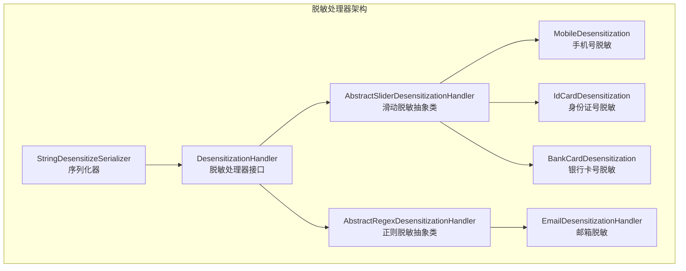
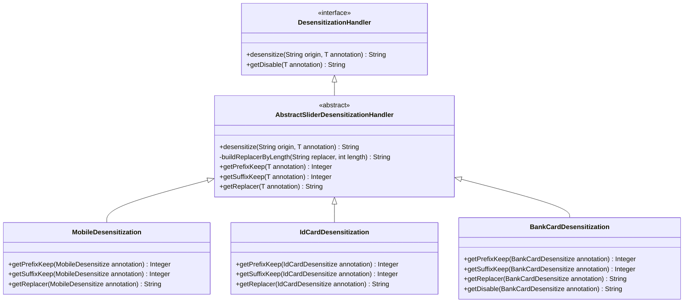
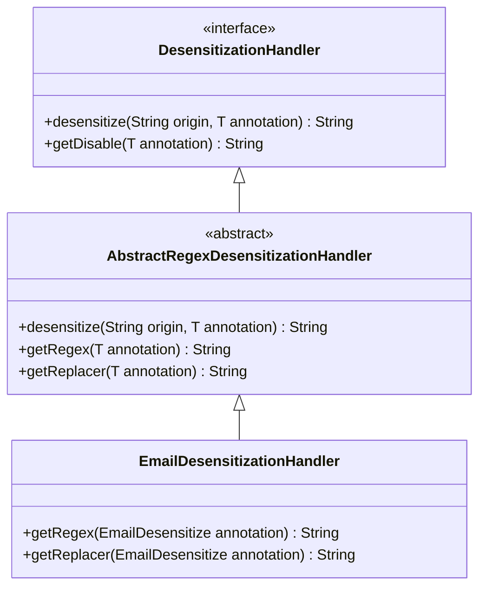
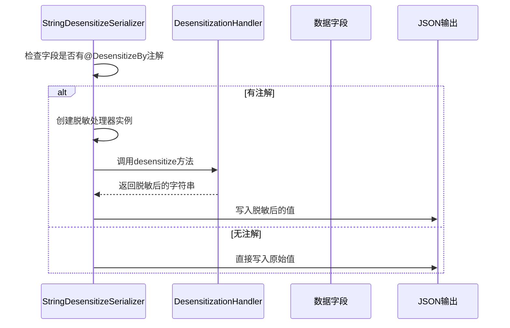
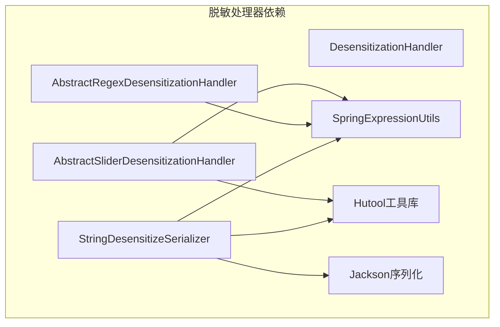

# 脱敏处理器

<cite>
**Referenced Files in This Document**   
- [DesensitizationHandler.java](file://yudao-framework/yudao-spring-boot-starter-web/src/main/java/cn/iocoder/yudao/framework/desensitize/core/base/handler/DesensitizationHandler.java)
- [AbstractSliderDesensitizationHandler.java](file://yudao-framework/yudao-spring-boot-starter-web/src/main/java/cn/iocoder/yudao/framework/desensitize/core/slider/handler/AbstractSliderDesensitizationHandler.java)
- [AbstractRegexDesensitizationHandler.java](file://yudao-framework/yudao-spring-boot-starter-web/src/main/java/cn/iocoder/yudao/framework/desensitize/core/regex/handler/AbstractRegexDesensitizationHandler.java)
- [MobileDesensitization.java](file://yudao-framework/yudao-spring-boot-starter-web/src/main/java/cn/iocoder/yudao/framework/desensitize/core/slider/handler/MobileDesensitization.java)
- [IdCardDesensitization.java](file://yudao-framework/yudao-spring-boot-starter-web/src/main/java/cn/iocoder/yudao/framework/desensitize/core/slider/handler/IdCardDesensitization.java)
- [BankCardDesensitization.java](file://yudao-framework/yudao-spring-boot-starter-web/src/main/java/cn/iocoder/yudao/framework/desensitize/core/slider/handler/BankCardDesensitization.java)
- [EmailDesensitizationHandler.java](file://yudao-framework/yudao-spring-boot-starter-web/src/main/java/cn/iocoder/yudao/framework/desensitize/core/regex/handler/EmailDesensitizationHandler.java)
- [StringDesensitizeSerializer.java](file://yudao-framework/yudao-spring-boot-starter-web/src/main/java/cn/iocoder/yudao/framework/desensitize/core/base/serializer/StringDesensitizeSerializer.java)
</cite>

## 目录
1. [简介](#简介)
2. [核心组件](#核心组件)
3. [架构概述](#架构概述)
4. [详细组件分析](#详细组件分析)
5. [依赖分析](#依赖分析)
6. [性能考虑](#性能考虑)
7. [故障排除指南](#故障排除指南)
8. [结论](#结论)

## 简介
本文档深入解析了脱敏处理器的实现逻辑，重点介绍MobileDesensitization、IdCardDesensitization、BankCardDesensitization等具体处理器的实现。文档详细说明了滑动脱敏处理器（AbstractSliderDesensitizationHandler）和正则脱敏处理器（AbstractRegexDesensitizationHandler）的抽象基类设计，以及处理器如何根据配置规则对敏感数据进行掩码处理。同时，文档还解释了EmailDesensitizationHandler如何使用正则表达式匹配和替换邮箱地址，并提供了扩展自定义处理器的开发指南。

## 核心组件
脱敏处理器系统由多个核心组件构成，包括基础接口DesensitizationHandler、抽象基类AbstractSliderDesensitizationHandler和AbstractRegexDesensitizationHandler，以及具体的实现类如MobileDesensitization、IdCardDesensitization等。这些组件共同构成了一个灵活且可扩展的脱敏处理框架，能够根据不同的配置规则对敏感数据进行有效的掩码处理。

**Section sources**
- [DesensitizationHandler.java](file://yudao-framework/yudao-spring-boot-starter-web/src/main/java/cn/iocoder/yudao/framework/desensitize/core/base/handler/DesensitizationHandler.java)
- [AbstractSliderDesensitizationHandler.java](file://yudao-framework/yudao-spring-boot-starter-web/src/main/java/cn/iocoder/yudao/framework/desensitize/core/slider/handler/AbstractSliderDesensitizationHandler.java)
- [AbstractRegexDesensitizationHandler.java](file://yudao-framework/yudao-spring-boot-starter-web/src/main/java/cn/iocoder/yudao/framework/desensitize/core/regex/handler/AbstractRegexDesensitizationHandler.java)

## 架构概述
脱敏处理器采用分层架构设计，通过抽象基类提供通用的脱敏逻辑，具体实现类则负责特定类型的脱敏处理。系统通过注解驱动的方式，将脱敏规则与数据字段关联，实现了灵活的配置和扩展能力。

**Diagram sources**
- [DesensitizationHandler.java](file://yudao-framework/yudao-spring-boot-starter-web/src/main/java/cn/iocoder/yudao/framework/desensitize/core/base/handler/DesensitizationHandler.java)
- [AbstractSliderDesensitizationHandler.java](file://yudao-framework/yudao-spring-boot-starter-web/src/main/java/cn/iocoder/yudao/framework/desensitize/core/slider/handler/AbstractSliderDesensitizationHandler.java)
- [AbstractRegexDesensitizationHandler.java](file://yudao-framework/yudao-spring-boot-starter-web/src/main/java/cn/iocoder/yudao/framework/desensitize/core/regex/handler/AbstractRegexDesensitizationHandler.java)
- [StringDesensitizeSerializer.java](file://yudao-framework/yudao-spring-boot-starter-web/src/main/java/cn/iocoder/yudao/framework/desensitize/core/base/serializer/StringDesensitizeSerializer.java)

## 详细组件分析

### 滑动脱敏处理器分析
滑动脱敏处理器通过AbstractSliderDesensitizationHandler抽象类实现，该类提供了通用的滑动脱敏逻辑。具体实现类如MobileDesensitization、IdCardDesensitization等通过继承该抽象类，实现了特定类型的脱敏处理。

#### 滑动脱敏处理器类图

**Diagram sources**
- [DesensitizationHandler.java](file://yudao-framework/yudao-spring-boot-starter-web/src/main/java/cn/iocoder/yudao/framework/desensitize/core/base/handler/DesensitizationHandler.java)
- [AbstractSliderDesensitizationHandler.java](file://yudao-framework/yudao-spring-boot-starter-web/src/main/java/cn/iocoder/yudao/framework/desensitize/core/slider/handler/AbstractSliderDesensitizationHandler.java)
- [MobileDesensitization.java](file://yudao-framework/yudao-spring-boot-starter-web/src/main/java/cn/iocoder/yudao/framework/desensitize/core/slider/handler/MobileDesensitization.java)
- [IdCardDesensitization.java](file://yudao-framework/yudao-spring-boot-starter-web/src/main/java/cn/iocoder/yudao/framework/desensitize/core/slider/handler/IdCardDesensitization.java)
- [BankCardDesensitization.java](file://yudao-framework/yudao-spring-boot-starter-web/src/main/java/cn/iocoder/yudao/framework/desensitize/core/slider/handler/BankCardDesensitization.java)

### 正则脱敏处理器分析
正则脱敏处理器通过AbstractRegexDesensitizationHandler抽象类实现，该类提供了基于正则表达式的通用脱敏逻辑。EmailDesensitizationHandler是其具体实现之一，用于处理邮箱地址的脱敏。

#### 正则脱敏处理器类图

**Diagram sources**
- [DesensitizationHandler.java](file://yudao-framework/yudao-spring-boot-starter-web/src/main/java/cn/iocoder/yudao/framework/desensitize/core/base/handler/DesensitizationHandler.java)
- [AbstractRegexDesensitizationHandler.java](file://yudao-framework/yudao-spring-boot-starter-web/src/main/java/cn/iocoder/yudao/framework/desensitize/core/regex/handler/AbstractRegexDesensitizationHandler.java)
- [EmailDesensitizationHandler.java](file://yudao-framework/yudao-spring-boot-starter-web/src/main/java/cn/iocoder/yudao/framework/desensitize/core/regex/handler/EmailDesensitizationHandler.java)

### 脱敏序列化器分析
StringDesensitizeSerializer是脱敏系统的核心组件之一，负责在JSON序列化过程中应用脱敏规则。它通过Jackson的序列化机制，自动识别带有脱敏注解的字段并进行处理。

#### 脱敏序列化流程

**Diagram sources**
- [StringDesensitizeSerializer.java](file://yudao-framework/yudao-spring-boot-starter-web/src/main/java/cn/iocoder/yudao/framework/desensitize/core/base/serializer/StringDesensitizeSerializer.java)
- [DesensitizationHandler.java](file://yudao-framework/yudao-spring-boot-starter-web/src/main/java/cn/iocoder/yudao/framework/desensitize/core/base/handler/DesensitizationHandler.java)

## 依赖分析
脱敏处理器系统依赖于多个框架组件，包括Spring Expression Language用于条件判断，Hutool工具库用于字符串处理，以及Jackson用于JSON序列化。这些依赖关系确保了系统的灵活性和可扩展性。

**Diagram sources**
- [AbstractSliderDesensitizationHandler.java](file://yudao-framework/yudao-spring-boot-starter-web/src/main/java/cn/iocoder/yudao/framework/desensitize/core/slider/handler/AbstractSliderDesensitizationHandler.java)
- [AbstractRegexDesensitizationHandler.java](file://yudao-framework/yudao-spring-boot-starter-web/src/main/java/cn/iocoder/yudao/framework/desensitize/core/regex/handler/AbstractRegexDesensitizationHandler.java)
- [StringDesensitizeSerializer.java](file://yudao-framework/yudao-spring-boot-starter-web/src/main/java/cn/iocoder/yudao/framework/desensitize/core/base/serializer/StringDesensitizeSerializer.java)

## 性能考虑
脱敏处理器在设计时考虑了性能因素。滑动脱敏处理器通过简单的字符串截取和替换操作实现高效处理，而正则脱敏处理器虽然性能相对较低，但通过缓存和优化正则表达式来提高效率。序列化器在处理大量数据时可能会成为性能瓶颈，建议在高并发场景下进行性能测试和优化。

## 故障排除指南
当脱敏功能未按预期工作时，应首先检查注解是否正确应用到目标字段，确认脱敏处理器是否已正确注册，以及序列化配置是否正确。对于复杂的脱敏规则，建议通过单元测试验证其正确性。

**Section sources**
- [StringDesensitizeSerializer.java](file://yudao-framework/yudao-spring-boot-starter-web/src/main/java/cn/iocoder/yudao/framework/desensitize/core/base/serializer/StringDesensitizeSerializer.java)

## 结论
脱敏处理器系统提供了一个灵活、可扩展的敏感数据保护解决方案。通过抽象基类和具体实现的分离，系统能够轻松支持新的脱敏规则和处理器。开发者可以根据业务需求，通过实现DesensitizationHandler接口并注册到处理器链中来扩展系统功能。