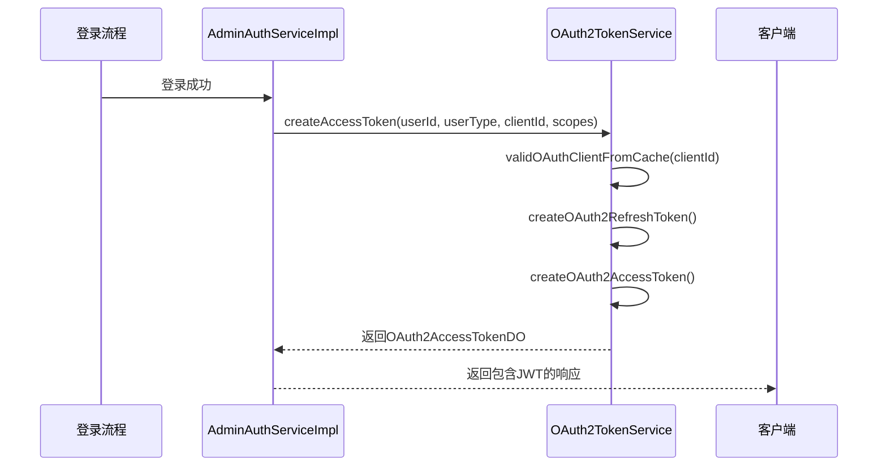
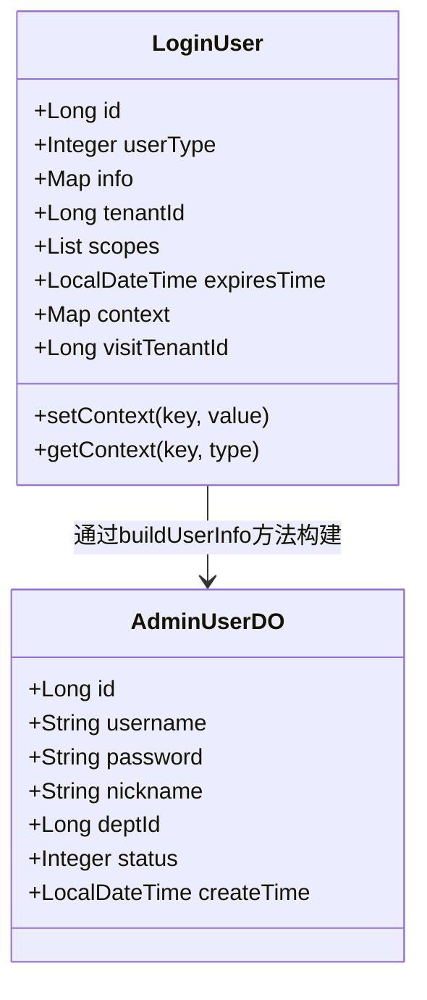
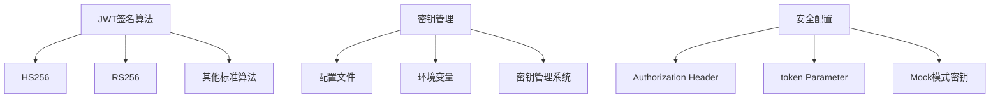
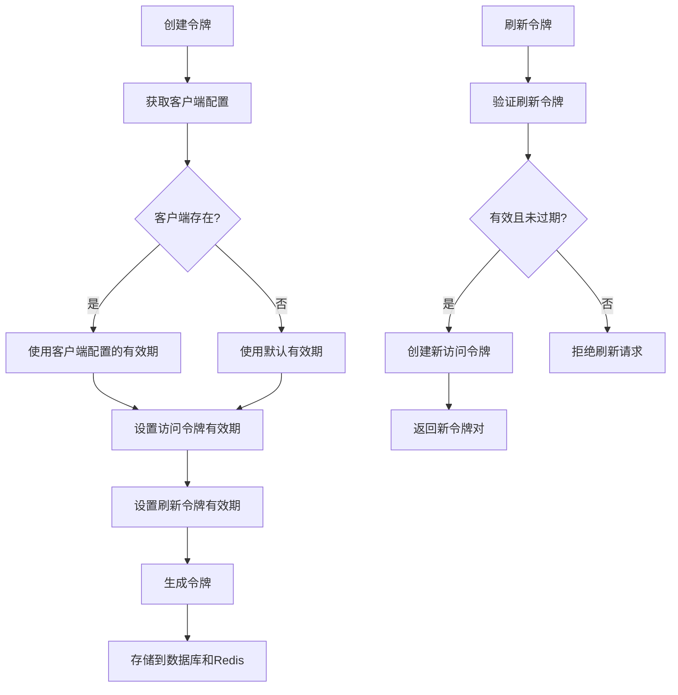
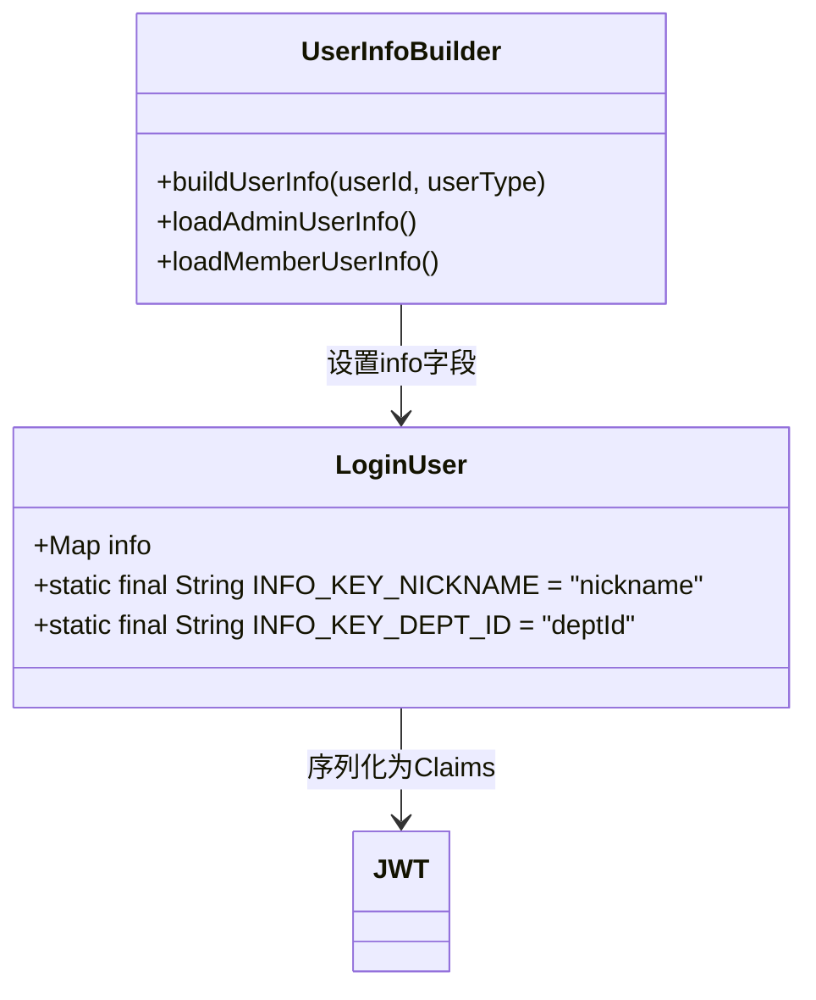
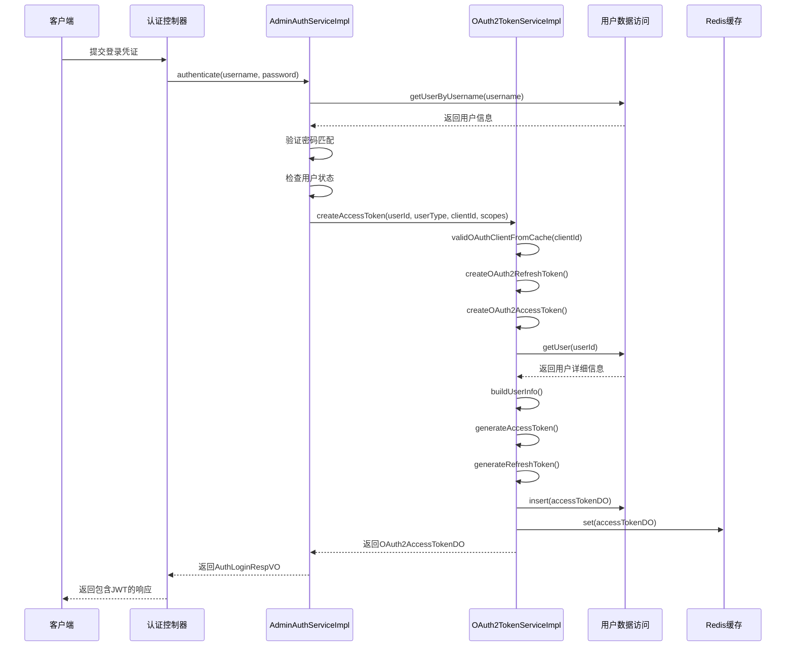

# JWT令牌生成

<cite>
**本文档引用的文件**   
- [AdminAuthServiceImpl.java](file://yudao-module-system/src/main/java/cn/iocoder/yudao/module/system/service/auth/AdminAuthServiceImpl.java)
- [LoginUser.java](file://yudao-framework/yudao-spring-boot-starter-security/src/main/java/cn/iocoder/yudao/framework/security/core/LoginUser.java)
- [OAuth2TokenServiceImpl.java](file://yudao-module-system/src/main/java/cn/iocoder/yudao/module/system/service/oauth2/OAuth2TokenServiceImpl.java)
- [application.yaml](file://yudao-server/src/main/resources/application.yaml)
- [AuthConvert.java](file://yudao-module-system/src/main/java/cn/iocoder/yudao/module/system/convert/auth/AuthConvert.java)
</cite>

## 目录
1. [简介](#简介)
2. [核心组件分析](#核心组件分析)
3. [JWT令牌生成流程](#jwt令牌生成流程)
4. [LoginUser对象序列化](#loginuser对象序列化)
5. [JWT签名算法与密钥管理](#jwt签名算法与密钥管理)
6. [令牌有效期与刷新策略](#令牌有效期与刷新策略)
7. [自定义Claims扩展](#自定义claims扩展)
8. [完整流程示例](#完整流程示例)
9. [结论](#结论)

## 简介
本文档详细说明了系统中JWT令牌的生成过程，重点分析了`AdminAuthServiceImpl`类中`createAccessToken`方法的实现逻辑。文档解释了`LoginUser`对象如何被序列化为JWT Claims，涵盖了用户ID、类型、租户ID等关键字段。同时描述了JWT签名算法的配置和密钥管理机制，文档化了令牌有效期和刷新令牌的生成策略，并提供了代码示例展示令牌生成的完整流程。

## 核心组件分析

本文档涉及的核心组件包括：
- `AdminAuthServiceImpl`：负责认证和令牌创建的核心服务实现类
- `LoginUser`：表示登录用户信息的数据结构
- `OAuth2TokenServiceImpl`：负责OAuth2.0令牌创建和管理的服务实现
- `AuthConvert`：负责数据对象转换的工具类

这些组件协同工作，实现了完整的JWT令牌生成和管理功能。

**文档来源**
- [AdminAuthServiceImpl.java](file://yudao-module-system/src/main/java/cn/iocoder/yudao/module/system/service/auth/AdminAuthServiceImpl.java)
- [LoginUser.java](file://yudao-framework/yudao-spring-boot-starter-security/src/main/java/cn/iocoder/yudao/framework/security/core/LoginUser.java)
- [OAuth2TokenServiceImpl.java](file://yudao-module-system/src/main/java/cn/iocoder/yudao/module/system/service/oauth2/OAuth2TokenServiceImpl.java)
- [AuthConvert.java](file://yudao-module-system/src/main/java/cn/iocoder/yudao/module/system/convert/auth/AuthConvert.java)

## JWT令牌生成流程

JWT令牌的生成流程始于用户成功登录后，系统调用`AdminAuthServiceImpl`类的`createTokenAfterLoginSuccess`方法。该方法首先记录登录日志，然后通过`oauth2TokenService.createAccessToken`方法创建访问令牌。

**流程来源**
- [AdminAuthServiceImpl.java](file://yudao-module-system/src/main/java/cn/iocoder/yudao/module/system/service/auth/AdminAuthServiceImpl.java#L250-L255)
- [OAuth2TokenServiceImpl.java](file://yudao-module-system/src/main/java/cn/iocoder/yudao/module/system/service/oauth2/OAuth2TokenServiceImpl.java#L30-L37)

## LoginUser对象序列化

`LoginUser`对象是JWT Claims序列化的基础，包含了用户身份验证所需的关键信息。该对象通过`buildUserInfo`方法从数据库用户信息构建，并作为用户信息字段包含在JWT Claims中。

**序列化来源**
- [LoginUser.java](file://yudao-framework/yudao-spring-boot-starter-security/src/main/java/cn/iocoder/yudao/framework/security/core/LoginUser.java#L26-L57)
- [OAuth2TokenServiceImpl.java](file://yudao-module-system/src/main/java/cn/iocoder/yudao/module/system/service/oauth2/OAuth2TokenServiceImpl.java#L170-L188)

## JWT签名算法与密钥管理

系统使用标准的JWT签名算法来确保令牌的安全性。虽然具体签名算法的实现细节未在提供的代码中直接显示，但系统通过Spring Security框架集成JWT功能，通常使用HS256等标准算法。

密钥管理通过配置文件进行，系统在`application.yaml`中配置了安全相关的参数，包括令牌头信息和参数名称。密钥本身通常存储在环境变量或安全的配置中心中，以确保安全性。

**配置来源**
- [application.yaml](file://yudao-server/src/main/resources/application.yaml#L300-L315)
- [SecurityProperties.java](file://yudao-framework/yudao-spring-boot-starter-security/src/main/java/cn/iocoder/yudao/framework/security/config/SecurityProperties.java)

## 令牌有效期与刷新策略

系统实现了完善的令牌有效期管理和刷新策略。访问令牌和刷新令牌的有效期通过客户端配置进行管理，而不是硬编码在系统中。

访问令牌的有效期和刷新令牌的有效期在`OAuth2ClientDO`对象中定义，通过`accessTokenValiditySeconds`和`refreshTokenValiditySeconds`属性进行配置。这种设计允许不同客户端有不同的安全策略，提高了系统的灵活性。

**有效期来源**
- [OAuth2ClientSaveReqVO.java](file://yudao-module-system/src/main/java/cn/iocoder/yudao/module/system/controller/admin/oauth2/vo/client/OAuth2ClientSaveReqVO.java#L38-L55)
- [OAuth2TokenServiceImpl.java](file://yudao-module-system/src/main/java/cn/iocoder/yudao/module/system/service/oauth2/OAuth2TokenServiceImpl.java#L130-L131)

## 自定义Claims扩展

系统支持通过`LoginUser`对象的`info`字段扩展自定义Claims。`buildUserInfo`方法负责从用户数据中提取额外信息，并将其添加到`LoginUser`对象中，最终序列化为JWT Claims的一部分。

当前实现中，对于管理员用户类型，系统会自动添加昵称和部门ID作为额外信息。这种设计模式允许在不修改核心认证逻辑的情况下，灵活地扩展JWT Claims内容。

**扩展来源**
- [LoginUser.java](file://yudao-framework/yudao-spring-boot-starter-security/src/main/java/cn/iocoder/yudao/framework/security/core/LoginUser.java#L20-L21)
- [OAuth2TokenServiceImpl.java](file://yudao-module-system/src/main/java/cn/iocoder/yudao/module/system/service/oauth2/OAuth2TokenServiceImpl.java#L170-L188)

## 完整流程示例

以下是JWT令牌生成的完整流程示例，展示了从用户登录到令牌生成的全过程：

该流程展示了系统如何安全地验证用户身份，并生成包含必要信息的JWT令牌，同时确保令牌信息被正确存储和缓存。

**完整流程来源**
- [AdminAuthServiceImpl.java](file://yudao-module-system/src/main/java/cn/iocoder/yudao/module/system/service/auth/AdminAuthServiceImpl.java)
- [OAuth2TokenServiceImpl.java](file://yudao-module-system/src/main/java/cn/iocoder/yudao/module/system/service/oauth2/OAuth2TokenServiceImpl.java)

## 结论

本文档详细分析了系统中JWT令牌的生成机制，涵盖了从用户认证到令牌创建的完整流程。系统通过`AdminAuthServiceImpl`和`OAuth2TokenServiceImpl`等核心组件，实现了安全可靠的JWT令牌管理功能。

关键特点包括：
- 基于`LoginUser`对象的灵活Claims序列化机制
- 支持客户端自定义的令牌有效期配置
- 通过`info`字段实现的自定义Claims扩展能力
- 数据库与Redis双重存储的高可用性设计
- 完善的刷新令牌机制确保用户体验

这些设计确保了系统在安全性、灵活性和可扩展性方面的优秀表现，为应用程序提供了可靠的认证和授权基础。