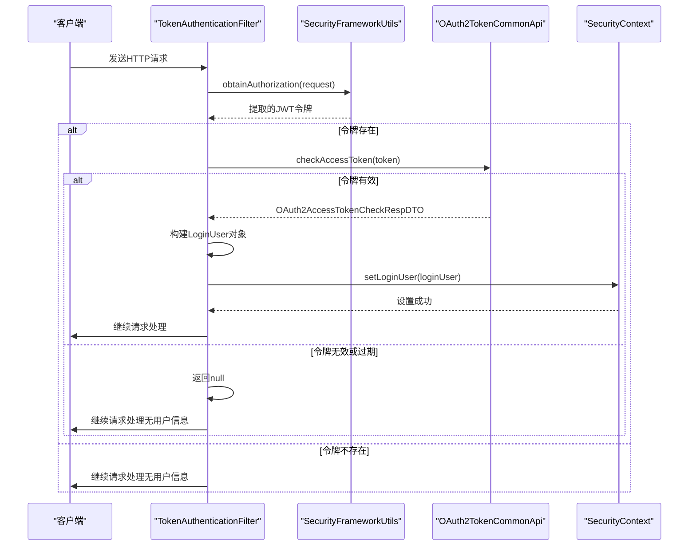
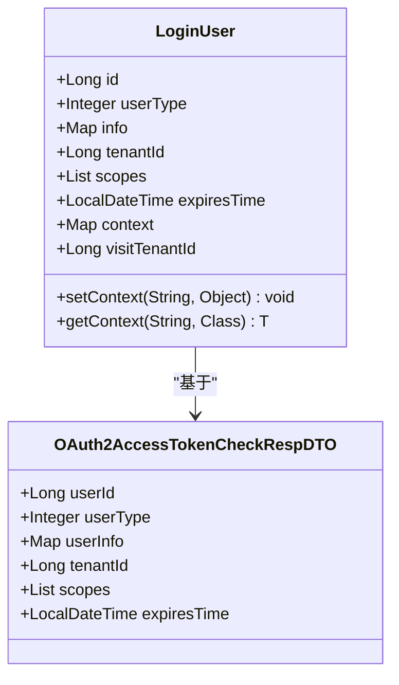

# JWT令牌验证

<cite>
**Referenced Files in This Document**   
- [TokenAuthenticationFilter.java](file://yudao-framework/yudao-spring-boot-starter-security/src/main/java/cn/iocoder/yudao/framework/security/core/filter/TokenAuthenticationFilter.java)
- [LoginUser.java](file://yudao-framework/yudao-spring-boot-starter-security/src/main/java/cn/iocoder/yudao/framework/security/core/LoginUser.java)
- [OAuth2AccessTokenCheckRespDTO.java](file://yudao-framework/yudao-common/src/main/java/cn/iocoder/yudao/framework/common/biz/system/oauth2/dto/OAuth2AccessTokenCheckRespDTO.java)
- [SecurityFrameworkUtils.java](file://yudao-framework/yudao-spring-boot-starter-security/src/main/java/cn/iocoder/yudao/framework/security/core/util/SecurityFrameworkUtils.java)
- [WebFrameworkUtils.java](file://yudao-framework/yudao-spring-boot-starter-web/src/main/java/cn/iocoder/yudao/framework/web/core/util/WebFrameworkUtils.java)
- [OAuth2TokenCommonApi.java](file://yudao-framework/yudao-common/src/main/java/cn/iocoder/yudao/framework/common/biz/system/oauth2/OAuth2TokenCommonApi.java)
</cite>

## 目录
1. [简介](#简介)
2. [令牌验证流程](#令牌验证流程)
3. [核心组件分析](#核心组件分析)
4. [异常处理策略](#异常处理策略)
5. [结论](#结论)

## 简介
本文档深入解析了`TokenAuthenticationFilter`中的JWT令牌验证流程。该过滤器是系统安全框架的核心组件，负责验证HTTP请求中的JWT令牌，确保只有经过授权的用户才能访问受保护的资源。文档详细说明了从HTTP请求头中提取JWT令牌、验证其签名有效性和过期时间的完整过程，以及验证成功后如何构建`Authentication`对象并设置到`SecurityContext`中的机制。

## 令牌验证流程

**Diagram sources**
- [TokenAuthenticationFilter.java](file://yudao-framework/yudao-spring-boot-starter-security/src/main/java/cn/iocoder/yudao/framework/security/core/filter/TokenAuthenticationFilter.java#L30-L118)
- [SecurityFrameworkUtils.java](file://yudao-framework/yudao-spring-boot-starter-security/src/main/java/cn/iocoder/yudao/framework/security/core/util/SecurityFrameworkUtils.java#L23-L50)
- [OAuth2TokenCommonApi.java](file://yudao-framework/yudao-common/src/main/java/cn/iocoder/yudao/framework/common/biz/system/oauth2/OAuth2TokenCommonApi.java#L15-L20)

## 核心组件分析

### 令牌提取与验证
`TokenAuthenticationFilter`的`doFilterInternal`方法是整个验证流程的入口。该方法首先通过`SecurityFrameworkUtils.obtainAuthorization`从HTTP请求中提取JWT令牌。提取过程遵循优先级规则：首先检查请求头（Header），然后检查请求参数（Parameter）。提取到的令牌会去除`Bearer`前缀，得到纯净的JWT字符串。

**Section sources**
- [TokenAuthenticationFilter.java](file://yudao-framework/yudao-spring-boot-starter-security/src/main/java/cn/iocoder/yudao/framework/security/core/filter/TokenAuthenticationFilter.java#L30-L118)
- [SecurityFrameworkUtils.java](file://yudao-framework/yudao-spring-boot-starter-security/src/main/java/cn/iocoder/yudao/framework/security/core/util/SecurityFrameworkUtils.java#L23-L50)

### LoginUser对象构建
当成功提取到JWT令牌后，系统会调用`OAuth2TokenCommonApi.checkAccessToken`方法对令牌进行校验。如果校验成功，系统会根据返回的`OAuth2AccessTokenCheckRespDTO`对象构建`LoginUser`对象。`LoginUser`对象包含了用户的核心信息，如用户编号、用户类型、租户编号、授权范围和过期时间等。

**Diagram sources**
- [LoginUser.java](file://yudao-framework/yudao-spring-boot-starter-security/src/main/java/cn/iocoder/yudao/framework/security/core/LoginUser.java#L17-L74)
- [OAuth2AccessTokenCheckRespDTO.java](file://yudao-framework/yudao-common/src/main/java/cn/iocoder/yudao/framework/common/biz/system/oauth2/dto/OAuth2AccessTokenCheckRespDTO.java#L14-L42)

### 安全上下文设置
构建好的`LoginUser`对象会被设置到Spring Security的上下文中。`SecurityFrameworkUtils.setLoginUser`方法负责创建`UsernamePasswordAuthenticationToken`对象，并将其设置到`SecurityContextHolder`中。同时，为了确保其他过滤器（如`ApiAccessLogFilter`）能够获取到用户信息，用户编号和用户类型也会被设置到`HttpServletRequest`的属性中。

**Section sources**
- [SecurityFrameworkUtils.java](file://yudao-framework/yudao-spring-boot-starter-security/src/main/java/cn/iocoder/yudao/framework/security/core/util/SecurityFrameworkUtils.java#L100-L130)
- [WebFrameworkUtils.java](file://yudao-framework/yudao-spring-boot-starter-web/src/main/java/cn/iocoder/yudao/framework/web/core/util/WebFrameworkUtils.java#L50-L80)

## 异常处理策略
系统对无效令牌、过期令牌和缺失令牌采用了不同的处理策略。对于无效或过期的令牌，`checkAccessToken`方法会抛出`ServiceException`，`TokenAuthenticationFilter`会捕获此异常并直接返回`null`，表示该请求无需用户认证。对于缺失令牌的情况，系统同样会继续处理请求，允许访问无需认证的接口。这种设计确保了系统的灵活性，既保护了需要认证的资源，又不妨碍公开接口的访问。

**Section sources**
- [TokenAuthenticationFilter.java](file://yudao-framework/yudao-spring-boot-starter-security/src/main/java/cn/iocoder/yudao/framework/security/core/filter/TokenAuthenticationFilter.java#L70-L80)
- [OAuth2TokenCommonApi.java](file://yudao-framework/yudao-common/src/main/java/cn/iocoder/yudao/framework/common/biz/system/oauth2/OAuth2TokenCommonApi.java#L20-L25)

## 结论
`TokenAuthenticationFilter`实现了一个完整且灵活的JWT令牌验证机制。通过与`OAuth2TokenCommonApi`的协作，系统能够有效地验证令牌的有效性，并将用户信息安全地传递到后续的处理流程中。异常处理策略的设计既保证了系统的安全性，又保持了足够的灵活性，能够适应不同的业务场景需求。