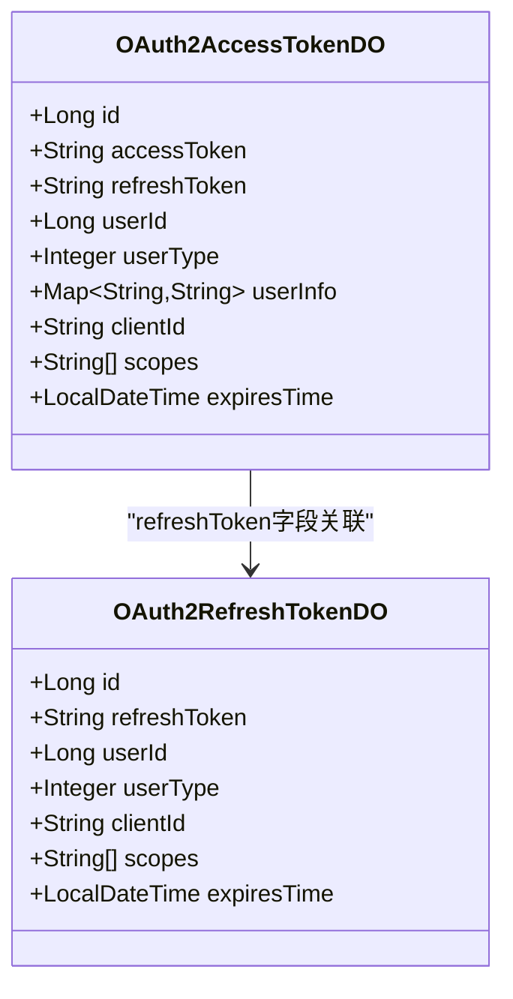
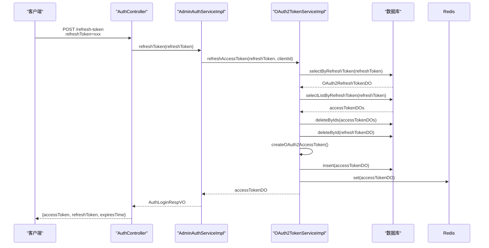
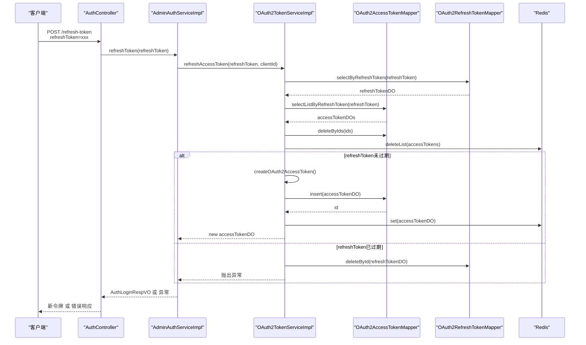

# JWT刷新机制

<cite>
**本文档引用文件**  
- [AuthController.java](file://yudao-module-system/src/main/java/cn/iocoder/yudao/module/system/controller/admin/auth/AuthController.java)
- [AdminAuthServiceImpl.java](file://yudao-module-system/src/main/java/cn/iocoder/yudao/module/system/service/auth/AdminAuthServiceImpl.java)
- [OAuth2TokenServiceImpl.java](file://yudao-module-system/src/main/java/cn/iocoder/yudao/module/system/service/oauth2/OAuth2TokenServiceImpl.java)
- [OAuth2AccessTokenDO.java](file://yudao-module-system/src/main/java/cn/iocoder/yudao/module/system/dal/dataobject/oauth2/OAuth2AccessTokenDO.java)
- [OAuth2RefreshTokenDO.java](file://yudao-module-system/src/main/java/cn/iocoder/yudao/module/system/dal/dataobject/oauth2/OAuth2RefreshTokenDO.java)
- [AuthLoginRespVO.java](file://yudao-module-system/src/main/java/cn/iocoder/yudao/module/system/controller/admin/auth/vo/AuthLoginRespVO.java)
</cite>

## 目录
1. [简介](#简介)
2. [refreshToken生成与存储机制](#refreshtoken生成与存储机制)
3. [refreshToken验证与刷新流程](#refreshtoken验证与刷新流程)
4. [AuthController中refreshToken接口实现](#authcontroller中refreshtoken接口实现)
5. [安全存储建议与防滥用机制](#安全存储建议与防滥用机制)
6. [刷新流程时序图](#刷新流程时序图)
7. [异常处理场景](#异常处理场景)
8. [总结](#总结)

## 简介
JWT（JSON Web Token）刷新机制是现代认证系统中的关键组成部分，用于在访问令牌（accessToken）过期后，通过刷新令牌（refreshToken）获取新的访问令牌，从而提升用户体验并保障系统安全。本系统基于OAuth2.0协议实现JWT刷新机制，通过`AuthController`暴露刷新接口，由`AdminAuthServiceImpl`和`OAuth2TokenServiceImpl`协同完成令牌的生成、验证与刷新逻辑。

该机制的核心优势在于将短期有效的访问令牌与长期有效的刷新令牌分离，既保证了接口调用的安全性，又避免了用户频繁重新登录。refreshToken通常具有更长的有效期，并在数据库和Redis中持久化存储，确保其可追溯性和安全性。

**Section sources**
- [AuthController.java](file://yudao-module-system/src/main/java/cn/iocoder/yudao/module/system/controller/admin/auth/AuthController.java#L83-L89)
- [OAuth2TokenServiceImpl.java](file://yudao-module-system/src/main/java/cn/iocoder/yudao/module/system/service/oauth2/OAuth2TokenServiceImpl.java#L59-L67)

## refreshToken生成与存储机制
refreshToken在用户首次登录成功时与accessToken一同生成。当用户通过账号密码或短信验证码登录后，系统调用`oauth2TokenService.createAccessToken()`方法，该方法内部会先创建一个refreshToken，再创建accessToken。

refreshToken的生成采用`IdUtil.fastSimpleUUID()`生成唯一字符串，并与用户ID、用户类型、客户端ID、授权范围及过期时间等信息一并封装为`OAuth2RefreshTokenDO`对象，持久化存储至MySQL的`system_oauth2_refresh_token`表中。同时，系统会将refreshToken与对应的accessToken关联，确保刷新时的匹配验证。

refreshToken的有效期由客户端配置的`refreshTokenValiditySeconds`决定，通常远长于accessToken的有效期（如7天 vs 2小时），从而实现长期会话保持。

**Diagram sources**
- [OAuth2RefreshTokenDO.java](file://yudao-module-system/src/main/java/cn/iocoder/yudao/module/system/dal/dataobject/oauth2/OAuth2RefreshTokenDO.java#L18-L58)
- [OAuth2AccessTokenDO.java](file://yudao-module-system/src/main/java/cn/iocoder/yudao/module/system/dal/dataobject/oauth2/OAuth2AccessTokenDO.java#L24-L74)

**Section sources**
- [OAuth2TokenServiceImpl.java](file://yudao-module-system/src/main/java/cn/iocoder/yudao/module/system/service/oauth2/OAuth2TokenServiceImpl.java#L174-L181)
- [OAuth2AccessTokenDO.java](file://yudao-module-system/src/main/java/cn/iocoder/yudao/module/system/dal/dataobject/oauth2/OAuth2AccessTokenDO.java#L42)

## refreshToken验证与刷新流程
refreshToken的验证与刷新流程是JWT机制的核心安全环节。当客户端需要刷新令牌时，需提供有效的refreshToken和客户端ID。系统通过`OAuth2TokenServiceImpl.refreshAccessToken()`方法执行以下步骤：

1. **查询refreshToken**：通过`oauth2RefreshTokenMapper.selectByRefreshToken()`从数据库查询refreshToken记录。
2. **校验客户端匹配**：验证请求的客户端ID与refreshToken中存储的客户端ID是否一致，防止跨客户端滥用。
3. **移除旧令牌**：删除该refreshToken关联的所有旧accessToken，确保一次性使用。
4. **检查过期时间**：若refreshToken已过期，则删除其记录并抛出异常。
5. **生成新令牌**：若验证通过，则基于原refreshToken信息调用`createOAuth2AccessToken()`生成新的accessToken和refreshToken对。

此流程确保了refreshToken的单次有效性，防止重放攻击，并通过客户端绑定增强了安全性。

**Section sources**
- [OAuth2TokenServiceImpl.java](file://yudao-module-system/src/main/java/cn/iocoder/yudao/module/system/service/oauth2/OAuth2TokenServiceImpl.java#L69-L99)

## AuthController中refreshToken接口实现
`AuthController`中的`refreshToken`接口是刷新机制的入口，通过`POST /system/auth/refresh-token`暴露。该接口由`@PermitAll`注解标记，允许未认证用户访问，但必须提供有效的refreshToken。

接口接收`refreshToken`作为请求参数，调用`AdminAuthServiceImpl.refreshToken()`服务方法。该方法进一步委托给`OAuth2TokenService.refreshAccessToken()`完成核心逻辑，并将生成的`OAuth2AccessTokenDO`对象通过`AuthConvert.INSTANCE.convert()`转换为包含新accessToken和refreshToken的`AuthLoginRespVO`返回给客户端。

返回的`AuthLoginRespVO`包含新的accessToken、refreshToken及过期时间，客户端应立即更新本地存储的令牌对。

**Diagram sources**
- [AuthController.java](file://yudao-module-system/src/main/java/cn/iocoder/yudao/module/system/controller/admin/auth/AuthController.java#L83-L89)
- [AdminAuthServiceImpl.java](file://yudao-module-system/src/main/java/cn/iocoder/yudao/module/system/service/auth/AdminAuthServiceImpl.java#L220-L224)
- [OAuth2TokenServiceImpl.java](file://yudao-module-system/src/main/java/cn/iocoder/yudao/module/system/service/oauth2/OAuth2TokenServiceImpl.java#L69-L99)

**Section sources**
- [AuthController.java](file://yudao-module-system/src/main/java/cn/iocoder/yudao/module/system/controller/admin/auth/AuthController.java#L83-L89)
- [AuthLoginRespVO.java](file://yudao-module-system/src/main/java/cn/iocoder/yudao/module/system/controller/admin/auth/vo/AuthLoginRespVO.java#L23-L24)

## 安全存储建议与防滥用机制
为保障refreshToken的安全，系统采用多重防护机制：

1. **HttpOnly Cookie存储**：建议前端将refreshToken存储在HttpOnly Cookie中，防止XSS攻击窃取。
2. **客户端绑定**：每个refreshToken与特定客户端ID绑定，防止跨应用滥用。
3. **单次有效性**：每次刷新后，旧的refreshToken会被立即删除，确保无法重复使用。
4. **过期机制**：refreshToken具有明确的过期时间，过期后无法使用，需用户重新登录。
5. **数据库持久化**：refreshToken存储在数据库中，便于审计和主动撤销。

此外，系统通过Redis缓存accessToken以提升性能，但refreshToken的验证始终以数据库为准，确保数据一致性。

**Section sources**
- [OAuth2TokenServiceImpl.java](file://yudao-module-system/src/main/java/cn/iocoder/yudao/module/system/service/oauth2/OAuth2TokenServiceImpl.java#L85-L89)
- [OAuth2RefreshTokenMapper.java](file://yudao-module-system/src/main/java/cn/iocoder/yudao/module/system/dal/mysql/oauth2/OAuth2RefreshTokenMapper.java#L16-L19)

## 刷新流程时序图
下图详细描述了从客户端发起刷新请求到获取新令牌的完整流程：

**Diagram sources**
- [OAuth2TokenServiceImpl.java](file://yudao-module-system/src/main/java/cn/iocoder/yudao/module/system/service/oauth2/OAuth2TokenServiceImpl.java#L69-L99)
- [OAuth2AccessTokenMapper.java](file://yudao-module-system/src/main/java/cn/iocoder/yudao/module/system/dal/mysql/oauth2/OAuth2AccessTokenMapper.java#L16-L19)
- [OAuth2RefreshTokenMapper.java](file://yudao-module-system/src/main/java/cn/iocoder/yudao/module/system/dal/mysql/oauth2/OAuth2RefreshTokenMapper.java#L16-L19)

## 异常处理场景
系统对refreshToken的异常情况进行了全面处理：

1. **无效refreshToken**：若提供的refreshToken不存在，系统返回`BAD_REQUEST`错误码。
2. **客户端不匹配**：若refreshToken的客户端ID与请求不符，返回`BAD_REQUEST`错误码。
3. **refreshToken过期**：若refreshToken已过期，系统删除其记录并返回`UNAUTHORIZED`错误码，用户需重新登录。
4. **refreshToken被撤销**：若refreshToken已被使用或手动删除，查询结果为空，视为无效。

这些异常均通过`ServiceExceptionUtil.exception0()`抛出，确保前端能准确识别错误类型并采取相应措施。

**Section sources**
- [OAuth2TokenServiceImpl.java](file://yudao-module-system/src/main/java/cn/iocoder/yudao/module/system/service/oauth2/OAuth2TokenServiceImpl.java#L72-L75)
- [OAuth2TokenServiceImpl.java](file://yudao-module-system/src/main/java/cn/iocoder/yudao/module/system/service/oauth2/OAuth2TokenServiceImpl.java#L88-L90)

## 总结
本系统通过`AuthController`、`AdminAuthServiceImpl`和`OAuth2TokenServiceImpl`三层协作，实现了安全可靠的JWT刷新机制。refreshToken在用户登录时生成，存储于数据库，并与客户端绑定。刷新流程严格验证refreshToken的有效性、客户端匹配和过期状态，确保每次刷新后旧令牌失效，新令牌安全生成。

通过HttpOnly Cookie存储、单次有效性、过期机制等多重安全策略，系统有效防止了refreshToken的滥用和窃取。完善的异常处理机制确保了在各种错误场景下系统行为的可预测性和安全性，为用户提供流畅且安全的认证体验。

**Section sources**
- [OAuth2TokenServiceImpl.java](file://yudao-module-system/src/main/java/cn/iocoder/yudao/module/system/service/oauth2/OAuth2TokenServiceImpl.java#L69-L99)
- [AuthController.java](file://yudao-module-system/src/main/java/cn/iocoder/yudao/module/system/controller/admin/auth/AuthController.java#L83-L89)