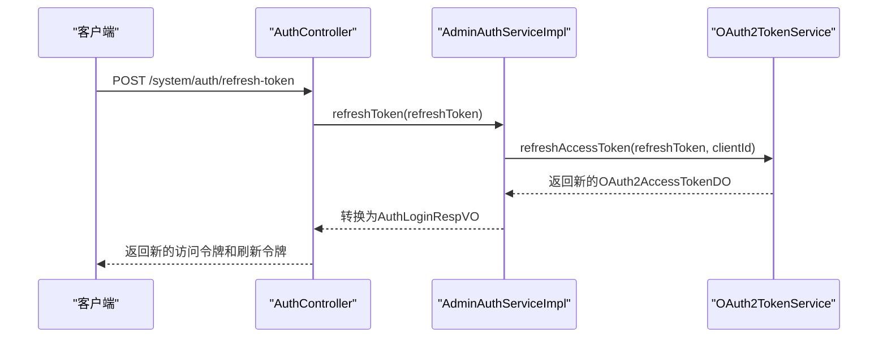
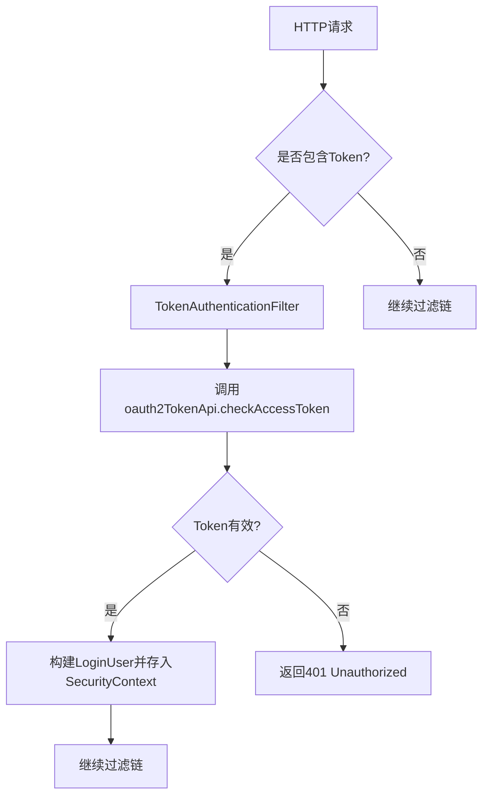

# JWT安全最佳实践

<cite>
**本文档引用的文件**  
- [SecurityProperties.java](file://yudao-framework/yudao-spring-boot-starter-security/src/main/java/cn/iocoder/yudao/framework/security/config/SecurityProperties.java)
- [YudaoWebSecurityConfigurerAdapter.java](file://yudao-framework/yudao-spring-boot-starter-security/src/main/java/cn/iocoder/yudao/framework/security/config/YudaoWebSecurityConfigurerAdapter.java)
- [TokenAuthenticationFilter.java](file://yudao-framework/yudao-spring-boot-starter-security/src/main/java/cn/iocoder/yudao/framework/security/core/filter/TokenAuthenticationFilter.java)
- [AdminAuthServiceImpl.java](file://yudao-module-system/src/main/java/cn/iocoder/yudao/module/system/service/auth/AdminAuthServiceImpl.java)
- [AuthController.java](file://yudao-module-system/src/main/java/cn/iocoder/yudao/module/system/controller/admin/auth/AuthController.java)
</cite>

## 目录
1. [引言](#引言)
2. [JWT安全传输与存储](#jwt安全传输与存储)
3. [令牌有效期与刷新机制](#令牌有效期与刷新机制)
4. [防范XSS与CSRF攻击](#防范xss与csrf攻击)
5. [YudaoWebSecurityConfigurerAdapter安全配置](#yudaowebsecurityconfigureradapter安全配置)
6. [令牌黑名单机制](#令牌黑名单机制)
7. [敏感操作重新认证](#敏感操作重新认证)
8. [异常登录行为监控](#异常登录行为监控)
9. [总结](#总结)

## 引言
JSON Web Token（JWT）作为一种广泛使用的身份认证机制，其安全性直接关系到系统的整体安全。本文档基于“yudao-boot-mini-zt”项目，系统性地总结了JWT认证的安全最佳实践，涵盖从传输、存储、有效期管理到主动注销和异常监控的完整安全策略。

## JWT安全传输与存储
确保JWT在传输和存储过程中的安全性是防止令牌泄露的第一道防线。

### 使用HTTPS加密传输
所有包含JWT的请求必须通过HTTPS进行传输，以防止中间人攻击（MITM）窃取令牌。在项目配置中，应强制所有API端点使用HTTPS，确保数据在客户端与服务器之间的传输全程加密。

### 安全存储refreshToken
refreshToken作为长期有效的令牌，其安全性至关重要。推荐使用HttpOnly Cookie来存储refreshToken，这样可以有效防止跨站脚本（XSS）攻击窃取令牌。HttpOnly属性能阻止JavaScript访问Cookie，即使页面被注入恶意脚本，也无法读取到refreshToken。

**Section sources**
- [SecurityProperties.java](file://yudao-framework/yudao-spring-boot-starter-security/src/main/java/cn/iocoder/yudao/framework/security/config/SecurityProperties.java#L1-L50)

## 令牌有效期与刷新机制
合理的令牌有效期和刷新机制是平衡安全性和用户体验的关键。

### 设置合适的令牌有效期
访问令牌（access token）应设置较短的有效期（例如15-30分钟），以减少令牌泄露后被滥用的风险。短期令牌即使被窃取，其有效时间窗口也很短。项目中通过`OAuth2TokenService`创建令牌时，会自动设置过期时间。

### 刷新令牌机制
当访问令牌过期后，客户端应使用refreshToken来获取新的访问令牌，而无需用户重新登录。`AdminAuthServiceImpl`中的`refreshToken`方法实现了此功能，通过`oauth2TokenService.refreshAccessToken`方法验证refreshToken并颁发新的访问令牌。

**Diagram sources**
- [AdminAuthServiceImpl.java](file://yudao-module-system/src/main/java/cn/iocoder/yudao/module/system/service/auth/AdminAuthServiceImpl.java#L220-L224)
- [AuthController.java](file://yudao-module-system/src/main/java/cn/iocoder/yudao/module/system/controller/admin/auth/AuthController.java#L83-L89)

## 防范XSS与CSRF攻击
针对常见的Web攻击，必须采取有效的防护措施。

### 防范XSS攻击
如前所述，将refreshToken存储在HttpOnly Cookie中是防范XSS攻击的核心手段。此外，应对所有用户输入进行严格的验证和转义，避免恶意脚本注入。

### 防范CSRF攻击
由于本系统采用基于Token的认证机制（无状态），不依赖于Session，因此天然免疫CSRF攻击。CSRF攻击依赖于浏览器自动携带Cookie，而Token通常通过Authorization Header传递，不受浏览器同源策略的自动携带机制影响。项目中的`YudaoWebSecurityConfigurerAdapter`明确禁用了CSRF保护，因为在此架构下它是不必要的。

**Section sources**
- [YudaoWebSecurityConfigurerAdapter.java](file://yudao-framework/yudao-spring-boot-starter-security/src/main/java/cn/iocoder/yudao/framework/security/config/YudaoWebSecurityConfigurerAdapter.java#L108-L152)

## YudaoWebSecurityConfigurerAdapter安全配置
`YudaoWebSecurityConfigurerAdapter`是系统安全策略的核心配置类。

### CORS配置
该配置类通过`.cors(Customizer.withDefaults())`开启了跨域资源共享（CORS），允许指定的前端域名访问API。这是现代前后端分离架构的必要配置。

### HSTS配置
虽然代码中未直接体现，但应在生产环境的Web服务器（如Nginx）上配置HTTP Strict Transport Security（HSTS），强制浏览器只通过HTTPS与服务器通信，进一步提升安全性。

### 安全过滤器链
配置类构建了Spring Security的过滤器链。核心是`TokenAuthenticationFilter`，它负责从请求头或参数中提取JWT，并验证其有效性。该过滤器被添加到`UsernamePasswordAuthenticationFilter`之前，确保在任何受保护的资源访问前完成身份验证。

**Diagram sources**
- [YudaoWebSecurityConfigurerAdapter.java](file://yudao-framework/yudao-spring-boot-starter-security/src/main/java/cn/iocoder/yudao/framework/security/config/YudaoWebSecurityConfigurerAdapter.java#L108-L152)
- [TokenAuthenticationFilter.java](file://yudao-framework/yudao-spring-boot-starter-security/src/main/java/cn/iocoder/yudao/framework/security/core/filter/TokenAuthenticationFilter.java#L39-L68)

## 令牌黑名单机制
实现主动注销功能需要一种机制来使已发出的令牌失效。

### 实现思路
由于JWT是无状态的，服务器无法直接“作废”一个令牌。实现主动注销的常用方法是维护一个令牌黑名单（Token Blacklist）。当用户登出时，将当前的访问令牌和refreshToken的ID（或JTI）加入黑名单，并设置一个过期时间（等于原令牌的剩余有效期）。在每次请求验证JWT时，除了检查签名和有效期外，还需查询黑名单，如果令牌在黑名单中，则拒绝请求。

在本项目中，`AdminAuthServiceImpl`的`logout`方法调用了`oauth2TokenService.removeAccessToken`，这暗示了服务端会移除该令牌的记录。后续的`TokenAuthenticationFilter`在`buildLoginUserByToken`时，会通过`oauth2TokenApi.checkAccessToken`来验证令牌，如果服务端已将其标记为无效，则验证失败，从而实现注销效果。

**Section sources**
- [AdminAuthServiceImpl.java](file://yudao-module-system/src/main/java/cn/iocoder/yudao/module/system/service/auth/AdminAuthServiceImpl.java#L226-L235)
- [TokenAuthenticationFilter.java](file://yudao-framework/yudao-spring-boot-starter-security/src/main/java/cn/iocoder/yudao/framework/security/core/filter/TokenAuthenticationFilter.java#L70-L92)

## 敏感操作重新认证
对于修改密码等敏感操作，应要求用户重新进行身份验证。

### 实现建议
在执行敏感操作前，不应仅依赖当前会话的有效性，而应要求用户提供额外的认证因子。例如：
1.  **二次密码验证**：在修改密码的接口中，要求用户输入当前密码。
2.  **动态验证码**：向用户绑定的手机或邮箱发送一次性验证码，用户需提供该验证码才能完成操作。
3.  **生物识别**：在移动端应用中，可结合指纹或面部识别。

在本项目的`resetPassword`方法中，虽然没有要求输入原密码，但它依赖于短信验证码（`smsCodeApi.useSmsCode`）来验证用户身份，这符合重新认证的原则，确保了操作的安全性。

**Section sources**
- [AdminAuthServiceImpl.java](file://yudao-module-system/src/main/java/cn/iocoder/yudao/module/system/service/auth/AdminAuthServiceImpl.java#L287-L303)

## 异常登录行为监控
监控异常登录行为是发现和阻止账户盗用的重要手段。

### 安全措施
1.  **登录日志记录**：系统应详细记录每次登录尝试，包括时间、IP地址、用户代理、登录结果（成功/失败及原因）。`AdminAuthServiceImpl`中的`createLoginLog`方法正是用于此目的。
2.  **失败次数限制**：对同一账户或IP地址的连续登录失败次数进行限制，达到阈值后暂时锁定账户或IP，防止暴力破解。
3.  **异地登录告警**：通过IP地址分析用户的登录地点，如果发现与常用登录地不符的登录行为，可触发告警或要求二次验证。
4.  **多设备登录检测**：监控同一账户在多个设备上的同时登录情况，对于异常的并发登录进行告警。

**Section sources**
- [AdminAuthServiceImpl.java](file://yudao-module-system/src/main/java/cn/iocoder/yudao/module/system/service/auth/AdminAuthServiceImpl.java#L150-L167)

## 总结
本文档系统地阐述了在“yudao-boot-mini-zt”项目中实施JWT安全的最佳实践。通过强制HTTPS、安全存储refreshToken、合理设置令牌有效期、利用无状态特性防范CSRF、配置核心安全策略、实现令牌黑名单、对敏感操作进行重新认证以及监控异常登录行为，可以构建一个健壮且安全的认证体系。这些实践共同作用，最大限度地降低了JWT被滥用的风险，保障了系统的整体安全。