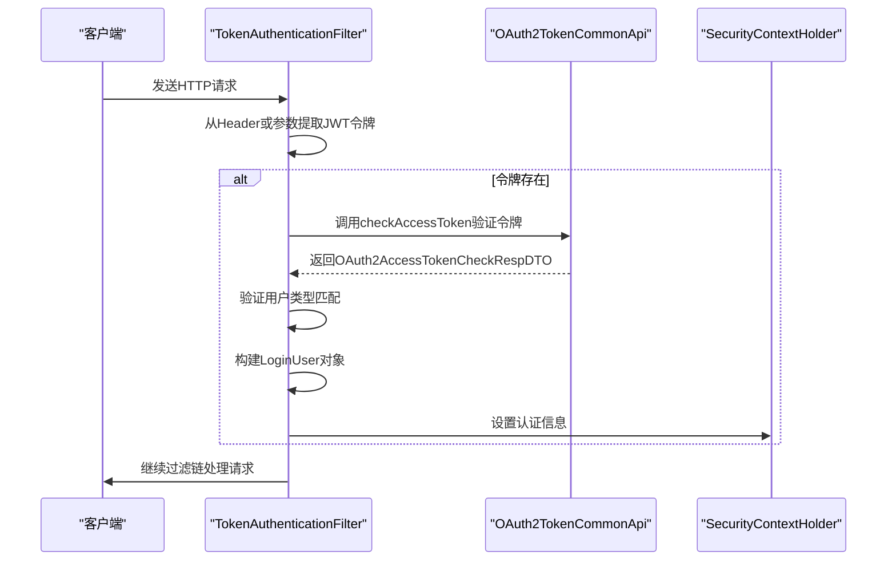
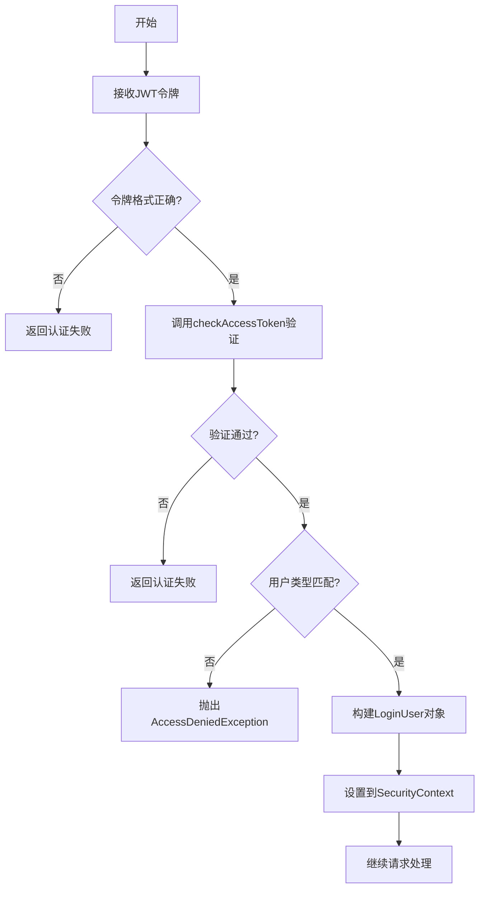
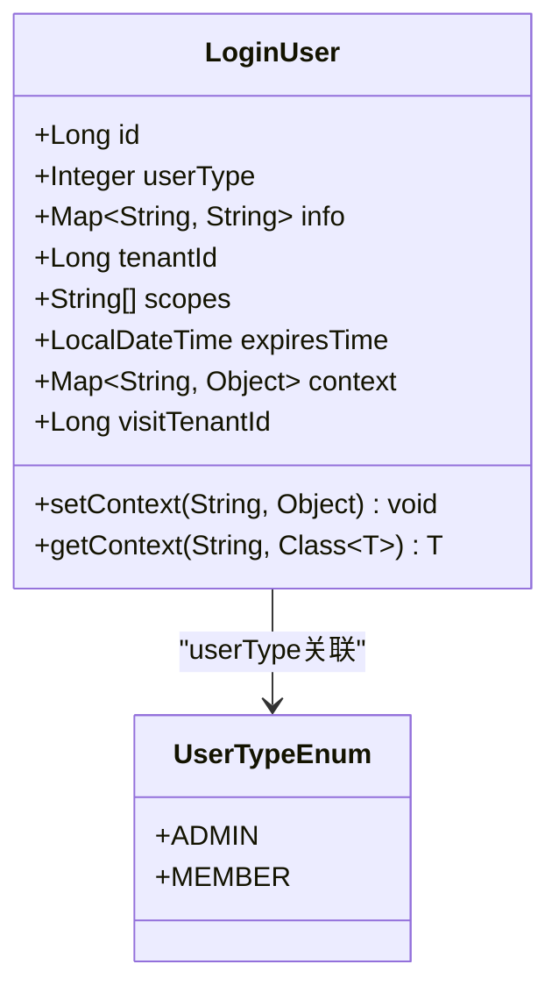
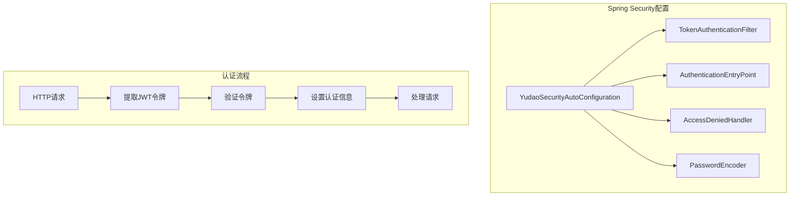

# JWT认证机制

<cite>
**本文档引用的文件**   
- [TokenAuthenticationFilter.java](file://yudao-framework/yudao-spring-boot-starter-security/src/main/java/cn/iocoder/yudao/framework/security/core/filter/TokenAuthenticationFilter.java)
- [LoginUser.java](file://yudao-framework/yudao-spring-boot-starter-security/src/main/java/cn/iocoder/yudao/framework/security/core/LoginUser.java)
- [SecurityProperties.java](file://yudao-framework/yudao-spring-boot-starter-security/src/main/java/cn/iocoder/yudao/framework/security/config/SecurityProperties.java)
- [OAuth2TokenCommonApi.java](file://yudao-framework/yudao-common/src/main/java/cn/iocoder/yudao/framework/common/biz/system/oauth2/OAuth2TokenCommonApi.java)
- [SecurityFrameworkUtils.java](file://yudao-framework/yudao-spring-boot-starter-security/src/main/java/cn/iocoder/yudao/framework/security/core/util/SecurityFrameworkUtils.java)
- [WebFrameworkUtils.java](file://yudao-framework/yudao-spring-boot-starter-web/src/main/java/cn/iocoder/yudao/framework/web/core/util/WebFrameworkUtils.java)
- [GlobalExceptionHandler.java](file://yudao-framework/yudao-spring-boot-starter-web/src/main/java/cn/iocoder/yudao/framework/web/core/handler/GlobalExceptionHandler.java)
- [YudaoSecurityAutoConfiguration.java](file://yudao-framework/yudao-spring-boot-starter-security/src/main/java/cn/iocoder/yudao/framework/security/config/YudaoSecurityAutoConfiguration.java)
</cite>

## 目录
1. [简介](#简介)
2. [认证过滤器执行流程](#认证过滤器执行流程)
3. [JWT令牌生成与验证](#jwt令牌生成与验证)
4. [LoginUser对象结构](#loginuser对象结构)
5. [Spring Security集成](#spring-security集成)
6. [安全最佳实践](#安全最佳实践)
7. [自定义JWT Claims](#自定义jwt-claims)

## 简介
本文档详细解析基于JWT的无状态认证机制实现，涵盖TokenAuthenticationFilter的过滤器链执行流程、JWT令牌的生成与验证机制、LoginUser对象结构以及与Spring Security的集成方式。

## 认证过滤器执行流程

TokenAuthenticationFilter是JWT认证的核心组件，负责在每次请求时验证JWT令牌的有效性，并将认证信息设置到Spring Security上下文中。



**图示来源**
- [TokenAuthenticationFilter.java](file://yudao-framework/yudao-spring-boot-starter-security/src/main/java/cn/iocoder/yudao/framework/security/core/filter/TokenAuthenticationFilter.java#L39-L68)
- [SecurityFrameworkUtils.java](file://yudao-framework/yudao-spring-boot-starter-security/src/main/java/cn/iocoder/yudao/framework/security/core/util/SecurityFrameworkUtils.java#L121-L132)

**本节来源**
- [TokenAuthenticationFilter.java](file://yudao-framework/yudao-spring-boot-starter-security/src/main/java/cn/iocoder/yudao/framework/security/core/filter/TokenAuthenticationFilter.java#L30-L118)

## JWT令牌生成与验证

### 令牌生成算法
JWT令牌通过OAuth2TokenService生成，包含用户ID、用户类型、租户ID、授权范围和过期时间等信息。生成过程采用BCryptPasswordEncoder进行密码加密，加密复杂度由securityProperties.passwordEncoderLength配置。

### 签名机制
系统采用标准的JWT签名机制，确保令牌的完整性和防篡改性。令牌验证通过OAuth2TokenCommonApi接口的checkAccessToken方法实现。

### 过期时间配置
令牌的过期时间在OAuth2AccessTokenCheckRespDTO中定义，通过LocalDateTime类型存储。系统通过定期检查令牌的expiresTime字段来判断令牌是否过期。

### 刷新策略
系统支持令牌刷新功能，通过refreshAccessToken方法实现。当令牌即将过期时，客户端可以使用刷新令牌获取新的访问令牌，而无需重新登录。



**图示来源**
- [OAuth2TokenCommonApi.java](file://yudao-framework/yudao-common/src/main/java/cn/iocoder/yudao/framework/common/biz/system/oauth2/OAuth2TokenCommonApi.java#L29-L29)
- [SecurityProperties.java](file://yudao-framework/yudao-spring-boot-starter-security/src/main/java/cn/iocoder/yudao/framework/security/config/SecurityProperties.java#L30-L30)

**本节来源**
- [TokenAuthenticationFilter.java](file://yudao-framework/yudao-spring-boot-starter-security/src/main/java/cn/iocoder/yudao/framework/security/core/filter/TokenAuthenticationFilter.java#L70-L92)
- [SecurityProperties.java](file://yudao-framework/yudao-spring-boot-starter-security/src/main/java/cn/iocoder/yudao/framework/security/config/SecurityProperties.java#L40-L51)

## LoginUser对象结构

LoginUser类是认证用户信息的核心数据结构，包含用户的基本信息和上下文数据。



**图示来源**
- [LoginUser.java](file://yudao-framework/yudao-spring-boot-starter-security/src/main/java/cn/iocoder/yudao/framework/security/core/LoginUser.java#L1-L75)
- [OAuth2AccessTokenCheckRespDTO.java](file://yudao-framework/yudao-common/src/main/java/cn/iocoder/yudao/framework/common/biz/system/oauth2/dto/OAuth2AccessTokenCheckRespDTO.java#L14-L42)

**本节来源**
- [LoginUser.java](file://yudao-framework/yudao-spring-boot-starter-security/src/main/java/cn/iocoder/yudao/framework/security/core/LoginUser.java#L1-L75)

## Spring Security集成

### 认证成功处理器
系统通过AuthenticationEntryPointImpl处理认证成功的情况，将认证信息正确设置到Spring Security上下文中。

### 认证失败处理器
当JWT验证失败时，系统通过GlobalExceptionHandler统一处理异常，并返回标准化的错误响应。



**图示来源**
- [YudaoSecurityAutoConfiguration.java](file://yudao-framework/yudao-spring-boot-starter-security/src/main/java/cn/iocoder/yudao/framework/security/config/YudaoSecurityAutoConfiguration.java#L31-L93)
- [GlobalExceptionHandler.java](file://yudao-framework/yudao-spring-boot-starter-web/src/main/java/cn/iocoder/yudao/framework/web/core/handler/GlobalExceptionHandler.java#L53-L439)

**本节来源**
- [YudaoSecurityAutoConfiguration.java](file://yudao-framework/yudao-spring-boot-starter-security/src/main/java/cn/iocoder/yudao/framework/security/config/YudaoSecurityAutoConfiguration.java#L31-L93)

## 安全最佳实践

### 令牌安全存储
- 前端应将JWT存储在HttpOnly的Cookie中，防止XSS攻击
- 避免将令牌存储在localStorage中，降低安全风险
- 设置适当的令牌过期时间，平衡安全性和用户体验

### 传输安全
- 强制使用HTTPS协议传输JWT令牌
- 配置HSTS（HTTP Strict Transport Security）增强安全性
- 使用安全的Cookie属性（Secure、HttpOnly）

### 防重放攻击
- 实施令牌黑名单机制，记录已注销的令牌
- 使用短期有效的访问令牌配合长期有效的刷新令牌
- 记录令牌使用日志，监控异常访问模式

### 模拟登录安全
系统提供模拟登录功能用于开发调试，但必须在生产环境中禁用：

```properties
# 安全配置示例
yudao.security.mock-enable=false
yudao.security.mock-secret=your-secret-key
```

**本节来源**
- [SecurityProperties.java](file://yudao-framework/yudao-spring-boot-starter-security/src/main/java/cn/iocoder/yudao/framework/security/config/SecurityProperties.java#L1-L51)
- [TokenAuthenticationFilter.java](file://yudao-framework/yudao-spring-boot-starter-security/src/main/java/cn/iocoder/yudao/framework/security/core/filter/TokenAuthenticationFilter.java#L104-L116)

## 自定义JWT Claims

系统支持通过LoginUser的info字段扩展用户信息，允许自定义JWT Claims。

### 扩展用户信息
通过LoginUser的info Map存储额外的用户信息，如昵称、部门ID等：

```java
// 预定义的键名常量
public static final String INFO_KEY_NICKNAME = "nickname";
public static final String INFO_KEY_DEPT_ID = "deptId";
```

### 上下文管理
LoginUser提供context字段用于临时存储上下文数据，不进行持久化：

```java
// 设置上下文数据
loginUser.setContext("sessionData", sessionObject);

// 获取上下文数据
Object data = loginUser.getContext("sessionData", ObjectType.class);
```

### 租户支持
系统内置租户支持，通过tenantId和visitTenantId字段实现多租户隔离：

```java
// 获取租户ID
Long tenantId = WebFrameworkUtils.getTenantId(request);

// 获取访问租户ID
Long visitTenantId = WebFrameworkUtils.getVisitTenantId(request);
```

**本节来源**
- [LoginUser.java](file://yudao-framework/yudao-spring-boot-starter-security/src/main/java/cn/iocoder/yudao/framework/security/core/LoginUser.java#L1-L75)
- [WebFrameworkUtils.java](file://yudao-framework/yudao-spring-boot-starter-web/src/main/java/cn/iocoder/yudao/framework/web/core/util/WebFrameworkUtils.java#L19-L157)