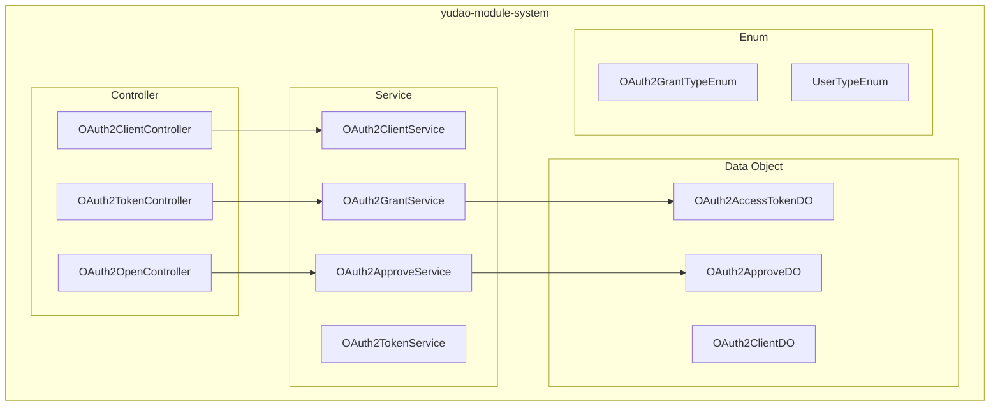
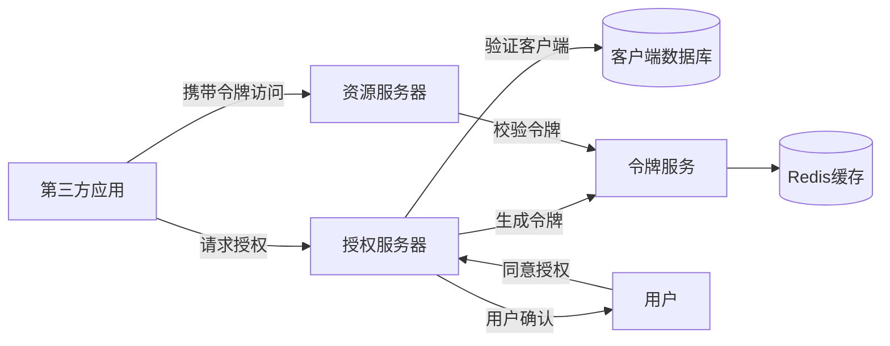
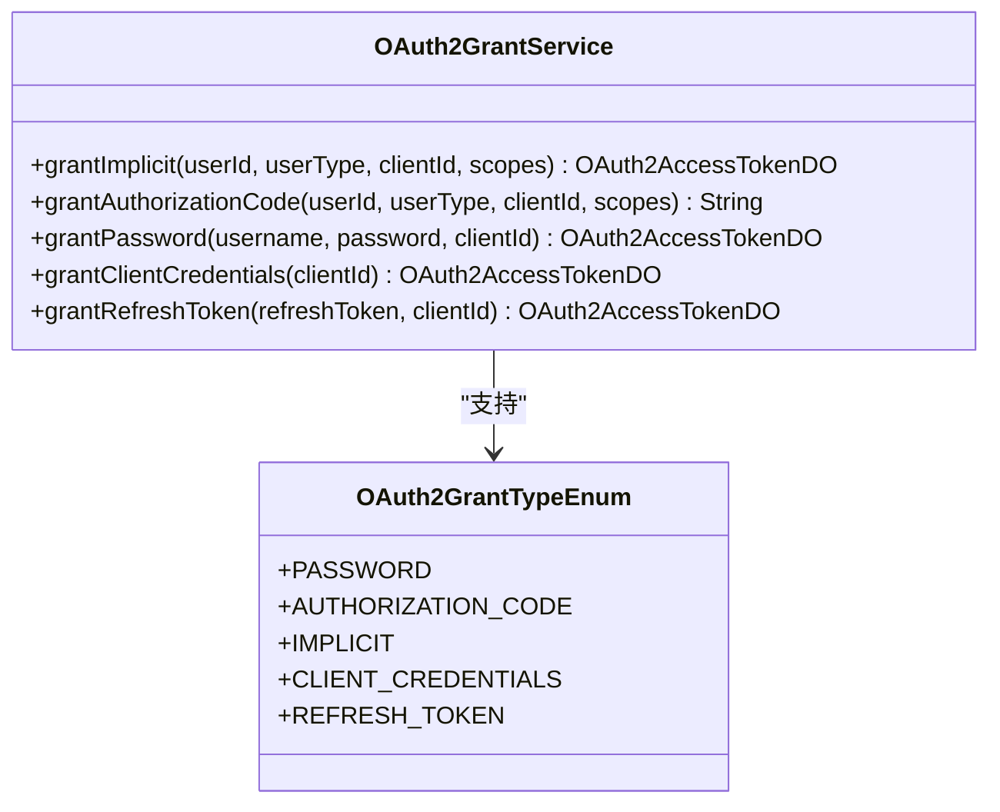
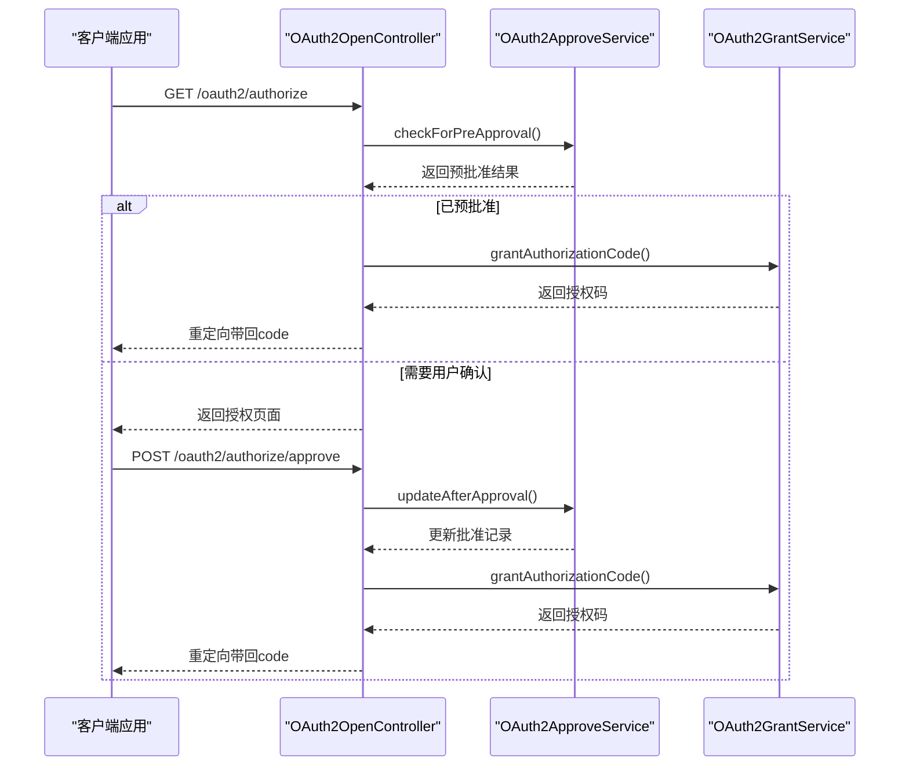
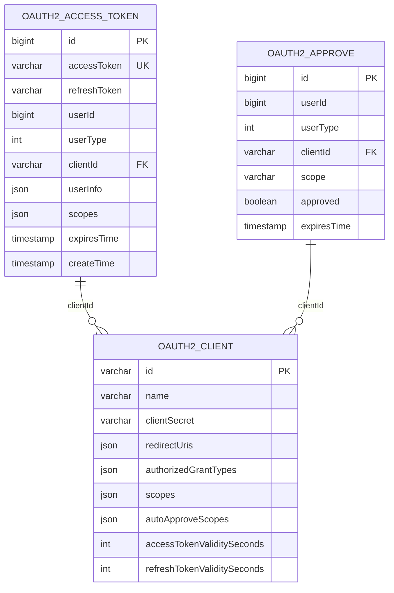
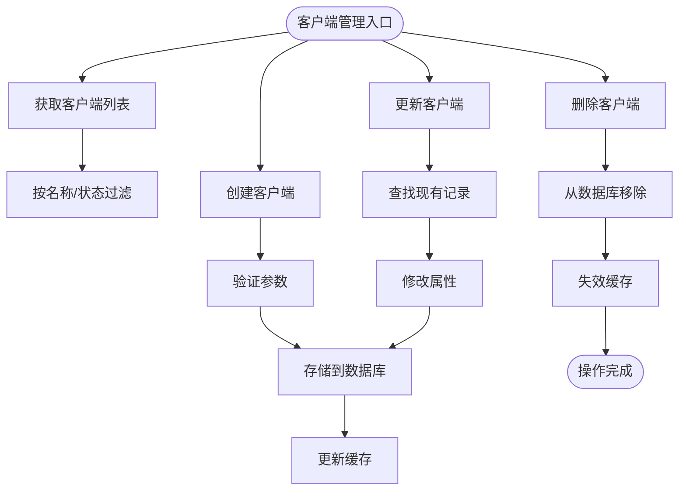
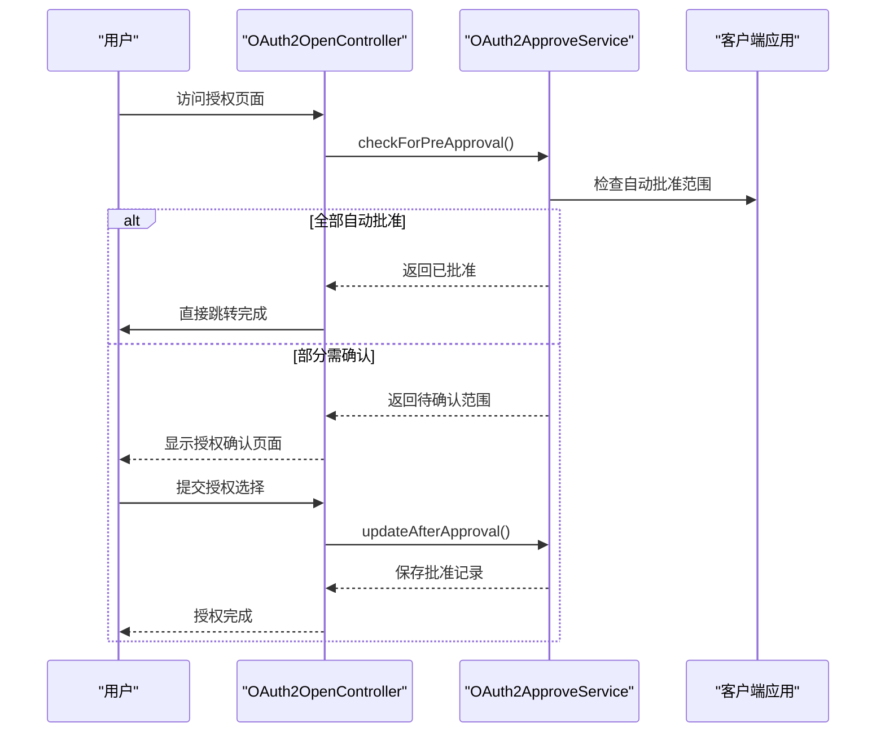
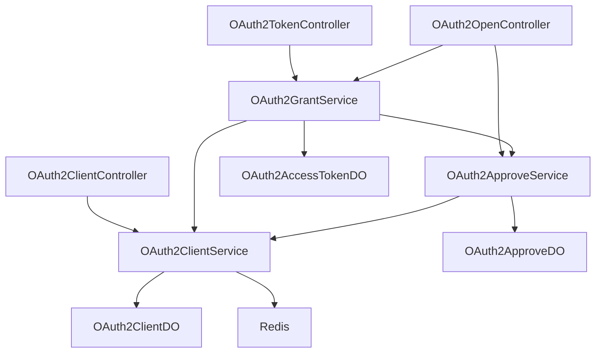

# OAuth2.0授权

<cite>
**本文档引用文件**  
- [OAuth2AccessTokenDO.java](file://yudao-module-system/src/main/java/cn/iocoder/yudao/module/system/dal/dataobject/oauth2/OAuth2AccessTokenDO.java)
- [OAuth2ClientDO.java](file://yudao-module-system/src/main/java/cn/iocoder/yudao/module/system/dal/dataobject/oauth2/OAuth2ClientDO.java)
- [OAuth2ApproveDO.java](file://yudao-module-system/src/main/java/cn/iocoder/yudao/module/system/dal/dataobject/oauth2/OAuth2ApproveDO.java)
- [OAuth2GrantTypeEnum.java](file://yudao-module-system/src/main/java/cn/iocoder/yudao/module/system/enums/oauth2/OAuth2GrantTypeEnum.java)
- [OAuth2ClientService.java](file://yudao-module-system/src/main/java/cn/iocoder/yudao/module/system/service/oauth2/OAuth2ClientService.java)
- [OAuth2ApproveService.java](file://yudao-module-system/src/main/java/cn/iocoder/yudao/module/system/service/oauth2/OAuth2ApproveService.java)
- [OAuth2GrantService.java](file://yudao-module-system/src/main/java/cn/iocoder/yudao/module/system/service/oauth2/OAuth2GrantService.java)
- [OAuth2TokenController.java](file://yudao-module-system/src/main/java/cn/iocoder/yudao/module/system/controller/admin/oauth2/OAuth2TokenController.java)
- [OAuth2ClientController.java](file://yudao-module-system/src/main/java/cn/iocoder/yudao/module/system/controller/admin/oauth2/OAuth2ClientController.java)
- [OAuth2OpenController.java](file://yudao-module-system/src/main/java/cn/iocoder/yudao/module/system/controller/admin/oauth2/OAuth2OpenController.java)
</cite>

## 目录
1. [简介](#简介)
2. [项目结构](#项目结构)
3. [核心组件](#核心组件)
4. [架构概述](#架构概述)
5. [详细组件分析](#详细组件分析)
6. [依赖分析](#依赖分析)
7. [性能考虑](#性能考虑)
8. [故障排除指南](#故障排除指南)
9. [结论](#结论)

## 简介
本文档全面介绍基于 `yudao-boot-mini-zt` 项目的 OAuth2.0 授权服务器实现。涵盖四种授权模式（授权码、密码、客户端凭证、刷新令牌）的流程与接口规范，详细说明 OAuth2.0 数据模型设计、客户端管理机制、授权同意流程、第三方应用集成及安全最佳实践。

## 项目结构
项目采用模块化设计，OAuth2.0 相关功能主要集中在 `yudao-module-system` 模块中，涉及数据对象、服务实现、控制器和接口定义。

**图示来源**  
- [OAuth2ClientController.java](file://yudao-module-system/src/main/java/cn/iocoder/yudao/module/system/controller/admin/oauth2/OAuth2ClientController.java)
- [OAuth2TokenController.java](file://yudao-module-system/src/main/java/cn/iocoder/yudao/module/system/controller/admin/oauth2/OAuth2TokenController.java)
- [OAuth2OpenController.java](file://yudao-module-system/src/main/java/cn/iocoder/yudao/module/system/controller/admin/oauth2/OAuth2OpenController.java)
- [OAuth2ClientService.java](file://yudao-module-system/src/main/java/cn/iocoder/yudao/module/system/service/oauth2/OAuth2ClientService.java)
- [OAuth2GrantService.java](file://yudao-module-system/src/main/java/cn/iocoder/yudao/module/system/service/oauth2/OAuth2GrantService.java)
- [OAuth2ApproveService.java](file://yudao-module-system/src/main/java/cn/iocoder/yudao/module/system/service/oauth2/OAuth2ApproveService.java)
- [OAuth2AccessTokenDO.java](file://yudao-module-system/src/main/java/cn/iocoder/yudao/module/system/dal/dataobject/oauth2/OAuth2AccessTokenDO.java)
- [OAuth2ApproveDO.java](file://yudao-module-system/src/main/java/cn/iocoder/yudao/module/system/dal/dataobject/oauth2/OAuth2ApproveDO.java)

**本节来源**  
- [项目结构](file://README.md)

## 核心组件
核心组件包括 OAuth2.0 客户端管理、令牌生成与验证、授权批准机制和四种标准授权模式的实现。

**本节来源**  
- [OAuth2ClientService.java](file://yudao-module-system/src/main/java/cn/iocoder/yudao/module/system/service/oauth2/OAuth2ClientService.java)
- [OAuth2GrantService.java](file://yudao-module-system/src/main/java/cn/iocoder/yudao/module/system/service/oauth2/OAuth2GrantService.java)
- [OAuth2ApproveService.java](file://yudao-module-system/src/main/java/cn/iocoder/yudao/module/system/service/oauth2/OAuth2ApproveService.java)

## 架构概述
系统采用典型的 OAuth2.0 服务端架构，包含客户端注册、授权服务器、资源服务器三大核心部分。通过 Spring Security OAuth2 扩展实现，结合 MyBatis 和 Redis 实现持久化与缓存。

**图示来源**  
- [OAuth2TokenService.java](file://yudao-module-system/src/main/java/cn/iocoder/yudao/module/system/service/oauth2/OAuth2TokenService.java)
- [OAuth2ClientService.java](file://yudao-module-system/src/main/java/cn/iocoder/yudao/module/system/service/oauth2/OAuth2ClientService.java)
- [RedisKeyConstants.java](file://yudao-module-system/src/main/java/cn/iocoder/yudao/module/system/dal/redis/RedisKeyConstants.java)

## 详细组件分析

### 授权模式实现分析
系统完整实现了 OAuth2.0 四种授权模式：

**图示来源**  
- [OAuth2GrantService.java](file://yudao-module-system/src/main/java/cn/iocoder/yudao/module/system/service/oauth2/OAuth2GrantService.java)
- [OAuth2GrantTypeEnum.java](file://yudao-module-system/src/main/java/cn/iocoder/yudao/module/system/enums/oauth2/OAuth2GrantTypeEnum.java)

#### 授权码模式流程

**图示来源**  
- [OAuth2OpenController.java](file://yudao-module-system/src/main/java/cn/iocoder/yudao/module/system/controller/admin/oauth2/OAuth2OpenController.java)
- [OAuth2ApproveService.java](file://yudao-module-system/src/main/java/cn/iocoder/yudao/module/system/service/oauth2/OAuth2ApproveService.java)
- [OAuth2GrantService.java](file://yudao-module-system/src/main/java/cn/iocoder/yudao/module/system/service/oauth2/OAuth2GrantService.java)

### OAuth2AccessTokenDO 数据模型
`OAuth2AccessTokenDO` 数据对象定义了访问令牌的核心属性和存储结构。

**图示来源**  
- [OAuth2AccessTokenDO.java](file://yudao-module-system/src/main/java/cn/iocoder/yudao/module/system/dal/dataobject/oauth2/OAuth2AccessTokenDO.java)
- [OAuth2ClientDO.java](file://yudao-module-system/src/main/java/cn/iocoder/yudao/module/system/dal/dataobject/oauth2/OAuth2ClientDO.java)
- [OAuth2ApproveDO.java](file://yudao-module-system/src/main/java/cn/iocoder/yudao/module/system/dal/dataobject/oauth2/OAuth2ApproveDO.java)

**本节来源**  
- [OAuth2AccessTokenDO.java](file://yudao-module-system/src/main/java/cn/iocoder/yudao/module/system/dal/dataobject/oauth2/OAuth2AccessTokenDO.java)
- [OAuth2ClientDO.java](file://yudao-module-system/src/main/java/cn/iocoder/yudao/module/system/dal/dataobject/oauth2/OAuth2ClientDO.java)
- [OAuth2ApproveDO.java](file://yudao-module-system/src/main/java/cn/iocoder/yudao/module/system/dal/dataobject/oauth2/OAuth2ApproveDO.java)

### 客户端管理机制
客户端管理通过 `OAuth2ClientService` 实现，提供完整的 CRUD 操作和缓存机制。

**图示来源**  
- [OAuth2ClientService.java](file://yudao-module-system/src/main/java/cn/iocoder/yudao/module/system/service/oauth2/OAuth2ClientService.java)
- [OAuth2ClientServiceImpl.java](file://yudao-module-system/src/main/java/cn/iocoder/yudao/module/system/service/oauth2/OAuth2ClientServiceImpl.java)
- [OAuth2ClientMapper.java](file://yudao-module-system/src/main/java/cn/iocoder/yudao/module/system/dal/mysql/oauth2/OAuth2ClientMapper.java)

**本节来源**  
- [OAuth2ClientService.java](file://yudao-module-system/src/main/java/cn/iocoder/yudao/module/system/service/oauth2/OAuth2ClientService.java)
- [OAuth2ClientServiceImpl.java](file://yudao-module-system/src/main/java/cn/iocoder/yudao/module/system/service/oauth2/OAuth2ClientServiceImpl.java)

### 授权同意机制
授权同意机制通过 `OAuth2ApproveService` 实现，记录用户对客户端的授权决策。

**图示来源**  
- [OAuth2ApproveService.java](file://yudao-module-system/src/main/java/cn/iocoder/yudao/module/system/service/oauth2/OAuth2ApproveService.java)
- [OAuth2ApproveServiceImpl.java](file://yudao-module-system/src/main/java/cn/iocoder/yudao/module/system/service/oauth2/OAuth2ApproveServiceImpl.java)
- [OAuth2OpenController.java](file://yudao-module-system/src/main/java/cn/iocoder/yudao/module/system/controller/admin/oauth2/OAuth2OpenController.java)

**本节来源**  
- [OAuth2ApproveService.java](file://yudao-module-system/src/main/java/cn/iocoder/yudao/module/system/service/oauth2/OAuth2ApproveService.java)
- [OAuth2ApproveServiceImpl.java](file://yudao-module-system/src/main/java/cn/iocoder/yudao/module/system/service/oauth2/OAuth2ApproveServiceImpl.java)

## 依赖分析
系统依赖关系清晰，各组件职责分明。

**图示来源**  
- [OAuth2ClientController.java](file://yudao-module-system/src/main/java/cn/iocoder/yudao/module/system/controller/admin/oauth2/OAuth2ClientController.java)
- [OAuth2TokenController.java](file://yudao-module-system/src/main/java/cn/iocoder/yudao/module/system/controller/admin/oauth2/OAuth2TokenController.java)
- [OAuth2OpenController.java](file://yudao-module-system/src/main/java/cn/iocoder/yudao/module/system/controller/admin/oauth2/OAuth2OpenController.java)
- [OAuth2GrantService.java](file://yudao-module-system/src/main/java/cn/iocoder/yudao/module/system/service/oauth2/OAuth2GrantService.java)
- [OAuth2ApproveService.java](file://yudao-module-system/src/main/java/cn/iocoder/yudao/module/system/service/oauth2/OAuth2ApproveService.java)
- [OAuth2ClientService.java](file://yudao-module-system/src/main/java/cn/iocoder/yudao/module/system/service/oauth2/OAuth2ClientService.java)

**本节来源**  
- [OAuth2ClientController.java](file://yudao-module-system/src/main/java/cn/iocoder/yudao/module/system/controller/admin/oauth2/OAuth2ClientController.java)
- [OAuth2TokenController.java](file://yudao-module-system/src/main/java/cn/iocoder/yudao/module/system/controller/admin/oauth2/OAuth2TokenController.java)
- [OAuth2OpenController.java](file://yudao-module-system/src/main/java/cn/iocoder/yudao/module/system/controller/admin/oauth2/OAuth2OpenController.java)

## 性能考虑
系统通过多级缓存和数据库优化确保高性能：
- 客户端信息缓存于 Redis，减少数据库查询
- 令牌验证采用内存缓存机制
- 数据库表建立适当索引（clientId, userId等）
- 批量操作支持提高管理效率

## 故障排除指南
常见问题及解决方案：
- **授权码失效**：检查授权码有效期配置
- **客户端验证失败**：确认 clientId 和 clientSecret 正确性
- **重定向 URI 不匹配**：检查客户端配置的 redirectUris
- **授权范围不足**：确认请求的 scopes 在客户端允许范围内
- **令牌过期**：使用刷新令牌机制获取新令牌

**本节来源**  
- [OAuth2ClientServiceImpl.java](file://yudao-module-system/src/main/java/cn/iocoder/yudao/module/system/service/oauth2/OAuth2ClientServiceImpl.java)
- [OAuth2GrantServiceImpl.java](file://yudao-module-system/src/main/java/cn/iocoder/yudao/module/system/service/oauth2/OAuth2GrantServiceImpl.java)
- [OAuth2ApproveServiceImpl.java](file://yudao-module-system/src/main/java/cn/iocoder/yudao/module/system/service/oauth2/OAuth2ApproveServiceImpl.java)

## 结论
本系统实现了完整的 OAuth2.0 授权服务器功能，支持四种标准授权模式，具备完善的客户端管理、授权同意、令牌管理和安全控制机制。通过合理的架构设计和性能优化，能够满足企业级应用的安全授权需求。