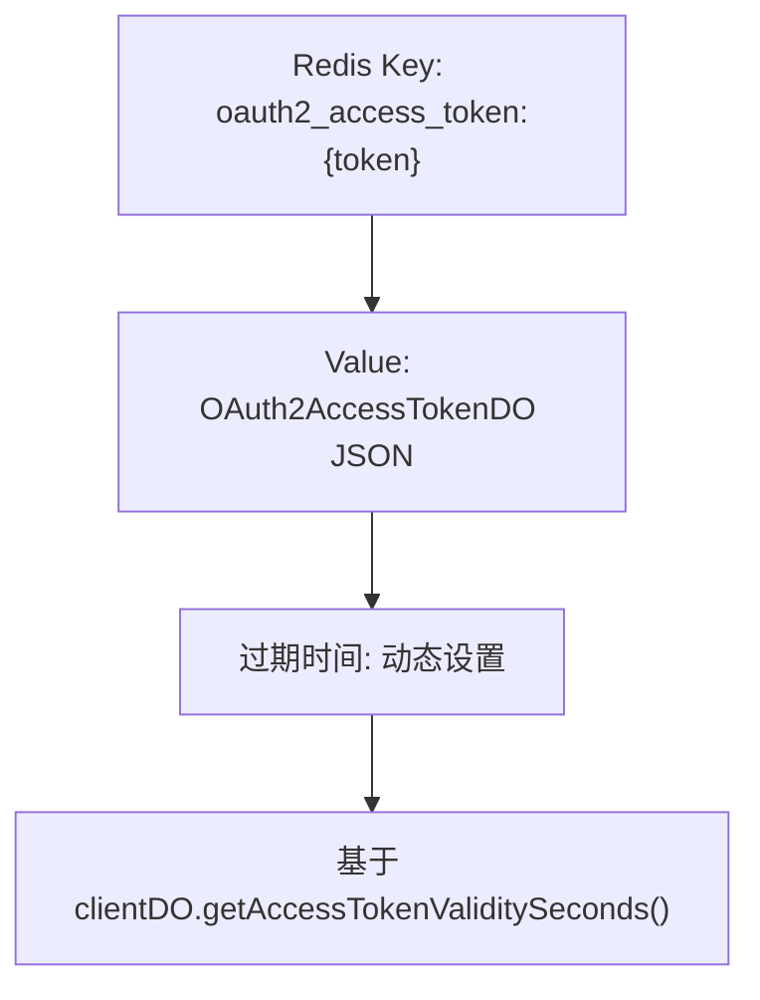
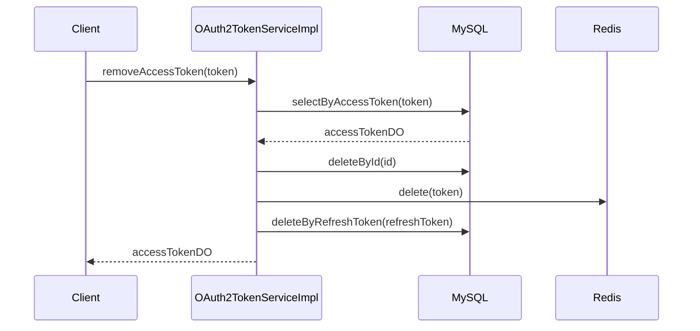

# 令牌管理与存储

<cite>
**本文档引用的文件**  
- [OAuth2AccessTokenDO.java](file://yudao-module-system/src/main/java/cn/iocoder/yudao/module/system/dal/dataobject/oauth2/OAuth2AccessTokenDO.java)
- [RedisKeyConstants.java](file://yudao-module-system/src/main/java/cn/iocoder/yudao/module/system/dal/redis/RedisKeyConstants.java)
- [OAuth2TokenServiceImpl.java](file://yudao-module-system/src/main/java/cn/iocoder/yudao/module/system/service/oauth2/OAuth2TokenServiceImpl.java)
- [OAuth2TokenApiImpl.java](file://yudao-module-system/src/main/java/cn/iocoder/yudao/module/system/api/oauth2/OAuth2TokenApiImpl.java)
- [OAuth2AccessTokenRedisDAO.java](file://yudao-module-system/src/main/java/cn/iocoder/yudao/module/system/dal/redis/oauth2/OAuth2AccessTokenRedisDAO.java)
- [OAuth2AccessTokenMapper.java](file://yudao-module-system/src/main/java/cn/iocoder/yudao/module/system/dal/mysql/oauth2/OAuth2AccessTokenMapper.java)
- [OAuth2RefreshTokenMapper.java](file://yudao-module-system/src/main/java/cn/iocoder/yudao/module/system/dal/mysql/oauth2/OAuth2RefreshTokenMapper.java)
</cite>

## 目录
1. [数据模型设计](#数据模型设计)
2. [Redis存储结构与过期策略](#redis存储结构与过期策略)
3. [索引设计与查询优化](#索引设计与查询优化)
4. [令牌撤销机制与黑名单管理](#令牌撤销机制与黑名单管理)
5. [分布式环境下的令牌一致性](#分布式环境下的令牌一致性)
6. [性能优化建议与监控指标](#性能优化建议与监控指标)

## 数据模型设计

`OAuth2AccessTokenDO` 实体类定义了访问令牌的核心数据结构，继承自 `TenantBaseDO` 以支持多租户功能。该实体包含以下关键字段：

- **id**: 主键，数据库自增编号
- **accessToken**: 访问令牌值，用于客户端访问受保护资源
- **refreshToken**: 刷新令牌，用于获取新的访问令牌
- **userId**: 用户编号，标识令牌所属用户
- **userType**: 用户类型，枚举值定义于 `UserTypeEnum`，区分管理员与会员等用户类型
- **userInfo**: 用户信息，以 `Map<String, String>` 形式存储，包含昵称、部门ID等关键信息
- **clientId**: 客户端编号，关联 `OAuth2ClientDO` 实体，标识令牌所属应用
- **scopes**: 授权范围，`List<String>` 类型，表示该令牌被授予的权限集合
- **expiresTime**: 过期时间，`LocalDateTime` 类型，精确控制令牌有效期

该设计遵循 OAuth2.0 规范，将访问令牌与刷新令牌分离，支持安全的令牌刷新机制。`userInfo` 字段通过 Jackson 序列化处理器存储，避免了对用户信息的冗余查询，提升了验证效率。

**Section sources**
- [OAuth2AccessTokenDO.java](file://yudao-module-system/src/main/java/cn/iocoder/yudao/module/system/dal/dataobject/oauth2/OAuth2AccessTokenDO.java#L24-L74)

## Redis存储结构与过期策略

令牌在 Redis 中采用键值对（Key-Value）结构进行缓存，以实现高性能的令牌验证。存储结构设计如下：

**存储结构说明：**
- **Key 格式**: `oauth2_access_token:{token}`，其中 `{token}` 是实际的访问令牌值
- **Value 格式**: 序列化后的 `OAuth2AccessTokenDO` 对象 JSON 字符串
- **过期策略**: 采用动态过期时间，由 `OAuth2ClientDO` 配置的 `accessTokenValiditySeconds` 决定。在写入 Redis 时，通过 `LocalDateTimeUtil.between` 计算剩余有效秒数，并作为 `set` 命令的 TTL 参数。

该策略确保了 Redis 中的令牌与数据库中的过期时间严格同步，避免了因缓存导致的令牌有效期不一致问题。`OAuth2AccessTokenRedisDAO` 的 `set` 方法在写入前会清理 `updater`、`updateTime` 等非必要字段，以减少网络传输和内存占用。

**Diagram sources**
- [RedisKeyConstants.java](file://yudao-module-system/src/main/java/cn/iocoder/yudao/module/system/dal/redis/RedisKeyConstants.java#L65-L71)
- [OAuth2AccessTokenRedisDAO.java](file://yudao-module-system/src/main/java/cn/iocoder/yudao/module/system/dal/redis/oauth2/OAuth2AccessTokenRedisDAO.java#L34-L42)

**Section sources**
- [RedisKeyConstants.java](file://yudao-module-system/src/main/java/cn/iocoder/yudao/module/system/dal/redis/RedisKeyConstants.java#L65-L71)
- [OAuth2AccessTokenRedisDAO.java](file://yudao-module-system/src/main/java/cn/iocoder/yudao/module/system/dal/redis/oauth2/OAuth2AccessTokenRedisDAO.java#L34-L42)

## 索引设计与查询优化

系统通过多级缓存和数据库索引相结合的方式，实现了高效的令牌查询：

1.  **优先级缓存查询**: `getAccessToken` 方法首先尝试从 Redis 中获取令牌，利用 Redis 的 O(1) 时间复杂度特性，实现毫秒级响应。
2.  **数据库二级查询**: 当 Redis 缓存未命中时，系统会查询 MySQL 数据库。`OAuth2AccessTokenMapper` 提供了 `selectByAccessToken` 方法，该方法基于 `accessToken` 字段进行等值查询。
3.  **特殊场景兼容**: 为解决前端 WebSocket 或积木报表等场景无法传递 `refresh_token` 的问题，系统还支持通过 `refresh_token` 查询 `access_token`。`OAuth2RefreshTokenMapper` 的 `selectByRefreshToken` 方法允许在特定情况下将刷新令牌作为访问令牌使用。
4.  **分页查询优化**: `getAccessTokenPage` 方法使用 `LambdaQueryWrapperX` 构建查询条件，不仅支持按用户ID、用户类型、客户端ID进行筛选，还通过 `gt(OAuth2AccessTokenDO::getExpiresTime, LocalDateTime.now())` 自动过滤已过期的令牌，确保分页结果的有效性。

这种“Redis + MySQL”的混合查询模式，既保证了高并发下的性能，又确保了数据的最终一致性。

**Section sources**
- [OAuth2TokenServiceImpl.java](file://yudao-module-system/src/main/java/cn/iocoder/yudao/module/system/service/oauth2/OAuth2TokenServiceImpl.java#L101-L126)
- [OAuth2AccessTokenMapper.java](file://yudao-module-system/src/main/java/cn/iocoder/yudao/module/system/dal/mysql/oauth2/OAuth2AccessTokenMapper.java#L16-L19)
- [OAuth2RefreshTokenMapper.java](file://yudao-module-system/src/main/java/cn/iocoder/yudao/module/system/dal/mysql/oauth2/OAuth2RefreshTokenMapper.java#L17-L21)

## 令牌撤销机制与黑名单管理

系统的令牌撤销机制通过 `removeAccessToken` 方法实现，该机制不仅删除令牌本身，还联动清理相关资源，形成完整的“黑名单”管理：

**撤销流程详解：**
1.  **查询令牌**: 根据提供的 `accessToken` 从数据库中查询完整的 `OAuth2AccessTokenDO` 对象。
2.  **删除数据库记录**: 从 `system_oauth2_access_token` 表中删除该访问令牌的记录。
3.  **清除Redis缓存**: 调用 `oauth2AccessTokenRedisDAO.delete(accessToken)`，确保后续请求无法从缓存中获取该令牌。
4.  **级联删除刷新令牌**: 调用 `oauth2RefreshTokenMapper.deleteByRefreshToken`，删除与该访问令牌关联的刷新令牌。这一步至关重要，因为它彻底切断了通过旧刷新令牌获取新访问令牌的可能性，实现了真正的“撤销”。

此机制被 `AdminAuthServiceImpl.logout` 方法调用，用于用户登出时的令牌清理，确保了用户会话的安全性。

**Diagram sources**
- [OAuth2TokenServiceImpl.java](file://yudao-module-system/src/main/java/cn/iocoder/yudao/module/system/service/oauth2/OAuth2TokenServiceImpl.java#L140-L153)

**Section sources**
- [OAuth2TokenServiceImpl.java](file://yudao-module-system/src/main/java/cn/iocoder/yudao/module/system/service/oauth2/OAuth2TokenServiceImpl.java#L140-L153)
- [AdminAuthServiceImpl.java](file://yudao-module-system/src/main/java/cn/iocoder/yudao/module/system/service/auth/AdminAuthServiceImpl.java#L226-L235)

## 分布式环境下的令牌一致性

在分布式环境下，系统通过以下措施保障令牌数据的一致性：

1.  **Redis 作为单一数据源**: 对于令牌的读取，系统优先从 Redis 获取。由于 Redis 通常是单实例或主从架构，这保证了所有应用节点看到的令牌状态是统一的。
2.  **数据库作为持久化存储**: MySQL 作为令牌的最终持久化存储，确保了数据的可靠性和可恢复性。
3.  **写操作的原子性**: `createAccessToken` 和 `removeAccessToken` 方法均使用 `@Transactional` 注解，保证了对数据库和 Redis 操作的原子性。例如，在创建令牌时，先插入数据库，再写入 Redis；在删除时，先删数据库，再删 Redis。这种顺序确保了即使在写入 Redis 失败的情况下，数据库的最终状态也是正确的。
4.  **租户上下文隔离**: `TenantContextHolder.getTenantId()` 被显式设置到 `accessTokenDO` 中，避免了多租户环境下因上下文丢失导致的缓存污染。

这些设计确保了在高并发和分布式部署场景下，令牌的创建、验证和撤销操作都能保持数据的一致性和完整性。

**Section sources**
- [OAuth2TokenServiceImpl.java](file://yudao-module-system/src/main/java/cn/iocoder/yudao/module/system/service/oauth2/OAuth2TokenServiceImpl.java#L160-L172)
- [OAuth2TokenServiceImpl.java](file://yudao-module-system/src/main/java/cn/iocoder/yudao/module/system/service/oauth2/OAuth2TokenServiceImpl.java#L140-L153)

## 性能优化建议与监控指标

### 性能优化建议
1.  **合理设置过期时间**: 根据业务场景调整 `accessTokenValiditySeconds` 和 `refreshTokenValiditySeconds`。过短的过期时间会增加刷新频率，过长则增加安全风险。
2.  **监控Redis内存**: 定期监控 Redis 内存使用情况，防止因大量令牌缓存导致内存溢出。可考虑对长期未使用的令牌进行主动清理。
3.  **优化数据库索引**: 确保 `system_oauth2_access_token` 表的 `access_token` 和 `refresh_token` 字段有唯一索引，以加速查询。
4.  **批量操作**: 在需要批量撤销令牌的场景（如用户批量删除），应使用批量删除接口，减少数据库交互次数。

### 监控指标
- **令牌创建速率**: 监控 `createAccessToken` 方法的调用频率，可反映用户登录活跃度。
- **令牌验证延迟**: 监控 `getAccessToken` 方法的平均响应时间，应主要集中在 Redis 查询的毫秒级。
- **缓存命中率**: 统计 Redis 缓存的命中率，高命中率（>95%）表明缓存策略有效。
- **令牌撤销率**: 监控 `removeAccessToken` 的调用频率，可反映用户登出或令牌被强制撤销的情况。
- **Redis内存占用**: 监控 `oauth2_access_token:*` 键的总内存占用，评估缓存规模。

通过监控这些指标，可以及时发现性能瓶颈和潜在的安全问题，确保令牌系统的稳定运行。

**Section sources**
- [OAuth2TokenServiceImpl.java](file://yudao-module-system/src/main/java/cn/iocoder/yudao/module/system/service/oauth2/OAuth2TokenServiceImpl.java#L59-L67)
- [OAuth2TokenServiceImpl.java](file://yudao-module-system/src/main/java/cn/iocoder/yudao/module/system/service/oauth2/OAuth2TokenServiceImpl.java#L101-L126)
- [OAuth2AccessTokenRedisDAO.java](file://yudao-module-system/src/main/java/cn/iocoder/yudao/module/system/dal/redis/oauth2/OAuth2AccessTokenRedisDAO.java#L34-L42)