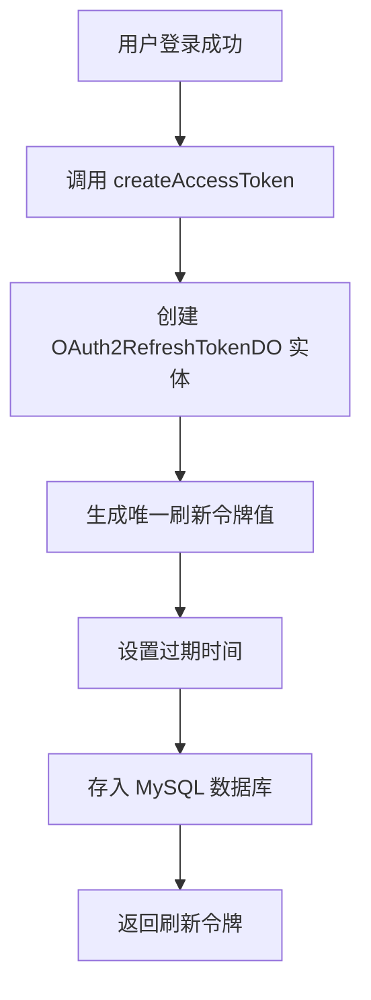
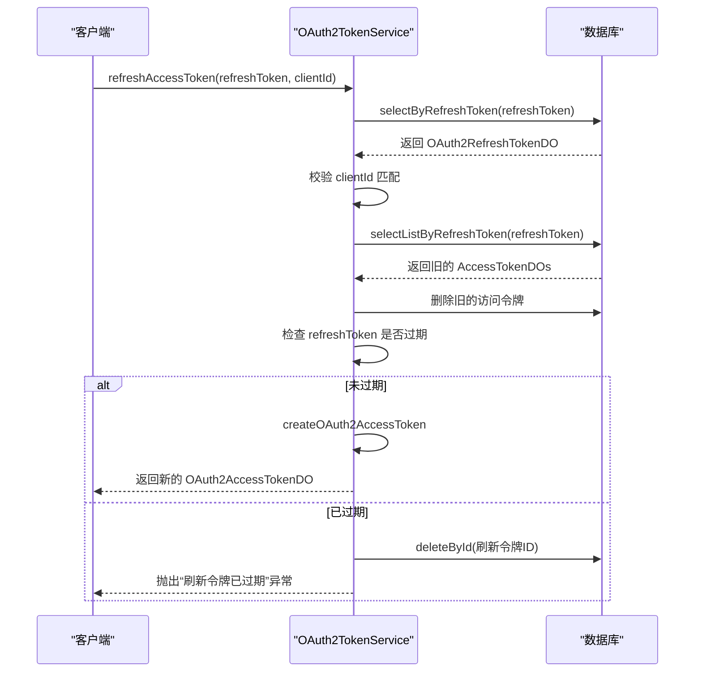
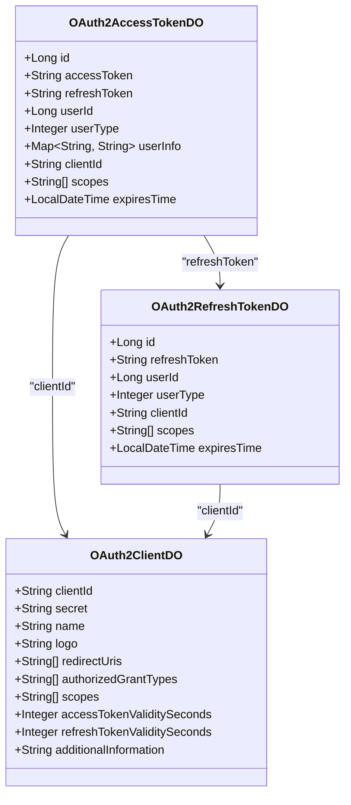

# 刷新令牌机制

<cite>
**本文档引用的文件**  
- [OAuth2TokenServiceImpl.java](file://yudao-module-system/src/main/java/cn/iocoder/yudao/module/system/service/oauth2/OAuth2TokenServiceImpl.java)
- [OAuth2TokenService.java](file://yudao-module-system/src/main/java/cn/iocoder/yudao/module/system/service/oauth2/OAuth2TokenService.java)
- [OAuth2RefreshTokenDO.java](file://yudao-module-system/src/main/java/cn/iocoder/yudao/module/system/dal/dataobject/oauth2/OAuth2RefreshTokenDO.java)
- [OAuth2AccessTokenDO.java](file://yudao-module-system/src/main/java/cn/iocoder/yudao/module/system/dal/dataobject/oauth2/OAuth2AccessTokenDO.java)
- [OAuth2AccessTokenMapper.java](file://yudao-module-system/src/main/java/cn/iocoder/yudao/module/system/dal/mysql/oauth2/OAuth2AccessTokenMapper.java)
- [OAuth2RefreshTokenMapper.java](file://yudao-module-system/src/main/java/cn/iocoder/yudao/module/system/dal/mysql/oauth2/OAuth2RefreshTokenMapper.java)
- [OAuth2AccessTokenRedisDAO.java](file://yudao-module-system/src/main/java/cn/iocoder/yudao/module/system/dal/redis/oauth2/OAuth2AccessTokenRedisDAO.java)
- [AdminAuthServiceImpl.java](file://yudao-module-system/src/main/java/cn/iocoder/yudao/module/system/service/auth/AdminAuthServiceImpl.java)
- [OAuth2OpenController.java](file://yudao-module-system/src/main/java/cn/iocoder/yudao/module/system/controller/admin/oauth2/OAuth2OpenController.java)
- [OAuth2ClientDO.java](file://yudao-module-system/src/main/java/cn/iocoder/yudao/module/system/dal/dataobject/oauth2/OAuth2ClientDO.java)
</cite>

## 目录
1. [简介](#简介)
2. [刷新令牌的生成与使用](#刷新令牌的生成与使用)
3. [刷新令牌的安全管理](#刷新令牌的安全管理)
4. [刷新令牌的轮换与审计](#刷新令牌的轮换与审计)
5. [移动端长期会话最佳实践](#移动端长期会话最佳实践)

## 简介
刷新令牌（Refresh Token）是OAuth 2.0协议中的关键安全机制，用于在访问令牌（Access Token）过期后获取新的访问令牌，从而维持用户的长期会话。本系统通过`OAuth2TokenServiceImpl`服务实现了完整的刷新令牌生命周期管理，包括生成、验证、刷新和撤销。刷新令牌与访问令牌成对生成，存储于数据库和Redis缓存中，并具备一次性使用、客户端绑定和过期自动清理等安全特性。

## 刷新令牌的生成与使用

### 令牌生成流程
当用户首次登录或通过密码模式认证成功后，系统会调用`OAuth2TokenService.createAccessToken`方法，该方法会同时生成访问令牌和刷新令牌。刷新令牌的生成由`createOAuth2RefreshToken`私有方法完成，其核心逻辑如下：
1.  **创建实体**：基于用户ID、用户类型、客户端ID和授权范围（scopes）创建`OAuth2RefreshTokenDO`实体。
2.  **生成令牌值**：调用`generateRefreshToken()`方法，使用`IdUtil.fastSimpleUUID()`生成一个全局唯一的、不可预测的字符串作为刷新令牌值。
3.  **设置有效期**：有效期由客户端配置的`refreshTokenValiditySeconds`决定，通过`LocalDateTime.now().plusSeconds()`计算过期时间。
4.  **持久化存储**：将生成的刷新令牌实体通过`OAuth2RefreshTokenMapper`插入到`system_oauth2_refresh_token`数据库表中。

**图源**
- [OAuth2TokenServiceImpl.java](file://yudao-module-system/src/main/java/cn/iocoder/yudao/module/system/service/oauth2/OAuth2TokenServiceImpl.java#L174-L181)
- [OAuth2RefreshTokenDO.java](file://yudao-module-system/src/main/java/cn/iocoder/yudao/module/system/dal/dataobject/oauth2/OAuth2RefreshTokenDO.java#L18-L58)

### 访问令牌刷新流程
当访问令牌过期后，客户端可使用有效的刷新令牌来获取新的访问令牌。此过程由`OAuth2TokenService.refreshAccessToken`方法处理，其核心步骤为：
1.  **查询刷新令牌**：通过`OAuth2RefreshTokenMapper.selectByRefreshToken`方法，根据提供的刷新令牌值从数据库中查询对应的`OAuth2RefreshTokenDO`。
2.  **校验客户端**：验证请求中的`clientId`与数据库中存储的`clientId`是否匹配，防止跨客户端令牌滥用。
3.  **清理旧令牌**：查找并删除所有与该刷新令牌关联的旧访问令牌（可能因轮换产生多个），确保旧令牌立即失效。
4.  **检查过期**：若刷新令牌本身已过期，则将其从数据库中删除并抛出异常。
5.  **生成新令牌**：调用`createOAuth2AccessToken`方法，使用原有的刷新令牌信息生成一对全新的访问令牌和刷新令牌。

**图源**
- [OAuth2TokenServiceImpl.java](file://yudao-module-system/src/main/java/cn/iocoder/yudao/module/system/service/oauth2/OAuth2TokenServiceImpl.java#L69-L99)
- [OAuth2RefreshTokenMapper.java](file://yudao-module-system/src/main/java/cn/iocoder/yudao/module/system/dal/mysql/oauth2/OAuth2RefreshTokenMapper.java#L16-L19)

**节源**
- [OAuth2TokenServiceImpl.java](file://yudao-module-system/src/main/java/cn/iocoder/yudao/module/system/service/oauth2/OAuth2TokenServiceImpl.java#L69-L99)

## 刷新令牌的安全管理

### 存储策略与有效期
-   **存储策略**：刷新令牌以明文形式存储在`system_oauth2_refresh_token`数据库表中。系统未使用加密存储，依赖令牌的随机性和唯一性保证安全。同时，访问令牌会缓存在Redis中以提高校验效率，但刷新令牌本身不缓存。
-   **有效期配置**：刷新令牌的有效期由客户端（Client）独立配置，通过`OAuth2ClientDO.refreshTokenValiditySeconds`字段定义。这允许不同客户端（如Web应用和移动应用）设置不同的长期会话策略。

### 一次性使用与撤销机制
本系统实现了刷新令牌的“一次性使用”特性，这是通过令牌轮换（Token Rotation）实现的：
-   **轮换机制**：每次使用刷新令牌换取新令牌时，系统不仅会生成新的访问令牌，还会生成一个**全新的刷新令牌**。旧的刷新令牌在新令牌生成后立即被删除。这意味着每个刷新令牌只能成功使用一次，大大降低了令牌被盗用的风险。
-   **撤销机制**：当用户主动登出或系统需要强制终止会话时，调用`removeAccessToken`方法。该方法会根据访问令牌找到其关联的刷新令牌，并通过`OAuth2RefreshTokenMapper.deleteByRefreshToken`将其从数据库中彻底删除，实现令牌的立即失效。

**图源**
- [OAuth2RefreshTokenDO.java](file://yudao-module-system/src/main/java/cn/iocoder/yudao/module/system/dal/dataobject/oauth2/OAuth2RefreshTokenDO.java#L18-L58)
- [OAuth2AccessTokenDO.java](file://yudao-module-system/src/main/java/cn/iocoder/yudao/module/system/dal/dataobject/oauth2/OAuth2AccessTokenDO.java#L24-L74)
- [OAuth2ClientDO.java](file://yudao-module-system/src/main/java/cn/iocoder/yudao/module/system/dal/dataobject/oauth2/OAuth2ClientDO.java#L21-L108)

### 安全防护措施
-   **客户端绑定**：每个刷新令牌都与特定的`clientId`绑定。在刷新令牌时，必须提供正确的`clientId`，否则请求将被拒绝，防止令牌被用于其他应用。
-   **过期自动清理**：系统在刷新令牌时会检查其过期时间。如果已过期，不仅会拒绝请求，还会主动将其从数据库中删除，避免过期令牌堆积。
-   **租户隔离**：系统支持多租户，`OAuth2RefreshTokenDO`继承自`TenantBaseDO`，通过`tenantId`字段实现数据隔离，确保不同租户的令牌互不干扰。

**节源**
- [OAuth2TokenServiceImpl.java](file://yudao-module-system/src/main/java/cn/iocoder/yudao/module/system/service/oauth2/OAuth2TokenServiceImpl.java#L69-L99)
- [OAuth2ClientDO.java](file://yudao-module-system/src/main/java/cn/iocoder/yudao/module/system/dal/dataobject/oauth2/OAuth2ClientDO.java#L68-L68)

## 刷新令牌的轮换与审计

### 轮换策略
如前所述，系统的轮换策略是核心安全特性。每次刷新操作都会导致：
1.  旧的刷新令牌被标记为无效并从数据库删除。
2.  一个新的、随机的刷新令牌被创建并返回给客户端。
3.  客户端有责任在收到新令牌后，立即更新本地存储的刷新令牌，以备下次使用。

这种策略确保了即使某个刷新令牌在传输过程中被截获，攻击者也只能使用一次，且使用后该令牌即失效，而合法用户在下次刷新时会获得一个全新的令牌，攻击行为不会影响其后续会话。

### 安全审计日志
虽然刷新令牌的生成和刷新操作本身不直接记录审计日志，但与之紧密关联的用户行为会被记录：
-   **登录日志**：用户首次登录成功会记录`LoginLog`，类型为`LOGIN_SUCCESS`。
-   **登出日志**：当调用`logout`方法时，会先调用`removeAccessToken`删除令牌，然后记录`LoginLog`，类型为`LOGOUT_DELETE`。
-   **操作日志**：管理员对OAuth2客户端的创建、修改等操作会被`OperateLog`服务记录。

这些日志为追踪用户会话生命周期和排查安全事件提供了重要依据。

**节源**
- [AdminAuthServiceImpl.java](file://yudao-module-system/src/main/java/cn/iocoder/yudao/module/system/service/auth/AdminAuthServiceImpl.java#L210-L235)

## 移动端应用维护长期会话的最佳实践

对于移动端应用，应遵循以下最佳实践来安全地维护长期会话：
1.  **安全存储**：将刷新令牌存储在设备的安全存储区域，如Android的`Keystore`或iOS的`Keychain`，避免以明文形式存放在SharedPreferences或文件中。
2.  **及时更新**：在每次成功刷新令牌后，必须立即将新的刷新令牌更新到安全存储中，覆盖旧的令牌。
3.  **优雅降级**：当刷新令牌请求因过期或无效而失败时，不应尝试重试，而应引导用户重新进行身份验证（登录），以建立新的会话。
4.  **最小化权限**：客户端在请求令牌时，应遵循最小权限原则，只请求必要的`scopes`，以降低令牌泄露后的潜在风险。
5.  **监控异常**：应用应监控频繁的令牌刷新失败情况，这可能是令牌被盗用的迹象，可考虑实现自动登出或通知用户。