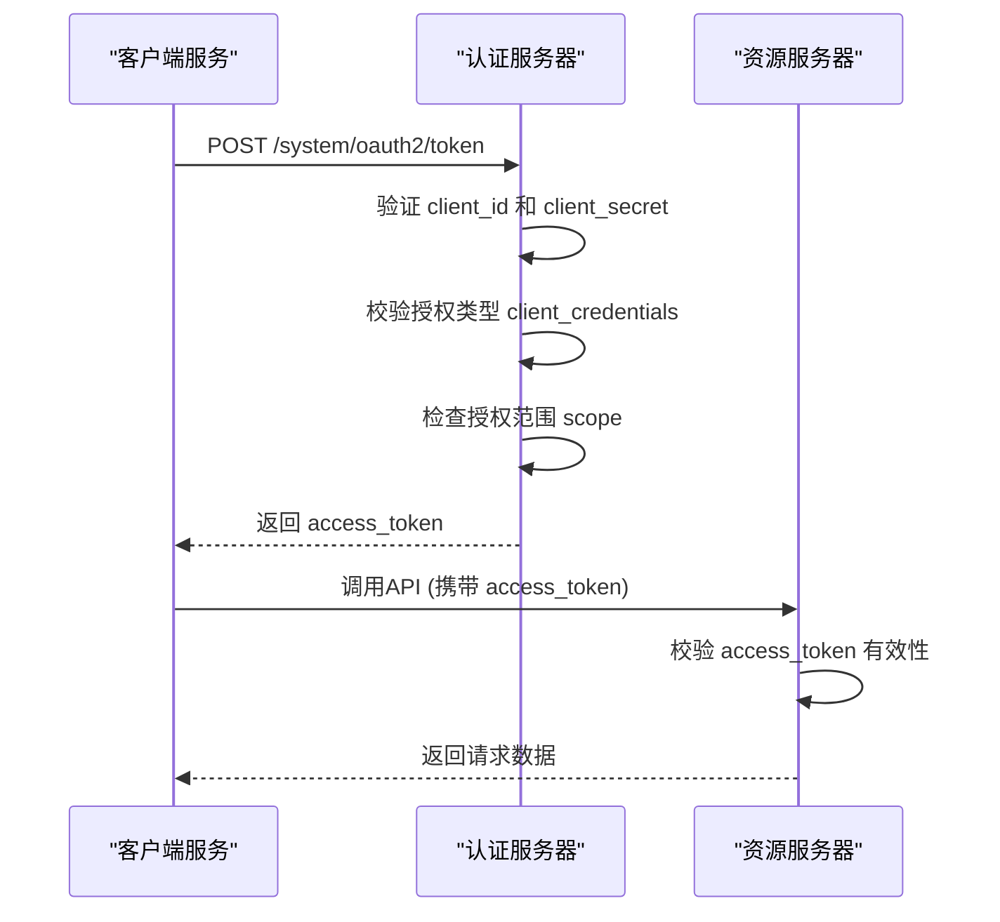
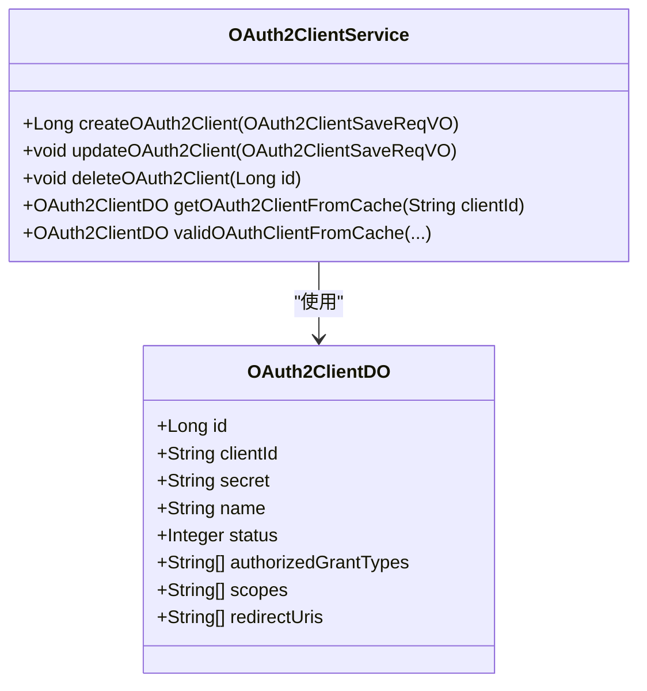

# 客户端凭证模式

<cite>
**本文档引用的文件**  
- [OAuth2ClientService.java](file://yudao-module-system/src/main/java/cn/iocoder/yudao/module/system/service/oauth2/OAuth2ClientService.java)
- [OAuth2ClientServiceImpl.java](file://yudao-module-system/src/main/java/cn/iocoder/yudao/module/system/service/oauth2/OAuth2ClientServiceImpl.java)
- [OAuth2ClientDO.java](file://yudao-module-system/src/main/java/cn/iocoder/yudao/module/system/dal/dataobject/oauth2/OAuth2ClientDO.java)
- [OAuth2GrantTypeEnum.java](file://yudao-module-system/src/main/java/cn/iocoder/yudao/module/system/enums/oauth2/OAuth2GrantTypeEnum.java)
- [OAuth2OpenController.java](file://yudao-module-system/src/main/java/cn/iocoder/yudao/module/system/controller/admin/oauth2/OAuth2OpenController.java)
- [OAuth2GrantServiceImpl.java](file://yudao-module-system/src/main/java/cn/iocoder/yudao/module/system/service/oauth2/OAuth2GrantServiceImpl.java)
- [OAuth2AccessTokenDO.java](file://yudao-module-system/src/main/java/cn/iocoder/yudao/module/system/dal/dataobject/oauth2/OAuth2AccessTokenDO.java)
</cite>

## 目录
1. [简介](#简介)
2. [客户端凭证模式概述](#客户端凭证模式概述)
3. [客户端凭证的生成与存储](#客户端凭证的生成与存储)
4. [客户端凭证的验证机制](#客户端凭证的验证机制)
5. [权限范围（Scope）配置与管理](#权限范围scope配置与管理)
6. [安全存储与密钥轮换策略](#安全存储与密钥轮换策略)
7. [服务间通信典型应用场景](#服务间通信典型应用场景)
8. [API网关集成配置示例](#api网关集成配置示例)
9. [总结](#总结)

## 简介
客户端凭证模式是OAuth 2.0协议中用于服务间通信的一种授权模式，特别适用于后台任务、微服务调用等无需用户参与的场景。该模式通过客户端ID和密钥进行身份验证，获取访问令牌以调用受保护的API资源。

**客户端凭证模式**的核心在于服务端对客户端的身份认证，而非对最终用户的身份认证。系统通过校验客户端ID和密钥的合法性，确保只有授权的服务才能访问特定资源。

## 客户端凭证模式概述
客户端凭证模式（Client Credentials Grant）是OAuth 2.0规范中定义的一种授权类型，其授权类型值为`client_credentials`。在本系统中，该模式由`OAuth2GrantTypeEnum.CLIENT_CREDENTIALS`枚举值表示。

该模式适用于以下场景：
- 微服务之间的内部调用
- 后台任务处理服务
- 定时任务执行器
- 系统级集成服务

与需要用户参与的授权码模式或密码模式不同，客户端凭证模式完全基于服务端之间的信任关系，不涉及用户身份验证。



**图示来源**  
- [OAuth2OpenController.java](file://yudao-module-system/src/main/java/cn/iocoder/yudao/module/system/controller/admin/oauth2/OAuth2OpenController.java#L126-L153)
- [OAuth2GrantServiceImpl.java](file://yudao-module-system/src/main/java/cn/iocoder/yudao/module/system/service/oauth2/OAuth2GrantServiceImpl.java#L90-L95)

## 客户端凭证的生成与存储
客户端凭证包括客户端ID（client_id）和客户端密钥（client_secret），由系统管理员通过管理后台创建和管理。

### 凭证生成
客户端凭证通过`OAuth2ClientService`接口的`createOAuth2Client`方法生成。系统会验证客户端ID的唯一性，确保不会重复创建。

```java
public interface OAuth2ClientService {
    Long createOAuth2Client(@Valid OAuth2ClientSaveReqVO createReqVO);
}
```

创建过程中，系统会执行以下验证：
- 客户端ID是否已存在
- 必填字段是否完整
- 授权类型是否包含`client_credentials`

### 凭证存储
客户端凭证存储在`system_oauth2_client`数据库表中，对应的实体类为`OAuth2ClientDO`。关键字段包括：

| 字段 | 说明 |
|------|------|
| clientId | 客户端编号，唯一标识 |
| secret | 客户端密钥，加密存储 |
| authorizedGrantTypes | 授权类型列表，必须包含 client_credentials |
| scopes | 可授权的权限范围 |
| status | 客户端状态，启用或禁用 |

此外，系统使用Redis缓存客户端信息，缓存键为`RedisKeyConstants.OAUTH_CLIENT`，以提高验证效率。



**图示来源**  
- [OAuth2ClientDO.java](file://yudao-module-system/src/main/java/cn/iocoder/yudao/module/system/dal/dataobject/oauth2/OAuth2ClientDO.java#L21-L108)
- [OAuth2ClientService.java](file://yudao-module-system/src/main/java/cn/iocoder/yudao/module/system/service/oauth2/OAuth2ClientService.java#L18-L97)

## 客户端凭证的验证机制
客户端凭证的验证是客户端凭证模式的核心安全机制，确保只有合法的客户端才能获取访问令牌。

### 验证流程
验证流程由`OAuth2ClientServiceImpl`类的`validOAuthClientFromCache`方法实现，主要步骤包括：

1. 从缓存中获取客户端信息
2. 校验客户端是否存在且状态为启用
3. 验证客户端密钥是否匹配
4. 检查授权类型是否包含`client_credentials`
5. 验证请求的权限范围是否在客户端授权范围内

```java
@Override
public OAuth2ClientDO validOAuthClientFromCache(String clientId, String clientSecret, 
                                               String authorizedGrantType,
                                               Collection<String> scopes, 
                                               String redirectUri) {
    // 校验客户端存在、且开启
    OAuth2ClientDO client = getSelf().getOAuth2ClientFromCache(clientId);
    if (client == null) {
        throw exception(OAUTH2_CLIENT_NOT_EXISTS);
    }
    if (CommonStatusEnum.isDisable(client.getStatus())) {
        throw exception(OAUTH2_CLIENT_DISABLE);
    }

    // 校验客户端密钥
    if (StrUtil.isNotEmpty(clientSecret) && ObjectUtil.notEqual(client.getSecret(), clientSecret)) {
        throw exception(OAUTH2_CLIENT_CLIENT_SECRET_ERROR);
    }
    // 校验授权方式
    if (StrUtil.isNotEmpty(authorizedGrantType) && !CollUtil.contains(client.getAuthorizedGrantTypes(), authorizedGrantType)) {
        throw exception(OAUTH2_CLIENT_AUTHORIZED_GRANT_TYPE_NOT_EXISTS);
    }
    // 校验授权范围
    if (CollUtil.isNotEmpty(scopes) && !CollUtil.containsAll(client.getScopes(), scopes)) {
        throw exception(OAUTH2_CLIENT_SCOPE_OVER);
    }
    return client;
}
```

### 访问令牌生成
验证通过后，系统调用`OAuth2GrantService`的`grantClientCredentials`方法生成访问令牌：

```java
@Override
public OAuth2AccessTokenDO grantClientCredentials(String clientId, List<String> scopes) {
    return oauth2TokenService.createAccessToken(0L, UserTypeEnum.ADMIN.getValue(), 
                                              clientId, scopes);
}
```

注意：在客户端凭证模式下，用户ID为0，表示系统级访问，不关联具体用户。

**图示来源**  
- [OAuth2ClientServiceImpl.java](file://yudao-module-system/src/main/java/cn/iocoder/yudao/module/system/service/oauth2/OAuth2ClientServiceImpl.java#L130-L161)
- [OAuth2GrantServiceImpl.java](file://yudao-module-system/src/main/java/cn/iocoder/yudao/module/system/service/oauth2/OAuth2GrantServiceImpl.java#L90-L95)

## 权限范围（Scope）配置与管理
权限范围（Scope）是客户端凭证模式中的重要概念，用于限制客户端的访问权限，实现最小权限原则。

### Scope配置
在创建或更新客户端时，可以配置以下与权限范围相关的字段：

- `scopes`：客户端可请求的权限范围列表
- `autoApproveScopes`：自动授权的权限范围，无需用户确认

每个权限范围代表一组特定的API访问权限，例如：
- `user:read`：读取用户信息
- `order:write`：创建订单
- `report:view`：查看报表

### Scope管理
系统通过`OAuth2ClientDO`类的`scopes`字段存储权限范围，使用JacksonTypeHandler进行JSON序列化存储。

在令牌请求时，系统会验证请求的权限范围是否在客户端配置的范围内：

```java
// 校验授权范围
if (CollUtil.isNotEmpty(scopes) && !CollUtil.containsAll(client.getScopes(), scopes)) {
    throw exception(OAUTH2_CLIENT_SCOPE_OVER);
}
```

这种机制确保了客户端只能访问其被授权的资源，防止权限越界。

**图示来源**  
- [OAuth2ClientDO.java](file://yudao-module-system/src/main/java/cn/iocoder/yudao/module/system/dal/dataobject/oauth2/OAuth2ClientDO.java#L21-L108)
- [OAuth2ClientServiceImpl.java](file://yudao-module-system/src/main/java/cn/iocoder/yudao/module/system/service/oauth2/OAuth2ClientServiceImpl.java#L130-L161)

## 安全存储与密钥轮换策略
客户端凭证的安全存储和密钥轮换是保障系统安全的重要措施。

### 安全存储最佳实践
1. **密钥加密存储**：客户端密钥在数据库中应加密存储，避免明文保存
2. **环境变量管理**：生产环境的客户端密钥应通过环境变量或密钥管理服务注入
3. **访问控制**：限制对客户端管理界面的访问权限，仅允许授权人员操作
4. **日志审计**：记录所有客户端凭证的创建、修改和删除操作

### 密钥轮换策略
系统支持客户端密钥的定期轮换，建议采用以下策略：

1. **定期轮换**：每90天更换一次客户端密钥
2. **滚动更新**：先更新服务端配置，再更新客户端配置，避免服务中断
3. **双密钥机制**：在轮换期间，同时支持新旧两个密钥，确保平滑过渡

密钥轮换可以通过更新客户端配置实现：

```java
@Override
@CacheEvict(cacheNames = RedisKeyConstants.OAUTH_CLIENT, allEntries = true)
public void updateOAuth2Client(OAuth2ClientSaveReqVO updateReqVO) {
    // 校验存在
    validateOAuth2ClientExists(updateReqVO.getId());
    // 校验 Client 未被占用
    validateClientIdExists(updateReqVO.getId(), updateReqVO.getClientId());

    // 更新
    OAuth2ClientDO updateObj = BeanUtils.toBean(updateReqVO, OAuth2ClientDO.class);
    oauth2ClientMapper.updateById(updateObj);
}
```

更新后，旧的访问令牌将继续有效直到过期，新的请求将使用新的密钥。

**图示来源**  
- [OAuth2ClientServiceImpl.java](file://yudao-module-system/src/main/java/cn/iocoder/yudao/module/system/service/oauth2/OAuth2ClientServiceImpl.java#L30-L45)
- [OAuth2ClientDO.java](file://yudao-module-system/src/main/java/cn/iocoder/yudao/module/system/dal/dataobject/oauth2/OAuth2ClientDO.java#L21-L108)

## 服务间通信典型应用场景
客户端凭证模式特别适用于服务间通信的场景，以下是几个典型应用：

### 微服务调用
在微服务架构中，服务A需要调用服务B的API：

```mermaid
flowchart TD
A[服务A] --> |1. 获取 access_token| Auth[认证服务器]
Auth --> |2. 返回 access_token| A
A --> |3. 调用API (携带 token)| B[服务B]
B --> |4. 返回数据| A
```

### 后台任务处理
定时任务服务调用业务服务处理数据：

```java
// 定时任务中调用API
String accessToken = obtainAccessToken("task-client", "task-secret", "data:process");
HttpHeaders headers = new HttpHeaders();
headers.setBearerAuth(accessToken);
restTemplate.exchange("http://api-service/data/process", 
                     HttpMethod.POST, new HttpEntity<>(headers), String.class);
```

### 数据同步服务
系统间数据同步场景：

1. 数据源服务生成访问令牌
2. 数据接收服务使用令牌访问数据
3. 完成数据同步后，令牌过期失效

这些场景的共同特点是：无需用户参与、服务间信任、需要安全的身份验证。

**图示来源**  
- [OAuth2OpenController.java](file://yudao-module-system/src/main/java/cn/iocoder/yudao/module/system/controller/admin/oauth2/OAuth2OpenController.java#L126-L153)
- [OAuth2GrantServiceImpl.java](file://yudao-module-system/src/main/java/cn/iocoder/yudao/module/system/service/oauth2/OAuth2GrantServiceImpl.java#L90-L95)

## API网关集成配置示例
在API网关中集成客户端凭证模式的配置示例：

### Spring Security配置
```java
@Configuration
@EnableWebSecurity
public class SecurityConfig {

    @Bean
    public SecurityFilterChain filterChain(HttpSecurity http) throws Exception {
        http
            .authorizeHttpRequests(authz -> authz
                .requestMatchers("/public/**").permitAll()
                .requestMatchers("/api/**").authenticated()
            )
            .oauth2ResourceServer(oauth2 -> oauth2
                .jwt(jwt -> jwt
                    .decoder(jwtDecoder())
                )
            );
        return http.build();
    }

    @Bean
    public JwtDecoder jwtDecoder() {
        return NimbusJwtDecoder.withSecretKey(
            new SecretKeySpec("your-signing-key".getBytes(), "HmacSHA256"))
            .build();
    }
}
```

### 客户端调用示例
```bash
# 获取访问令牌
curl -X POST http://localhost:48080/system/oauth2/token \
  -H "Authorization: Basic $(echo -n 'client-id:client-secret' | base64)" \
  -H "Content-Type: application/x-www-form-urlencoded" \
  -d "grant_type=client_credentials" \
  -d "scope=user:read order:write"

# 使用访问令牌调用API
curl -X GET http://localhost:48080/system-api/user/info \
  -H "Authorization: Bearer access-token-value"
```

### Nginx配置示例
```nginx
location /api/ {
    # 验证 access_token
    access_by_lua_block {
        local jwt = require("nginx-jwt")
        jwt.auth()
    }
    
    proxy_pass http://backend-service;
    proxy_set_header X-Forwarded-For $proxy_add_x_forwarded_for;
}
```

这些配置示例展示了如何在不同层级集成客户端凭证模式，确保服务间通信的安全性。

**图示来源**  
- [OAuth2OpenController.java](file://yudao-module-system/src/main/java/cn/iocoder/yudao/module/system/controller/admin/oauth2/OAuth2OpenController.java#L126-L153)
- [OAuth2ClientServiceImpl.java](file://yudao-module-system/src/main/java/cn/iocoder/yudao/module/system/service/oauth2/OAuth2ClientServiceImpl.java#L130-L161)

## 总结
客户端凭证模式为服务间通信提供了一种安全、可靠的身份验证机制。通过客户端ID和密钥的组合，系统能够有效识别和验证服务身份，确保只有授权的服务才能访问特定资源。

关键要点包括：
- 客户端凭证由客户端ID和密钥组成
- 验证机制包括身份验证和权限范围检查
- 权限范围（Scope）实现细粒度的访问控制
- 安全存储和密钥轮换策略保障系统安全
- 适用于微服务、后台任务等服务间通信场景

通过合理配置和管理客户端凭证，可以构建安全可靠的分布式系统架构。