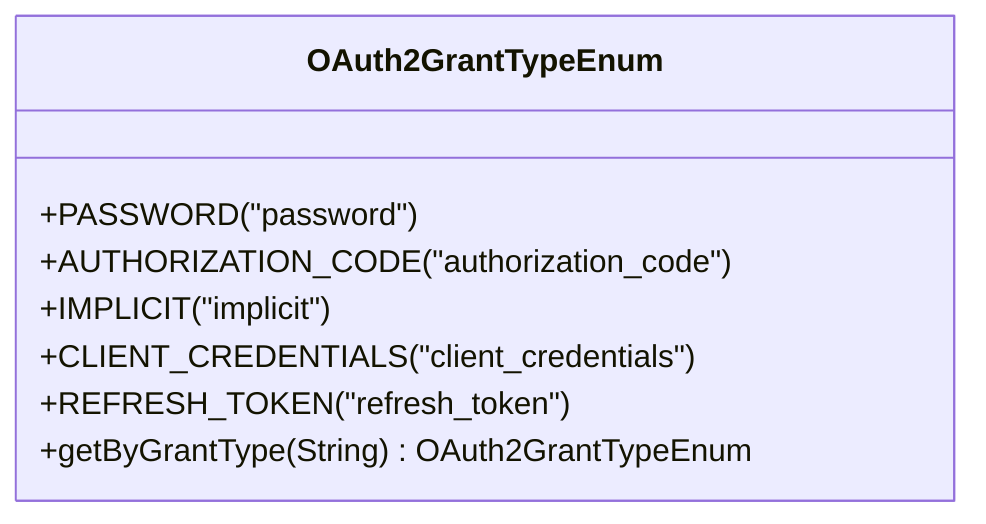
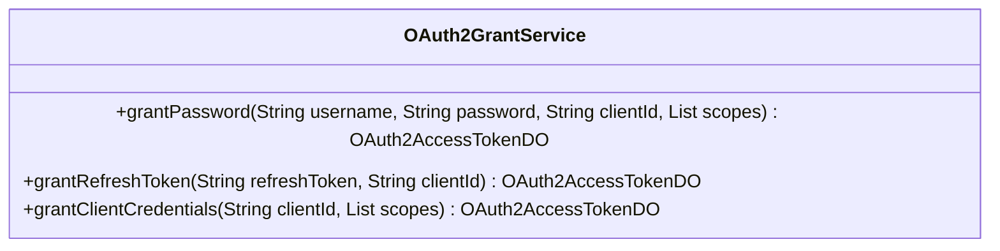
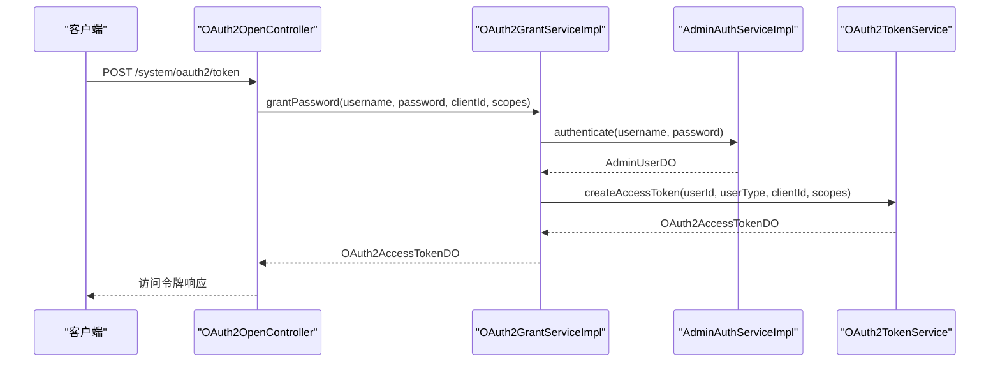
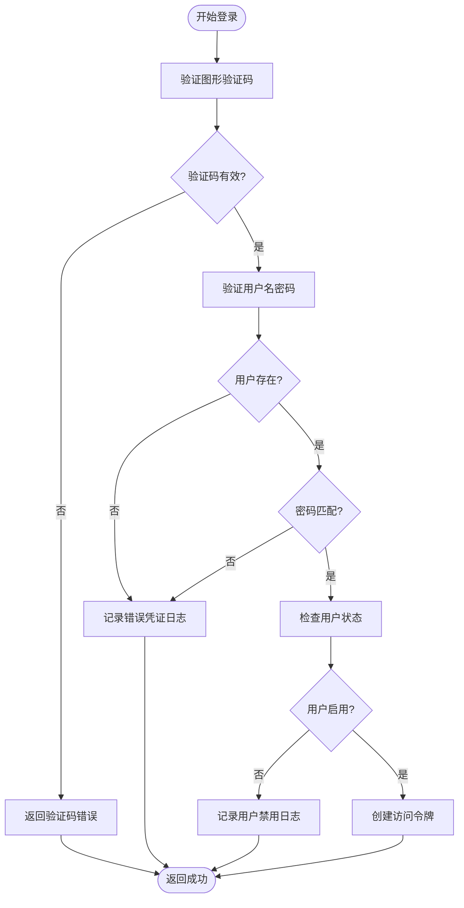
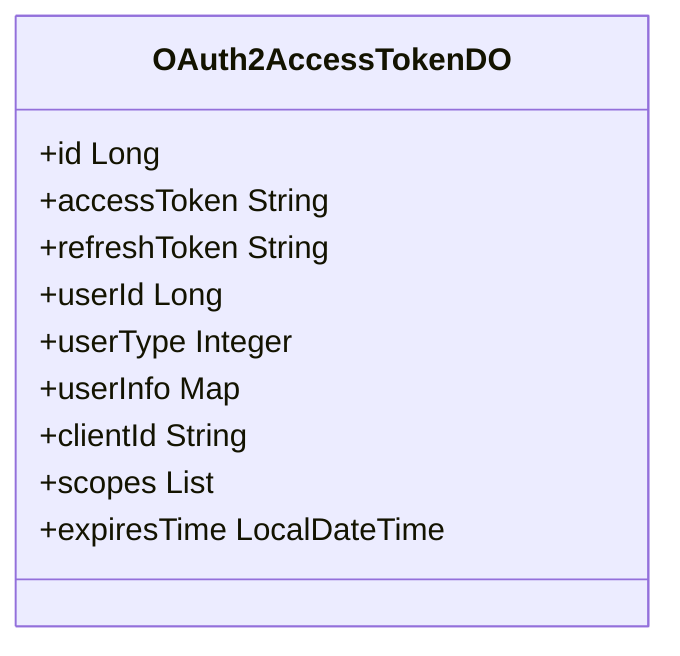

# 密码凭证模式

<cite>
**本文档引用文件**  
- [OAuth2GrantTypeEnum.java](file://yudao-module-system/src/main/java/cn/iocoder/yudao/module/system/enums/oauth2/OAuth2GrantTypeEnum.java)
- [OAuth2GrantService.java](file://yudao-module-system/src/main/java/cn/iocoder/yudao/module/system/service/oauth2/OAuth2GrantService.java)
- [OAuth2GrantServiceImpl.java](file://yudao-module-system/src/main/java/cn/iocoder/yudao/module/system/service/oauth2/OAuth2GrantServiceImpl.java)
- [AdminAuthService.java](file://yudao-module-system/src/main/java/cn/iocoder/yudao/module/system/service/auth/AdminAuthService.java)
- [AdminAuthServiceImpl.java](file://yudao-module-system/src/main/java/cn/iocoder/yudao/module/system/service/auth/AdminAuthServiceImpl.java)
- [OAuth2AccessTokenDO.java](file://yudao-module-system/src/main/java/cn/iocoder/yudao/module/system/dal/dataobject/oauth2/OAuth2AccessTokenDO.java)
- [OAuth2OpenController.java](file://yudao-module-system/src/main/java/cn/iocoder/yudao/module/system/controller/admin/oauth2/OAuth2OpenController.java)
- [application.yaml](file://yudao-server/src/main/resources/application.yaml)
</cite>

## 目录
1. [引言](#引言)
2. [密码凭证模式实现原理](#密码凭证模式实现原理)
3. [验证流程与安全传输](#验证流程与安全传输)
4. [受信任客户端场景与安全风险](#受信任客户端场景与安全风险)
5. [密码加密存储与失败防护](#密码加密存储与失败防护)
6. [访问令牌与刷新令牌机制](#访问令牌与刷新令牌机制)
7. [移动端最佳实践](#移动端最佳实践)
8. [结论](#结论)

## 引言
密码凭证授权模式是OAuth 2.0协议中的一种授权方式，允许客户端应用通过用户的用户名和密码直接获取访问令牌。该模式适用于高度受信任的客户端，如第一方应用或系统内部服务。本文档深入解析该模式在本系统中的实现原理、安全考量及最佳实践。

## 密码凭证模式实现原理

### 授权类型定义
系统通过`OAuth2GrantTypeEnum`枚举定义了支持的授权类型，其中`PASSWORD("password")`表示密码模式，用于标识客户端请求使用用户名和密码进行认证。

**图示来源**  
- [OAuth2GrantTypeEnum.java](file://yudao-module-system/src/main/java/cn/iocoder/yudao/module/system/enums/oauth2/OAuth2GrantTypeEnum.java#L11-L28)

### 授权服务接口
`OAuth2GrantService`接口定义了密码模式的核心方法`grantPassword`，该方法接收用户名、密码、客户端ID和授权范围，返回访问令牌数据对象。

**图示来源**  
- [OAuth2GrantService.java](file://yudao-module-system/src/main/java/cn/iocoder/yudao/module/system/service/oauth2/OAuth2GrantService.java#L71-L112)

### 授权服务实现
`OAuth2GrantServiceImpl`实现了`grantPassword`方法，其核心逻辑为调用`AdminAuthService.authenticate`进行用户认证，认证通过后调用`OAuth2TokenService.createAccessToken`创建访问令牌。

**图示来源**  
- [OAuth2GrantServiceImpl.java](file://yudao-module-system/src/main/java/cn/iocoder/yudao/module/system/service/oauth2/OAuth2GrantServiceImpl.java#L68-L75)
- [AdminAuthServiceImpl.java](file://yudao-module-system/src/main/java/cn/iocoder/yudao/module/system/service/auth/AdminAuthServiceImpl.java#L50-L65)
- [OAuth2OpenController.java](file://yudao-module-system/src/main/java/cn/iocoder/yudao/module/system/controller/admin/oauth2/OAuth2OpenController.java#L100-L130)

**本节来源**  
- [OAuth2GrantServiceImpl.java](file://yudao-module-system/src/main/java/cn/iocoder/yudao/module/system/service/oauth2/OAuth2GrantServiceImpl.java#L68-L75)

## 验证流程与安全传输

### 客户端凭证验证
在`OAuth2OpenController.postAccessToken`方法中，系统首先通过HTTP Basic Authentication获取`client_id`和`client_secret`，并调用`OAuth2ClientService.validOAuthClientFromCache`验证客户端凭证的有效性、授权类型匹配性和重定向URI合法性。

### 用户凭证验证
用户凭证验证由`AdminAuthServiceImpl.authenticate`方法完成，其流程如下：
1. 根据用户名查询用户信息
2. 比对输入密码与数据库存储的加密密码
3. 检查用户状态是否启用

### 安全传输要求
系统要求所有涉及凭证传输的请求必须通过HTTPS协议进行，以防止中间人攻击。在`application.yaml`中配置了API加密功能，确保敏感数据在传输过程中的安全性。

**本节来源**  
- [OAuth2OpenController.java](file://yudao-module-system/src/main/java/cn/iocoder/yudao/module/system/controller/admin/oauth2/OAuth2OpenController.java#L100-L130)
- [AdminAuthServiceImpl.java](file://yudao-module-system/src/main/java/cn/iocoder/yudao/module/system/service/auth/AdminAuthServiceImpl.java#L50-L65)
- [application.yaml](file://yudao-server/src/main/resources/application.yaml#L320-L325)

## 受信任客户端场景与潜在安全风险

### 适用场景
密码凭证模式适用于以下受信任的客户端场景：
- **第一方应用**：由同一组织开发的移动应用或桌面应用
- **系统内部服务**：微服务架构中服务间的直接调用
- **遗留系统集成**：无法支持更安全授权模式的旧系统

### 潜在安全风险
1. **密码暴露风险**：客户端应用需要直接处理用户密码，增加了密码泄露的可能性
2. **客户端滥用**：恶意客户端可能滥用用户凭证进行未授权操作
3. **凭证重放**：若传输未加密，攻击者可截获并重放凭证
4. **缺乏用户控制**：用户无法对特定权限进行细粒度授权

**本节来源**  
- [OAuth2GrantTypeEnum.java](file://yudao-module-system/src/main/java/cn/iocoder/yudao/module/system/enums/oauth2/OAuth2GrantTypeEnum.java#L11-L28)
- [OAuth2OpenController.java](file://yudao-module-system/src/main/java/cn/iocoder/yudao/module/system/controller/admin/oauth2/OAuth2OpenController.java#L100-L130)

## 密码加密存储与失败防护

### 密码加密机制
系统使用强哈希算法对用户密码进行加密存储。`AdminUserDO`实体中的`password`字段存储的是经过哈希处理的密码摘要，而非明文密码。`AdminUserService.isPasswordMatch`方法负责验证输入密码与存储哈希值的匹配性。

### 失败尝试防护
系统实现了多层失败尝试防护策略：
- **验证码机制**：登录接口默认启用图形验证码，防止自动化暴力破解
- **登录日志记录**：每次登录尝试（成功或失败）均记录详细日志，包括IP地址、用户代理和结果
- **账户锁定**：连续多次失败后可触发账户临时锁定机制

**图示来源**  
- [AdminAuthServiceImpl.java](file://yudao-module-system/src/main/java/cn/iocoder/yudao/module/system/service/auth/AdminAuthServiceImpl.java#L50-L65)
- [AdminAuthServiceImpl.java](file://yudao-module-system/src/main/java/cn/iocoder/yudao/module/system/service/auth/AdminAuthServiceImpl.java#L140-L145)

**本节来源**  
- [AdminAuthServiceImpl.java](file://yudao-module-system/src/main/java/cn/iocoder/yudao/module/system/service/auth/AdminAuthServiceImpl.java#L50-L65)
- [application.yaml](file://yudao-server/src/main/resources/application.yaml#L280-L285)

## 访问令牌与刷新令牌机制

### 令牌数据结构
`OAuth2AccessTokenDO`类定义了访问令牌的核心属性，包括：
- `accessToken`：访问令牌字符串
- `refreshToken`：刷新令牌字符串
- `userId`：用户编号
- `userType`：用户类型
- `clientId`：客户端编号
- `scopes`：授权范围列表
- `expiresTime`：过期时间

### 生成逻辑
访问令牌和刷新令牌由`OAuth2TokenService.createAccessToken`方法生成。该方法根据用户ID、用户类型、客户端ID和授权范围创建新的令牌对，并设置默认有效期。

### 有效期配置
令牌有效期在`OAuth2TokenService`的配置中定义，可通过系统参数进行调整。访问令牌通常具有较短的有效期（如2小时），而刷新令牌具有较长的有效期（如7天），以平衡安全性和用户体验。

**图示来源**  
- [OAuth2AccessTokenDO.java](file://yudao-module-system/src/main/java/cn/iocoder/yudao/module/system/dal/dataobject/oauth2/OAuth2AccessTokenDO.java#L24-L74)

**本节来源**  
- [OAuth2AccessTokenDO.java](file://yudao-module-system/src/main/java/cn/iocoder/yudao/module/system/dal/dataobject/oauth2/OAuth2AccessTokenDO.java#L24-L74)
- [OAuth2GrantServiceImpl.java](file://yudao-module-system/src/main/java/cn/iocoder/yudao/module/system/service/oauth2/OAuth2GrantServiceImpl.java#L68-L75)

## 移动端或第一方应用使用此模式的最佳实践指南

### 安全实现建议
1. **强制HTTPS**：确保所有API调用均通过HTTPS加密通道
2. **客户端凭证保护**：将`client_secret`安全存储在应用内部，避免硬编码在代码中
3. **最小权限原则**：请求最必要的授权范围，避免过度授权
4. **令牌安全存储**：使用安全存储机制（如Keychain/Keystore）保存访问令牌和刷新令牌

### 用户体验优化
1. **自动刷新**：在访问令牌即将过期时，使用刷新令牌自动获取新令牌，避免频繁重新登录
2. **生物识别集成**：结合设备的指纹或面部识别功能，提升登录便捷性
3. **离线支持**：合理设计离线功能，减少对实时令牌验证的依赖

### 监控与审计
1. **登录日志**：记录所有登录事件，包括时间、IP地址和设备信息
2. **异常检测**：监控异常登录行为（如短时间内多次失败尝试）
3. **令牌撤销**：提供用户主动撤销令牌的功能，增强账户控制力

**本节来源**  
- [OAuth2GrantService.java](file://yudao-module-system/src/main/java/cn/iocoder/yudao/module/system/service/oauth2/OAuth2GrantService.java#L71-L112)
- [OAuth2AccessTokenDO.java](file://yudao-module-system/src/main/java/cn/iocoder/yudao/module/system/dal/dataobject/oauth2/OAuth2AccessTokenDO.java#L24-L74)
- [application.yaml](file://yudao-server/src/main/resources/application.yaml#L320-L325)

## 结论
密码凭证授权模式在本系统中通过清晰的接口定义和分层实现，为受信任的客户端提供了直接的用户认证能力。系统通过严格的客户端验证、安全的密码存储和全面的日志记录，最大限度地降低了该模式固有的安全风险。对于移动端和第一方应用，建议遵循最佳实践，结合HTTPS、安全存储和自动刷新机制，以提供既安全又流畅的用户体验。