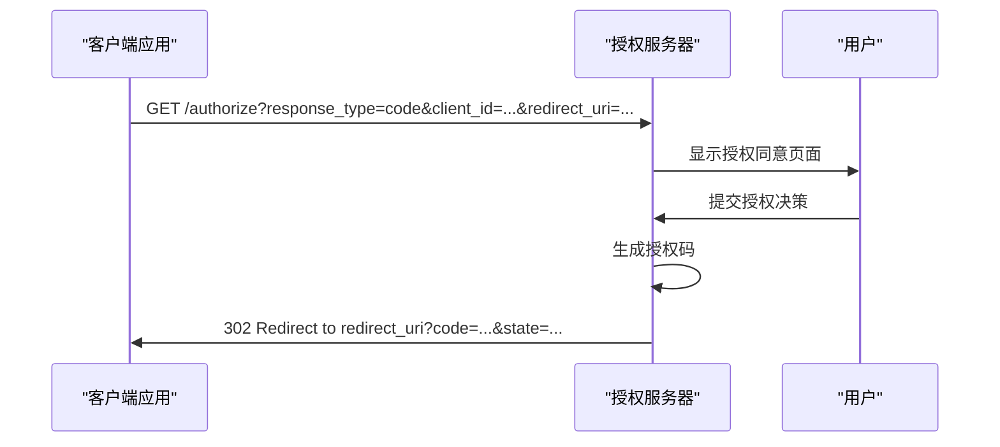
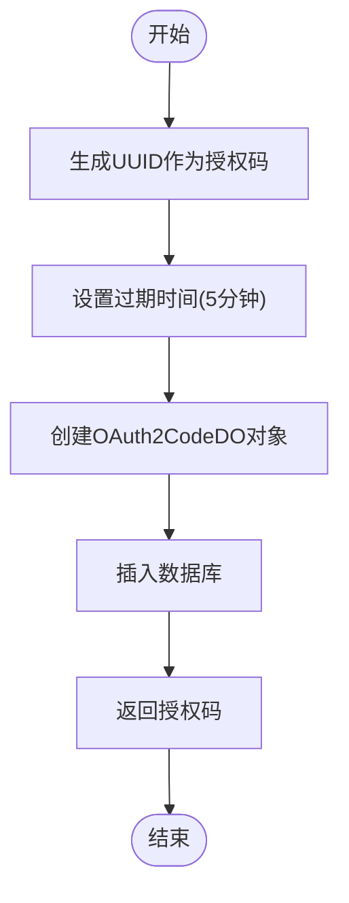
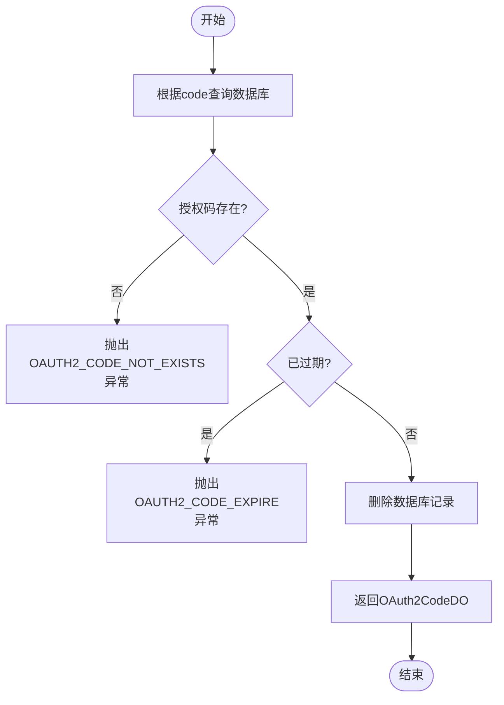
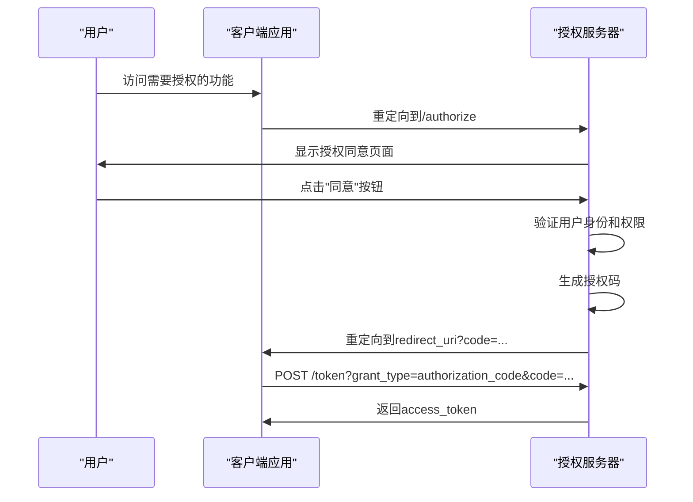
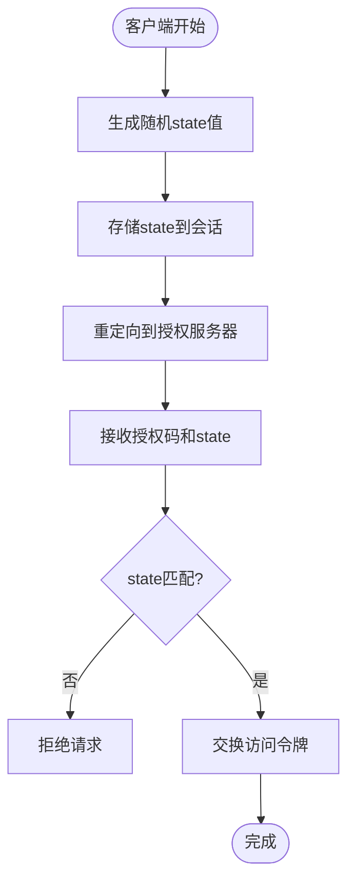

# 授权码模式

<cite>
**本文档引用的文件**
- [OAuth2CodeService.java](file://yudao-module-system/src/main/java/cn/iocoder/yudao/module/system/service/oauth2/OAuth2CodeService.java)
- [OAuth2CodeServiceImpl.java](file://yudao-module-system/src/main/java/cn/iocoder/yudao/module/system/service/oauth2/OAuth2CodeServiceImpl.java)
- [OAuth2GrantService.java](file://yudao-module-system/src/main/java/cn/iocoder/yudao/module/system/service/oauth2/OAuth2GrantService.java)
- [OAuth2GrantServiceImpl.java](file://yudao-module-system/src/main/java/cn/iocoder/yudao/module/system/service/oauth2/OAuth2GrantServiceImpl.java)
- [OAuth2OpenController.java](file://yudao-module-system/src/main/java/cn/iocoder/yudao/module/system/controller/admin/oauth2/OAuth2OpenController.java)
- [OAuth2CodeDO.java](file://yudao-module-system/src/main/java/cn/iocoder/yudao/module/system/dal/dataobject/oauth2/OAuth2CodeDO.java)
- [OAuth2Utils.java](file://yudao-module-system/src/main/java/cn/iocoder/yudao/module/system/util/oauth2/OAuth2Utils.java)
</cite>

## 目录
1. [简介](#简介)
2. [授权码模式实现机制](#授权码模式实现机制)
3. [授权码生命周期管理](#授权码生命周期管理)
4. [用户授权同意流程](#用户授权同意流程)
5. [PKCE扩展与安全防护](#pkce扩展与安全防护)
6. [前端集成示例](#前端集成示例)
7. [结论](#结论)

## 简介
本文档详细阐述了OAuth2.0授权码模式的实现机制，重点说明了授权码的生成、存储、验证和使用流程。文档涵盖了从用户授权到访问令牌获取的完整过程，包括安全验证机制、重定向流程和前端集成方案。

**本文档引用的文件**
- [OAuth2CodeService.java](file://yudao-module-system/src/main/java/cn/iocoder/yudao/module/system/service/oauth2/OAuth2CodeService.java)
- [OAuth2CodeServiceImpl.java](file://yudao-module-system/src/main/java/cn/iocoder/yudao/module/system/service/oauth2/OAuth2CodeServiceImpl.java)
- [OAuth2GrantService.java](file://yudao-module-system/src/main/java/cn/iocoder/yudao/module/system/service/oauth2/OAuth2GrantService.java)
- [OAuth2GrantServiceImpl.java](file://yudao-module-system/src/main/java/cn/iocoder/yudao/module/system/service/oauth2/OAuth2GrantServiceImpl.java)
- [OAuth2OpenController.java](file://yudao-module-system/src/main/java/cn/iocoder/yudao/module/system/controller/admin/oauth2/OAuth2OpenController.java)

## 授权码模式实现机制

### /code接口请求参数与响应格式
授权码模式通过`/system/oauth2/authorize`接口实现，该接口处理授权请求并返回授权码。接口支持以下请求参数：

- **response_type**: 响应类型，必须为"code"
- **client_id**: 客户端编号
- **scope**: 授权范围，以空格分隔的权限列表
- **redirect_uri**: 重定向URI
- **auto_approve**: 用户是否自动授权
- **state**: 状态参数，用于CSRF防护

接口响应为重定向URL，包含授权码和state参数。响应格式遵循OAuth2.0规范，通过302重定向将用户代理返回到客户端指定的重定向URI。

**图示来源**
- [OAuth2OpenController.java](file://yudao-module-system/src/main/java/cn/iocoder/yudao/module/system/controller/admin/oauth2/OAuth2OpenController.java#L205-L253)
- [OAuth2Utils.java](file://yudao-module-system/src/main/java/cn/iocoder/yudao/module/system/util/oauth2/OAuth2Utils.java#L15-L25)

### 重定向流程
授权码模式的重定向流程包含以下步骤：
1. 客户端应用重定向用户代理到授权服务器的`/authorize`端点
2. 授权服务器验证客户端身份和请求参数
3. 显示用户授权同意页面
4. 用户确认授权后，服务器生成授权码
5. 服务器重定向用户代理到客户端提供的重定向URI，附带授权码

重定向URI的构建由`OAuth2Utils.buildAuthorizationCodeRedirectUri`方法完成，确保符合OAuth2.0规范。

**本节来源**
- [OAuth2OpenController.java](file://yudao-module-system/src/main/java/cn/iocoder/yudao/module/system/controller/admin/oauth2/OAuth2OpenController.java#L274-L297)
- [OAuth2Utils.java](file://yudao-module-system/src/main/java/cn/iocoder/yudao/module/system/util/oauth2/OAuth2Utils.java#L15-L25)

## 授权码生命周期管理

### 授权码生成
授权码由`OAuth2CodeServiceImpl.createAuthorizationCode`方法生成，包含以下步骤：
1. 生成唯一授权码（使用`IdUtil.fastSimpleUUID()`）
2. 设置授权码的过期时间（默认5分钟）
3. 存储授权码相关信息（用户ID、客户端ID、授权范围等）
4. 将授权码记录插入数据库

**图示来源**
- [OAuth2CodeServiceImpl.java](file://yudao-module-system/src/main/java/cn/iocoder/yudao/module/system/service/oauth2/OAuth2CodeServiceImpl.java#L34-L44)
- [OAuth2CodeDO.java](file://yudao-module-system/src/main/java/cn/iocoder/yudao/module/system/dal/dataobject/oauth2/OAuth2CodeDO.java#L19-L67)

### 授权码存储
授权码存储在`system_oauth2_code`数据库表中，包含以下字段：
- **id**: 主键，数据库自增
- **code**: 授权码，唯一标识
- **userId**: 用户编号
- **userType**: 用户类型
- **clientId**: 客户端编号
- **scopes**: 授权范围，JSON格式存储
- **redirectUri**: 重定向地址
- **state**: 状态参数
- **expiresTime**: 过期时间

存储操作通过MyBatis Plus的`OAuth2CodeMapper`完成，确保数据持久化。

**本节来源**
- [OAuth2CodeDO.java](file://yudao-module-system/src/main/java/cn/iocoder/yudao/module/system/dal/dataobject/oauth2/OAuth2CodeDO.java)
- [OAuth2CodeServiceImpl.java](file://yudao-module-system/src/main/java/cn/iocoder/yudao/module/system/service/oauth2/OAuth2CodeServiceImpl.java#L40)

### 授权码验证与使用
授权码的验证和使用由`OAuth2CodeServiceImpl.consumeAuthorizationCode`方法处理，包含以下验证步骤：
1. 根据授权码查询数据库记录
2. 验证授权码是否存在
3. 验证授权码是否已过期
4. 验证通过后删除授权码记录（一次性使用）

**图示来源**
- [OAuth2CodeServiceImpl.java](file://yudao-module-system/src/main/java/cn/iocoder/yudao/module/system/service/oauth2/OAuth2CodeServiceImpl.java#L46-L57)
- [OAuth2CodeDO.java](file://yudao-module-system/src/main/java/cn/iocoder/yudao/module/system/dal/dataobject/oauth2/OAuth2CodeDO.java)

### 时效性与一次性使用特性
授权码具有严格的时效性和一次性使用特性：
- **时效性**: 授权码默认有效期为5分钟，通过`expiresTime`字段控制
- **一次性使用**: 授权码被使用后立即从数据库删除，防止重复使用
- **安全性**: 过期的授权码无法使用，确保授权过程的安全性

这些特性通过`consumeAuthorizationCode`方法中的过期检查和删除操作实现。

**本节来源**
- [OAuth2CodeServiceImpl.java](file://yudao-module-system/src/main/java/cn/iocoder/yudao/module/system/service/oauth2/OAuth2CodeServiceImpl.java#L15-L16)
- [OAuth2CodeServiceImpl.java](file://yudao-module-system/src/main/java/cn/iocoder/yudao/module/system/service/oauth2/OAuth2CodeServiceImpl.java#L46-L57)

## 用户授权同意流程

### 交互流程
用户授权同意流程包含以下步骤：
1. 用户访问客户端应用，触发OAuth2.0授权流程
2. 客户端重定向到授权服务器的`/authorize`端点
3. 授权服务器验证客户端身份和请求参数
4. 显示授权同意页面，列出请求的权限范围
5. 用户确认或拒绝授权
6. 根据用户决策，生成授权码并重定向回客户端

**图示来源**
- [OAuth2OpenController.java](file://yudao-module-system/src/main/java/cn/iocoder/yudao/module/system/controller/admin/oauth2/OAuth2OpenController.java#L205-L253)
- [OAuth2GrantServiceImpl.java](file://yudao-module-system/src/main/java/cn/iocoder/yudao/module/system/service/oauth2/OAuth2GrantServiceImpl.java#L47-L69)

### 安全验证机制
授权流程包含多重安全验证机制：
1. **客户端验证**: 验证client_id和client_secret
2. **重定向URI验证**: 确保重定向URI与注册的URI匹配
3. **state参数验证**: 防止CSRF攻击
4. **授权范围验证**: 确保请求的权限在客户端授权范围内

这些验证在`approveOrDeny`方法中实现，确保授权过程的安全性。

**本节来源**
- [OAuth2OpenController.java](file://yudao-module-system/src/main/java/cn/iocoder/yudao/module/system/controller/admin/oauth2/OAuth2OpenController.java#L205-L253)
- [OAuth2GrantServiceImpl.java](file://yudao-module-system/src/main/java/cn/iocoder/yudao/module/system/service/oauth2/OAuth2GrantServiceImpl.java#L52-L60)

## PKCE扩展与安全防护

### PKCE实现方式
虽然当前实现未直接展示PKCE（Proof Key for Code Exchange）扩展，但系统设计支持安全增强机制。PKCE通过以下方式防止授权码劫持：
1. 客户端生成code_verifier和code_challenge
2. 在授权请求中包含code_challenge
3. 在令牌请求中提供code_verifier
4. 服务器验证code_verifier与code_challenge的匹配性

这种机制确保即使授权码被截获，攻击者也无法获取访问令牌。

### 防授权码劫持措施
系统实施了多项措施防止授权码劫持：
- **HTTPS强制**: 所有OAuth2.0端点必须通过HTTPS访问
- **短时效性**: 授权码有效期仅5分钟
- **一次性使用**: 授权码使用后立即失效
- **重定向URI绑定**: 授权码与特定重定向URI绑定
- **客户端身份验证**: 必须提供有效的client_id和client_secret

这些措施共同构成了多层安全防护体系。

**本节来源**
- [OAuth2CodeServiceImpl.java](file://yudao-module-system/src/main/java/cn/iocoder/yudao/module/system/service/oauth2/OAuth2CodeServiceImpl.java#L15-L16)
- [OAuth2GrantServiceImpl.java](file://yudao-module-system/src/main/java/cn/iocoder/yudao/module/system/service/oauth2/OAuth2GrantServiceImpl.java#L52-L60)

## 前端集成示例

### state参数使用
state参数用于防止CSRF攻击，使用方式如下：
1. 客户端生成随机state值并存储在会话中
2. 在授权请求中包含该state值
3. 接收重定向时验证返回的state值与存储的值匹配
4. 验证通过后继续处理授权码

**图示来源**
- [OAuth2OpenController.java](file://yudao-module-system/src/main/java/cn/iocoder/yudao/module/system/controller/admin/oauth2/OAuth2OpenController.java#L274-L297)
- [OAuth2GrantServiceImpl.java](file://yudao-module-system/src/main/java/cn/iocoder/yudao/module/system/service/oauth2/OAuth2GrantServiceImpl.java#L58-L60)

### CSRF防护
CSRF防护通过以下机制实现：
- **state参数**: 作为反CSRF令牌
- **SameSite Cookie**: 设置Cookie的SameSite属性
- **Referer检查**: 验证请求来源
- **双重提交Cookie**: 关键操作需要额外验证

这些措施确保授权流程不受跨站请求伪造攻击的影响。

**本节来源**
- [OAuth2OpenController.java](file://yudao-module-system/src/main/java/cn/iocoder/yudao/module/system/controller/admin/oauth2/OAuth2OpenController.java#L274-L297)
- [OAuth2GrantServiceImpl.java](file://yudao-module-system/src/main/java/cn/iocoder/yudao/module/system/service/oauth2/OAuth2GrantServiceImpl.java#L58-L60)

## 结论
本文档详细阐述了OAuth2.0授权码模式的实现机制，涵盖了从授权码生成、存储、验证到使用的完整生命周期。系统通过严格的时效性控制、一次性使用特性和多重安全验证机制，确保了授权过程的安全性。前端集成示例展示了state参数的正确使用和CSRF防护的最佳实践。整体设计遵循OAuth2.0规范，提供了安全可靠的授权解决方案。