# 多因素认证

<cite>
**本文档引用文件**  
- [SmsCodeServiceImpl.java](file://yudao-module-system/src/main/java/cn/iocoder/yudao/module/system/service/sms/SmsCodeServiceImpl.java)
- [SocialUserServiceImpl.java](file://yudao-module-system/src/main/java/cn/iocoder/yudao/module/system/service/social/SocialUserServiceImpl.java)
- [AdminAuthServiceImpl.java](file://yudao-module-system/src/main/java/cn/iocoder/yudao/module/system/service/auth/AdminAuthServiceImpl.java)
- [SmsCodeService.java](file://yudao-module-system/src/main/java/cn/iocoder/yudao/module/system/service/sms/SmsCodeService.java)
- [SocialUserService.java](file://yudao-module-system/src/main/java/cn/iocoder/yudao/module/system/service/social/SocialUserService.java)
- [SmsSceneEnum.java](file://yudao-module-system/src/main/java/cn/iocoder/yudao/module/system/enums/sms/SmsSceneEnum.java)
- [RedisKeyConstants.java](file://yudao-module-system/src/main/java/cn/iocoder/yudao/module/system/dal/redis/RedisKeyConstants.java)
- [AuthController.java](file://yudao-module-system/src/main/java/cn/iocoder/yudao/module/system/controller/admin/auth/AuthController.java)
- [SmsCodeApi.java](file://yudao-module-system/src/main/java/cn/iocoder/yudao/module/system/api/sms/SmsCodeApi.java)
- [SocialUserApi.java](file://yudao-module-system/src/main/java/cn/iocoder/yudao/module/system/api/social/SocialUserApi.java)
</cite>

## 目录
1. [简介](#简介)
2. [短信验证码机制](#短信验证码机制)
3. [社交登录机制](#社交登录机制)
4. [统一认证入口设计](#统一认证入口设计)
5. [安全存储与频率控制](#安全存储与频率控制)
6. [用户体验与安全建议](#用户体验与安全建议)

## 简介
本系统实现了多因素认证机制，支持短信验证码和社交登录两种主要方式。短信验证码用于手机号登录、注册、密码重置等场景，社交登录支持微信、QQ等第三方平台。系统通过统一的认证入口处理多种认证方式，并采用Redis缓存和数据库持久化相结合的方式保障安全性和性能。

## 短信验证码机制

### 生成与发送流程
短信验证码的生成和发送由`SmsCodeServiceImpl`类实现。系统根据配置的起始和结束码范围生成随机验证码，并通过短信服务发送。

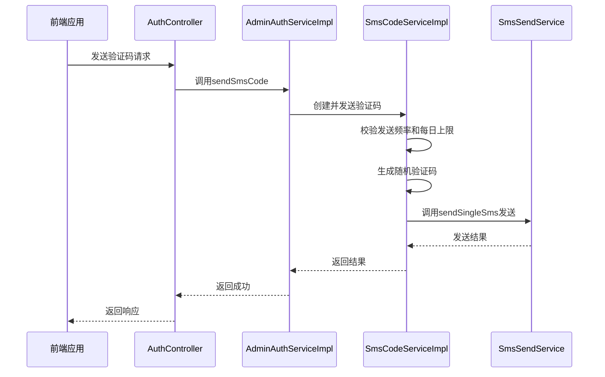

**图示来源**
- [SmsCodeServiceImpl.java](file://yudao-module-system/src/main/java/cn/iocoder/yudao/module/system/service/sms/SmsCodeServiceImpl.java#L41-L50)
- [AdminAuthServiceImpl.java](file://yudao-module-system/src/main/java/cn/iocoder/yudao/module/system/service/auth/AdminAuthServiceImpl.java#L117-L133)

### 验证与使用逻辑
验证码验证通过`validateSmsCode0`方法实现，检查验证码是否存在、是否过期、是否已被使用。

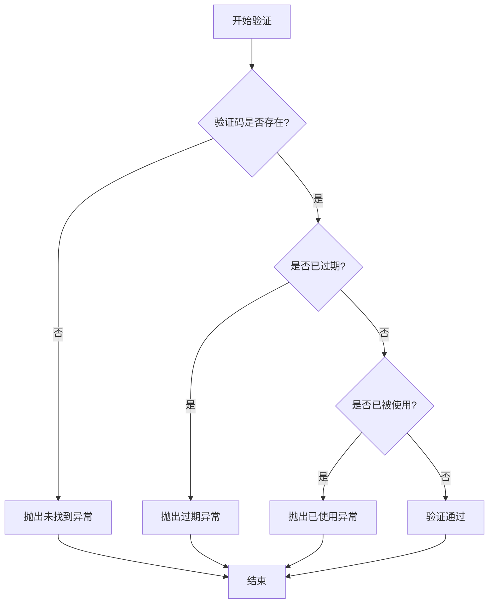

**图示来源**
- [SmsCodeServiceImpl.java](file://yudao-module-system/src/main/java/cn/iocoder/yudao/module/system/service/sms/SmsCodeServiceImpl.java#L92-L109)

### 防刷策略
系统实现了多层防刷机制，包括发送频率限制和每日发送上限。

**防刷策略配置**
- 发送频率：通过`SmsCodeProperties.getSendFrequency()`配置
- 每日上限：通过`SmsCodeProperties.getSendMaximumQuantityPerDay()`配置
- 场景管理：通过`SmsSceneEnum`枚举管理不同场景

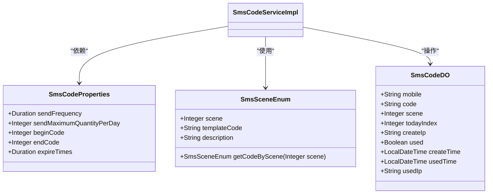

**图示来源**
- [SmsCodeServiceImpl.java](file://yudao-module-system/src/main/java/cn/iocoder/yudao/module/system/service/sms/SmsCodeServiceImpl.java#L32-L33)
- [SmsSceneEnum.java](file://yudao-module-system/src/main/java/cn/iocoder/yudao/module/system/enums/sms/SmsSceneEnum.java#L1-L53)

**本节来源**
- [SmsCodeServiceImpl.java](file://yudao-module-system/src/main/java/cn/iocoder/yudao/module/system/service/sms/SmsCodeServiceImpl.java#L52-L76)
- [SmsSceneEnum.java](file://yudao-module-system/src/main/java/cn/iocoder/yudao/module/system/enums/sms/SmsSceneEnum.java#L1-L53)

## 社交登录机制

### OAuth2.0集成流程
社交登录基于OAuth2.0协议实现，通过`SocialUserServiceImpl`类处理授权码验证和用户信息获取。

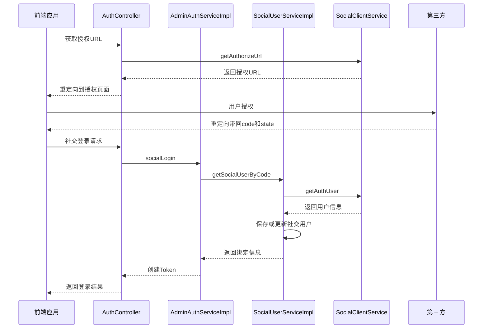

**图示来源**
- [SocialUserServiceImpl.java](file://yudao-module-system/src/main/java/cn/iocoder/yudao/module/system/service/social/SocialUserServiceImpl.java#L131-L158)
- [AdminAuthServiceImpl.java](file://yudao-module-system/src/main/java/cn/iocoder/yudao/module/system/service/auth/AdminAuthServiceImpl.java#L169-L186)

### 用户绑定与解绑
系统支持用户与社交账号的绑定和解绑操作，通过`SocialUserBindDO`实体管理绑定关系。

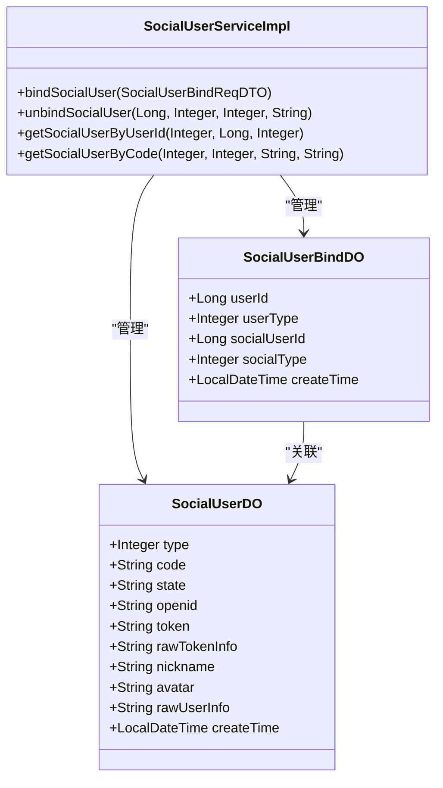

**图示来源**
- [SocialUserServiceImpl.java](file://yudao-module-system/src/main/java/cn/iocoder/yudao/module/system/service/social/SocialUserServiceImpl.java#L59-L80)
- [SocialUserServiceImpl.java](file://yudao-module-system/src/main/java/cn/iocoder/yudao/module/system/service/social/SocialUserServiceImpl.java#L82-L92)

### 绑定流程逻辑
绑定流程包含解绑旧关系和建立新关系的原子操作。

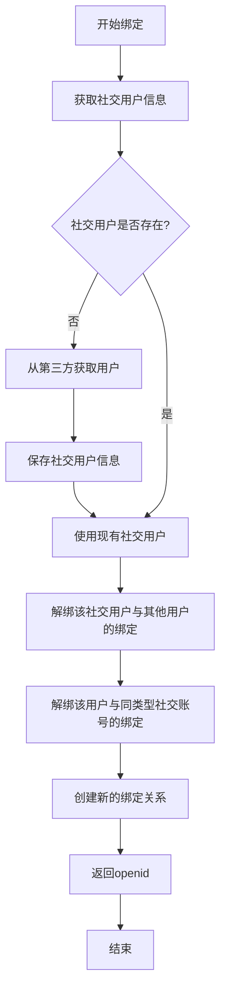

**图示来源**
- [SocialUserServiceImpl.java](file://yudao-module-system/src/main/java/cn/iocoder/yudao/module/system/service/social/SocialUserServiceImpl.java#L59-L80)

**本节来源**
- [SocialUserServiceImpl.java](file://yudao-module-system/src/main/java/cn/iocoder/yudao/module/system/service/social/SocialUserServiceImpl.java#L35-L172)
- [SocialUserApi.java](file://yudao-module-system/src/main/java/cn/iocoder/yudao/module/system/api/social/SocialUserApi.java#L1-L54)

## 统一认证入口设计

### 认证策略选择机制
系统通过`AdminAuthServiceImpl`提供统一的认证入口，支持多种认证方式。

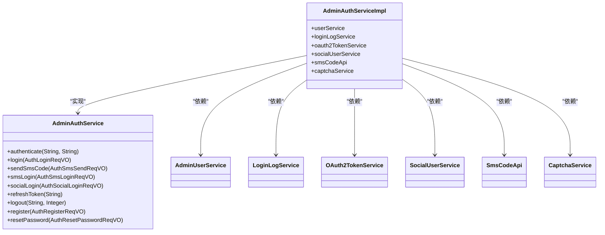

**图示来源**
- [AdminAuthServiceImpl.java](file://yudao-module-system/src/main/java/cn/iocoder/yudao/module/system/service/auth/AdminAuthServiceImpl.java#L50-L304)
- [AdminAuthService.java](file://yudao-module-system/src/main/java/cn/iocoder/yudao/module/system/service/auth/AdminAuthService.java#L14-L87)

### 多因素认证流程
系统支持多种认证方式的组合使用，如账号密码+短信验证码、社交登录+绑定等。

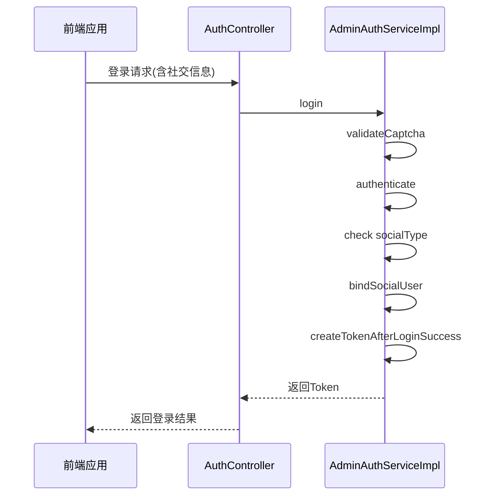

**图示来源**
- [AdminAuthServiceImpl.java](file://yudao-module-system/src/main/java/cn/iocoder/yudao/module/system/service/auth/AdminAuthServiceImpl.java#L99-L115)
- [AuthController.java](file://yudao-module-system/src/main/java/cn/iocoder/yudao/module/system/controller/admin/auth/AuthController.java#L1-L174)

**本节来源**
- [AdminAuthServiceImpl.java](file://yudao-module-system/src/main/java/cn/iocoder/yudao/module/system/service/auth/AdminAuthServiceImpl.java#L99-L115)
- [AuthController.java](file://yudao-module-system/src/main/java/cn/iocoder/yudao/module/system/controller/admin/auth/AuthController.java#L1-L174)

## 安全存储与频率控制

### 验证码安全存储
验证码信息存储在数据库中，包含完整上下文信息。

**验证码数据结构**
- 手机号：`mobile`
- 验证码：`code`
- 场景：`scene`
- 当日索引：`todayIndex`
- 创建IP：`createIp`
- 是否已使用：`used`
- 创建时间：`createTime`
- 使用时间：`usedTime`
- 使用IP：`usedIp`

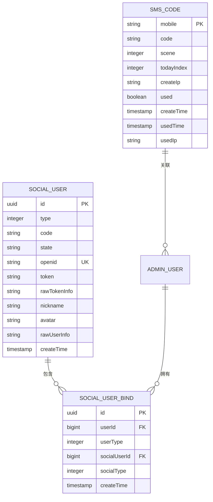

**图示来源**
- [SmsCodeDO](file://yudao-module-system/src/main/java/cn/iocoder/yudao/module/system/dal/dataobject/sms/SmsCodeDO.java)
- [SocialUserDO](file://yudao-module-system/src/main/java/cn/iocoder/yudao/module/system/dal/dataobject/social/SocialUserDO.java)
- [SocialUserBindDO](file://yudao-module-system/src/main/java/cn/iocoder/yudao/module/system/dal/dataobject/social/SocialUserBindDO.java)

### 过期时间管理
系统通过配置管理验证码的过期时间。

**过期时间配置**
- 配置项：`SmsCodeProperties.expireTimes`
- 默认值：通过配置文件设置
- 验证逻辑：在`validateSmsCode0`方法中检查时间差

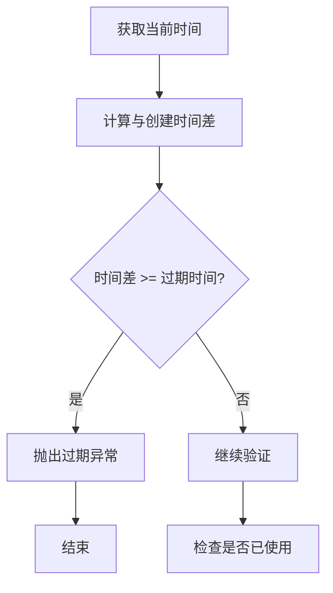

**图示来源**
- [SmsCodeServiceImpl.java](file://yudao-module-system/src/main/java/cn/iocoder/yudao/module/system/service/sms/SmsCodeServiceImpl.java#L92-L109)

### 频率限制实现
系统实现了多层次的频率限制策略。

**频率限制策略**
- 发送频率：防止短时间内重复发送
- 每日上限：防止滥用服务
- IP限制：未来可扩展的防刷机制

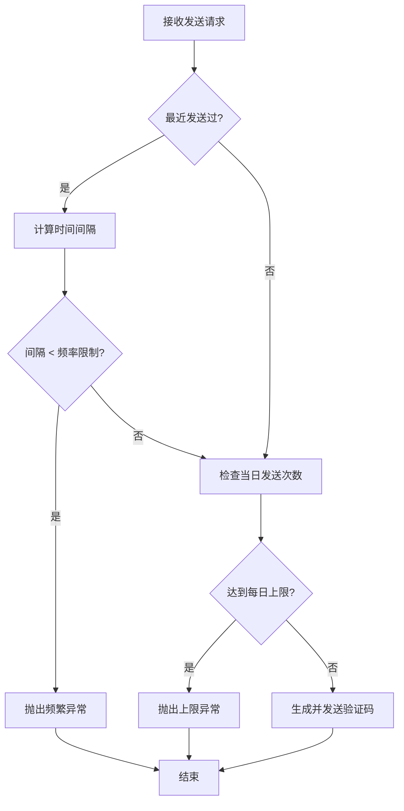

**本节来源**
- [SmsCodeServiceImpl.java](file://yudao-module-system/src/main/java/cn/iocoder/yudao/module/system/service/sms/SmsCodeServiceImpl.java#L52-L76)
- [RedisKeyConstants.java](file://yudao-module-system/src/main/java/cn/iocoder/yudao/module/system/dal/redis/RedisKeyConstants.java#L1-L110)

## 用户体验与安全建议

### 用户体验优化
系统在保证安全性的前提下，提供了良好的用户体验。

**优化建议**
- 清晰的错误提示：不同场景返回明确的错误信息
- 合理的等待时间：发送频率设置为合理值
- 多场景支持：覆盖登录、注册、找回密码等常见场景
- 社交登录便捷：一键授权，简化注册流程

### 安全风险防范
系统实现了多层安全防护机制。

**安全措施**
- 验证码随机性：使用随机数生成确保不可预测
- 验证码一次性：使用后立即标记为已使用
- 时间限制：设置合理的过期时间
- 频率控制：防止暴力破解和滥用
- IP记录：记录创建和使用IP用于审计

**风险防范建议**
- 定期审查日志：监控异常登录行为
- 加强敏感操作保护：对密码重置等操作增加额外验证
- 监控发送量：及时发现异常的大量发送行为
- 更新密钥：定期更新第三方平台的API密钥

**本节来源**
- [SmsCodeServiceImpl.java](file://yudao-module-system/src/main/java/cn/iocoder/yudao/module/system/service/sms/SmsCodeServiceImpl.java#L28-L111)
- [SocialUserServiceImpl.java](file://yudao-module-system/src/main/java/cn/iocoder/yudao/module/system/service/social/SocialUserServiceImpl.java#L35-L172)
- [AdminAuthServiceImpl.java](file://yudao-module-system/src/main/java/cn/iocoder/yudao/module/system/service/auth/AdminAuthServiceImpl.java#L50-L304)