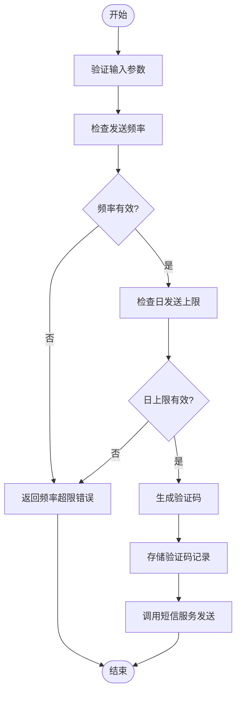
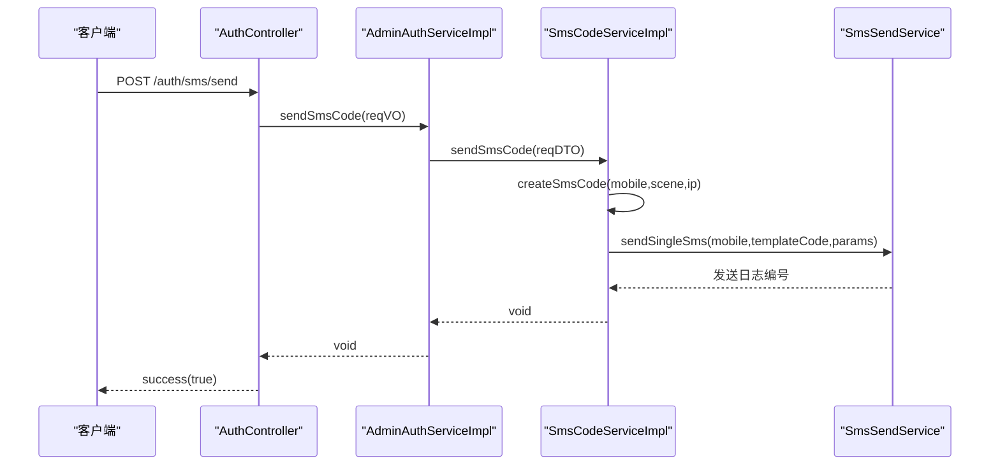
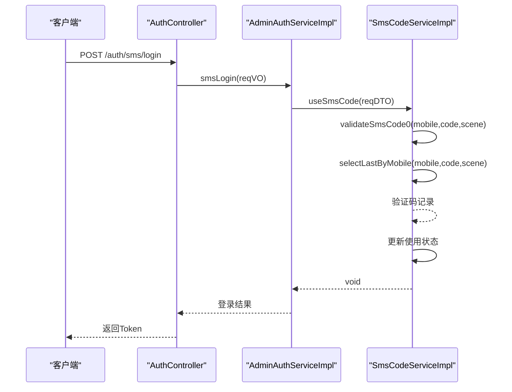

# 短信验证码认证

<cite>
**本文档引用的文件**  
- [SmsCodeServiceImpl.java](file://yudao-module-system/src/main/java/cn/iocoder/yudao/module/system/service/sms/SmsCodeServiceImpl.java)
- [SmsCodeApi.java](file://yudao-module-system/src/main/java/cn/iocoder/yudao/module/system/api/sms/SmsCodeApi.java)
- [application-dev.yaml](file://yudao-server/src/main/resources/application-dev.yaml)
- [SmsCodeProperties.java](file://yudao-module-system/src/main/java/cn/iocoder/yudao/module/system/framework/sms/config/SmsCodeProperties.java)
- [SmsCodeMapper.java](file://yudao-module-system/src/main/java/cn/iocoder/yudao/module/system/dal/mysql/sms/SmsCodeMapper.java)
- [ErrorCodeConstants.java](file://yudao-module-system/src/main/java/cn/iocoder/yudao/module/system/enums/ErrorCodeConstants.java)
- [AuthController.java](file://yudao-module-system/src/main/java/cn/iocoder/yudao/module/system/controller/admin/auth/AuthController.java)
- [AdminAuthServiceImpl.java](file://yudao-module-system/src/main/java/cn/iocoder/yudao/module/system/service/auth/AdminAuthServiceImpl.java)
- [SmsSendService.java](file://yudao-module-system/src/main/java/cn/iocoder/yudao/module/system/service/sms/SmsSendService.java)
</cite>

## 目录
1. [简介](#简介)
2. [验证码生命周期管理](#验证码生命周期管理)
3. [核心组件分析](#核心组件分析)
4. [API接口设计](#api接口设计)
5. [异常处理与降级方案](#异常处理与降级方案)
6. [短信服务商配置](#短信服务商配置)

## 简介
本系统实现了完整的短信验证码认证机制，支持基于手机号的登录、注册、密码重置等场景。系统采用分层架构设计，通过SmsCodeService接口提供验证码的发送、验证和使用功能，结合Redis缓存和数据库持久化存储，确保验证码的安全性和可靠性。系统支持多种短信服务商（如阿里云、腾讯云），并提供了灵活的配置选项。

## 验证码生命周期管理

### 生成算法
验证码采用随机数生成算法，范围由配置文件中的`beginCode`和`endCode`参数决定。默认情况下，系统生成6位数字验证码，通过`randomInt(beginCode, endCode + 1)`方法实现。生成的验证码会格式化为固定长度的字符串，确保一致性。

### 存储机制
验证码信息存储在MySQL数据库的`sms_code`表中，同时利用Redis进行缓存优化。系统通过`SmsCodeMapper`接口的`selectLastByMobile`方法查询最新验证码记录，使用`insert`和`updateById`方法进行创建和更新操作。存储的数据包括手机号、验证码、场景、创建IP、使用状态和时间戳等关键信息。

### 过期时间配置
系统默认设置验证码有效期为5分钟，该值可通过配置文件中的`expireTimes`参数进行调整。在验证过程中，系统会比较当前时间与验证码创建时间的时间差，若超过`expireTimes`设定的时长，则抛出`SMS_CODE_EXPIRED`异常。

### 防刷策略
系统实现了多层次的防刷机制：
- **频率限制**：基于手机号的发送频率限制，通过`sendFrequency`参数控制，防止短时间内频繁发送。
- **数量限制**：每日发送上限控制，通过`sendMaximumQuantityPerDay`参数设置，防止滥用。
- **IP限制**：虽然当前实现中存在TODO注释，但框架已预留了基于IP的限制扩展点，可在未来版本中实现每个IP每天或每小时的发送数量限制。



**图示来源**
- [SmsCodeServiceImpl.java](file://yudao-module-system/src/main/java/cn/iocoder/yudao/module/system/service/sms/SmsCodeServiceImpl.java#L52-L76)
- [SmsCodeProperties.java](file://yudao-module-system/src/main/java/cn/iocoder/yudao/module/system/framework/sms/config/SmsCodeProperties.java#L9-L40)

**本节来源**
- [SmsCodeServiceImpl.java](file://yudao-module-system/src/main/java/cn/iocoder/yudao/module/system/service/sms/SmsCodeServiceImpl.java#L28-L111)
- [SmsCodeProperties.java](file://yudao-module-system/src/main/java/cn/iocoder/yudao/module/system/framework/sms/config/SmsCodeProperties.java#L9-L40)

## 核心组件分析

### SmsCodeServiceImpl实现逻辑
`SmsCodeServiceImpl`类是短信验证码服务的核心实现，主要包含`sendSmsCode`和`validateSmsCode`两个关键方法。

#### sendSmsCode方法
该方法负责验证码的发送流程：
1. 首先通过`SmsSceneEnum.getCodeByScene`验证发送场景的有效性
2. 调用`createSmsCode`方法生成并存储验证码
3. 通过`SmsSendService.sendSingleSms`调用短信渠道服务发送短信



**图示来源**
- [SmsCodeServiceImpl.java](file://yudao-module-system/src/main/java/cn/iocoder/yudao/module/system/service/sms/SmsCodeServiceImpl.java#L41-L50)
- [AdminAuthServiceImpl.java](file://yudao-module-system/src/main/java/cn/iocoder/yudao/module/system/service/auth/AdminAuthServiceImpl.java#L117-L133)
- [AuthController.java](file://yudao-module-system/src/main/java/cn/iocoder/yudao/module/system/controller/admin/auth/AuthController.java#L135-L141)

#### validateSmsCode方法
该方法负责验证码的验证流程，包含三个关键检查：
1. **存在性检查**：通过`selectLastByMobile`查询验证码记录
2. **时效性检查**：验证是否超过`expireTimes`设定的有效期
3. **使用状态检查**：确认验证码未被使用过



**图示来源**
- [SmsCodeServiceImpl.java](file://yudao-module-system/src/main/java/cn/iocoder/yudao/module/system/service/sms/SmsCodeServiceImpl.java#L92-L109)
- [AdminAuthServiceImpl.java](file://yudao-module-system/src/main/java/cn/iocoder/yudao/module/system/service/auth/AdminAuthServiceImpl.java#L199-L208)
- [AuthController.java](file://yudao-module-system/src/main/java/cn/iocoder/yudao/module/system/controller/admin/auth/AuthController.java#L150-L156)

**本节来源**
- [SmsCodeServiceImpl.java](file://yudao-module-system/src/main/java/cn/iocoder/yudao/module/system/service/sms/SmsCodeServiceImpl.java#L28-L111)
- [SmsSendService.java](file://yudao-module-system/src/main/java/cn/iocoder/yudao/module/system/service/sms/SmsSendService.java#L52-L53)

## API接口设计

### 接口列表
系统提供了三个核心API接口用于短信验证码认证：

| 接口路径 | HTTP方法 | 功能描述 |
|---------|--------|--------|
| /auth/sms/send | POST | 发送短信验证码 |
| /auth/sms/login | POST | 短信验证码登录 |
| /auth/sms/reset-password | POST | 重置密码 |

### 请求参数
#### 发送验证码请求 (/auth/sms/send)
- **mobile**：手机号码（必填）
- **scene**：发送场景（必填，枚举值）
- **captchaVerification**：图形验证码（仅重置密码场景需要）

#### 短信登录请求 (/auth/sms/login)
- **mobile**：手机号码（必填）
- **code**：收到的验证码（必填）

#### 重置密码请求 (/auth/sms/reset-password)
- **mobile**：手机号码（必填）
- **code**：收到的验证码（必填）
- **password**：新密码（必填）

### 响应格式
所有接口返回统一的`CommonResult`格式：
```json
{
  "code": 0,
  "data": {},
  "msg": "success"
}
```

### 错误码
系统定义了详细的错误码体系，主要包含：

| 错误码 | 错误信息 | 触发条件 |
|-------|--------|--------|
| 1002014000 | 验证码不存在 | 手机号未发送过验证码 |
| 1002014001 | 验证码已过期 | 超过5分钟有效期 |
| 1002014002 | 验证码已使用 | 验证码已被验证过 |
| 1002014004 | 超过每日短信发送数量 | 达到日发送上限 |
| 1002014005 | 短信发送过于频繁 | 两次发送间隔太短 |

**本节来源**
- [AuthController.java](file://yudao-module-system/src/main/java/cn/iocoder/yudao/module/system/controller/admin/auth/AuthController.java#L135-L141)
- [ErrorCodeConstants.java](file://yudao-module-system/src/main/java/cn/iocoder/yudao/module/system/enums/ErrorCodeConstants.java#L101-L116)
- [SmsCodeApi.java](file://yudao-module-system/src/main/java/cn/iocoder/yudao/module/system/api/sms/SmsCodeApi.java#L21-L21)

## 异常处理与降级方案

### 异常处理机制
系统采用分层异常处理策略，通过`ServiceException`统一异常处理机制。当验证码验证失败时，系统会抛出相应的业务异常，包含具体的错误码和描述信息。异常处理流程如下：

1. **参数验证**：使用JSR-303注解进行请求参数验证
2. **业务逻辑验证**：在服务层进行业务规则验证
3. **异常转换**：将验证结果转换为标准化的`ServiceException`
4. **全局处理**：通过Spring的`@ControllerAdvice`进行统一异常处理

### 降级方案
系统设计了多种降级策略以应对不同场景的故障：

1. **短信服务降级**：当主短信服务商不可用时，系统可自动切换到备用服务商
2. **缓存降级**：当Redis不可用时，系统可降级到数据库直连模式
3. **验证码降级**：在极端情况下，可临时关闭验证码验证，改用其他认证方式
4. **限流降级**：当系统负载过高时，可动态调整发送频率限制

系统通过配置文件中的`yudao.sms-code`前缀参数进行降级策略配置，支持运行时动态调整。

**本节来源**
- [SmsCodeServiceImpl.java](file://yudao-module-system/src/main/java/cn/iocoder/yudao/module/system/service/sms/SmsCodeServiceImpl.java#L92-L109)
- [ErrorCodeConstants.java](file://yudao-module-system/src/main/java/cn/iocoder/yudao/module/system/enums/ErrorCodeConstants.java#L86-L101)
- [application-dev.yaml](file://yudao-server/src/main/resources/application-dev.yaml#L1-L202)

## 短信服务商配置

### 多服务商支持
系统支持配置多个短信服务商，包括阿里云、腾讯云等主流平台。服务商配置主要包含以下参数：

- **渠道编码**：唯一标识一个短信渠道
- **API密钥**：服务商提供的认证密钥
- **模板代码**：预先审核通过的短信模板ID
- **签名配置**：短信签名信息

### 配置方式
服务商配置通过YAML文件进行，示例如下：
```yaml
yudao:
  sms-code:
    expire-times: 5m
    send-frequency: 60s
    send-maximum-quantity-per-day: 10
    begin-code: 100000
    end-code: 999999
```

### 模板管理
系统提供了灵活的模板管理机制：
1. **模板配置**：通过后台管理界面配置不同场景的短信模板
2. **参数化模板**：支持在模板中使用占位符，如`{code}`表示验证码
3. **多语言支持**：可根据用户语言偏好选择不同的模板
4. **审核机制**：所有模板变更需要经过审核流程

系统通过`SmsSceneEnum`枚举类定义了多种使用场景，每种场景对应不同的模板代码，确保短信内容的准确性和合规性。

**本节来源**
- [application-dev.yaml](file://yudao-server/src/main/resources/application-dev.yaml#L1-L202)
- [SmsCodeProperties.java](file://yudao-module-system/src/main/java/cn/iocoder/yudao/module/system/framework/sms/config/SmsCodeProperties.java#L9-L40)
- [SmsSceneEnum.java](file://yudao-module-system/src/main/java/cn/iocoder/yudao/module/system/enums/sms/SmsSceneEnum.java#L14-L52)