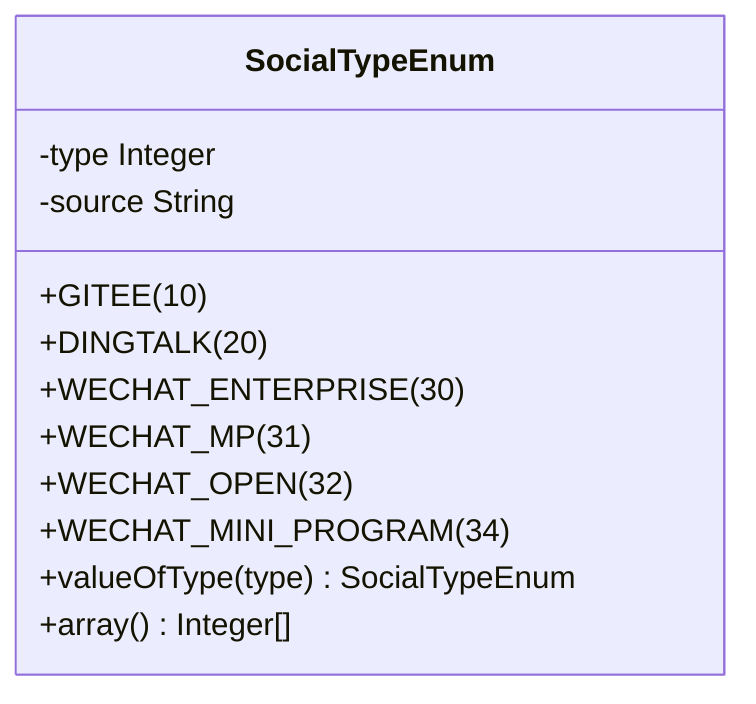
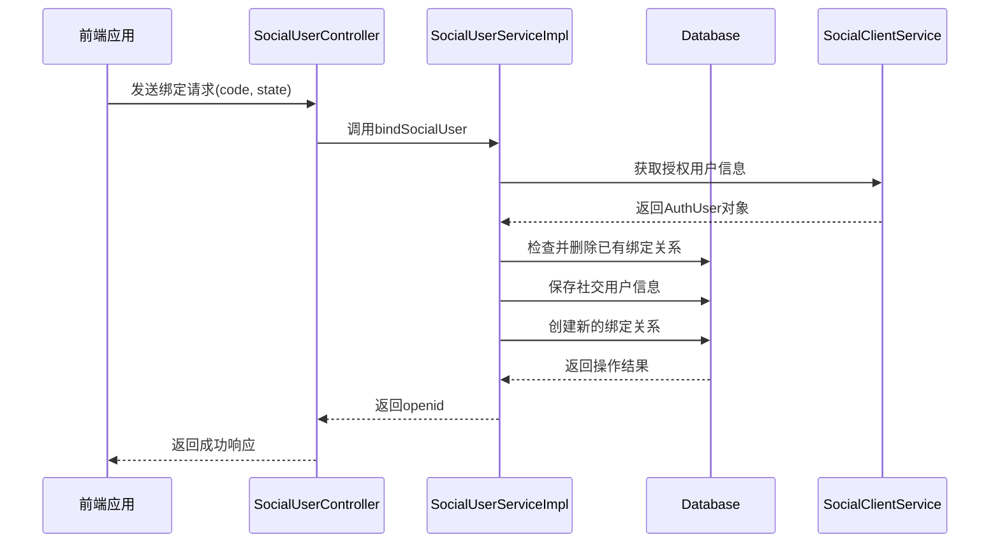
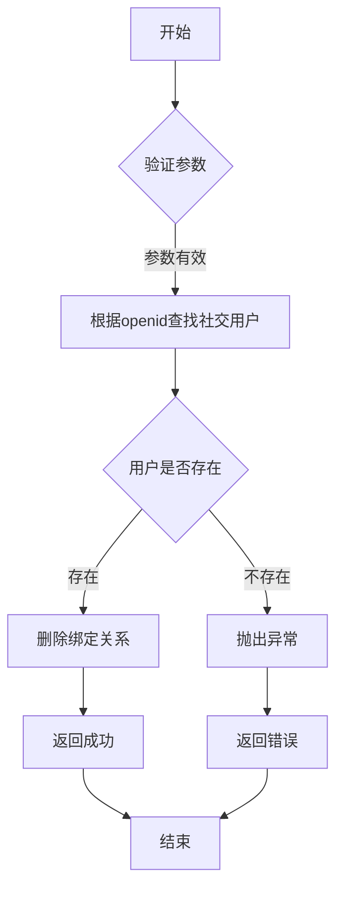

# 社交登录认证

<cite>
**本文档引用的文件**  
- [SocialUserServiceImpl.java](file://yudao-module-system/src/main/java/cn/iocoder/yudao/module/system/service/social/SocialUserServiceImpl.java)
- [SocialUserService.java](file://yudao-module-system/src/main/java/cn/iocoder/yudao/module/system/service/social/SocialUserService.java)
- [SocialUserBindMapper.java](file://yudao-module-system/src/main/java/cn/iocoder/yudao/module/system/dal/mysql/social/SocialUserBindMapper.java)
- [SocialUserMapper.java](file://yudao-module-system/src/main/java/cn/iocoder/yudao/module/system/dal/mysql/social/SocialUserMapper.java)
- [SocialUserDO.java](file://yudao-module-system/src/main/java/cn/iocoder/yudao/module/system/dal/dataobject/social/SocialUserDO.java)
- [SocialUserBindReqDTO.java](file://yudao-module-system/src/main/java/cn/iocoder/yudao/module/system/api/social/dto/SocialUserBindReqDTO.java)
- [SocialClientService.java](file://yudao-module-system/src/main/java/cn/iocoder/yudao/module/system/service/social/SocialClientService.java)
- [AuthController.java](file://yudao-module-system/src/main/java/cn/iocoder/yudao/module/system/controller/admin/auth/AuthController.java)
- [SocialUserController.java](file://yudao-module-system/src/main/java/cn/iocoder/yudao/module/system/controller/admin/socail/SocialUserController.java)
- [SocialTypeEnum.java](file://yudao-module-system/src/main/java/cn/iocoder/yudao/module/system/enums/social/SocialTypeEnum.java)
</cite>

## 目录
1. [简介](#简介)
2. [OAuth2.0授权流程](#oauth20授权流程)
3. [社交平台集成](#社交平台集成)
4. [核心组件分析](#核心组件分析)
5. [API接口设计](#api接口设计)
6. [安全策略](#安全策略)
7. [用户数据隐私保护](#用户数据隐私保护)
8. [结论](#结论)

## 简介
本文档详细介绍了社交登录认证系统的实现，重点阐述了OAuth2.0第三方登录的集成机制。系统支持微信、QQ等社交平台的授权登录，通过标准化的OAuth2.0授权码模式实现用户身份验证。文档深入分析了社交用户与系统用户的绑定关系管理，包括绑定、解绑等核心业务逻辑，并详细说明了相关API接口的设计与安全实现。

## OAuth2.0授权流程
系统采用OAuth2.0授权码模式实现社交登录，该流程包含以下关键步骤：

1. **授权请求**：用户点击社交登录按钮后，系统生成唯一的state参数并重定向到社交平台的授权URL
2. **用户授权**：社交平台展示授权页面，用户确认授权后，平台将授权码(code)和state参数回调到系统指定的redirect_uri
3. **令牌获取**：系统使用授权码向社交平台请求access_token
4. **用户信息拉取**：使用access_token获取用户基本信息（如openid、昵称、头像等）
5. **用户绑定**：将社交用户信息与系统用户账户进行绑定或创建新账户

该流程确保了用户身份验证的安全性，通过state参数有效防止CSRF攻击。

**Section sources**
- [SocialUserServiceImpl.java](file://yudao-module-system/src/main/java/cn/iocoder/yudao/module/system/service/social/SocialUserServiceImpl.java#L131-L158)
- [SocialClientService.java](file://yudao-module-system/src/main/java/cn/iocoder/yudao/module/system/service/social/SocialClientService.java#L24-L159)

## 社交平台集成
系统通过`SocialTypeEnum`枚举类管理支持的社交平台类型，目前包括：

**Diagram sources**
- [SocialTypeEnum.java](file://yudao-module-system/src/main/java/cn/iocoder/yudao/module/system/enums/social/SocialTypeEnum.java#L14-L77)

各社交平台的集成通过`SocialClientService`接口统一管理，实现了平台无关的抽象层。系统支持通过数据库配置不同社交平台的AppID和AppSecret，便于多租户环境下的灵活配置。

**Section sources**
- [SocialTypeEnum.java](file://yudao-module-system/src/main/java/cn/iocoder/yudao/module/system/enums/social/SocialTypeEnum.java#L14-L77)
- [SocialClientService.java](file://yudao-module-system/src/main/java/cn/iocoder/yudao/module/system/service/social/SocialClientService.java#L24-L159)

## 核心组件分析

### SocialUserServiceImpl分析
`SocialUserServiceImpl`是社交用户管理的核心服务类，负责处理社交用户与系统用户的关联关系。

#### bindSocialUser方法
该方法实现社交用户绑定的核心逻辑：

**Diagram sources**
- [SocialUserServiceImpl.java](file://yudao-module-system/src/main/java/cn/iocoder/yudao/module/system/service/social/SocialUserServiceImpl.java#L59-L80)
- [SocialUserController.java](file://yudao-module-system/src/main/java/cn/iocoder/yudao/module/system/controller/admin/socail/SocialUserController.java#L37-L44)

#### unbindSocialUser方法
该方法处理社交用户解绑逻辑，通过openid查找对应的社交用户，然后删除用户与社交账号的绑定关系。

**Diagram sources**
- [SocialUserServiceImpl.java](file://yudao-module-system/src/main/java/cn/iocoder/yudao/module/system/service/social/SocialUserServiceImpl.java#L82-L92)

**Section sources**
- [SocialUserServiceImpl.java](file://yudao-module-system/src/main/java/cn/iocoder/yudao/module/system/service/social/SocialUserServiceImpl.java#L59-L92)
- [SocialUserService.java](file://yudao-module-system/src/main/java/cn/iocoder/yudao/module/system/service/social/SocialUserService.java#L35-L35)

## API接口设计
系统提供了标准化的RESTful API接口用于社交登录和绑定操作。

### 认证接口
- **POST /auth/social/login**：社交快捷登录接口，接收授权码进行登录
- **GET /auth/social-auth-redirect**：获取社交平台授权URL的重定向接口

### 绑定接口
- **POST /system/social-user/bind**：社交账号绑定接口
- **DELETE /system/social-user/unbind**：社交账号解绑接口

#### 请求参数说明
| 参数 | 类型 | 必填 | 说明 |
|------|------|------|------|
| type | Integer | 是 | 社交平台类型，参考SocialTypeEnum |
| code | String | 是 | 授权码 |
| state | String | 是 | 防CSRF攻击的随机字符串 |

#### state参数防CSRF实现
系统在生成授权URL时生成唯一的state参数并存储在会话中，回调时验证传入的state与存储的state是否匹配，有效防止跨站请求伪造攻击。

**Section sources**
- [AuthController.java](file://yudao-module-system/src/main/java/cn/iocoder/yudao/module/system/controller/admin/auth/AuthController.java#L41-L173)
- [SocialUserController.java](file://yudao-module-system/src/main/java/cn/iocoder/yudao/module/system/controller/admin/socail/SocialUserController.java#L37-L44)

## 安全策略
系统实施了多层次的安全策略来保护用户数据和系统安全：

1. **参数验证**：所有输入参数都经过严格的格式和范围验证
2. **CSRF防护**：通过state参数机制防止跨站请求伪造
3. **会话管理**：使用安全的令牌机制管理用户会话
4. **数据加密**：敏感信息在存储时进行加密处理
5. **访问控制**：基于角色的访问控制(RBAC)确保操作权限

## 用户数据隐私保护
系统严格遵守用户数据隐私保护原则：

1. **最小化收集**：仅收集必要的用户基本信息
2. **明确授权**：在获取用户信息前明确告知并获得用户授权
3. **数据隔离**：不同租户的数据严格隔离
4. **安全存储**：用户敏感信息加密存储
5. **访问审计**：记录所有敏感操作日志

## 结论
本文档详细阐述了社交登录认证系统的架构设计和实现细节。系统通过标准化的OAuth2.0协议实现了与主流社交平台的安全集成，提供了完善的用户绑定和管理功能。通过合理的安全策略和隐私保护措施，确保了用户数据的安全性和隐私性。该设计具有良好的扩展性，便于未来集成更多社交平台。