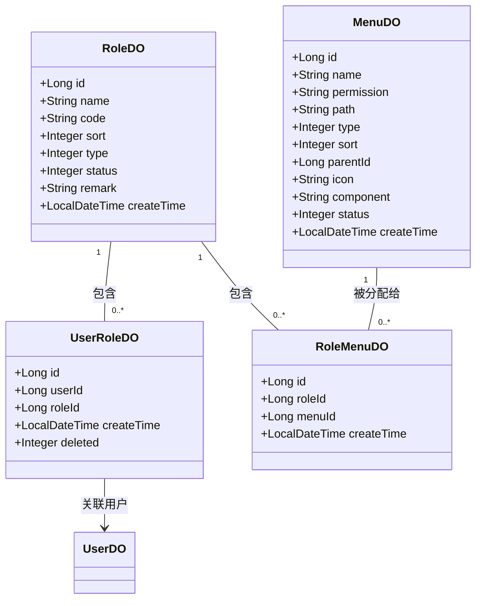
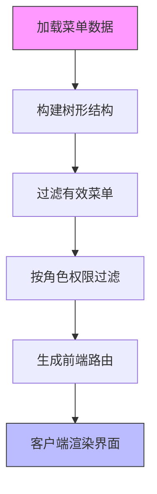
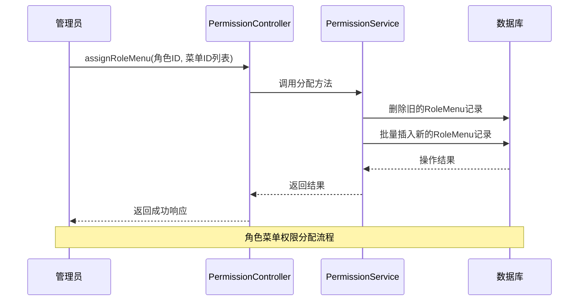
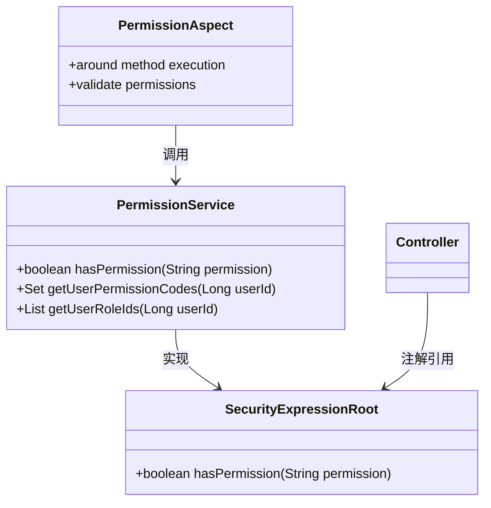
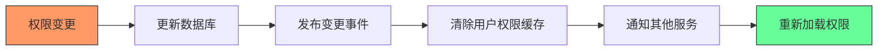

# 功能权限

<cite>
**本文档引用文件**  
- [MenuDO.java](file://yudao-module-system/src/main/java/cn/iocoder/yudao/module/system/dal/dataobject/permission/MenuDO.java)
- [RoleDO.java](file://yudao-module-system/src/main/java/cn/iocoder/yudao/module/system/dal/dataobject/permission/RoleDO.java)
- [UserRoleDO.java](file://yudao-module-system/src/main/java/cn/iocoder/yudao/module/system/dal/dataobject/permission/UserRoleDO.java)
- [RoleMenuDO.java](file://yudao-module-system/src/main/java/cn/iocoder/yudao/module/system/dal/dataobject/permission/RoleMenuDO.java)
- [MenuService.java](file://yudao-module-system/src/main/java/cn/iocoder/yudao/module/system/service/permission/MenuService.java)
- [MenuServiceImpl.java](file://yudao-module-system/src/main/java/cn/iocoder/yudao/module/system/service/permission/MenuServiceImpl.java)
- [RoleService.java](file://yudao-module-system/src/main/java/cn/iocoder/yudao/module/system/service/permission/RoleService.java)
- [RoleServiceImpl.java](file://yudao-module-system/src/main/java/cn/iocoder/yudao/module/system/service/permission/RoleServiceImpl.java)
- [PermissionService.java](file://yudao-module-system/src/main/java/cn/iocoder/yudao/module/system/service/permission/PermissionService.java)
- [PermissionServiceImpl.java](file://yudao-module-system/src/main/java/cn/iocoder/yudao/module/system/service/permission/PermissionServiceImpl.java)
- [PermissionController.java](file://yudao-module-system/src/main/java/cn/iocoder/yudao/module/system/controller/admin/permission/PermissionController.java)
- [RoleController.java](file://yudao-module-system/src/main/java/cn/iocoder/yudao/module/system/controller/admin/permission/RoleController.java)
- [MenuController.java](file://yudao-module-system/src/main/java/cn/iocoder/yudao/module/system/controller/admin/permission/MenuController.java)
- [PermissionApi.java](file://yudao-module-system/src/main/java/cn/iocoder/yudao/module/system/api/permission/PermissionApi.java)
- [PermissionApiImpl.java](file://yudao-module-system/src/main/java/cn/iocoder/yudao/module/system/api/permission/PermissionApiImpl.java)
</cite>

## 目录
1. [引言](#引言)
2. [核心数据对象设计](#核心数据对象设计)
3. [菜单权限树形结构实现](#菜单权限树形结构实现)
4. [权限分配接口业务流程](#权限分配接口业务流程)
5. [权限验证机制](#权限验证机制)
6. [权限缓存与变更通知](#权限缓存与变更通知)
7. [总结](#总结)

## 引言
本系统采用基于角色的访问控制（RBAC）模型实现功能权限管理，通过角色、菜单与用户之间的多对多关系，构建灵活的权限体系。系统支持细粒度的菜单权限控制和数据权限隔离，确保不同角色的用户只能访问其被授权的功能模块和数据范围。

## 核心数据对象设计

系统通过四个核心数据对象实现权限三元组关系模型：`RoleDO`（角色）、`MenuDO`（菜单）、`UserRoleDO`（用户-角色关联）和`RoleMenuDO`（角色-菜单关联）。

**图示来源**
- [RoleDO.java](file://yudao-module-system/src/main/java/cn/iocoder/yudao/module/system/dal/dataobject/permission/RoleDO.java)
- [MenuDO.java](file://yudao-module-system/src/main/java/cn/iocoder/yudao/module/system/dal/dataobject/permission/MenuDO.java)
- [UserRoleDO.java](file://yudao-module-system/src/main/java/cn/iocoder/yudao/module/system/dal/dataobject/permission/UserRoleDO.java)
- [RoleMenuDO.java](file://yudao-module-system/src/main/java/cn/iocoder/yudao/module/system/dal/dataobject/permission/RoleMenuDO.java)

**本节来源**
- [RoleDO.java](file://yudao-module-system/src/main/java/cn/iocoder/yudao/module/system/dal/dataobject/permission/RoleDO.java#L1-L50)
- [MenuDO.java](file://yudao-module-system/src/main/java/cn/iocoder/yudao/module/system/dal/dataobject/permission/MenuDO.java#L1-L80)
- [UserRoleDO.java](file://yudao-module-system/src/main/java/cn/iocoder/yudao/module/system/dal/dataobject/permission/UserRoleDO.java#L1-L30)
- [RoleMenuDO.java](file://yudao-module-system/src/main/java/cn/iocoder/yudao/module/system/dal/dataobject/permission/RoleMenuDO.java#L1-L30)

## 菜单权限树形结构实现

系统采用树形结构组织菜单权限，支持多级嵌套。每个菜单节点通过`parentId`字段关联其父节点，形成层级结构。权限标识符（permission code）遵循统一命名规范：`模块:功能:操作`，如`system:user:create`。

前端路由与后端权限通过`MenuDO`中的`path`和`component`字段实现同步。系统启动时加载所有菜单构建路由表，用户登录后根据其角色权限动态生成可访问的路由列表。

**图示来源**
- [MenuDO.java](file://yudao-module-system/src/main/java/cn/iocoder/yudao/module/system/dal/dataobject/permission/MenuDO.java)
- [MenuService.java](file://yudao-module-system/src/main/java/cn/iocoder/yudao/module/system/service/permission/MenuService.java)
- [MenuServiceImpl.java](file://yudao-module-system/src/main/java/cn/iocoder/yudao/module/system/service/permission/MenuServiceImpl.java)

**本节来源**
- [MenuDO.java](file://yudao-module-system/src/main/java/cn/iocoder/yudao/module/system/dal/dataobject/permission/MenuDO.java#L40-L60)
- [MenuServiceImpl.java](file://yudao-module-system/src/main/java/cn/iocoder/yudao/module/system/service/permission/MenuServiceImpl.java#L50-L120)

## 权限分配接口业务流程

权限分配通过`PermissionController`暴露的REST API实现，主要包括角色分配菜单权限、用户分配角色等操作。

**图示来源**
- [PermissionController.java](file://yudao-module-system/src/main/java/cn/iocoder/yudao/module/system/controller/admin/permission/PermissionController.java)
- [PermissionServiceImpl.java](file://yudao-module-system/src/main/java/cn/iocoder/yudao/module/system/service/permission/PermissionServiceImpl.java)
- [RoleMenuDO.java](file://yudao-module-system/src/main/java/cn/iocoder/yudao/module/system/dal/dataobject/permission/RoleMenuDO.java)

**本节来源**
- [PermissionController.java](file://yudao-module-system/src/main/java/cn/iocoder/yudao/module/system/controller/admin/permission/PermissionController.java#L20-L60)
- [PermissionServiceImpl.java](file://yudao-module-system/src/main/java/cn/iocoder/yudao/module/system/service/permission/PermissionServiceImpl.java#L30-L100)

## 权限验证机制

系统通过Spring Security结合自定义AOP切面实现权限验证。使用`@PreAuthorize`注解配合Spring Expression Language（SpEL）进行方法级权限控制，如`@PreAuthorize("@ss.hasPermission('system:user:list')")`。

同时，系统提供`PermissionApi`接口供其他模块进行权限校验，实现跨服务的权限一致性。

**图示来源**
- [PermissionService.java](file://yudao-module-system/src/main/java/cn/iocoder/yudao/module/system/service/permission/PermissionService.java)
- [PermissionServiceImpl.java](file://yudao-module-system/src/main/java/cn/iocoder/yudao/module/system/service/permission/PermissionServiceImpl.java)
- [PermissionApi.java](file://yudao-module-system/src/main/java/cn/iocoder/yudao/module/system/api/permission/PermissionApi.java)

**本节来源**
- [PermissionService.java](file://yudao-module-system/src/main/java/cn/iocoder/yudao/module/system/service/permission/PermissionService.java#L10-L40)
- [PermissionServiceImpl.java](file://yudao-module-system/src/main/java/cn/iocoder/yudao/module/system/service/permission/PermissionServiceImpl.java#L100-L150)
- [PermissionApi.java](file://yudao-module-system/src/main/java/cn/iocoder/yudao/module/system/api/permission/PermissionApi.java#L5-L20)

## 权限缓存与变更通知

为提高性能，系统使用Redis缓存用户权限数据。当权限发生变更时，通过事件机制清除相关缓存并发送更新通知。

**图示来源**
- [PermissionServiceImpl.java](file://yudao-module-system/src/main/java/cn/iocoder/yudao/module/system/service/permission/PermissionServiceImpl.java)
- [RoleServiceImpl.java](file://yudao-module-system/src/main/java/cn/iocoder/yudao/module/system/service/permission/RoleServiceImpl.java)

**本节来源**
- [PermissionServiceImpl.java](file://yudao-module-system/src/main/java/cn/iocoder/yudao/module/system/service/permission/PermissionServiceImpl.java#L150-L200)
- [RoleServiceImpl.java](file://yudao-module-system/src/main/java/cn/iocoder/yudao/module/system/service/permission/RoleServiceImpl.java#L80-L120)

## 总结
本系统通过RBAC模型实现了完整的功能权限管理体系，具备良好的扩展性和灵活性。通过树形菜单结构、标准化权限标识、AOP权限验证和缓存机制，确保了权限控制的准确性与高性能。