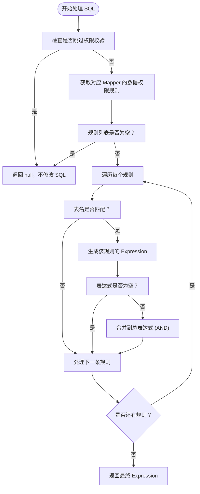

# 数据权限

<cite>
**本文档引用文件**  
- [DataPermission.java](file://yudao-framework/yudao-spring-boot-starter-biz-data-permission/src/main/java/cn/iocoder/yudao/framework/datapermission/core/annotation/DataPermission.java)
- [DataPermissionContextHolder.java](file://yudao-framework/yudao-spring-boot-starter-biz-data-permission/src/main/java/cn/iocoder/yudao/framework/datapermission/core/aop/DataPermissionContextHolder.java)
- [DataPermissionRuleHandler.java](file://yudao-framework/yudao-spring-boot-starter-biz-data-permission/src/main/java/cn/iocoder/yudao/framework/datapermission/core/db/DataPermissionRuleHandler.java)
- [DataPermissionRuleFactoryImpl.java](file://yudao-framework/yudao-spring-boot-starter-biz-data-permission/src/main/java/cn/iocoder/yudao/framework/datapermission/core/rule/DataPermissionRuleFactoryImpl.java)
- [DeptDataPermissionRule.java](file://yudao-framework/yudao-spring-boot-starter-biz-data-permission/src/main/java/cn/iocoder/yudao/framework/datapermission/core/rule/dept/DeptDataPermissionRule.java)
- [YudaoDataPermissionAutoConfiguration.java](file://yudao-framework/yudao-spring-boot-starter-biz-data-permission/src/main/java/cn/iocoder/yudao/framework/datapermission/config/YudaoDataPermissionAutoConfiguration.java)
</cite>

## 目录
1. [简介](#简介)
2. [核心组件](#核心组件)
3. [数据权限注解详解](#数据权限注解详解)
4. [数据权限上下文管理](#数据权限上下文管理)
5. [数据权限规则处理器](#数据权限规则处理器)
6. [部门数据权限规则实现](#部门数据权限规则实现)
7. [多规则组合逻辑处理](#多规则组合逻辑处理)
8. [数据权限缓存与性能优化](#数据权限缓存与性能优化)
9. [常见问题排查指南](#常见问题排查指南)

## 简介
本文档详细解析基于注解和规则引擎的数据权限控制机制。系统通过 `@DataPermission` 注解声明数据权限规则，并在 MyBatis 拦截器层面动态修改 SQL 查询条件，实现细粒度的数据过滤。文档涵盖注解使用、规则实现、上下文管理、SQL 动态改写、缓存策略及性能优化等核心内容。

## 核心组件

**本文档引用文件**  
- [DataPermission.java](file://yudao-framework/yudao-spring-boot-starter-biz-data-permission/src/main/java/cn/iocoder/yudao/framework/datapermission/core/annotation/DataPermission.java)
- [DataPermissionContextHolder.java](file://yudao-framework/yudao-spring-boot-starter-biz-data-permission/src/main/java/cn/iocoder/yudao/framework/datapermission/core/aop/DataPermissionContextHolder.java)
- [DataPermissionRuleHandler.java](file://yudao-framework/yudao-spring-boot-starter-biz-data-permission/src/main/java/cn/iocoder/yudao/framework/datapermission/core/db/DataPermissionRuleHandler.java)
- [DataPermissionRuleFactoryImpl.java](file://yudao-framework/yudao-spring-boot-starter-biz-data-permission/src/main/java/cn/iocoder/yudao/framework/datapermission/core/rule/DataPermissionRuleFactoryImpl.java)
- [DeptDataPermissionRule.java](file://yudao-framework/yudao-spring-boot-starter-biz-data-permission/src/main/java/cn/iocoder/yudao/framework/datapermission/core/rule/dept/DeptDataPermissionRule.java)
- [YudaoDataPermissionAutoConfiguration.java](file://yudao-framework/yudao-spring-boot-starter-biz-data-permission/src/main/java/cn/iocoder/yudao/framework/datapermission/config/YudaoDataPermissionAutoConfiguration.java)

## 数据权限注解详解

`@DataPermission` 注解用于在类或方法级别声明数据权限控制规则。即使未显式添加该注解，默认情况下数据权限功能仍处于开启状态。

### 注解属性说明
- **enable**: 控制当前类或方法是否启用数据权限，默认为 `true`。设为 `false` 可显式禁用。
- **includeRules**: 指定生效的数据权限规则类数组，优先级高于 `excludeRules`。
- **excludeRules**: 排除特定的数据权限规则类数组，优先级最低。

该注解通过 AOP 拦截机制，在方法执行前后将注解信息压入和弹出线程上下文，供后续 SQL 改写逻辑使用。

**本节引用文件**  
- [DataPermission.java](file://yudao-framework/yudao-spring-boot-starter-biz-data-permission/src/main/java/cn/iocoder/yudao/framework/datapermission/core/annotation/DataPermission.java#L12-L34)

## 数据权限上下文管理

数据权限上下文由 `DataPermissionContextHolder` 类实现，基于 `TransmittableThreadLocal` 管理当前线程的 `DataPermission` 注解队列，支持方法嵌套调用场景。

### 核心方法
- **add(DataPermission)**: 将注解实例入栈
- **remove()**: 将注解实例出栈，若栈为空则清空 ThreadLocal
- **get()**: 获取当前最近的 `DataPermission` 注解
- **getAll()**: 获取所有已入栈的注解实例
- **clear()**: 清空上下文（主要用于单元测试）

该机制确保在调用链中能正确传递和管理不同层级的数据权限配置。

**本节引用文件**  
- [DataPermissionContextHolder.java](file://yudao-framework/yudao-spring-boot-starter-biz-data-permission/src/main/java/cn/iocoder/yudao/framework/datapermission/core/aop/DataPermissionContextHolder.java#L13-L71)

## 数据权限规则处理器

`DataPermissionRuleHandler` 是数据权限的核心处理器，实现了 MyBatis Plus 的 `MultiDataPermissionHandler` 接口，在 SQL 执行前动态注入 WHERE 条件。

### 处理流程

**图示来源**  
- [DataPermissionRuleHandler.java](file://yudao-framework/yudao-spring-boot-starter-biz-data-permission/src/main/java/cn/iocoder/yudao/framework/datapermission/core/db/DataPermissionRuleHandler.java#L24-L63)

**本节引用文件**  
- [DataPermissionRuleHandler.java](file://yudao-framework/yudao-spring-boot-starter-biz-data-permission/src/main/java/cn/iocoder/yudao/framework/datapermission/core/db/DataPermissionRuleHandler.java#L24-L63)

## 部门数据权限规则实现

`DeptDataPermissionRule` 是基于部门的数据权限规则实现类，通过调用 `PermissionCommonApi` 获取用户的数据权限范围。

### 权限判断逻辑
1. 仅对已登录且为管理员类型的用户生效
2. 从 `LoginUser` 上下文中获取或调用 API 获取 `DeptDataPermissionRespDTO`
3. 若权限为 `ALL`，则不限制查询
4. 若既无部门权限又不能查看自己，则返回空结果
5. 否则，组合部门 (`dept_id IN (?)`) 和个人 (`user_id = ?`) 的查询条件

### 字段配置
支持自定义表的部门字段名和用户字段名：
- `addDeptColumn(tableName, columnName)`
- `addUserColumn(tableName, columnName)`

**本节引用文件**  
- [DeptDataPermissionRule.java](file://yudao-framework/yudao-spring-boot-starter-biz-data-permission/src/main/java/cn/iocoder/yudao/framework/datapermission/core/rule/dept/DeptDataPermissionRule.java#L50-L209)

## 多规则组合逻辑处理

数据权限规则的组合逻辑由 `DataPermissionRuleFactoryImpl` 实现，根据当前上下文中的 `@DataPermission` 注解决定生效的规则集。

### 规则筛选优先级
1. 若无任何规则，返回空列表
2. 若上下文无 `DataPermission` 注解，默认启用所有规则
3. 若 `enable = false`，禁用所有规则
4. 若配置了 `includeRules`，仅启用包含的规则
5. 若配置了 `excludeRules`，排除指定的规则
6. 否则，启用所有规则

规则之间通过 `AND` 连接，确保所有条件同时满足。

**本节引用文件**  
- [DataPermissionRuleFactoryImpl.java](file://yudao-framework/yudao-spring-boot-starter-biz-data-permission/src/main/java/cn/iocoder/yudao/framework/datapermission/core/rule/DataPermissionRuleFactoryImpl.java#L24-L62)

## 数据权限缓存与性能优化

### 缓存策略
- **LoginUser 上下文缓存**: `DeptDataPermissionRule` 将获取到的 `DeptDataPermissionRespDTO` 缓存在 `LoginUser` 的 `Context` 中，避免重复调用 API。
- **注解缓存**: `DataPermissionAnnotationInterceptor` 使用 `ConcurrentHashMap` 缓存方法的 `DataPermission` 注解，减少反射开销。

### 性能优化建议
1. **合理配置规则范围**: 避免为无需数据权限控制的 Mapper 配置规则。
2. **避免递归调用**: 在获取数据权限的 API 上添加 `@DataPermission(enable = false)`，防止无限递归。
3. **优化部门变更策略**: 用户变更部门后，考虑是否需要同步更新历史数据的 `dept_id`。
4. **监控 SQL 改写结果**: 通过日志观察最终生成的 SQL，确保条件正确且高效。

**本节引用文件**  
- [DeptDataPermissionRule.java](file://yudao-framework/yudao-spring-boot-starter-biz-data-permission/src/main/java/cn/iocoder/yudao/framework/datapermission/core/rule/dept/DeptDataPermissionRule.java#L75-L80)
- [DataPermissionAnnotationInterceptor.java](file://yudao-framework/yudao-spring-boot-starter-biz-data-permission/src/main/java/cn/iocoder/yudao/framework/datapermission/core/aop/DataPermissionAnnotationInterceptor.java#L45-L72)
- [PermissionServiceImpl.java](file://yudao-module-system/src/main/java/cn/iocoder/yudao/module/system/service/permission/PermissionServiceImpl.java#L271-L301)

## 常见问题排查指南

### 问题1：数据权限未生效
- **检查点**:
  - 确认 `YudaoDataPermissionAutoConfiguration` 已正确加载。
  - 检查 `DataPermissionRule` 是否已注册为 Spring Bean。
  - 确认 Mapper 对应的表名已通过 `addDeptColumn` 等方法注册。

### 问题2：SQL 条件拼接错误
- **检查点**:
  - 检查 `getExpression` 方法返回的 `Expression` 是否正确。
  - 确认表别名处理是否符合预期。
  - 查看日志中是否有 `构建的条件为空` 的警告。

### 问题3：出现递归调用
- **现象**: `getDeptDataPermission` 方法无限递归。
- **解决方案**: 在该方法上添加 `@DataPermission(enable = false)`。

### 问题4：ThreadLocal 内存泄漏
- **检查点**:
  - 确保 `DataPermissionAnnotationInterceptor` 的 `finally` 块中正确执行了 `remove()`。
  - 检查是否有异常导致出栈逻辑未执行。

**本节引用文件**  
- [YudaoDataPermissionAutoConfiguration.java](file://yudao-framework/yudao-spring-boot-starter-biz-data-permission/src/main/java/cn/iocoder/yudao/framework/datapermission/config/YudaoDataPermissionAutoConfiguration.java#L21-L46)
- [DataPermissionAnnotationInterceptor.java](file://yudao-framework/yudao-spring-boot-starter-biz-data-permission/src/main/java/cn/iocoder/yudao/framework/datapermission/core/aop/DataPermissionAnnotationInterceptor.java#L55-L65)
- [PermissionServiceImpl.java](file://yudao-module-system/src/main/java/cn/iocoder/yudao/module/system/service/permission/PermissionServiceImpl.java#L271-L301)