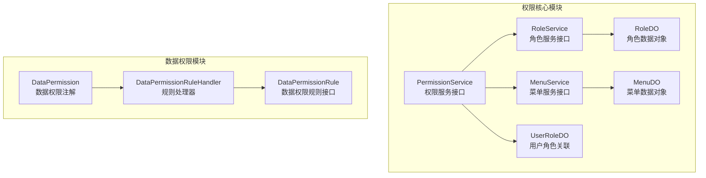
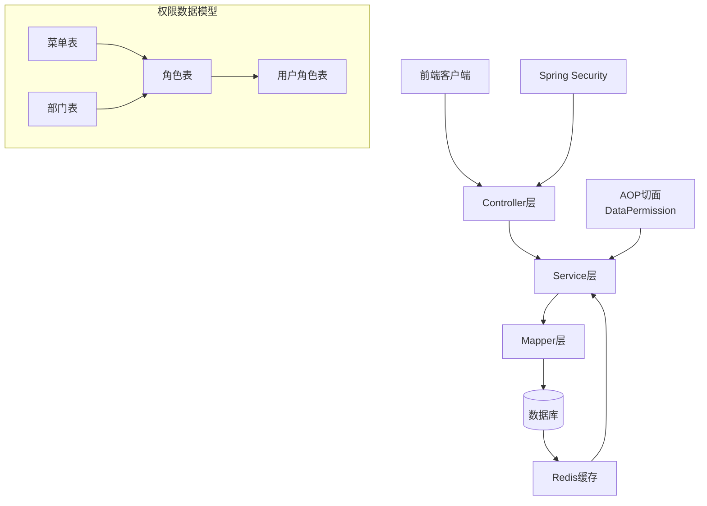
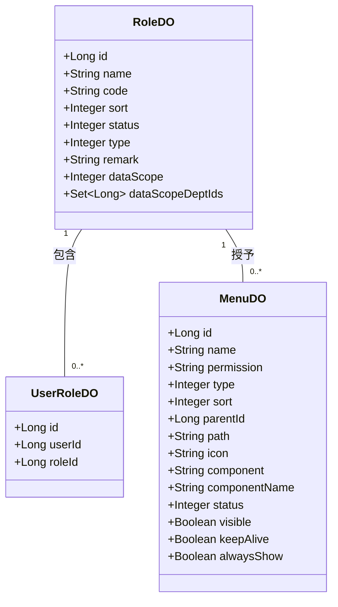
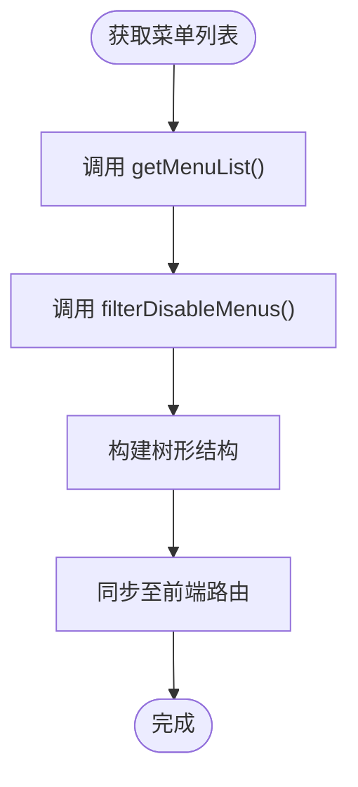
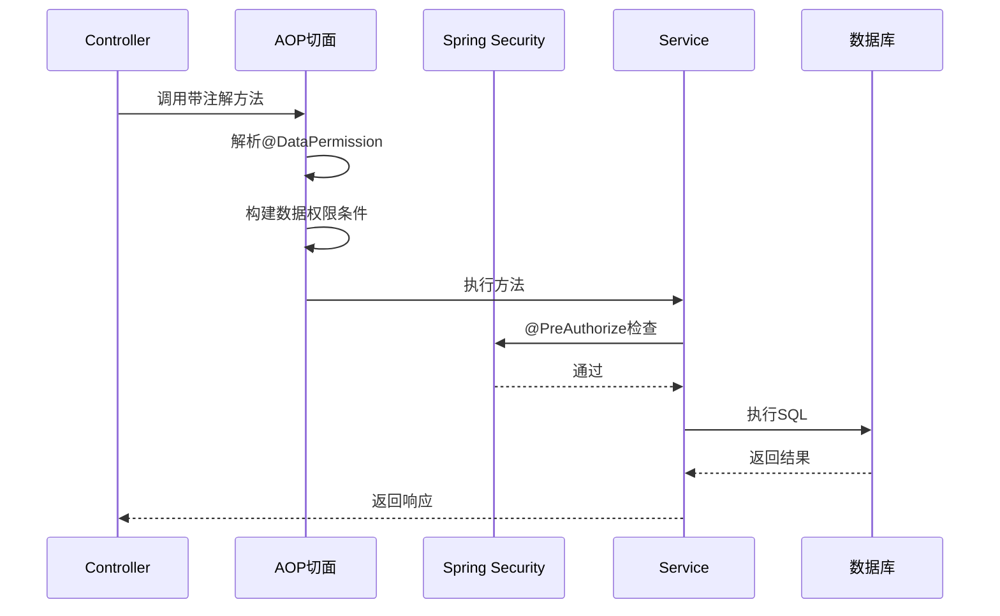
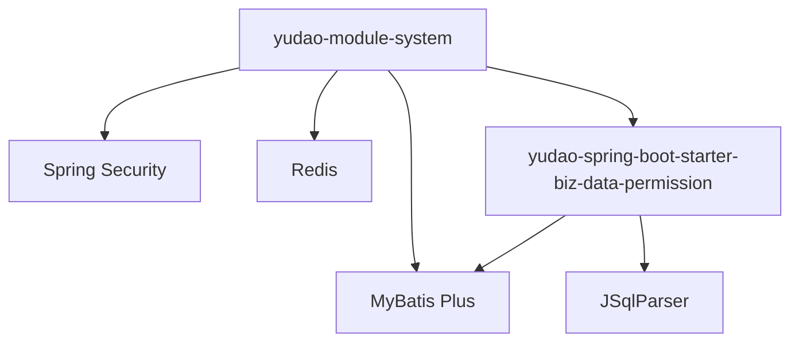

# 权限模型

<cite>
**本文档引用文件**  
- [RoleDO.java](file://yudao-module-system/src/main/java/cn/iocoder/yudao/module/system/dal/dataobject/permission/RoleDO.java)
- [MenuDO.java](file://yudao-module-system/src/main/java/cn/iocoder/yudao/module/system/dal/dataobject/permission/MenuDO.java)
- [UserRoleDO.java](file://yudao-module-system/src/main/java/cn/iocoder/yudao/module/system/dal/dataobject/permission/UserRoleDO.java)
- [DataPermission.java](file://yudao-framework/yudao-spring-boot-starter-biz-data-permission/src/main/java/cn/iocoder/yudao/framework/datapermission/core/annotation/DataPermission.java)
- [DataPermissionRule.java](file://yudao-framework/yudao-spring-boot-starter-biz-data-permission/src/main/java/cn/iocoder/yudao/framework/datapermission/core/rule/DataPermissionRule.java)
- [DataPermissionRuleHandler.java](file://yudao-framework/yudao-spring-boot-starter-biz-data-permission/src/main/java/cn/iocoder/yudao/framework/datapermission/core/db/DataPermissionRuleHandler.java)
- [PermissionService.java](file://yudao-module-system/src/main/java/cn/iocoder/yudao/module/system/service/permission/PermissionService.java)
- [MenuService.java](file://yudao-module-system/src/main/java/cn/iocoder/yudao/module/system/service/permission/MenuService.java)
- [RoleService.java](file://yudao-module-system/src/main/java/cn/iocoder/yudao/module/system/service/permission/RoleService.java)
</cite>

## 目录
1. [简介](#简介)
2. [项目结构](#项目结构)
3. [核心组件](#核心组件)
4. [架构概述](#架构概述)
5. [详细组件分析](#详细组件分析)
6. [依赖分析](#依赖分析)
7. [性能考虑](#性能考虑)
8. [故障排除指南](#故障排除指南)
9. [结论](#结论)

## 简介
本文档深入解析基于RBAC（基于角色的访问控制）的权限控制系统，涵盖角色、权限与菜单三者之间的关系模型。详细说明了核心数据对象的设计，包括角色、菜单及用户角色关联实体。文档还描述了菜单权限的树形结构实现机制、前端路由同步策略、数据权限控制方式、权限验证的AOP切面实现以及Spring Security表达式支持。此外，还涵盖了权限缓存策略、权限变更通知机制和调试工具的使用方法。

## 项目结构
系统权限模块主要位于 `yudao-module-system` 模块中，其核心权限管理功能集中在 `service.permission` 和 `dal.dataobject.permission` 包下。数据权限功能由独立的 `yudao-spring-boot-starter-biz-data-permission` 模块提供，实现了基于注解和SQL重写的动态数据过滤机制。



**图示来源**
- [RoleDO.java](file://yudao-module-system/src/main/java/cn/iocoder/yudao/module/system/dal/dataobject/permission/RoleDO.java)
- [MenuDO.java](file://yudao-module-system/src/main/java/cn/iocoder/yudao/module/system/dal/dataobject/permission/MenuDO.java)
- [UserRoleDO.java](file://yudao-module-system/src/main/java/cn/iocoder/yudao/module/system/dal/dataobject/permission/UserRoleDO.java)
- [DataPermission.java](file://yudao-framework/yudao-spring-boot-starter-biz-data-permission/src/main/java/cn/iocoder/yudao/framework/datapermission/core/annotation/DataPermission.java)
- [DataPermissionRule.java](file://yudao-framework/yudao-spring-boot-starter-biz-data-permission/src/main/java/cn/iocoder/yudao/framework/datapermission/core/rule/DataPermissionRule.java)
- [DataPermissionRuleHandler.java](file://yudao-framework/yudao-spring-boot-starter-biz-data-permission/src/main/java/cn/iocoder/yudao/framework/datapermission/core/db/DataPermissionRuleHandler.java)

**章节来源**
- [RoleDO.java](file://yudao-module-system/src/main/java/cn/iocoder/yudao/module/system/dal/dataobject/permission/RoleDO.java#L1-L78)
- [MenuDO.java](file://yudao-module-system/src/main/java/cn/iocoder/yudao/module/system/dal/dataobject/permission/MenuDO.java#L1-L109)
- [UserRoleDO.java](file://yudao-module-system/src/main/java/cn/iocoder/yudao/module/system/dal/dataobject/permission/UserRoleDO.java#L1-L35)

## 核心组件

本文档的核心组件包括角色（Role）、菜单（Menu）和用户角色关联（UserRole）三个数据对象，以及权限服务（PermissionService）、菜单服务（MenuService）和角色服务（RoleService）三个服务接口。这些组件共同构成了基于RBAC的权限控制体系。

**章节来源**
- [RoleDO.java](file://yudao-module-system/src/main/java/cn/iocoder/yudao/module/system/dal/dataobject/permission/RoleDO.java)
- [MenuDO.java](file://yudao-module-system/src/main/java/cn/iocoder/yudao/module/system/dal/dataobject/permission/MenuDO.java)
- [UserRoleDO.java](file://yudao-module-system/src/main/java/cn/iocoder/yudao/module/system/dal/dataobject/permission/UserRoleDO.java)
- [PermissionService.java](file://yudao-module-system/src/main/java/cn/iocoder/yudao/module/system/service/permission/PermissionService.java)

## 架构概述

系统采用分层架构设计，权限控制贯穿于数据访问层、服务层和控制层。通过Spring Security进行认证和基础权限校验，结合自定义AOP切面实现细粒度的数据权限控制。菜单权限通过树形结构组织，并与前端路由动态同步。



**图示来源**
- [RoleDO.java](file://yudao-module-system/src/main/java/cn/iocoder/yudao/module/system/dal/dataobject/permission/RoleDO.java)
- [MenuDO.java](file://yudao-module-system/src/main/java/cn/iocoder/yudao/module/system/dal/dataobject/permission/MenuDO.java)
- [UserRoleDO.java](file://yudao-module-system/src/main/java/cn/iocoder/yudao/module/system/dal/dataobject/permission/UserRoleDO.java)

## 详细组件分析

### 角色-权限-菜单三元组关系模型

系统采用标准的RBAC模型，通过角色作为中介连接用户与权限（菜单）。用户被赋予角色，角色被授予菜单访问权限，从而实现权限的灵活分配与管理。

#### 数据对象设计



**图示来源**
- [RoleDO.java](file://yudao-module-system/src/main/java/cn/iocoder/yudao/module/system/dal/dataobject/permission/RoleDO.java#L1-L78)
- [MenuDO.java](file://yudao-module-system/src/main/java/cn/iocoder/yudao/module/system/dal/dataobject/permission/MenuDO.java#L1-L109)
- [UserRoleDO.java](file://yudao-module-system/src/main/java/cn/iocoder/yudao/module/system/dal/dataobject/permission/UserRoleDO.java#L1-L35)

**章节来源**
- [RoleDO.java](file://yudao-module-system/src/main/java/cn/iocoder/yudao/module/system/dal/dataobject/permission/RoleDO.java#L1-L78)
- [MenuDO.java](file://yudao-module-system/src/main/java/cn/iocoder/yudao/module/system/dal/dataobject/permission/MenuDO.java#L1-L109)
- [UserRoleDO.java](file://yudao-module-system/src/main/java/cn/iocoder/yudao/module/system/dal/dataobject/permission/UserRoleDO.java#L1-L35)

### 菜单权限树形结构与前端路由同步

菜单采用树形结构存储，通过 `parentId` 字段建立父子关系。系统提供服务方法构建完整的菜单树，并过滤掉禁用的菜单项，确保前端只接收到有效的路由配置。



**章节来源**
- [MenuService.java](file://yudao-module-system/src/main/java/cn/iocoder/yudao/module/system/service/permission/MenuService.java#L1-L102)

### 数据权限实现机制

系统通过 `@DataPermission` 注解实现数据权限控制。该注解可应用于类或方法，支持启用/禁用控制，并可指定包含或排除的数据权限规则。

```mermaid
classDiagram
annotation DataPermission {
+boolean enable() default true
+Class~DataPermissionRule~[] includeRules()
+Class~DataPermissionRule~[] excludeRules()
}
interface DataPermissionRule {
+Set~String~ getTableNames()
+Expression getExpression(String tableName, Alias tableAlias)
}
class DataPermissionRuleHandler {
+getSqlSegment(Table table, Expression whereExpression, String sql)
}
DataPermission --> DataPermissionRule : 使用
DataPermissionRuleHandler --> DataPermissionRule : 实现
```

**图示来源**
- [DataPermission.java](file://yudao-framework/yudao-spring-boot-starter-biz-data-permission/src/main/java/cn/iocoder/yudao/framework/datapermission/core/annotation/DataPermission.java#L1-L35)
- [DataPermissionRule.java](file://yudao-framework/yudao-spring-boot-starter-biz-data-permission/src/main/java/cn/iocoder/yudao/framework/datapermission/core/rule/DataPermissionRule.java#L1-L36)
- [DataPermissionRuleHandler.java](file://yudao-framework/yudao-spring-boot-starter-biz-data-permission/src/main/java/cn/iocoder/yudao/framework/datapermission/core/db/DataPermissionRuleHandler.java)

**章节来源**
- [DataPermission.java](file://yudao-framework/yudao-spring-boot-starter-biz-data-permission/src/main/java/cn/iocoder/yudao/framework/datapermission/core/annotation/DataPermission.java#L1-L35)
- [DataPermissionRule.java](file://yudao-framework/yudao-spring-boot-starter-biz-data-permission/src/main/java/cn/iocoder/yudao/framework/datapermission/core/rule/DataPermissionRule.java#L1-L36)

### 权限验证AOP切面与Spring Security集成

权限验证通过AOP切面拦截带有 `@DataPermission` 注解的方法，动态修改SQL查询条件，实现数据行级过滤。同时，系统集成Spring Security，利用 `@PreAuthorize` 注解进行方法级权限控制。



**章节来源**
- [DataPermission.java](file://yudao-framework/yudao-spring-boot-starter-biz-data-permission/src/main/java/cn/iocoder/yudao/framework/datapermission/core/annotation/DataPermission.java#L1-L35)
- [PermissionService.java](file://yudao-module-system/src/main/java/cn/iocoder/yudao/module/system/service/permission/PermissionService.java#L1-L146)

## 依赖分析

系统权限模块依赖于框架提供的通用组件，如MyBatis Plus、Spring Security、Redis缓存等。数据权限模块作为独立Starter，可被其他业务模块引用，实现解耦。



**图示来源**
- [pom.xml](file://yudao-module-system/pom.xml)
- [pom.xml](file://yudao-framework/yudao-spring-boot-starter-biz-data-permission/pom.xml)

**章节来源**
- [RoleService.java](file://yudao-module-system/src/main/java/cn/iocoder/yudao/module/system/service/permission/RoleService.java#L1-L131)
- [MenuService.java](file://yudao-module-system/src/main/java/cn/iocoder/yudao/module/system/service/permission/MenuService.java#L1-L102)
- [PermissionService.java](file://yudao-module-system/src/main/java/cn/iocoder/yudao/module/system/service/permission/PermissionService.java#L1-L146)

## 性能考虑

系统通过多级缓存机制提升权限查询性能。角色、菜单等静态数据常驻内存，用户角色关联等动态数据使用Redis缓存。数据权限规则在应用启动时预加载，避免运行时重复解析。

## 故障排除指南

当出现权限不生效问题时，应检查以下方面：
1. 确认Controller或Service方法是否正确添加了 `@DataPermission` 注解
2. 检查角色是否已正确分配菜单权限
3. 验证用户是否已关联相应角色
4. 查看日志中是否有权限相关的错误或警告信息
5. 确认缓存是否正常工作，必要时可清除相关缓存

**章节来源**
- [DataPermission.java](file://yudao-framework/yudao-spring-boot-starter-biz-data-permission/src/main/java/cn/iocoder/yudao/framework/datapermission/core/annotation/DataPermission.java#L1-L35)
- [PermissionService.java](file://yudao-module-system/src/main/java/cn/iocoder/yudao/module/system/service/permission/PermissionService.java#L1-L146)

## 结论

本权限模型文档详细阐述了基于RBAC的权限控制系统的设计与实现。系统通过清晰的角色-权限-菜单三元组关系，结合灵活的数据权限规则和高效的缓存机制，实现了安全、可扩展的权限管理方案。该设计既满足了常规的菜单访问控制，又支持复杂的部门级数据权限需求，为系统的安全运行提供了坚实保障。