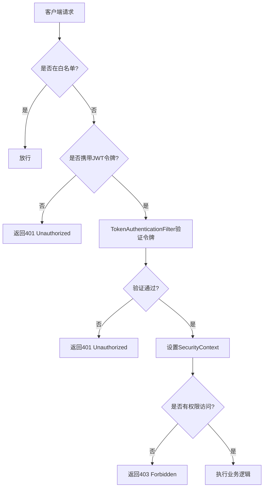
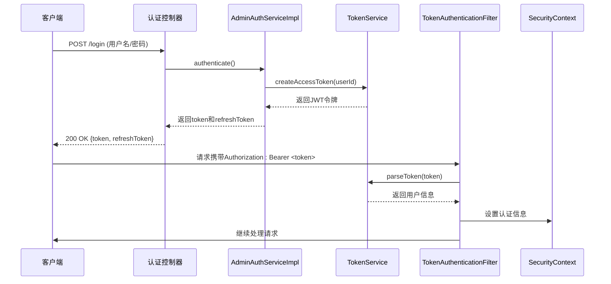
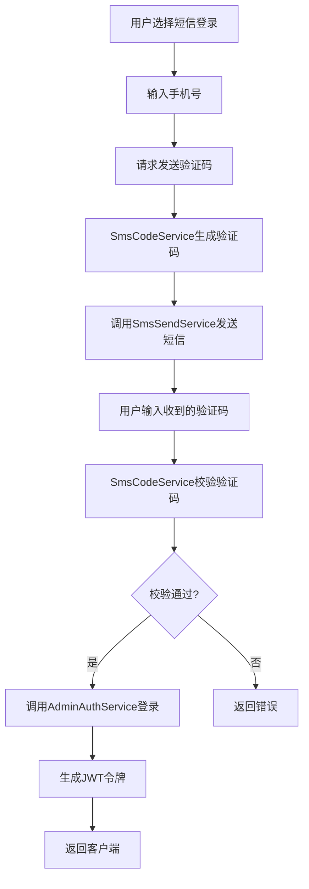
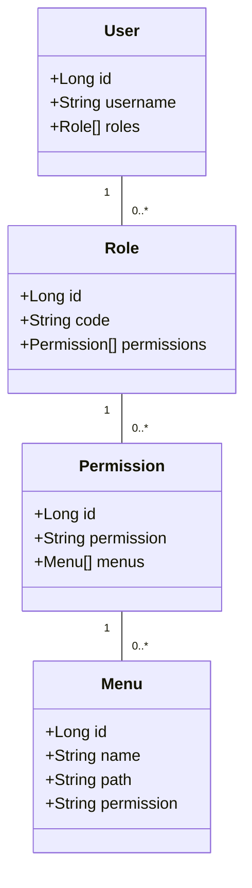
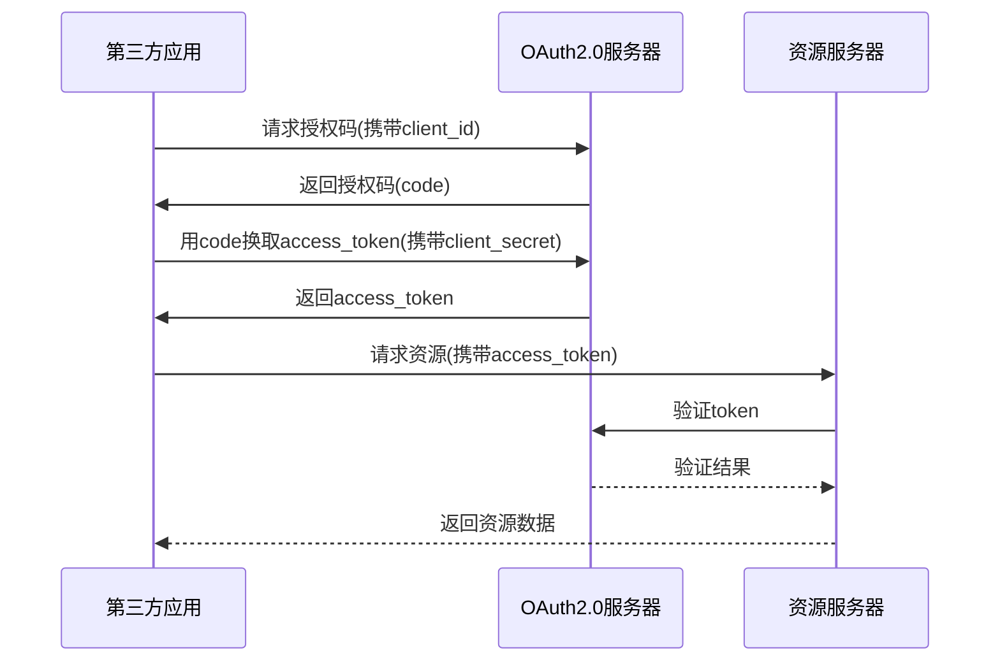

# 认证与授权

<cite>
**本文档引用文件**  
- [YudaoWebSecurityConfigurerAdapter.java](file://yudao-framework/yudao-spring-boot-starter-security/src/main/java/cn/iocoder/yudao/framework/security/config/YudaoWebSecurityConfigurerAdapter.java)
- [AdminAuthServiceImpl.java](file://yudao-module-system/src/main/java/cn/iocoder/yudao/module/system/service/auth/AdminAuthServiceImpl.java)
- [TokenAuthenticationFilter.java](file://yudao-framework/yudao-spring-boot-starter-security/src/main/java/cn/iocoder/yudao/framework/security/core/authentication/TokenAuthenticationFilter.java)
- [OAuth2TokenServiceImpl.java](file://yudao-module-system/src/main/java/cn/iocoder/yudao/module/system/service/oauth2/OAuth2TokenServiceImpl.java)
- [SocialUserServiceImpl.java](file://yudao-module-system/src/main/java/cn/iocoder/yudao/module/system/service/social/SocialUserServiceImpl.java)
- [SmsCodeServiceImpl.java](file://yudao-module-system/src/main/java/cn/iocoder/yudao/module/system/service/sms/SmsCodeServiceImpl.java)
- [PermissionServiceImpl.java](file://yudao-module-system/src/main/java/cn/iocoder/yudao/module/system/service/permission/PermissionServiceImpl.java)
- [RoleServiceImpl.java](file://yudao-module-system/src/main/java/cn/iocoder/yudao/module/system/service/permission/RoleServiceImpl.java)
- [MenuServiceImpl.java](file://yudao-module-system/src/main/java/cn/iocoder/yudao/module/system/service/permission/MenuServiceImpl.java)
- [SecurityProperties.java](file://yudao-framework/yudao-spring-boot-starter-security/src/main/java/cn/iocoder/yudao/framework/security/config/SecurityProperties.java)
</cite>

## 目录
1. [简介](#简介)
2. [安全配置与访问控制](#安全配置与访问控制)
3. [JWT 认证机制](#jwt-认证机制)
4. [多因素认证实现](#多因素认证实现)
5. [权限控制模型](#权限控制模型)
6. [OAuth2.0 授权服务器](#oauth20-授权服务器)
7. [异常与会话管理](#异常与会话管理)
8. [总结](#总结)

## 简介
本文档详细阐述了基于 Spring Security 的认证与授权体系，涵盖系统中的核心安全组件、认证流程、权限控制机制以及扩展功能。重点分析了 `YudaoWebSecurityConfigurerAdapter` 的安全配置规则、JWT 令牌处理、多因素认证（短信验证码、社交登录）、角色-权限-菜单模型及 OAuth2.0 授权服务器的实现。

## 安全配置与访问控制

`YudaoWebSecurityConfigurerAdapter` 是系统安全配置的核心类，继承自 `WebSecurityConfigurerAdapter`，通过重写 `configure(HttpSecurity http)` 方法定义了详细的访问控制策略。该配置结合 `SecurityProperties` 中的白名单、忽略路径等设置，实现了精细化的 URL 权限控制。

系统通过 `AuthorizeRequestsCustomizer` 扩展机制，允许模块化地添加自定义的权限规则。所有经过身份验证的请求必须携带有效的 JWT 令牌，未认证请求将被重定向至登录接口或返回 401 状态码。

**图示来源**
- [YudaoWebSecurityConfigurerAdapter.java](file://yudao-framework/yudao-spring-boot-starter-security/src/main/java/cn/iocoder/yudao/framework/security/config/YudaoWebSecurityConfigurerAdapter.java)
- [SecurityProperties.java](file://yudao-framework/yudao-spring-boot-starter-security/src/main/java/cn/iocoder/yudao/framework/security/config/SecurityProperties.java)

**本节来源**
- [YudaoWebSecurityConfigurerAdapter.java](file://yudao-framework/yudao-spring-boot-starter-security/src/main/java/cn/iocoder/yudao/framework/security/config/YudaoWebSecurityConfigurerAdapter.java)
- [SecurityProperties.java](file://yudao-framework/yudao-spring-boot-starter-security/src/main/java/cn/iocoder/yudao/framework/security/config/SecurityProperties.java)

## JWT 认证机制

系统采用 JWT（JSON Web Token）作为无状态认证的核心机制。`TokenAuthenticationFilter` 拦截所有请求，提取 `Authorization` 头中的 Bearer Token，调用 `TokenService` 进行解析和验证。

JWT 令牌的生成由 `AdminAuthServiceImpl` 在用户登录成功后完成，包含用户 ID、类型、过期时间等声明。令牌支持刷新机制，通过 `refreshToken` 在有效期内换取新的 `accessToken`，提升用户体验并保障安全性。

**图示来源**
- [AdminAuthServiceImpl.java](file://yudao-module-system/src/main/java/cn/iocoder/yudao/module/system/service/auth/AdminAuthServiceImpl.java)
- [TokenAuthenticationFilter.java](file://yudao-framework/yudao-spring-boot-starter-security/src/main/java/cn/iocoder/yudao/framework/security/core/authentication/TokenAuthenticationFilter.java)

**本节来源**
- [AdminAuthServiceImpl.java](file://yudao-module-system/src/main/java/cn/iocoder/yudao/module/system/service/auth/AdminAuthServiceImpl.java)
- [TokenAuthenticationFilter.java](file://yudao-framework/yudao-spring-boot-starter-security/src/main/java/cn/iocoder/yudao/framework/security/core/authentication/TokenAuthenticationFilter.java)

## 多因素认证实现

系统支持多种认证方式，包括短信验证码登录和社交账号登录，作为传统用户名密码认证的补充。

短信验证码登录由 `SmsCodeServiceImpl` 实现，用户请求验证码后，系统通过短信渠道发送一次性验证码，用户提交后进行比对验证。该流程集成在 `AdminAuthServiceImpl` 的认证逻辑中，支持多种场景（如登录、注册、找回密码）。

社交登录通过 `SocialUserServiceImpl` 和 `SocialClientServiceImpl` 实现，支持主流社交平台（如微信、QQ、GitHub）。用户授权后，系统获取授权码并换取用户信息，完成绑定或自动注册流程。

**图示来源**
- [SmsCodeServiceImpl.java](file://yudao-module-system/src/main/java/cn/iocoder/yudao/module/system/service/sms/SmsCodeServiceImpl.java)
- [SocialUserServiceImpl.java](file://yudao-module-system/src/main/java/cn/iocoder/yudao/module/system/service/social/SocialUserServiceImpl.java)

**本节来源**
- [SmsCodeServiceImpl.java](file://yudao-module-system/src/main/java/cn/iocoder/yudao/module/system/service/sms/SmsCodeServiceImpl.java)
- [SocialUserServiceImpl.java](file://yudao-module-system/src/main/java/cn/iocoder/yudao/module/system/service/social/SocialUserServiceImpl.java)

## 权限控制模型

系统采用“角色-权限-菜单”三级权限控制模型，由 `RoleService`、`PermissionService` 和 `MenuService` 共同实现。

- **角色（Role）**：代表用户的身份，如管理员、普通用户。
- **权限（Permission）**：对应具体的功能操作，如“用户查询”、“菜单删除”。
- **菜单（Menu）**：前端展示的导航菜单项，关联具体权限。

用户通过角色获得权限集合，系统在访问控制时检查当前用户是否拥有目标接口或菜单的权限。此外，系统还实现了数据权限控制，通过 `DataPermission` 注解和 AOP 拦截，实现基于部门、用户等维度的数据隔离。

**图示来源**
- [RoleServiceImpl.java](file://yudao-module-system/src/main/java/cn/iocoder/yudao/module/system/service/permission/RoleServiceImpl.java)
- [PermissionServiceImpl.java](file://yudao-module-system/src/main/java/cn/iocoder/yudao/module/system/service/permission/PermissionServiceImpl.java)
- [MenuServiceImpl.java](file://yudao-module-system/src/main/java/cn/iocoder/yudao/module/system/service/permission/MenuServiceImpl.java)

**本节来源**
- [RoleServiceImpl.java](file://yudao-module-system/src/main/java/cn/iocoder/yudao/module/system/service/permission/RoleServiceImpl.java)
- [PermissionServiceImpl.java](file://yudao-module-system/src/main/java/cn/iocoder/yudao/module/system/service/permission/PermissionServiceImpl.java)
- [MenuServiceImpl.java](file://yudao-module-system/src/main/java/cn/iocoder/yudao/module/system/service/permission/MenuServiceImpl.java)

## OAuth2.0 授权服务器

系统内置 OAuth2.0 授权服务器，由 `OAuth2TokenServiceImpl`、`OAuth2ClientServiceImpl` 等组件实现，支持多种授权模式：

- **授权码模式（Authorization Code）**：适用于 Web 应用，安全性高。
- **密码模式（Resource Owner Password Credentials）**：适用于受信任的客户端。
- **客户端凭证模式（Client Credentials）**：适用于服务间调用。

`OAuth2TokenApiImpl` 提供了 `/oauth2/token` 等标准接口，处理令牌的发放、刷新和撤销。客户端需预先在系统中注册，获取 `client_id` 和 `client_secret`。

**图示来源**
- [OAuth2TokenServiceImpl.java](file://yudao-module-system/src/main/java/cn/iocoder/yudao/module/system/service/oauth2/OAuth2TokenServiceImpl.java)
- [OAuth2ClientServiceImpl.java](file://yudao-module-system/src/main/java/cn/iocoder/yudao/module/system/service/oauth2/OAuth2ClientServiceImpl.java)

**本节来源**
- [OAuth2TokenServiceImpl.java](file://yudao-module-system/src/main/java/cn/iocoder/yudao/module/system/service/oauth2/OAuth2TokenServiceImpl.java)
- [OAuth2ClientServiceImpl.java](file://yudao-module-system/src/main/java/cn/iocoder/yudao/module/system/service/oauth2/OAuth2ClientServiceImpl.java)

## 异常与会话管理

系统对认证授权过程中的异常进行了统一处理，如 `BadCredentialsException`（凭据错误）、`AccessDeniedException`（访问拒绝）等，通过全局异常处理器返回标准化的错误响应。

由于采用 JWT 无状态认证，系统不依赖服务器端会话（Session）。JWT 令牌本身包含过期时间，通过 `SecurityProperties` 配置 `tokenExpireTime` 和 `refreshTokenExpireTime` 控制令牌生命周期。登录失败处理由 `AdminAuthServiceImpl` 实现，包含失败次数限制和锁定机制，防止暴力破解。

**本节来源**
- [AdminAuthServiceImpl.java](file://yudao-module-system/src/main/java/cn/iocoder/yudao/module/system/service/auth/AdminAuthServiceImpl.java)
- [SecurityProperties.java](file://yudao-framework/yudao-spring-boot-starter-security/src/main/java/cn/iocoder/yudao/framework/security/config/SecurityProperties.java)

## 总结

本系统构建了一套完整、灵活且安全的认证与授权体系。基于 Spring Security 和 JWT 实现了无状态认证，通过精细化的访问控制和“角色-权限-菜单”模型保障功能安全，支持多因素认证和 OAuth2.0 授权，满足复杂业务场景下的安全需求。整体设计模块化、可扩展，为系统的稳定运行提供了坚实的安全基础。