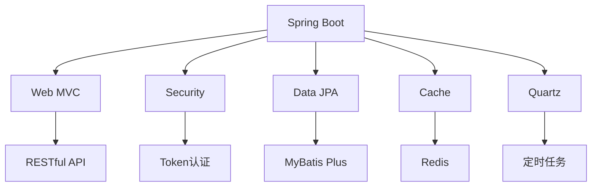
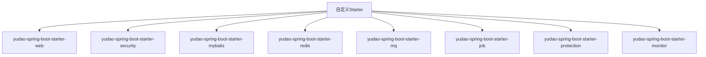

# 技术栈与依赖

<cite>
**本文档引用文件**  
- [README.md](file://README.md)
- [yudao-dependencies/pom.xml](file://yudao-dependencies/pom.xml)
- [yudao-framework/yudao-spring-boot-starter-web/pom.xml](file://yudao-framework/yudao-spring-boot-starter-web/pom.xml)
- [yudao-framework/yudao-spring-boot-starter-security/pom.xml](file://yudao-framework/yudao-spring-boot-starter-security/pom.xml)
- [yudao-framework/yudao-spring-boot-starter-mybatis/pom.xml](file://yudao-framework/yudao-spring-boot-starter-mybatis/pom.xml)
- [yudao-framework/yudao-spring-boot-starter-redis/pom.xml](file://yudao-framework/yudao-spring-boot-starter-redis/pom.xml)
- [yudao-framework/yudao-spring-boot-starter-mq/pom.xml](file://yudao-framework/yudao-spring-boot-starter-mq/pom.xml)
- [yudao-framework/yudao-spring-boot-starter-job/pom.xml](file://yudao-framework/yudao-spring-boot-starter-job/pom.xml)
- [yudao-framework/yudao-spring-boot-starter-protection/pom.xml](file://yudao-framework/yudao-spring-boot-starter-protection/pom.xml)
- [yudao-framework/yudao-spring-boot-starter-monitor/pom.xml](file://yudao-framework/yudao-spring-boot-starter-monitor/pom.xml)
- [yudao-module-system/pom.xml](file://yudao-module-system/pom.xml)
- [yudao-server/pom.xml](file://yudao-server/pom.xml)
</cite>

## 目录
1. [项目结构概览](#项目结构概览)
2. [核心框架与技术栈](#核心框架与技术栈)
3. [依赖管理机制](#依赖管理机制)
4. [自定义Spring Boot Starter详解](#自定义spring-boot-starter详解)
5. [ORM框架MyBatis配置与使用](#orm框架mybatis配置与使用)
6. [Redis缓存与分布式锁实现](#redis缓存与分布式锁实现)
7. [消息队列在异步处理中的应用](#消息队列在异步处理中的应用)
8. [Quartz定时任务调度](#quartz定时任务调度)
9. [依赖冲突解决与版本升级指南](#依赖冲突解决与版本升级指南)

## 项目结构概览

本项目采用Spring Boot多模块架构，主要模块包括`yudao-dependencies`、`yudao-framework`、`yudao-server`、`yudao-module-system`等。`yudao-server`作为主启动项目，通过引入各模块依赖提供RESTful API服务。`yudao-framework`包含多个自定义Starter，实现框架功能拓展。`yudao-dependencies`作为BOM文件统一管理所有依赖版本。

**文档来源**
- [README.md](file://README.md)
- [yudao-server/pom.xml](file://yudao-server/pom.xml)

## 核心框架与技术栈

项目基于Spring Boot 2.7.18构建，采用主流技术栈组合。核心框架包括Spring Boot、MyBatis Plus、Redis、RabbitMQ、Kafka、RocketMQ、Quartz、Spring Security等。数据库支持MySQL、Oracle、PostgreSQL等多种关系型数据库。消息队列支持Redis、RabbitMQ、Kafka、RocketMQ四种实现。权限认证使用Spring Security结合Token和Redis实现多终端认证。

**图示来源**
- [README.md](file://README.md)

## 依赖管理机制

`yudao-dependencies`模块作为项目的BOM（Bill of Materials）文件，通过Maven的`dependencyManagement`机制统一管理所有依赖版本。该模块定义了项目中使用的所有第三方库的版本号，避免了版本冲突问题。其他模块通过引入该BOM文件，继承统一的依赖版本配置。

在`yudao-dependencies/pom.xml`中，通过`<properties>`标签定义了各依赖的版本号，如`spring.boot.version`、`mybatis-plus.version`等。`<dependencyManagement>`部分集中声明了所有依赖及其版本，确保整个项目使用统一的依赖版本。

**文档来源**
- [yudao-dependencies/pom.xml](file://yudao-dependencies/pom.xml)

## 自定义Spring Boot Starter详解

项目通过自定义Spring Boot Starter机制扩展功能，实现了模块化和可插拔的架构设计。主要自定义Starter包括：

- `yudao-spring-boot-starter-web`：提供Web框架支持，包含全局异常处理、API日志、数据脱敏等功能
- `yudao-spring-boot-starter-security`：实现用户认证和权限校验，支持多终端、多用户类型的认证系统
- `yudao-spring-boot-starter-mybatis`：封装MyBatis Plus和多数据源配置，提供数据库操作支持
- `yudao-spring-boot-starter-redis`：封装Redis操作，提供缓存和分布式锁功能
- `yudao-spring-boot-starter-mq`：支持多种消息队列实现，包括Redis、RabbitMQ、Kafka、RocketMQ
- `yudao-spring-boot-starter-job`：基于Quartz实现定时任务调度
- `yudao-spring-boot-starter-protection`：提供分布式锁、幂等、限流等服务保障功能
- `yudao-spring-boot-starter-monitor`：集成链路追踪、监控指标收集等功能

这些Starter通过自动配置机制，简化了相关功能的集成和使用。

**图示来源**
- [yudao-framework/yudao-spring-boot-starter-web/pom.xml](file://yudao-framework/yudao-spring-boot-starter-web/pom.xml)
- [yudao-framework/yudao-spring-boot-starter-security/pom.xml](file://yudao-framework/yudao-spring-boot-starter-security/pom.xml)
- [yudao-framework/yudao-spring-boot-starter-mybatis/pom.xml](file://yudao-framework/yudao-spring-boot-starter-mybatis/pom.xml)
- [yudao-framework/yudao-spring-boot-starter-redis/pom.xml](file://yudao-framework/yudao-spring-boot-starter-redis/pom.xml)
- [yudao-framework/yudao-spring-boot-starter-mq/pom.xml](file://yudao-framework/yudao-spring-boot-starter-mq/pom.xml)
- [yudao-framework/yudao-spring-boot-starter-job/pom.xml](file://yudao-framework/yudao-spring-boot-starter-job/pom.xml)
- [yudao-framework/yudao-spring-boot-starter-protection/pom.xml](file://yudao-framework/yudao-spring-boot-starter-protection/pom.xml)
- [yudao-framework/yudao-spring-boot-starter-monitor/pom.xml](file://yudao-framework/yudao-spring-boot-starter-monitor/pom.xml)

## ORM框架MyBatis配置与使用

`yudao-spring-boot-starter-mybatis`模块封装了MyBatis Plus的配置和使用。该模块集成了Druid连接池、Dynamic Datasource多数据源支持、MyBatis Plus增强功能等。通过自动配置机制，简化了数据库访问层的开发。

模块支持多种数据库类型，包括MySQL、Oracle、PostgreSQL、SQL Server、达梦DM等。通过`dynamic-datasource-spring-boot-starter`实现多数据源配置，支持读写分离和动态数据源切换。`mybatis-plus-join-boot-starter`提供了联表查询支持，简化了复杂查询的实现。

**文档来源**
- [yudao-framework/yudao-spring-boot-starter-mybatis/pom.xml](file://yudao-framework/yudao-spring-boot-starter-mybatis/pom.xml)

## Redis缓存与分布式锁实现

`yudao-spring-boot-starter-redis`模块基于Redisson封装了Redis操作。该模块提供了缓存管理、分布式锁、分布式信号量等分布式协调功能。通过`redisson-spring-boot-starter`实现Redis客户端连接，支持Redis单机、哨兵、集群等多种部署模式。

模块实现了基于Redis的缓存抽象，支持Spring Cache注解。`yudao-spring-boot-starter-protection`模块利用Redisson实现了分布式锁功能，通过`@Lock4j`注解简化了分布式锁的使用。同时，该模块还支持基于Redis的幂等处理和限流控制。

**文档来源**
- [yudao-framework/yudao-spring-boot-starter-redis/pom.xml](file://yudao-framework/yudao-spring-boot-starter-redis/pom.xml)
- [yudao-framework/yudao-spring-boot-starter-protection/pom.xml](file://yudao-framework/yudao-spring-boot-starter-protection/pom.xml)

## 消息队列在异步处理中的应用

`yudao-spring-boot-starter-mq`模块提供了统一的消息队列接口，支持Redis、RabbitMQ、Kafka、RocketMQ四种实现。通过抽象的消息生产者和消费者接口，实现了消息队列的可插拔设计。

模块支持发布/订阅模式和点对点模式，可用于异步任务处理、事件驱动架构等场景。通过`@RabbitListener`、`@KafkaListener`等注解简化了消息消费者的实现。`yudao-spring-boot-starter-job`模块利用消息队列实现了异步任务调度功能。

**文档来源**
- [yudao-framework/yudao-spring-boot-starter-mq/pom.xml](file://yudao-framework/yudao-spring-boot-starter-mq/pom.xml)
- [yudao-framework/yudao-spring-boot-starter-job/pom.xml](file://yudao-framework/yudao-spring-boot-starter-job/pom.xml)

## Quartz定时任务调度

`yudao-spring-boot-starter-job`模块基于Quartz实现了定时任务调度功能。该模块提供了任务管理、任务日志、任务监控等功能。通过`@Scheduled`注解和Quartz Job接口支持两种任务定义方式。

模块实现了任务的动态增删改查，支持Cron表达式、固定频率、固定延迟等多种触发方式。任务执行日志记录到数据库，便于问题排查和审计。`yudao-module-system`模块中的定时任务通过该机制实现。

**文档来源**
- [yudao-framework/yudao-spring-boot-starter-job/pom.xml](file://yudao-framework/yudao-spring-boot-starter-job/pom.xml)
- [yudao-module-system/pom.xml](file://yudao-module-system/pom.xml)

## 依赖冲突解决与版本升级指南

项目通过`yudao-dependencies`模块统一管理依赖版本，从根本上避免了版本冲突问题。当需要升级某个依赖版本时，只需在`yudao-dependencies/pom.xml`中修改对应的版本属性即可。

对于可选依赖，项目采用`<optional>true</optional>`标记，避免不必要的传递性依赖。对于可能存在冲突的依赖，通过`<exclusions>`标签排除特定的传递性依赖。版本升级时，建议先在测试环境中验证兼容性，确保升级不会影响现有功能。

**文档来源**
- [yudao-dependencies/pom.xml](file://yudao-dependencies/pom.xml)