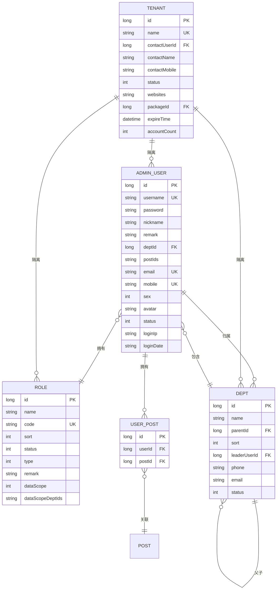
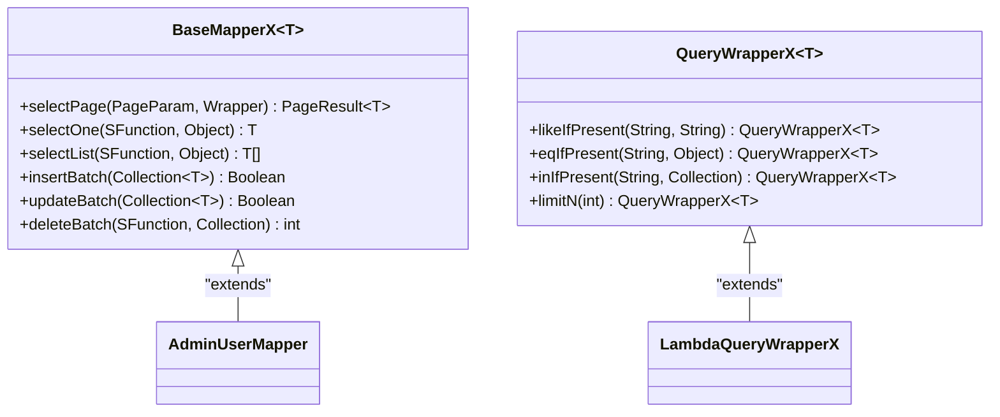

# 数据模型

<cite>
**本文档引用的文件**
- [AdminUserDO.java](file://yudao-module-system/src/main/java/cn/iocoder/yudao/module/system/dal/dataobject/user/AdminUserDO.java)
- [RoleDO.java](file://yudao-module-system/src/main/java/cn/iocoder/yudao/module/system/dal/dataobject/permission/RoleDO.java)
- [DeptDO.java](file://yudao-module-system/src/main/java/cn/iocoder/yudao/module/system/dal/dataobject/dept/DeptDO.java)
- [TenantDO.java](file://yudao-module-system/src/main/java/cn/iocoder/yudao/module/system/dal/dataobject/tenant/TenantDO.java)
- [BaseDO.java](file://yudao-framework/yudao-spring-boot-starter-mybatis/src/main/java/cn/iocoder/yudao/framework/mybatis/core/dataobject/BaseDO.java)
- [BaseMapperX.java](file://yudao-framework/yudao-spring-boot-starter-mybatis/src/main/java/cn/iocoder/yudao/framework/mybatis/core/mapper/BaseMapperX.java)
- [QueryWrapperX.java](file://yudao-framework/yudao-spring-boot-starter-mybatis/src/main/java/cn/iocoder/yudao/framework/mybatis/core/query/QueryWrapperX.java)
- [UserPostDO.java](file://yudao-module-system/src/main/java/cn/iocoder/yudao/module/system/dal/dataobject/dept/UserPostDO.java)
</cite>

## 目录
1. [引言](#引言)
2. [核心数据实体](#核心数据实体)
3. [实体关系与ER图](#实体关系与er图)
4. [MyBatis ORM映射配置](#mybatis-orm映射配置)
5. [数据库设计原则](#数据库设计原则)
6. [数据访问层设计](#数据访问层设计)
7. [数据一致性与事务管理](#数据一致性与事务管理)

## 引言
本文档详细描述了系统的核心数据模型，包括用户、角色、部门和租户等关键数据实体的结构、关系及持久化机制。文档深入分析了各数据对象的字段定义、约束条件和业务含义，阐明了实体间的关联关系，并说明了MyBatis ORM框架的扩展功能和数据访问模式。

## 核心数据实体

### AdminUserDO 用户数据对象
`AdminUserDO` 类定义了管理后台用户的核心信息，继承自 `TenantBaseDO`，支持多租户隔离。

**字段定义与业务含义：**
- **id**: 用户ID，主键，自增。
- **username**: 用户账号，唯一标识。
- **password**: 加密后的密码，使用BCrypt算法。
- **nickname**: 用户昵称，用于界面显示。
- **remark**: 备注信息。
- **deptId**: 所属部门ID，关联 `DeptDO`。
- **postIds**: 岗位编号数组，使用JacksonTypeHandler存储为JSON，实现用户与岗位的多对多关系。
- **email**: 用户邮箱，用于通知和验证。
- **mobile**: 手机号码，用于登录和验证。
- **sex**: 用户性别，枚举类型 `SexEnum`。
- **avatar**: 用户头像URL。
- **status**: 帐号状态，枚举类型 `CommonStatusEnum`（正常/停用）。
- **loginIp**: 最后登录IP地址。
- **loginDate**: 最后登录时间。

**Section sources**
- [AdminUserDO.java](file://yudao-module-system/src/main/java/cn/iocoder/yudao/module/system/dal/dataobject/user/AdminUserDO.java#L1-L97)

### RoleDO 角色数据对象
`RoleDO` 类定义了系统中的角色信息，用于权限控制。

**字段定义与业务含义：**
- **id**: 角色ID，主键，自增。
- **name**: 角色名称，如“系统管理员”。
- **code**: 角色标识，用于代码中引用。
- **sort**: 角色排序，影响界面显示顺序。
- **status**: 角色状态，枚举类型 `CommonStatusEnum`。
- **type**: 角色类型，枚举类型 `RoleTypeEnum`（如普通角色、内置角色）。
- **remark**: 备注。
- **dataScope**: 数据范围，枚举类型 `DataScopeEnum`（如全部、本部门、自定义）。
- **dataScopeDeptIds**: 数据范围指定的部门ID数组，当 `dataScope` 为“自定义”时使用，存储为JSON。

**Section sources**
- [RoleDO.java](file://yudao-module-system/src/main/java/cn/iocoder/yudao/module/system/dal/dataobject/permission/RoleDO.java#L1-L79)

### DeptDO 部门数据对象
`DeptDO` 类定义了组织架构中的部门信息。

**字段定义与业务含义：**
- **id**: 部门ID，主键，自增。
- **name**: 部门名称。
- **parentId**: 父部门ID，形成树形结构。根部门的 `parentId` 为0。
- **sort**: 显示顺序。
- **leaderUserId**: 负责人用户ID，关联 `AdminUserDO`。
- **phone**: 联系电话。
- **email**: 邮箱。
- **status**: 部门状态，枚举类型 `CommonStatusEnum`。

**Section sources**
- [DeptDO.java](file://yudao-module-system/src/main/java/cn/iocoder/yudao/module/system/dal/dataobject/dept/DeptDO.java#L1-L67)

### TenantDO 租户数据对象
`TenantDO` 类定义了多租户模式下的租户信息。

**字段定义与业务含义：**
- **id**: 租户编号，主键，自增。
- **name**: 租户名，唯一。
- **contactUserId**: 联系人用户ID，关联 `AdminUserDO`。
- **contactName**: 联系人姓名。
- **contactMobile**: 联系手机。
- **status**: 租户状态，枚举类型 `CommonStatusEnum`。
- **websites**: 绑定域名列表，支持多个域名，使用 `StringListTypeHandler` 存储为JSON数组。
- **packageId**: 租户套餐编号，关联 `TenantPackageDO`。
- **expireTime**: 过期时间。
- **accountCount**: 允许创建的账号数量。

**Section sources**
- [TenantDO.java](file://yudao-module-system/src/main/java/cn/iocoder/yudao/module/system/dal/dataobject/tenant/TenantDO.java#L1-L90)

## 实体关系与ER图

**Diagram sources**
- [AdminUserDO.java](file://yudao-module-system/src/main/java/cn/iocoder/yudao/module/system/dal/dataobject/user/AdminUserDO.java#L1-L97)
- [RoleDO.java](file://yudao-module-system/src/main/java/cn/iocoder/yudao/module/system/dal/dataobject/permission/RoleDO.java#L1-L79)
- [DeptDO.java](file://yudao-module-system/src/main/java/cn/iocoder/yudao/module/system/dal/dataobject/dept/DeptDO.java#L1-L67)
- [TenantDO.java](file://yudao-module-system/src/main/java/cn/iocoder/yudao/module/system/dal/dataobject/tenant/TenantDO.java#L1-L90)
- [UserPostDO.java](file://yudao-module-system/src/main/java/cn/iocoder/yudao/module/system/dal/dataobject/dept/UserPostDO.java#L1-L39)

## MyBatis ORM映射配置

### ResultMap定义
实体类通过 `@TableName(autoResultMap = true)` 注解启用自动ResultMap。对于复杂类型（如 `Set<Long>` 和 `List<String>`），使用MyBatis Plus的 `typeHandler`：
- `JacksonTypeHandler.class`：用于将集合序列化为JSON字符串存储。
- `StringListTypeHandler.class`：专门处理字符串列表的序列化和反序列化。

### 关联查询实现
系统使用 `MPJBaseMapper`（MyBatis Plus Join）来实现多表关联查询，避免了N+1问题。例如，查询用户信息时，可以同时关联部门和岗位信息。

**Section sources**
- [AdminUserDO.java](file://yudao-module-system/src/main/java/cn/iocoder/yudao/module/system/dal/dataobject/user/AdminUserDO.java#L1-L97)
- [BaseMapperX.java](file://yudao-framework/yudao-spring-boot-starter-mybatis/src/main/java/cn/iocoder/yudao/framework/mybatis/core/mapper/BaseMapperX.java#L1-L227)

## 数据库设计原则

### 逻辑删除
所有继承自 `BaseDO` 的实体都包含 `deleted` 字段，通过 `@TableLogic` 注解实现逻辑删除。查询时，MyBatis Plus会自动添加 `WHERE deleted = 0` 条件。

### 时间戳自动填充
`BaseDO` 定义了 `createTime` 和 `updateTime` 字段，并通过 `@TableField(fill = FieldFill.INSERT)` 和 `@TableField(fill = FieldFill.INSERT_UPDATE)` 实现创建和更新时间的自动填充。

### 多租户隔离
`TenantBaseDO` 在 `BaseDO` 基础上增加了 `tenantId` 字段，通过MyBatis Plus的多租户插件，在所有SQL查询中自动添加 `tenant_id = ?` 条件，实现数据的物理隔离。

**Section sources**
- [BaseDO.java](file://yudao-framework/yudao-spring-boot-starter-mybatis/src/main/java/cn/iocoder/yudao/framework/mybatis/core/dataobject/BaseDO.java#L1-L67)
- [TenantDO.java](file://yudao-module-system/src/main/java/cn/iocoder/yudao/module/system/dal/dataobject/tenant/TenantDO.java#L1-L90)

## 数据访问层设计

### BaseMapperX 扩展功能
`BaseMapperX` 接口在 `BaseMapper` 和 `MPJBaseMapper` 基础上提供了丰富的扩展方法：
- **分页查询增强**：`selectPage` 方法支持 `PageParam` 和 `SortingField`，简化分页逻辑。
- **批量操作**：`insertBatch` 和 `updateBatch` 方法支持批量插入和更新，对SQL Server有特殊处理。
- **条件查询简化**：提供 `selectOne`, `selectList`, `selectCount` 等便捷方法，支持Lambda表达式。

### QueryWrapperX 查询构建器
`QueryWrapperX` 继承自 `QueryWrapper`，增加了 `xxxIfPresent` 方法（如 `eqIfPresent`, `likeIfPresent`），只有当传入的值不为 `null` 或非空时才拼接查询条件，避免了大量 `if` 判断，使代码更简洁。

**Diagram sources**
- [BaseMapperX.java](file://yudao-framework/yudao-spring-boot-starter-mybatis/src/main/java/cn/iocoder/yudao/framework/mybatis/core/mapper/BaseMapperX.java#L1-L227)
- [QueryWrapperX.java](file://yudao-framework/yudao-spring-boot-starter-mybatis/src/main/java/cn/iocoder/yudao/framework/mybatis/core/query/QueryWrapperX.java#L1-L167)

## 数据一致性与事务管理
系统通过Spring的 `@Transactional` 注解管理事务。在涉及多个数据表的业务操作中（如创建用户并分配角色），将相关操作放在同一个事务方法中，确保数据的一致性。例如，`AdminUserServiceImpl` 中的 `createUser` 方法会原子性地完成用户创建、角色分配和岗位关联。

**Section sources**
- [AdminUserServiceImpl.java](file://yudao-module-system/src/main/java/cn/iocoder/yudao/module/system/service/user/AdminUserServiceImpl.java#L1-L301)
- [BaseMapperX.java](file://yudao-framework/yudao-spring-boot-starter-mybatis/src/main/java/cn/iocoder/yudao/framework/mybatis/core/mapper/BaseMapperX.java#L1-L227)