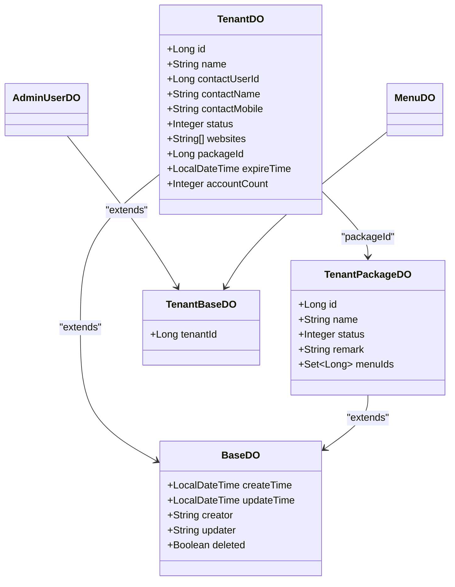

# 租户数据模型

<cite>
**本文档引用的文件**   
- [TenantDO.java](file://yudao-module-system/src/main/java/cn/iocoder/yudao/module/system/dal/dataobject/tenant/TenantDO.java)
- [TenantPackageDO.java](file://yudao-module-system/src/main/java/cn/iocoder/yudao/module/system/dal/dataobject/tenant/TenantPackageDO.java)
- [TenantContextHolder.java](file://yudao-framework/yudao-spring-boot-starter-biz-tenant/src/main/java/cn/iocoder/yudao/framework/tenant/core/context/TenantContextHolder.java)
- [TenantDatabaseInterceptor.java](file://yudao-framework/yudao-spring-boot-starter-biz-tenant/src/main/java/cn/iocoder/yudao/framework/tenant/core/db/TenantDatabaseInterceptor.java)
- [BaseDO.java](file://yudao-framework/yudao-spring-boot-starter-mybatis/src/main/java/cn/iocoder/yudao/framework/mybatis/core/dataobject/BaseDO.java)
- [TenantBaseDO.java](file://yudao-framework/yudao-spring-boot-starter-biz-tenant/src/main/java/cn/iocoder/yudao/framework/tenant/core/db/TenantBaseDO.java)
- [CommonStatusEnum.java](file://yudao-framework/yudao-common/src/main/java/cn/iocoder/yudao/framework/common/enums/CommonStatusEnum.java)
</cite>

## 目录
1. [引言](#引言)
2. [核心实体字段详解](#核心实体字段详解)
3. [多租户架构中的核心作用](#多租户架构中的核心作用)
4. [与租户套餐的关联关系](#与租户套餐的关联关系)
5. [逻辑删除与时间戳处理](#逻辑删除与时间戳处理)
6. [数据模型图示](#数据模型图示)
7. [租户上下文与拦截器中的应用](#租户上下文与拦截器中的应用)

## 引言
本文档详细阐述了多租户SaaS架构中的核心数据模型——`TenantDO`实体。该实体是整个系统实现租户隔离和管理的基础，承载了租户的核心业务信息。文档将深入解析其所有字段的定义、约束及业务含义，并说明其在系统中的关键作用，包括如何通过`tenant_id`实现数据隔离，以及与`TenantPackageDO`等实体的关联。同时，文档还将介绍逻辑删除、时间戳等通用字段的处理机制，并通过类图展示其在架构中的位置，最后说明`TenantContextHolder`和`TenantDatabaseInterceptor`如何利用该模型实现动态数据源切换和租户过滤。

## 核心实体字段详解
`TenantDO`实体定义了租户的所有核心属性，每个字段都具有明确的数据类型、约束条件和业务含义。

**Section sources**
- [TenantDO.java](file://yudao-module-system/src/main/java/cn/iocoder/yudao/module/system/dal/dataobject/tenant/TenantDO.java#L39-L86)

### 租户ID (id)
- **数据类型**: `Long`
- **约束条件**: 主键，自增。
- **业务含义**: 租户的唯一标识符，是系统内区分不同租户的根本依据。所有与租户相关的数据表都通过此ID进行关联。

### 租户名 (name)
- **数据类型**: `String`
- **约束条件**: 唯一性约束，不能为空。
- **业务含义**: 租户的名称，用于在管理界面中展示和识别。系统通过`validTenantNameDuplicate`方法确保名称的唯一性。

### 联系人 (contactName)
- **数据类型**: `String`
- **约束条件**: 可为空。
- **业务含义**: 该租户的主要联系人姓名，用于业务沟通。

### 联系电话 (contactMobile)
- **数据类型**: `String`
- **约束条件**: 可为空。
- **业务含义**: 该租户联系人的手机号码，用于紧急联系或通知。

### 状态 (status)
- **数据类型**: `Integer`
- **约束条件**: 枚举值，关联`CommonStatusEnum`。
- **业务含义**: 表示租户的当前状态。`0`代表“开启”（ENABLE），`1`代表“关闭”（DISABLE）。系统在访问租户资源前会通过`validTenant`方法校验其状态是否有效。

### 域名 (websites)
- **数据类型**: `List<String>`
- **约束条件**: 使用`StringListTypeHandler`进行类型转换，可为空。
- **业务含义**: 一个字符串列表，存储了该租户绑定的所有域名。系统支持一个租户拥有多个域名（如管理后台、会员前台等），并通过`validTenantWebsiteDuplicate`方法确保域名的唯一性。

### 租户套餐ID (packageId)
- **数据类型**: `Long`
- **约束条件**: 外键，关联`TenantPackageDO`的`id`。`0`为特殊值，表示系统内置租户。
- **业务含义**: 标识该租户所使用的套餐。此ID决定了租户可访问的菜单权限范围。当套餐变更时，系统会自动更新其角色的菜单权限。

### 账号数量 (accountCount)
- **数据类型**: `Integer`
- **约束条件**: 可为空。
- **业务含义**: 该租户允许创建的管理员账号总数上限，用于控制租户的用户规模。

### 过期时间 (expireTime)
- **数据类型**: `LocalDateTime`
- **约束条件**: 可为空。
- **业务含义**: 租户服务的到期时间。系统会检查此时间，过期的租户将无法继续使用服务。

### 备注 (remark)
- **数据类型**: `String`
- **约束条件**: 在`TenantDO`中未直接定义，但通常在管理界面中提供。
- **业务含义**: 用于记录关于该租户的额外信息或说明。

## 多租户架构中的核心作用
`TenantDO`实体是整个多租户SaaS系统的核心，其核心作用体现在**数据隔离**上。

系统采用**逻辑隔离**的方式，即所有租户的数据存储在同一个数据库的同一套表结构中，通过`tenant_id`字段来区分不同租户的数据。`TenantDO`的`id`字段作为`tenant_id`，被所有需要进行租户隔离的业务数据表所引用。

例如，`AdminUserDO`、`MenuDO`等实体都继承自`TenantBaseDO`，其中包含`tenantId`字段。当查询某个租户的用户列表时，SQL语句会自动添加`WHERE tenant_id = ?`的条件，从而确保每个租户只能看到和操作属于自己的数据，实现了安全、高效的数据隔离。

**Section sources**
- [TenantDO.java](file://yudao-module-system/src/main/java/cn/iocoder/yudao/module/system/dal/dataobject/tenant/TenantDO.java#L20-L88)
- [TenantBaseDO.java](file://yudao-framework/yudao-spring-boot-starter-biz-tenant/src/main/java/cn/iocoder/yudao/framework/tenant/core/db/TenantBaseDO.java#L11-L20)

## 与租户套餐的关联关系
`TenantDO`与`TenantPackageDO`实体之间存在明确的关联关系，这种关系是实现租户权限控制的关键。

- **关联方式**: `TenantDO`通过`packageId`字段与`TenantPackageDO`的`id`字段建立关联。
- **业务逻辑**: `TenantPackageDO`定义了套餐的名称、状态和**关联的菜单编号集合**（`menuIds`）。当一个租户被创建或更新时，系统会根据其`packageId`获取对应的套餐，并将套餐中的`menuIds`赋给该租户的角色，从而精确控制该租户能访问的系统功能模块。
- **数据一致性**: 当`TenantPackageDO`的`menuIds`发生变化时，`TenantPackageServiceImpl`中的`updateTenantPackage`方法会遍历所有使用该套餐的租户，并调用`updateTenantRoleMenu`来同步更新它们的权限，保证了数据的一致性。

**Section sources**
- [TenantDO.java](file://yudao-module-system/src/main/java/cn/iocoder/yudao/module/system/dal/dataobject/tenant/TenantDO.java#L78-L78)
- [TenantPackageDO.java](file://yudao-module-system/src/main/java/cn/iocoder/yudao/module/system/dal/dataobject/tenant/TenantPackageDO.java#L50-L51)
- [TenantPackageServiceImpl.java](file://yudao-module-system/src/main/java/cn/iocoder/yudao/module/system/service/tenant/TenantPackageServiceImpl.java#L51-L66)

## 逻辑删除与时间戳处理
`TenantDO`实体通过继承`BaseDO`类，获得了通用的审计和逻辑删除功能。

- **逻辑删除 (deleted)**:
  - **字段**: `Boolean deleted`
  - **处理机制**: 使用MyBatis Plus的`@TableLogic`注解。当执行删除操作时，数据库中的`deleted`字段会被更新为`true`，而非物理删除记录。查询时，框架会自动添加`WHERE deleted = false`的条件，从而实现数据的软删除，便于数据恢复和审计。

- **时间戳 (createTime, updateTime)**:
  - **字段**: `LocalDateTime createTime`, `LocalDateTime updateTime`
  - **处理机制**: 使用MyBatis Plus的`@TableField(fill = FieldFill.INSERT)`和`@TableField(fill = FieldFill.INSERT_UPDATE)`注解。`createTime`在插入时自动填充，`updateTime`在插入和更新时自动填充，无需在业务代码中手动设置。

- **创建者与更新者 (creator, updater)**:
  - **字段**: `String creator`, `String updater`
  - **处理机制**: 同样通过`@TableField(fill = ...)`注解实现自动填充，记录操作数据的用户。

**Section sources**
- [BaseDO.java](file://yudao-framework/yudao-spring-boot-starter-mybatis/src/main/java/cn/iocoder/yudao/framework/mybatis/core/dataobject/BaseDO.java#L21-L65)
- [TenantDO.java](file://yudao-module-system/src/main/java/cn/iocoder/yudao/module/system/dal/dataobject/tenant/TenantDO.java#L20-L88)

## 数据模型图示
以下类图展示了`TenantDO`实体在多租户架构中的核心位置及其与其他关键组件的关系。

**Diagram sources **
- [TenantDO.java](file://yudao-module-system/src/main/java/cn/iocoder/yudao/module/system/dal/dataobject/tenant/TenantDO.java#L20-L88)
- [TenantPackageDO.java](file://yudao-module-system/src/main/java/cn/iocoder/yudao/module/system/dal/dataobject/tenant/TenantPackageDO.java#L18-L53)
- [BaseDO.java](file://yudao-framework/yudao-spring-boot-starter-mybatis/src/main/java/cn/iocoder/yudao/framework/mybatis/core/dataobject/BaseDO.java#L21-L65)
- [TenantBaseDO.java](file://yudao-framework/yudao-spring-boot-starter-biz-tenant/src/main/java/cn/iocoder/yudao/framework/tenant/core/db/TenantBaseDO.java#L11-L20)

## 租户上下文与拦截器中的应用
`TenantDO`模型在运行时通过`TenantContextHolder`和`TenantDatabaseInterceptor`被动态使用，以实现租户的上下文管理和数据过滤。

- **租户上下文 (TenantContextHolder)**:
  - **作用**: 使用`TransmittableThreadLocal`在线程中存储当前请求的租户ID（`tenantId`）。
  - **应用**: 在请求处理的早期（如通过`TenantContextWebFilter`），系统会根据请求头或域名解析出`tenantId`，并调用`TenantContextHolder.setTenantId()`将其设置到上下文中。后续业务逻辑可通过`TenantContextHolder.getRequiredTenantId()`获取当前租户ID。

- **租户数据库拦截器 (TenantDatabaseInterceptor)**:
  - **作用**: 作为MyBatis Plus的`TenantLineHandler`，在SQL执行前动态修改SQL语句。
  - **应用**: 拦截器的`getTenantId()`方法会从`TenantContextHolder`中获取当前租户ID，并将其作为`WHERE tenant_id = ?`的条件自动拼接到所有需要租户隔离的查询和更新SQL中。`ignoreTable()`方法则用于判断哪些表（如`system_tenant`本身）不需要添加此过滤条件。

通过这一机制，业务代码无需关心`tenant_id`的拼接，实现了租户隔离逻辑的透明化和自动化。

**Section sources**
- [TenantContextHolder.java](file://yudao-framework/yudao-spring-boot-starter-biz-tenant/src/main/java/cn/iocoder/yudao/framework/tenant/core/context/TenantContextHolder.java#L10-L67)
- [TenantDatabaseInterceptor.java](file://yudao-framework/yudao-spring-boot-starter-biz-tenant/src/main/java/cn/iocoder/yudao/framework/tenant/core/db/TenantDatabaseInterceptor.java#L20-L82)